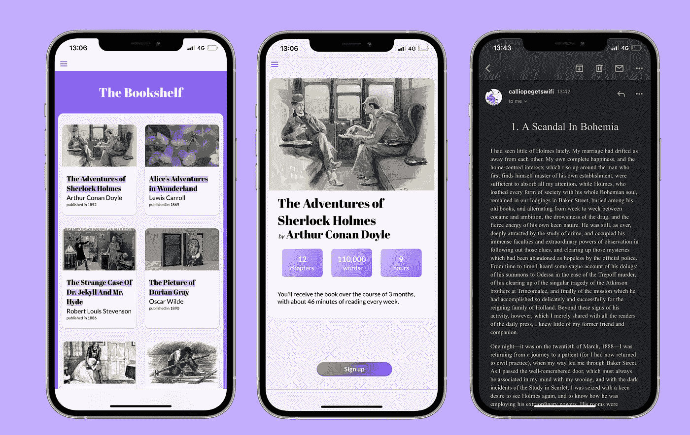
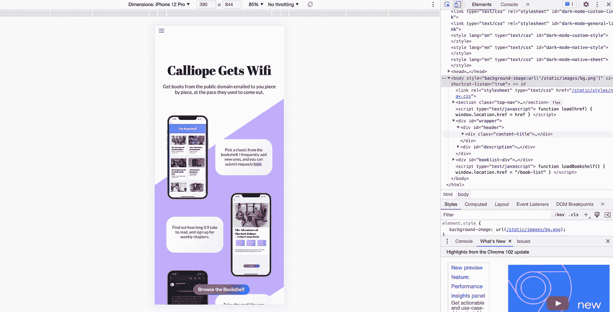
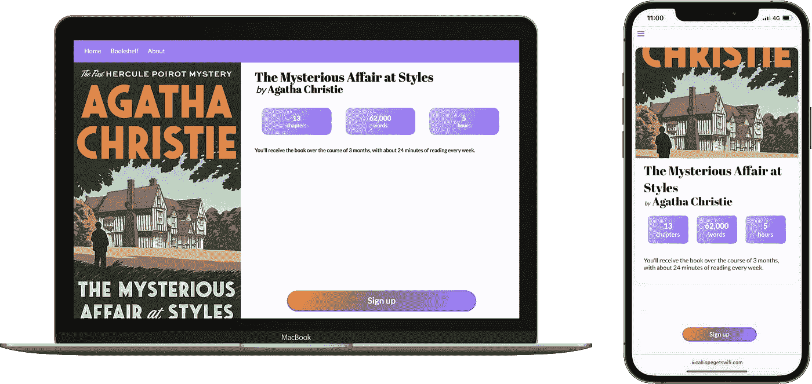
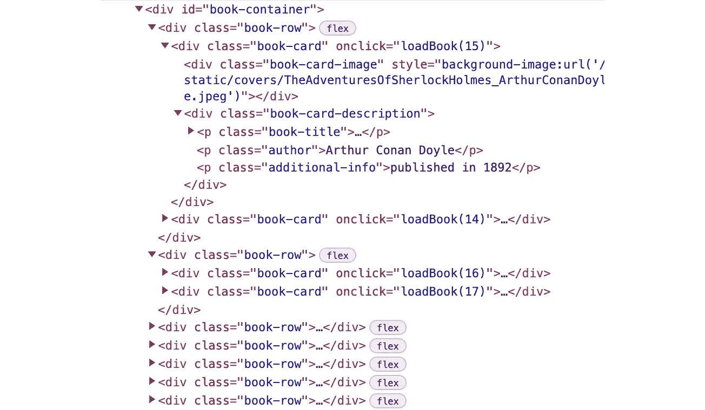
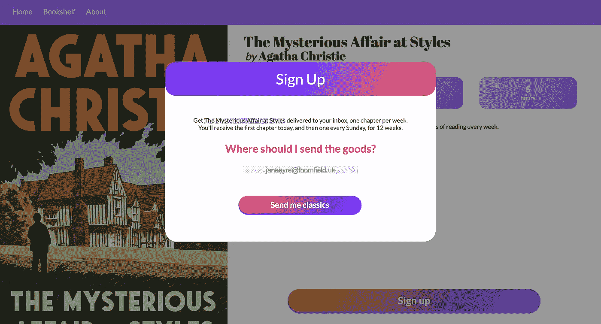
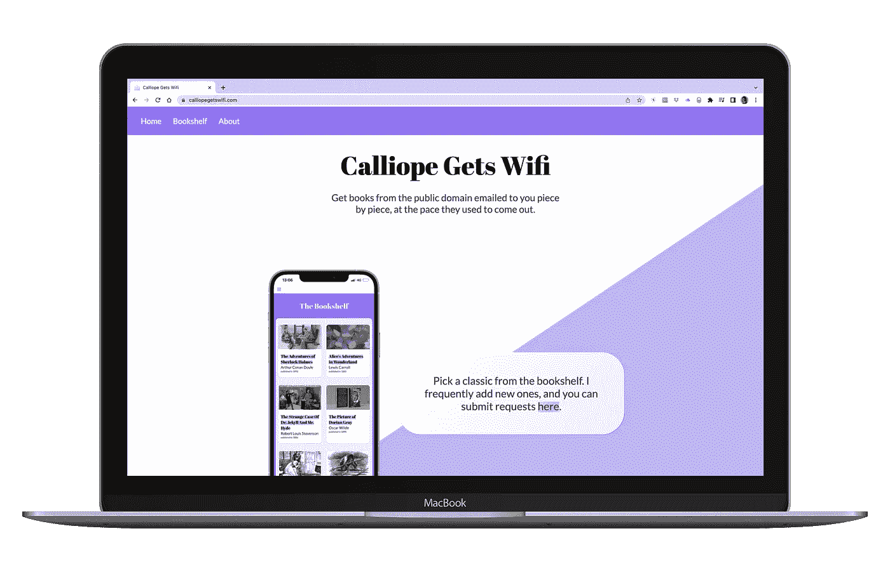

# 构建全栈 Web 应用程序:您的起点

> 原文：<https://betterprogramming.pub/building-a-web-app-a-starting-boost-9f037976f45f>

## 用 Python 实现和发布应用程序的第一步



[Calliope 有了 Wifi](https://www.calliopegetswifi.com/) ，这是我用 Flask 开发的网络应用(图片由作者提供)

# 介绍

很有可能，建立一个网站并没有你想象的那么难。您需要涵盖的技术和概念的跨度非常大，但是如果您已经掌握了一些 Python 也许还有一些 HTML——您可以很快地让事情运转起来。

在这篇文章中，我们将列出构建自己的 web 应用程序所需的所有基础，包括前端、后端、两者之间的通信、设计和托管服务，并为每一项提出起始解决方案。

首先，您可以从我的 [GitHub 库](https://github.com/chlolgr/flask-structure)中获取代码结构的模板。

在我将要给出的例子中，我将引用我自己的 web 应用程序，所以也可以随意看看！

我们将使用 **Python** ，以及它的 web 应用专用库 [Flask](https://flask.palletsprojects.com/en/2.1.x/) 。我不会介绍如何安装它们，但是你可以阅读我给你的模板中的`runtime.txt`和`requirements.txt`文件，找出我使用的具体版本。

这篇文章的目的是给你一个开始，而不是带你走完所有的路。如果你不知道从哪里开始使用你的应用程序，这里有一些建议！

# 前端

前端是项目中最明显的部分:你的店面。为了建立你的网站的外观，你需要 HTML 和 CSS 的臭名昭著的组合。

前者的所有文件将进入`app/templates/`，后者将进入`app/static/styles/`。

W3Schools 为 HTML 和 CSS 提供了很好的教程。

## 快速提及:移动优先的方法

由于网络流量的移动份额不断增加，许多产品设计师现在使用移动优先的方法，他们最初为移动设备设计，然后将设计扩展到桌面。你可以在这里阅读更多关于它的细节[。](https://medium.com/@Vincentxia77/what-is-mobile-first-design-why-its-important-how-to-make-it-7d3cf2e29d00)

知道对你的应用程序的请求的最大份额将来自手机，而手机屏幕提供的显示空间少得多，你可能需要认真考虑一下移动优先的方法。



使用开发者工具在仿真 iPhone 上测试你的前端(图片由作者提供)

☝️要开发移动设备，您可以在浏览器上打开开发工具，并使用设备仿真程序。

移动优先并不意味着你的桌面版本必须是你的移动设计的放大版本。使用 CSS，你可以过滤一些设计，只在足够大的屏幕上生效。

例如，`[@media](http://twitter.com/media) (min-width: 992px) {}`语句中的任何 CSS 只适用于 992 像素或更宽的屏幕。



来自同一 CSS 文件的视觉上不同的桌面和移动设计(图片由作者提供)

## 前端开发入门

我准备的代码模板有一个`app/templates/home.html`文件和一个`app/static/styles/home.css`文件你可以开始编辑。它们已经彼此连接，并连接到您的应用程序主页。你可能想从 HTML 开始，从结构中汲取灵感，在 CSS 中实现设计。

如果你在终端上运行`python run_locally.py`，当你在`127.0.0.1:5002`地址编辑上述文件时(复制粘贴到你的地址栏)，你将能够看到你的网页成形。我这样做是为了让您的更改在您刷新页面时生效。

你必须从这里接手了！请记住，有很多很棒的 HTML / CSS 代码片段可供您添加到页面中——从导航栏到加载屏幕和动画。

# 后端

后端是你安装所有软件的地方。无论你的应用程序提供什么服务，它都会在那里进行计算。

## 按指定路线发送

路由位于应用程序的中心。它将您的用户在您的网站上访问的页面连接到当他们转到特定路径时您想要运行的代码。

摘自我的`app/routes.py`文件(不是 git 存储库中的文件，是我实际应用程序的文件):

第 7-9 行告诉我的应用程序当一个客户端(对一个*用户*的技术术语)登陆到我网站的根目录时该做什么。`@app.route(‘/’)`表示客户端打开`calliopegetswifi.com/`时将调用以下函数。指令是获取并呈现隐式存储在我的`app/templates/`文件夹中的`home.html`文档，并将结果发送回客户端。这将导致显示[该页面](https://www.calliopegetswifi.com/)。

在第 17-25 行，我们得到了一些更复杂的东西。这段代码在客户端到达`calliopegetswifi.com/book-list`时运行。

在这里，服务器必须首先查询数据库来收集所有图书条目(第 19 行)，使用 SQLAlchemy ORM 来完成。然后，它必须将一些参数传递给`render_template`函数，该函数会将它们集成到`book_list.html` HTML 文档中。在我的例子中，我通过了:

*   `books`，图书对象列表，由 SQLAlchemy 从我的数据库中的`books`表生成，
*   `n_books`，我的图书列表中的图书数量、
*   和`n_rows`，我需要的行数，以 2 行显示我的书。

让我们看看在创建 HTML 文档时，我是如何使用这些参数的。

## 使用 Python 参数呈现 HTML

我们将使用上一节提到的`book_list.html`模板，来看看[书架](https://www.calliopegetswifi.com/book-list)页面是如何构建的。

☝️所有的``和`{{ ... }}`业务，称为 [Jinja](https://tedboy.github.io/jinja2/templ13.html) ，是关于将你传递的 Python 变量注入到你的 HTML 中。

``用 Python 语法为我需要的行数启动一个 for 循环，``复制它包含的所有 HTML。这样，我可以使用`{{ books[ (row_number*2)+i ].id }}`来引用我正在为其构建显示的书。

正如您可能已经直觉到的，``是语句的正确语法，而`{{ }}`专用于变量引用。

编译完成后，HTML 将如下所示:



book_list.html 摘录的渲染 HTML(图片由作者提供)

Jinja 允许我们构建动态 HTML 文档，我们可以分解结构并随意复制它们，同时用 Python 处理变量，而不必手动将它们写入 HTML。如果我意识到《夏洛克家园历险记》出版于 1893 年，而不是 1892 年，我可以在数据库中进行更改，当客户端启动页面时，Jinja 将动态加载更新后的值。

# JavaScript:中间人

JavaScript 是你前端团队的一部分，它也将处理与后端的通信。

## 团队前端

如果您需要执行的操作不需要页面上已经有的任何额外数据，您可以用“纯前端”JavaScript 来设置。

例如，这里的 JavaScript 帮助显示和隐藏[模态](https://www.w3schools.com/howto/tryit.asp?filename=tryhow_css_modal)。

`openModal()`函数显示模态，您可以从 HTML 块中调用该函数，例如:`<div onclick=”openModal()”>`。现在你的代码中有一个分支，当你点击它的时候会打开一个模态。

在第 5 行，我们启动了一个事件捕获。每当用户点击页面上的任何地方，JavaScript 都会检查点击是否触及了带有 id `signup-modal`的元素——你猜对了，模态`openModal`打开了——如果是，就再次隐藏它。



订阅模式(图片由作者提供)

## 团队后端

如果你需要将信息发送到你的后端，这样你就可以用 Python 来处理它，在 AJAX 的帮助下，JavaScript 也是你的帮手。

第 1 行允许我们使用 AJAX。

`saveSubscription`功能处理订阅，当用户填写他们的电子邮件地址并点击前面显示的模式上的“给我发送经典作品”。

在第 6 到 12 行，AJAX 用 `POST` *方法*(重要)将`data`字典发送到由`save_subscription`函数*实现的路由。另一方面，Python 接收并处理数据，如下所示:*

第 4 行和第 5 行捕获数据(注意`request.form`中的键与 AJAX 发送的`data`字典中的键匹配，并且`POST`是该函数唯一可用的访问方法)。

第 7–11 行在数据库中创建订阅，第 13–14 行提交更改。

显然，在实际的应用程序中有更多的功能(检查 AJAX 发送的电子邮件地址实际上是一个电子邮件地址，而不是一些 SQL，订阅还不存在，等等)，但为了简洁起见，我没有包括它。

## 放在哪里

您的 JavaScript 代码放在 HTML 文件末尾的`<script> </script>`标签中。你会想把它们放在你的`</body>`结束标签之前，所以它们是最后加载到你的页面上的东西(不需要加载你的用户还看不到的功能)。


HTML 中

我通常将 JavaScript 目的分成单独的`<script>`标签。我认为🤔你应该这么做。

# 设计

啊。最艰难的部分(至少对我来说)。

如果你不是一个设计人员，有几个工具可以帮助你。以下是我最喜欢的一些:

*   [Dribbble](https://dribbble.com/shots/popular/web-design) 主持真实设计师的设计摘录，这些设计师(大部分)知道他们在做什么。
*   [Icons8](https://icons8.com/) 有大量你可以在应用中免费使用的插图(免费提供一个返回平台的链接)。
*   [ColorBook](https://www.colorbook.io/hexcolors/view/ffe5e5) 是我最喜欢的“颜色可视化”网站。
*   Coolors 将为您提供丰富的调色板选择。
*   [谷歌字体](https://fonts.google.com/)——需要我说什么吗？

当然，总会有[不飞溅](https://unsplash.com/)。


杰克逊·索法特在 [Unsplash](https://unsplash.com/s/photos/web-design?utm_source=unsplash&utm_medium=referral&utm_content=creditCopyText) 上拍摄的照片

还有一些最佳实践可以遵循:

*   始终有一个行动号召(臭名昭著的 CTA ),并统一他们的外观，让您的用户本能地知道点击哪里才能领先。在我的应用程序中，CTA 是红色到紫色渐变背景的按钮。
*   不要使用超过三种字体。
*   经常检查你的颜色组合，让你的文字清晰易读！

好吧。这就是我对设计的全部理解。

# 托管服务

有很多地方可以上传你的应用，但我个人最喜欢的是 Heroku。Heroku 是免费的，只要你有限制地使用它，它就可以保持免费。免费版本包括每月 1，000 小时的服务器运行时间，每 15 分钟运行一次 bash 命令的调度程序，以及最多 10，000 行的数据库。

你可以在这里找到将你的应用部署到 Heroku right [的教程。](https://devcenter.heroku.com/articles/getting-started-with-python)

确保您的存储库中包含一个`Procfile`、一个`requirements.txt`文件和一个`runtime.txt`文件(所有文件都包含在我在本文开头链接的 git 存储库中)。

# 结论

我希望这个“第一步激励因素”已经激励你开始使用你的应用程序了！我已经用我的空闲时间练习 web 开发两年了，所以对我来说什么是已知的和什么是值得一提的之间的界限有点模糊。

欢迎对本文提出问题和反馈，我会添加任何必要的信息。

如果您觉得这很有用，您可以关注我或订阅我的时事通讯，以便在我发布后续消息时收到通知。我计划在以后更窄的文章中更详细地介绍每一步和具体的特性。



一个成品！(图片由作者提供)

点击阅读关于使用 PostgreSQL [设置 web 应用数据库的信息！](https://medium.com/p/ffa21fdf37b0)

# 笔记

1.  我在这里交替使用了*网站*和*网络应用*，但区别在于:一个网站是所有托管在同一个域名下的页面的集合，而网络应用是存储在远程服务器上并通过互联网交付的应用。主要的区别是，本质上，web 应用程序有一个后端。给你。

```
**Want to Connect?**I’ll be getting into more details about frontend development for this particular web app in later articles, so if you’d like to get notified when that happens, follow me here or on [Twitter](https://twitter.com/datasquish)!If you’re looking for easy access to classic novels, I would love for you to try out the web app I’ve used as a reference for this article. [Calliope Gets Wifi](https://www.calliopegetswifi.com/) is 100% a passion project, for which I’ve got tons of expansion ideas; and receiving subscription notifications fuels my development sessions.
```