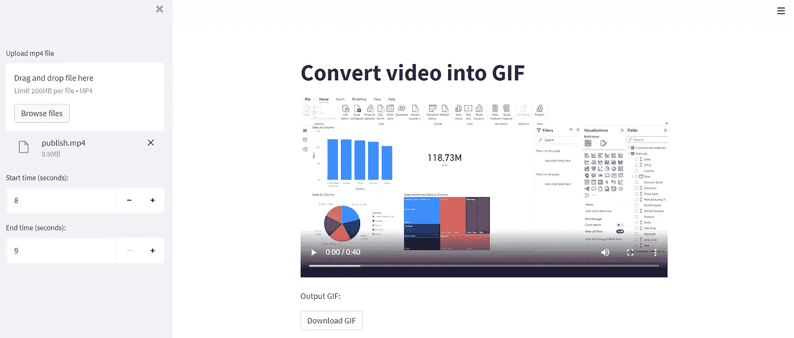
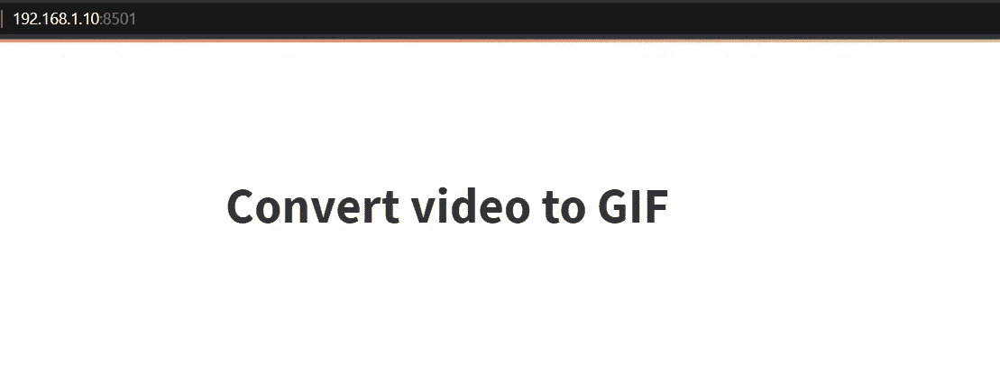
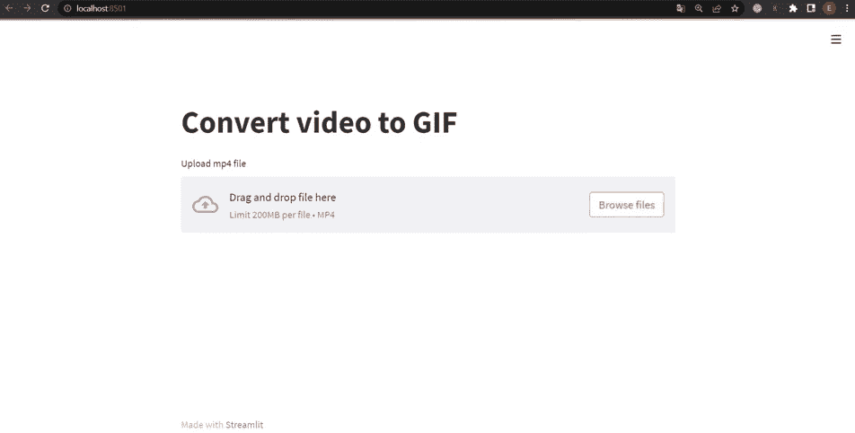
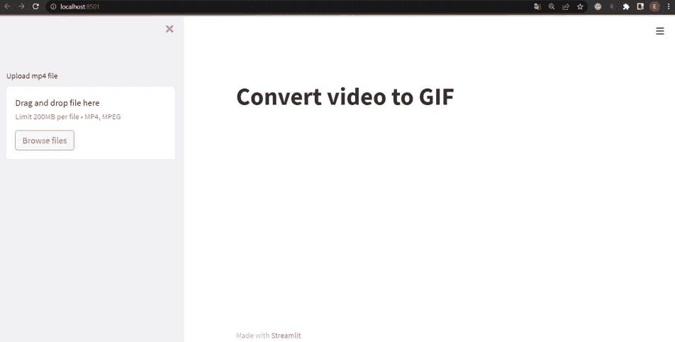
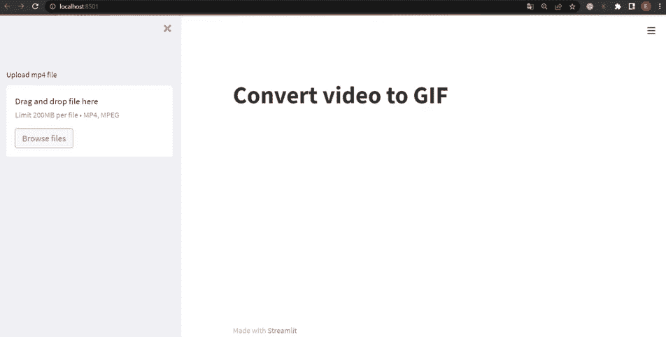

# 构建一个 Python Web 应用程序，使用 Streamlit 将视频转换为 Gif

> 原文：<https://betterprogramming.pub/building-a-web-application-to-convert-a-video-to-a-gif-using-streamlit-2ab3b377eac1>

## 使用 MoviePy 和 Streamlit 将视频转换为 GIF 的简单而有趣的方法



作者插图

几个月前，我尝试了很多网站将视频转换成 gif，但我没有找到任何令人满意的解决方案来编辑和转换视频，而不会变得疯狂。突然发现了 MoviePy，一个专门做视频剪辑的 python 库。它允许执行许多基本的编辑操作，如视频剪切、拼接和更改 fps。

同时，我想有一个直观的界面来创建一个 gif 文件，而不是每次修改和运行脚本。出于这个原因，我利用了 Streamlit，这是一个神奇的工具，它允许使用 Python 创建应用程序，只需几行代码。

在本教程中，我将向您展示如何以有效的方式利用这个令人惊叹的 Python 库。

# 什么是 Streamlit？

Streamlit 是一个免费的开源框架，允许在几分钟内创建 web 应用。该平台的优势在于:

*   它简单易用
*   不需要前端经验
*   不需要 HTML 的知识
*   几行代码构建了一个漂亮的应用程序
*   它和 Python 库一起工作，比如 pandas，Tensorflow，Pytorch

要深入了解，查看这篇帮助你掌握 [Streamlit](https://towardsdatascience.com/coding-ml-tools-like-you-code-ml-models-ddba3357eace) 基础知识的帖子。此外，Streamlit 有一个华丽的[图库](https://streamlit.io/gallery)，里面有许多数据科学项目的应用示例。

# 什么是 MoviePy？

MoviePy 是一个处理视频的 Python 模块。它允许编辑视频的有用功能，如:

*   `subclip(start,end)`返回开始和结束时间之间的剪辑
*   `resize(clip)`调整剪辑的`width` *和* `height`的大小
*   `concatenate_clips([clip1,clip2,...])`把不同的片段放在一起
*   `crop(clip,x1=None,x2=None,y1=None,y2=None,width=None,height=None)`返回函数中指定的剪辑的裁剪区域
*   `write_gif(clip,fps=None)`将视频转换成 GIF 格式，其中 fps 是每秒的帧数

这只是这个库可以对视频做些什么的一小部分列表。查看[官方网页](https://zulko.github.io/moviepy/)了解更多关于`moviepy`的信息。

**目录**

1.  **先决条件**
2.  **转换器应用**
3.  **额外功能**

# 1.先决条件

在本教程中，我建议您使用 Visual Studio 代码作为 IDE，因为它有一个直观的界面，通过安装扩展支持多种语言，并集成了一个终端。要开始使用 Visual Studio 代码，请查看本[指南](https://code.visualstudio.com/docs/languages/python)。一旦决定了要使用的代码编辑器并完成了安装，就该安装两个库了:

```
pip install streamlit
pip install moviepy
```

让我们尝试构建一个简单的 app，打印“将视频转换为 GIF”:

正如您所推断的，方法`title`用于以标题格式显示文本。下一步是以如下方式在终端上运行代码:

```
streamlit run <filename.py>
```

它返回本地 URL 和网络 URL。点击这些链接中的一个，然后，应用程序将自动在浏览器的新标签中打开。



作者插图

Streamlit 的另一个重要特性是由 [**输入小部件**](https://docs.streamlit.io/library/api-reference/widgets) 提供的，它允许您使用按钮、数字输入、滑块和其他选项在 web 应用程序中进行交互。例如，让我们从文件系统上传一个文件:



作者插图

# 2.转换器应用程序

目标是建立一个应用程序，简单地将 mp4 文件转换成 GIF 文件。为了处理视频，我们使用了用于视频编辑的 python 库`MoviePy`。



作者插图

*   我们通过在第 13 行指定`st.sidebar`从侧边栏上传文件
*   `st.video`允许在第 16 行显示视频
*   我们在第 21 行创建了一个带有 moviepy 的视频剪辑
*   函数`cut_video()`在第 22 行被调用。它用于在预定的秒范围内剪切视频，在这个范围内，我们在输入小部件中指定数字。功能`st.sidebar.number_input()`显示数字输入小工具，而`subclip`在之前选择的两个极端之间剪切视频。
*   `write_gif`最后在第 24 行将 mp4 文件转换成 GIF 文件。
*   `st.download_button`显示按钮小部件，允许我们下载 web 应用程序获得的 GIF 文件。

# 3.额外功能

该应用程序非常必要和简单。通过添加一个小部件来选择每秒帧数并显示获得的 gif，可以实现进一步的改进:



*   在第 33 行，我们添加了另一个输入小部件来指定每秒的帧数。视频的帧数越少，视频的变化就越小。
*   在最后一行，我们调用函数`download_gif`，它包含对获得的 GIF 的`st.markdown`，以及下载按钮的前一个函数。

# 最后的想法

恭喜你！将视频转换成 GIF 文件的 web 应用程序已经准备好了。正如我所承诺的，只用几行代码就可以做到这一点。它展示了 Streamlit 如何适用于为不同目的构建快速而简单的 web 应用程序，例如创建漂亮的仪表板、进行模型预测以及许多其他目的。GitHub 代码在这里是，而我部署的应用程序的链接在这里是。感谢阅读。祝您愉快！

你喜欢我的文章吗？ [*成为会员*](https://eugenia-anello.medium.com/membership) *每天无限获取数据科学新帖！这是一种间接的支持我的方式，不会给你带来任何额外的费用。如果您已经是会员，* [*订阅*](https://eugenia-anello.medium.com/subscribe) *每当我发布新的数据科学和 python 指南时，您都会收到电子邮件！*