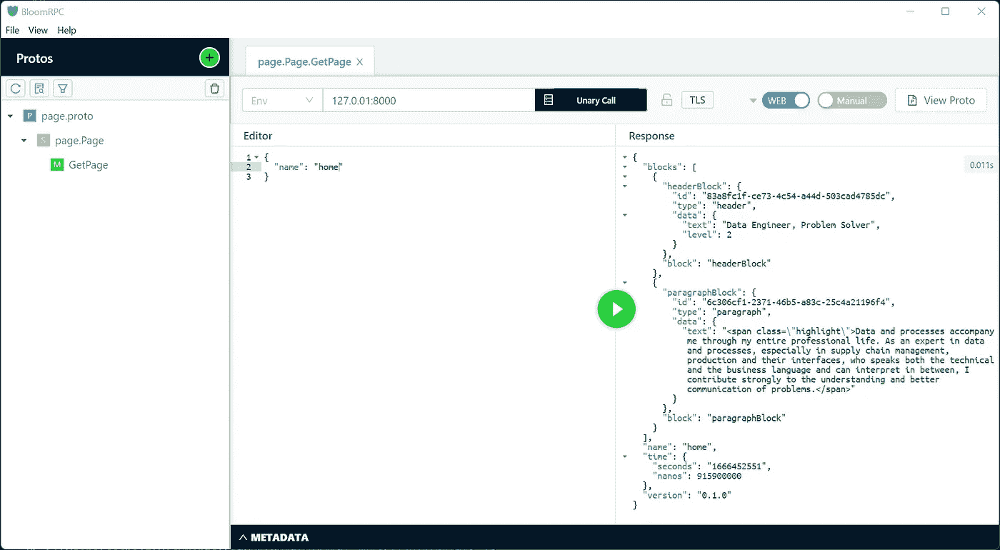

# 如何用 Rust，gRPC-Web，React 建立网站

> 原文：<https://betterprogramming.pub/building-a-website-using-rust-grpc-web-react-7412f1596a17>

## 创建自己的互联网家园指南


在 [Unsplash](https://unsplash.com?utm_source=medium&utm_medium=referral) 上由 [Carlos Muza](https://unsplash.com/@kmuza?utm_source=medium&utm_medium=referral) 拍摄的照片

这就是我如何使用一个 [grpc-web](https://github.com/grpc/grpc-web) 接口实现一个服务于我个人网站的小型客户端-服务器应用程序，以及我在做这件事时学到的东西。客户端提供一个静态页面，并通过 gRPC 接收内容。内容的结构类似于 [Editor.js](https://editorjs.io/) 。

对于服务器，我使用 Rust 和 [Tonic](https://github.com/hyperium/tonic) 框架。由于 gRPC 是基于 [http/2](https://en.wikipedia.org/wiki/HTTP/2) 的，因此 [Envoy 代理](https://www.envoyproxy.io/)通常用于将 [http/1.1](https://en.wikipedia.org/wiki/Hypertext_Transfer_Protocol) 转换为 [http/2。](https://en.wikipedia.org/wiki/HTTP/2)对于这个应用程序，我走了一条不同的路，使用了 [Tonic-web](https://github.com/hyperium/tonic/tree/master/tonic-web) 机箱。

对于客户，我使用[反应](https://reactjs.org/)并通过[快递](https://expressjs.com/)服务。

# 计算机网络服务器

## 设置环境

要构建这个应用，我们需要安装 [Rust](https://www.rust-lang.org/) 和[协议缓冲编译器](https://grpc.io/)(protoco)。

*   安装铁锈:[https://www.rust-lang.org/tools/install](https://www.rust-lang.org/tools/install)
*   在 Linux 和 macOS 上安装协议缓冲编译器:[https://grpc.io/docs/protoc-installation/](https://grpc.io/docs/protoc-installation/)要在 Windows 上安装，需要从[https://github.com/protocolbuffers/protobuf/releases](https://github.com/protocolbuffers/protobuf/releases)下载二进制。将它提取到类似于`C:\\Program Files\\protoc`的地方，并将`C:\\Program Files\\protoc\\bin`添加到您的[路径](https://www.architectryan.com/2018/03/17/add-to-the-path-on-windows-10/)中。

## 安装包

设置好我们的开发环境后，我们可以开始我们的项目了。让我们首先使用以下命令启动一个新的项目目录:

```
mkdir grpc_app
cd grpc_app
```

使用 Rust 包管理器，我们现在可以创建一个包。

```
cargo new server
cd server
```

对于应用程序界面，我们需要以下内容:

*   [Tonic-build](https://github.com/hyperium/tonic/tree/master/tonic-build) (作为构建依赖)， [Prost](https://github.com/tokio-rs/prost) ， [Prost-types](https://github.com/tokio-rs/prost/tree/master/prost-types) 装箱以从 [proto3](https://developers.google.com/protocol-buffers/docs/proto3) 文件生成 Rust 代码
*   托基奥机箱异步运行服务器

[UUID](https://github.com/uuid-rs/uuid) 机箱用于创建[uuid v4](https://en.wikipedia.org/wiki/Universally_unique_identifier#Version_4_(random))。这只是应用程序内容所需要的，而不是接口的一般实现。

让我们将它们添加到我们的服务器应用程序中，如下所示:

```
cargo add tonic@0.8 tonic-web@0.4
cargo add prost@0.11 prost-types@0.11
cargo add --features tokio@1.0/macros,tokio@1.0/rt-multi-thread tokio@1.0
cargo add --features uuid@1.2/v4 uuid@1.2
cargo add --build tonic-build@0.8
```

这应该会导致一个`Cargo.toml`，就像这样:

## 创建协议缓冲区定义

如上所述，我们想要基于 [Editor.js](https://editorjs.io/) 规范创建我们的界面。我们将实现块类型`Paragraph`、`Header`和`List`。

让我们首先在 proto 目录中创建新文件:

```
mkdir proto
cd proto
touch page.proto
```

首先，我们需要定义语法并给语法命名:

接下来，我们定义我们的服务。该服务只包含一个调用，接收并返回一条消息。

我们需要落实这两条信息。`PageRequest`只是一个字符串，但是`PageReply`将是我们结构化的 [Editor.js](https://editorjs.io/) 式的响应。

由于`PageReply`有时间戳，我们需要导入或创建一个额外的类型。我们将从 Google 的[知名类型](https://developers.google.com/protocol-buffers/docs/reference/csharp/namespace/google/protobuf/well-known-types)中导入一个。

然后我们定义我们的`PageReply`。为了创建一个列表，我们使用了特性`repeated`。该块可以是段落、标题和列表中的一个。为此，我们使用功能`oneof`。一个`oneof`不能是`repeated`。所以我们需要创建一个名为`Block`的中间消息。

现在我们可以实现不同的块类型。对于`ListBlock`,我们需要一个样式字段的约束。这可以通过`enum`来实现。

完整的代码可以在[这里](https://github.com/christopherscholz/rust_grpc_website/blob/main/server/proto/page.proto)找到。

## 生成原型存根

为了生成 proto 存根，我们需要在应用程序的主目录中添加一个[构建脚本](https://doc.rust-lang.org/cargo/reference/build-scripts.html) ( `build.rs`)。

## 实施服务

为了编写我们的应用程序，我们编辑了由`cargo new server`创建的`src/main.rs`文件。

首先，我们将声明一些模块的使用，并发布生成的原型页面存根。

接下来，我们声明结构并定义页面实现。我们稍后会谈到逻辑。

要运行我们的应用程序，我们必须添加我们的主函数。我们使用`tokio::main`宏来帮助我们。在这里，我们还使用`tonic_web` crate 来提供我们在 http/1.1 上的服务，并定义了 [CORS](https://developer.mozilla.org/en-US/docs/Web/HTTP/CORS) 头。

我们应用的逻辑是基于输入的。我们需要在我们的`get_page`函数中定义三种情况，如下所示:

*   家
*   出版说明
*   默认情况

然后，通过创建我们的模块来构建每个匹配臂，例如，如下所示:

完整的代码可以在[这里](https://github.com/christopherscholz/rust_grpc_website/blob/main/server/src/main.rs)找到。

## 运行服务

我们现在可以使用以下命令运行应用程序:

```
cargo run
```

因为我们还没有实现客户端，所以我们通过 [BloomRPC](https://github.com/bloomrpc/bloomrpc) 测试我们的服务器。为此，我们可以导入我们的 page.proto，然后将我们的服务器设置为`127.0.01:8000`并从 gRPC 切换到 web。点击绿色播放按钮将得到我们的回应。



## 归档

每一个好的 app 都需要 dockerized。我们首先构建它，然后将二进制文件复制到一个发行版映像。

让我们创建我们的`Dockerfile`

因为我们稍后还将为我们的客户创建一个 docker 映像，所以让我们在项目主目录中设置一个`docker-compose.json`。

然后，我们可以通过 BloomRPC 运行 Docker 映像并再次测试。

```
docker-compose up --build
```

# 客户

## 设置环境

安装[节点](https://nodejs.org/en/)。

除了我们为服务器安装的协议缓冲编译器，我们还需要两个插件来生成 JavaScript proto 存根。可惜 protobuf-javascript 的 JavaScript 实现维护的不是很好。在写这篇文章的时候，发布的二进制文件还没有工作，所以我们需要从源代码编译它。

首先，我们从[https://github.com/grpc/grpc-web/releases/tag/1.4.1](https://github.com/grpc/grpc-web/releases/tag/1.4.1)下载 protocol-gen-grpc-web 二进制文件，并把它放在我们的 protocol 二进制文件旁边。确保将二进制文件重命名为`[protoc-gen-grpc-web](https://github.com/grpc/grpc-web/releases/download/1.4.1/protoc-gen-grpc-web-1.4.1-darwin-aarch64)`。

其次，克隆 protobuf-javascript 存储库，并将其重置为指定的提交。

```
git clone <https://github.com/protocolbuffers/protobuf-javascript> /home/protobuf-javascript
git reset --hard 3ff6090f139d71453062fb96c66e9aff801709c2
```

我们需要安装巴泽尔:[https://docs.bazel.build/versions/main/install.html](https://docs.bazel.build/versions/main/install.html)

然后我们可以加载依赖项并构建二进制文件

```
cd protobuf-javascript
npm install
npm run build
```

最后一件事是将`bazel-bin/generator/protoc-gen-js`复制到与 protoc 二进制文件相同的路径。

## 安装包

现在，我们可以通过运行以下命令来创建 React 应用程序:

```
npx create-react-app client
cd client
```

除了 React 依赖项，我们还需要添加 react-router、grpc-web 和 google-protobuf 模块。

```
npm install --save google-protobuf@~3.21.2 grpc-web@~1.4.1 react-router-dom@~6.4.2
```

## 生成原型存根

我们必须创建我们的 proto-javascript 存根来编码/解码序列化/反序列化 grpc 数据。为此，我们可以使用二进制协议。将`page.proto`复制到客户端应用程序中名为`proto`的新目录中，然后运行以下命令:

```
protoc --proto_path=proto page.proto \\
  --grpc-web_out=import_style=commonjs,mode=grpcweb:src \\
  --js_out=import_style=commonjs,binary:src
```

这将在 src 目录中生成两个名为`page_grpc_web_pb.js`和`page_pb.js`的 JavaScript 文件。对于大的原型文件，这会生成大量代码。您可以使用类似于 [protobuf.js](https://github.com/protobufjs/protobuf.js) 的节点模块，而不是生成这个静态代码。

模式设置为`grpcweb`。相反，我们也可以将其设置为`grpcwebtext`。更多关于模式[的信息，请点击](https://github.com/grpc/grpc-web#wire-format-mode)。

为了支持二进制原型格式，我们将二进制文件`import_style`添加到`js_out`中。更多关于选项[在这里](https://github.com/protocolbuffers/protobuf-javascript#the---js_out-flag)。

为了确保每次都生成这个存根，我们运行`npm install`并向我们的`package.json`添加另一个脚本。

## 实现客户端

我们的委托人会很直接。

首先，我们需要一个`public/index.html`

然后我们将在`src/index.js`中实现我们的 React 应用。

首先，导入所有需要的模块并定义 React 根。

在我们的`React.StrictMode`中，我们将添加带有三条路由的 React 路由器

*   / →带有属性页的页面组件=主页
*   /impressum →带有属性 page=impressum 的页面组件
*   其他→无页面组件

组件只是一些没有任何逻辑的 HTML

对于`Page`组件，我们需要首先导入我们生成的 JavaScript 存根并创建一个`PageClient`对象。

然后我们就可以像这样不用逻辑来定义我们的组件。

对于逻辑，我们将从`page`属性创建一个`PageRequest`，调用`getPage`并用从`PageReply`生成的 HTML 设置组件的状态。

我们使用响应来生成 HTML。由于响应包括一个块列表，我们可以遍历它们并返回相应的 HTML。

对于我的实现，我添加了一些样式和一些其他静态 HTML 片段。

## 运行客户端

为了通过开发服务器运行我们的客户机，我们需要运行 React 启动脚本。这也将打开一个新的浏览器窗口并显示网站。

```
npm start
```

## 通过快递服务

开发服务器不是部署 React 应用程序的唯一方式。我们可以在这里读到一些可能性:[https://create-react-app.dev/docs/deployment/](https://create-react-app.dev/docs/deployment/)

我们选择通过 express 部署应用程序。为此，我们在客户端应用程序中创建了一个新的 nodejs 应用程序，并添加了 express 依赖项。

```
npm init express
cd express
npm install --save express@~4.18.2
```

然后我们需要一个`index.js` 文件来服务 React 应用程序。看起来是这样的:

这是行不通的，因为我们还没有创建产品版本。我们可以通过在客户端目录中运行以下命令来实现这一点:

```
npm run build
```

然后，我们可以使用以下代码运行 express 服务器:

```
cd express
node index.js
```

## 归档

像服务器应用程序一样，我们对客户端进行 dockerize。

这将稍微复杂一点，因为我们需要创建以下内容:

**构建器**

*   安装 protobuf 编译器和两个生成器插件
*   构建我们的 React 应用
*   安装快速

**转轮**

*   添加节点用户和组
*   安装 nodejs 和 dum-init
*   从生成器复制相关文件

现在，将我们的客户端添加到项目主目录中的`docker-compose.json`。

当我们把所有的东西放在一起后，我们运行两个图像并浏览到`[http://127.0.0.1:8000](http://127.0.0.1:8000)`。

```
docker-compose up --build
```

# 结论

我费了很大劲才让协议缓冲编译器 JavaScript 插件工作起来。但后来，一切都很容易设置。gRPC-web 与服务器的通信工作正常，并且只使用了相应 JSON 大小的大约 2/3。

但是消息的编码/解码和序列化/反序列化需要相当多的代码，这对于 webapp 来说似乎过于复杂。protobuf.js 可能是解决这个问题的一种方法，但是它也需要一些代码来动态生成存根。

我喜欢使用 proto 文件理解数据结构是如此容易。这些原型文件充当客户机和服务器之间的契约。

我怀念使用 GraphQL 时编写查询的可能性，因为它很像一个类似 REST 的二进制接口。创建一个类似 GraphQL 的协议缓冲区肯定是可能的，但这将是相当多的工作。目前，我仍将继续使用 GraphQL 进行 Web 客户端到服务器的通信。

应用程序的完整代码可以在[这里](https://github.com/christopherscholz/rust_grpc_website)找到。