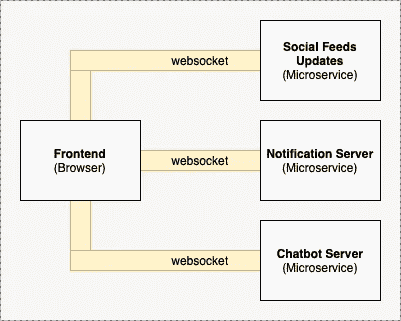
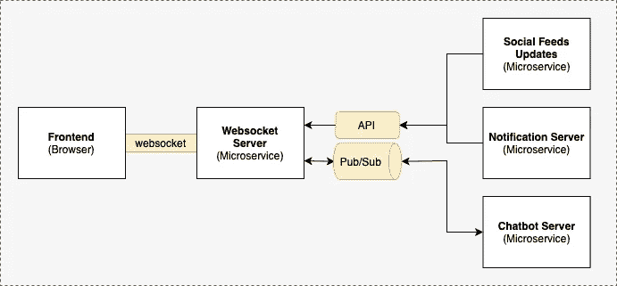
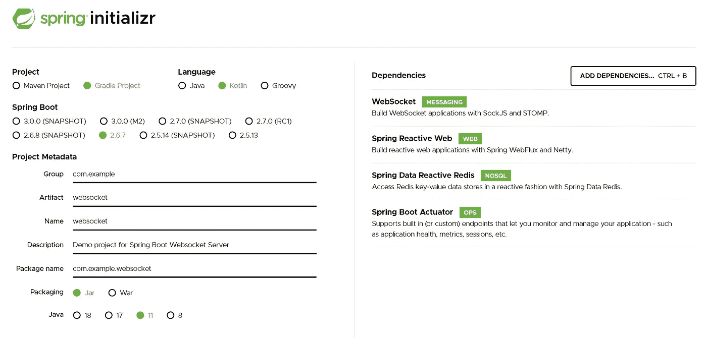
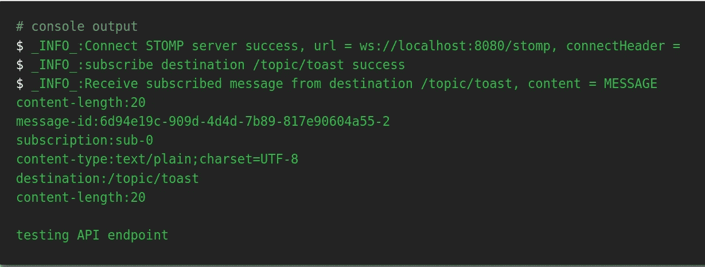
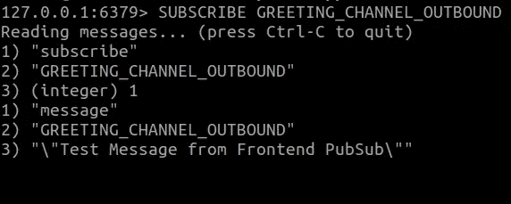

# 在微服务架构中构建 WebSocket 服务器

> 原文：<https://betterprogramming.pub/building-a-websocket-server-in-a-microservice-architecture-50c6c6432e2b>

## 在微服务架构中设计用于实时通信的 WebSocket 服务器


泰勒·维克在 [Unsplash](https://unsplash.com?utm_source=medium&utm_medium=referral) 上的照片

写这篇文章是为了分享我对使用 WebSocket 实现前端和后端实时通信的探索。近年来，微服务是许多开发人员采用的架构方法，微服务架构的关键原则之一是“单一责任原则”。

在这个探索中，我们将研究如何设计和实现一个 WebSocket 服务器，它负责建立与前端(web 应用程序)的 WebSocket 连接，并充当前端和后端之间实时通信的中间件(或代理)。

***注意*** *:本文不会详细讨论 WebSocket 或发布-订阅消息传递模式是如何工作的。*

[](https://github.com/bkjam/websocket-microservice) [## GitHub-bkjam/websocket-微服务:实时 web socket 微服务探索…

### 此时您不能执行该操作。您已使用另一个标签页或窗口登录。您已在另一个选项卡中注销，或者…

github.com](https://github.com/bkjam/websocket-microservice) 

# 我的 WebSocket 服务器系列

*   01:在微服务架构中构建 WebSocket 服务器
*   02: [使用发布-订阅模式水平扩展 WebSocket 服务器的设计考虑](/design-considerations-for-scaling-websocket-server-horizontally-with-a-publish-subscribe-pattern-fe6de9988400)
*   03: [使用 Spring Boot、Redis 发布/订阅和 Redis 流实现可伸缩的 WebSocket 服务器](/implement-a-scalable-websocket-server-with-spring-boot-redis-pub-sub-and-redis-streams-b6b8cc08767f)
*   04:待定

# **背景语境**

在很多情况下，web 应用程序(前端)需要客户端(浏览器)和服务器(后端)之间的实时通信。这种用例的一些例子是实时馈送、实时协作编辑、实时数据可视化、实时聊天、通知、事件更新等。



客户端(前端)和单个微服务(后端)之间的 WebSocket 连接示例

假设每个用例都有一个微服务；上面的图表将说明如何在客户端(前端)和每个单独的微服务(后端)之间建立 WebSocket 连接。

正如你所看到的，这不是一个最优的设计，因为当微服务的数量增加时，将会创建更多的 WebSocket 连接。因此，让我们看看 WebSocket 服务器如何帮助解决这个问题。

# WebSocket 服务器设计



微服务架构中 WebSocket 服务器的高级示意图

在上面的设计中，WebSocket 服务器是唯一与 web 应用程序(前端)建立 WebSocket 连接的微服务。对于其他微服务，与 web 应用程序(前端)进行实时通信有两种主要方式:

1.  单向(后端到前端)
    ——所有微服务(后端)都可以通过 API 向 WebSocket 服务器发送消息，然后消息将通过 WebSocket 转发给 web 应用(前端)。
2.  双向(前端和后端之间)
    ——Web 应用(前端)可以通过 WebSocket 向 WebSocket 服务器发送消息，然后消息将通过 Pub/Sub 转发给微服务(后端)。
    -微服务(后端)可以通过 Pub/Sub 向 WebSocket 服务器发送消息，然后通过 WebSocket 将消息转发给 web 应用(前端)。

# 构建 WebSocket 服务器

我们将基于上述设计，使用 Spring Boot、Stomp 和 Redis Pub/Sub 构建一个 WebSocket 服务器。由于我不会深入细节，你可以参考这些由[托马兹·dąbrowski](https://www.toptal.com/java/stomp-spring-boot-websocket)和[Baeldung.com](https://www.baeldung.com/websockets-spring)撰写的精彩文章，了解更多关于使用 Spring Boot 实现 WebSocket 的信息。

## **步骤 1:初始化 Spring Boot 项目**

前往 https://start.spring.io/[并初始化一个 Spring Boot 项目。至少，您将需要 Spring Web、Redis 和 Websocket 依赖项。](https://start.spring.io/)



Spring Boot 项目的例子

## **步骤 2:** 配置 WebSocket 和 STOMP 消息传递

创建一个配置文件`WebsocketConfig.kt`，并在下面添加配置。该配置为 Spring Boot 应用程序启用了 WebSocket 功能。

*注意，出于演示目的，stomp 端点允许所有原点，但这不应该是生产设置的配置。*

启用 Spring Boot web socket(websocketconfig . kt)的配置

## **步骤 3:** 创建用于单向实时通信的 API 端点

API 端点为微服务(后端)提供了一种向 web 应用(前端)发送消息的方式。由于消息只需要单向流动(后端→ WebSocket 服务器→前端)，使用 API 将是微服务(后端→ Websocket 服务器)之间很好的通信媒介。

用于向 WebSocket 服务器发送消息的 API 端点

上面的代码创建了一个带有 POST 请求端点的 REST 控制器，该端点接收请求体“`NewMessageRequest`”，其中`topic`是客户端(前端)订阅的 STOMP 目的地，`message`是字符串格式的实际消息。这样，您现在可以通过 API 向 WebSocket 服务器发送消息，然后该消息将通过 WebSocket 转发到 web 应用程序(前端)。

## **步骤 4:** 配置 Redis 发布/订阅进行双向实时通信(可选)

*注意:根据您的使用情况，如果您不需要 web 应用程序(前端)和微服务(后端)之间的双向实时通信，您可以省略此步骤。*

与使用发布-订阅消息传递模式相比，微服务(后端和 Websocket 服务器)之间通过 API 进行的通信对于实时通信来说不是最佳的。因此，对于双向通信，我们将利用发布-订阅消息传递模式。

有许多方法可以实现发布-订阅消息传递模式，但是为了演示和简单起见，我们将使用 Redis 发布/订阅。

首先，使用 docker ( `docker run — name redis-server -p 6379:6379 -d redis`)在本地运行 Redis 服务器，并将以下配置添加到 application.yml 文件中，以便 WebSocket 服务器连接到 Redis 服务器。

```
# application.yml
spring.redis:
    host: localhost
    port: 6379
```

接下来，创建一个配置文件`RedisConfig.kt`，并添加下面的配置。本质上，我们正在配置一个`ReactiveRedisTemplate`，它与 Redis 服务器通信，并被配置为将消息序列化和反序列化为字符串。

ReactiveRedisTemplate 的配置

接下来，创建一个包含订阅和发布到 Redis 服务器的逻辑的`RedisService`。在下面的例子中，我们订阅了一个入站通道主题`GREETING_CHANNEL_INBOUND`，它监听来自其他微服务(后端)的传入消息，并将所有收到的消息转发到 STOMP 目的地`/topic/greetings`。

最后，创建一个`Controller`来处理来自 web 应用程序(前端)的消息，这些消息被发送到带有前缀`/app`的 WebSocket 服务器。在下面的示例中，发送到`/app/greet`的消息将被转发(发布)到出站通道主题`GREETING_CHANNEL_OUTBOUND`，该主题随后将由正在侦听该通道的任何微服务(后端)进行处理。

至此，我们已经设置了 WebSocket 服务器作为中间件(或代理),它通过 WebSocket 与 web 应用程序(前端)通信，并通过 Redis Pub/Sub 与微服务(后端)通信。

# 测试 WebSocket 连接

使用一个由 jiangxy 构建的[开源 websocket 客户端调试器工具作为模拟 web 应用程序(前端)，我们可以测试我们上面构建的 WebSocket 服务器。](https://bkjam.github.io/websocket-debug-tool/)

## **测试#1:从后端向前端发送消息(通过 API)**

启动 WebSocket 服务器，并使用 WebSocket 调试器工具通过 STOMP 协议连接到 WebSocket 服务器`ws://localhost:8080/stomp`。连接后，配置 WebSocket 调试器工具以订阅主题`/topic/toast`。

接下来，使用下面的命令向 WebSocket 服务器发送 HTTP POST 请求:

```
curl -X POST -d '{"topic": "/topic/toast", "message": "testing API endpoint" }' -H 'Content-Type: application/json' localhost:8080/api/notification
```

WebSocket 调试器工具应该具有如下所示的输出:



WebSocket 调试器工具通过 API 从后端发送消息的输出屏幕截图

这说明 WebSocket 服务器已经通过 API 成功接收到消息，并通过 WebSocket 将消息转发给 web 应用(前端)。

## **测试#2:从后端向前端发送消息(通过发布/订阅)**

启动 WebSocket 服务器，使用 WebSocket 调试器工具通过 STOMP 协议连接到 WebSocket 服务器`ws://localhost:8080/stomp`。连接后，配置 WebSocket 调试器工具以订阅主题`/topic/greetings`(上面定义的)。

使用 Redis CLI，通过命令`PUBLISH GREETING_CHANNEL_INBOUND “\"Test Message from Backend PubSub\"”`向频道主题`GREETING_CHANNEL_INBOUND`(上面定义的)发布消息。

*注意，需要额外的* `*\”*` *，因为 WebSocket 服务器被配置为接收字符串消息*。WebSocket 调试器工具应该会收到如下所示的消息


通过 Redis PubSub 从后端发送消息的 WebSocket 调试器工具输出的屏幕截图

这说明 WebSocket 服务器已经通过 Redis Pub/Sub 成功接收到消息，并通过 WebSocket 将消息转发给 web 应用(前端)。

## **测试 3:从前端向后端发送消息(通过发布/订阅)**

启动 WebSocket 服务器，并使用 WebSocket 调试器工具通过 STOMP 协议连接到 WebSocket 服务器`ws://localhost:8080/stomp`。一旦连接，使用 Redis CLI，使用命令`SUBSCRIBE GREETING_CHANNEL_OUTBOUND`订阅频道主题`GREETING_CHANNEL_OUTBOUND`(上面定义的)。使用 WebSocket 调试器工具向 STOMP destination `/app/greet`发送消息，您应该观察到以下内容:



Redis CLI 订阅命令的输出

这说明 WebSocket 服务器已经通过 WebSocket 成功接收到消息，并通过 Redis Pub/Sub 将消息转发给微服务(后端)。

# 摘要

总之，我们已经在微服务架构中运行了一个 WebSocket 服务器的可能设计。拥有一个 WebSocket 服务器非常符合微服务的“单一责任原则”，它管理所有 WebSocket 到 web 应用程序(前端)的连接，并处理 web 应用程序(前端)和其他微服务(后端)之间的实时通信。

就是这样！我希望你能从这篇文章中学到一些新的东西。请继续关注下一篇文章，我们将研究如何扩展 WebSocket 服务器。

如果你喜欢这篇文章，请关注我获取更多内容:)。

谢谢你一直读到最后。快乐学习！