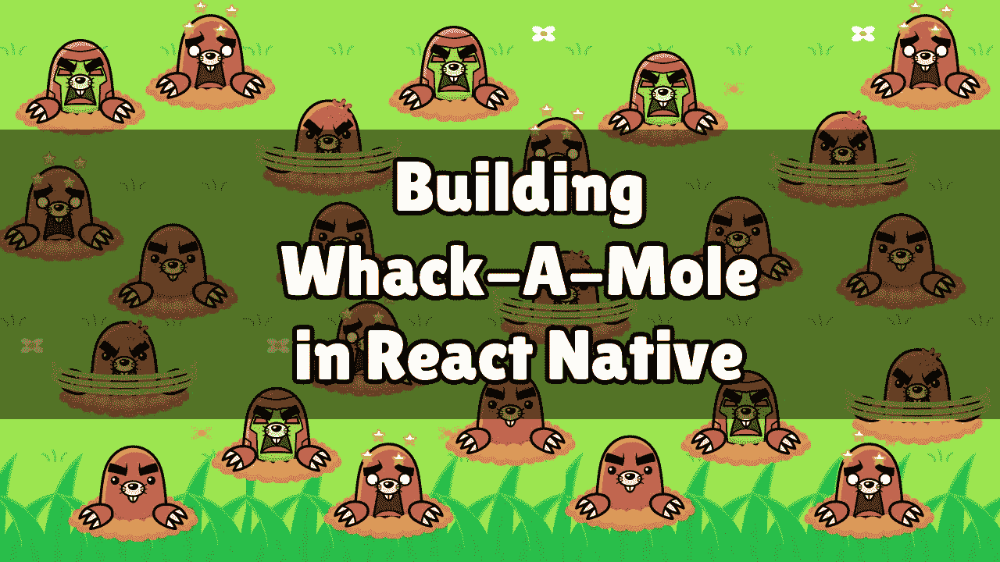
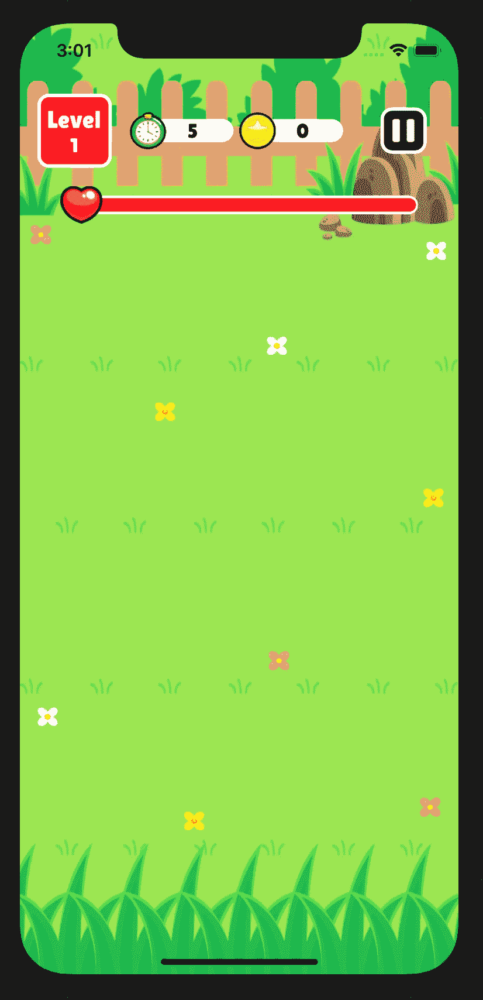
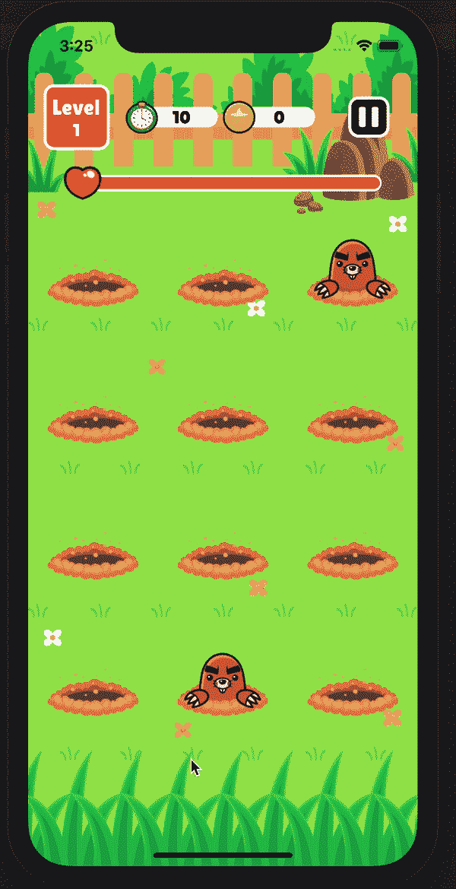
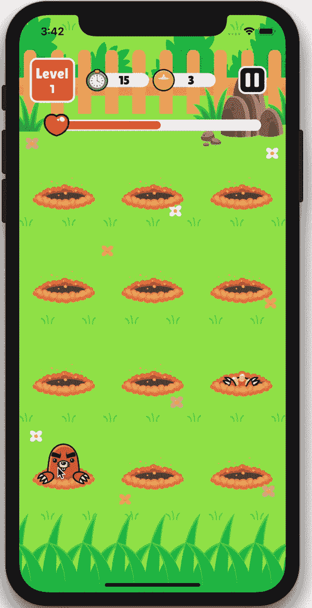

# 用 rn-sprite-sheet 构建打地鼠游戏

> 原文：<https://betterprogramming.pub/building-a-whack-a-mole-game-with-rn-sprite-sheet-e8871ca594ce>

## 通过一个新的转折来构建这个经典游戏



今天我要在 React Native 里再造另一个经典游戏:打地鼠。这款游戏的机械版在 70 年代末和 80 年代初是街机迷的最爱。从那以后，在各种设备上进行了大量的克隆。

TL；1 号医生:看视频:

TL；DR #2:从 GitHub 获取源代码

游戏玩法超级简单。在屏幕上，我们显示了 12 个插槽。鼹鼠会从这些槽中冒出来，然后又快速消失——玩家的目标是尽可能多地击中它们的头部。作为对原文的曲解，我想介绍三种不同的鼹鼠:

*   “中立”:如果没有被“重击”，这个鼹鼠不会造成伤害，但是当被击中时，玩家仍然会得到点数。
*   “好斗”:这种鼹鼠会攻击玩家，如果没有及时受到重击的话，会造成伤害。
*   “治疗者”:如果被重击，它会恢复玩家一点点生命值。

最初的游戏更多的是针对儿童的——我认为引入不同的鼹鼠将会使事情变得有趣，足以扩大它的吸引力！

# 设置

我们需要一些动画。在我看来，在 React Native 中制作动画的最佳方式是使用 [rn-sprite-sheet](https://github.com/MiLeung/rn-sprite-sheet) 库。您可以通过运行以下命令来安装它:

```
npm install --save rn-sprite-sheet
```

这个库在从包含相同大小的帧的单个图像文件中定义和运行小动画方面是惊人的。

例如，如果一个动画有六个图像帧，每个都是 40x50 像素，您可以创建一个 240x50 的图像，粘贴您的帧，然后就可以开始了。

然而，在现实生活中，你的镜架大小并不一样。我花了好几个小时手工创建我的 sprite 工作表，并且感到很烦——以至于我不得不创建一个 python 脚本来为我做这件事。你可以从我的 [GitHub](https://github.com/lepunk/sprite-sheet-generator) 中获取脚本。

无论如何，我最终为我们的游戏准备了这些图像资产:[https://github . com/lepunk/react-native-videos/tree/whak-a-mole/whack amole/assets/img](https://github.com/lepunk/react-native-videos/tree/whack-a-mole/WhackAMole/assets/img)

像往常一样，为了方便起见，让我们将它们放入 Image.js 文件中:

```
export default Images = {
    background: require('./img/background.png'),
    sprites: require('./img/sprites.png'),
    healthIcon: require('./img/icon_health.png'),
    pauseIcon: require('./img/icon_pause.png'),
    timeIcon: require('./img/icon_time.png'),
    scoreIcon: require('./img/icon_score.png'),
    restartIcon: require('./img/icon_restart.png'),
    playIcon: require('./img/icon_play.png')
}
```

设置基础设计既漫长又无聊。所以不用写几百行解释，只要[点这里](https://github.com/lepunk/react-native-videos/tree/whackamole/WhackAMole) 就能看到我们的起始位置。没什么特别的。我唯一想强调的是 Constants.js 中的两行代码

```
XR: Dimensions.get("screen").width / 650,
YR: Dimensions.get("screen").height / 1024,
```

我们的`background.png`图像是静态的 650x1024px png。我们正在拉伸这个图像，以覆盖用户设备的整个屏幕。这款设备的屏幕尺寸可能不会是 650x1024，因此图像会略有失真，这不是什么大问题。然而，问题是，以后我们需要在这个背景上的准确位置放置元素。这就是为什么我们必须设置 XR 和 YR 常数。它们表示背景图像大小和用户屏幕大小之间的 X 和 Y 比率。例如，如果屏幕的宽度是 1300，XR 值将是 2。如果我们想在原始背景的左边放置 20 像素的东西，我们可以说`Constants.XR * 20`



这是我们的新记录

# 鼹鼠. js

是时候把我们的鼹鼠加到屏幕上了。我们的基本 Mole.js 看起来会像这样:

```
import React, { Component } from 'react';
import { View, StyleSheet, Button, Image, TouchableWithoutFeedback } from 'react-native';
import Images from './assets/Images';
import SpriteSheet from 'rn-sprite-sheet';
import Constants from './Constants';

export default class Mole extends Component {
    constructor(props){
        super(props);

        this.mole = null;
    }

    whack = () => {

    }

    render(){
        return (
            <View style={{ flex: 1 }}>
                <SpriteSheet
                    ref={ref => (this.mole = ref)}
                    source={Images.sprites}
                    columns={6}
                    rows={8}
                    width={100}
                    animations={{
                        idle: [0],
                        appear: [1, 2, 3, 4],
                        hide: [4, 3, 2, 1, 0],
                        dizzy: [36, 37, 38],
                        faint: [42, 43, 44, 0],
                        attack: [11, 12, 13, 14, 15, 16],
                        heal: [24, 25, 26, 27, 28, 29, 30, 31, 32, 33]
                    }}
                />
                <TouchableWithoutFeedback onPress={this.whack} style={{ position: 'absolute', top: 0, left: 0, right: 0, bottom: 0}}>
                    <View style={{ position: 'absolute', top: 0, left: 0, right: 0, bottom: 0 }} />
                </TouchableWithoutFeedback>
            </View>
        )
    }
}
```

有趣的部分是<spritesheet>组件。因为我们的 sprites.png 一行有六个图像，而我们有八行，所以我们传入`columns={6}`和`rows={8}`</spritesheet>

然后我们需要定义动画。每个动画都有一个名称(例如“出现”)和一个帧索引列表。我们的 sprite 中的每一帧都分配了一个索引，从左上角的零开始，从左到右、从上到下递增 1。

# 将鼹鼠添加到屏幕上

在我们的 App.js 中，我们需要导入我们的 Mole 组件:

```
import Mole from './Mole';
```

我们可能希望保留对每个摩尔的引用，所以让我们按如下方式修改我们的构造函数:

```
constructor(props){
    super(props);
    this.state = DEFAULT_STATE;
    this.moles = [];
}
```

最后，在我们的`playArea`中创建一个 3x4 的鼹鼠网格:

```
<View style={styles.playArea}>
    {Array.apply(null, Array(4)).map((el, rowIdx) => {
        return (
            <View style={styles.playRow} key={rowIdx}>
                {Array.apply(null, Array(3)).map((el, colIdx) => {
                    let moleIdx = (rowIdx * 3) + colIdx;

                    return (
                        <View style={styles.playCell} key={colIdx}>
                            <Mole
                                index={moleIdx}
                                ref={(ref) => { this.moles[moleIdx] = ref }}
                            />
                        </View>
                    )
                })}
            </View>
        )
    })}
</View>
```

太好了，现在我们的屏幕上有 12 个洞什么都不用做。

# 打掉那些痣

我们希望定期在随机位置弹出鼹鼠。为了实现这一点，我们需要在我们的 Mole.js 中公开一个`pop()`方法

```
pop = () => {
    this.isPopping = true;
    this.mole.play({
        type: "appear",
        fps: 24,
        onFinish: () => {
            this.actionTimeout = setTimeout(() => {
                this.mole.play({
                    type: "hide",
                    fps: 24,
                    onFinish: () => {
                        this.isPopping = false;
                        this.props.onFinishPopping(this.props.index);
                    }
                })
            }, 1000)
        }
    });
}
```

当我们调用这个方法播放“出现”动画时，等待一秒钟然后播放“隐藏”动画。注意到`this.props.onFinishPopping`呼叫了吗？这将在整个序列完成时被调用。

在我们的 App.js 中，我们应该修改`Mole`定义:

```
<Mole
    index={moleIdx}
    ref={(ref) => { this.moles[moleIdx] = ref }}
    onFinishPopping={this.onFinishPopping}
/>
```

然后我们添加设置两个循环的逻辑:一个用于弹出摩尔，另一个用于减少计时器:

```
constructor(props){
    super(props);
    this.state = DEFAULT_STATE;
    this.moles = [];
    this.molesPopping = 0;
    this.interval = null;
    this.timeInterval = null;
}

componentDidMount = () => {
    this.setState(DEFAULT_STATE, this.setupTicks);
}

setupTicks = () => {
    let speed = 750 - (this.state.level * 50);
    if (speed < 350){
        speed = 350;
    }
    this.interval = setInterval(this.popRandomMole, speed);
    this.timeInterval = setInterval(this.timerTick, 1000);
}

randomBetween = (min, max) => {
    return Math.floor(Math.random() * (max - min + 1) + min);
}

onFinishPopping = (index) => {
    this.molesPopping -= 1;
}

popRandomMole = () => {
    if (this.moles.length != 12){
        return;
    }

    let randomIndex = this.randomBetween(0, 11);
    if (!this.moles[randomIndex].isPopping && this.molesPopping < 3){
        this.molesPopping += 1;
        this.moles[randomIndex].pop();
    }
}

timerTick = () => {
    if (this.state.time === 0){
        clearInterval(this.interval);
        clearInterval(this.timeInterval);
        this.setState({
            cleared: true
        })
    } else {
        this.setState({
            time: this.state.time - 1
        })
    }
}
```

好了，这里有很多东西要解开:

*   在`componentDidMount`上，我们调用`setupTicks`(在设置一些基本状态之后)。
*   `setupTick`将设置如上所述的两个间隔。
*   我们在`molesPopping`变量中记录在任何给定的时刻有多少摩尔在“爆炸”。
*   当一个鼹鼠完成弹出时，调用`onFinishPopping`，我们减少这个变量。
*   `popRandomMole`将选择一个当前没有弹出的随机槽，但前提是我们一次的活动鼹鼠少于三个(否则事情会变得太混乱)。



看起来不错，但并不令人兴奋…

# 打那些鼹鼠

正如这篇文章第一段提到的，我想在原来的游戏中加入一个转折，引入不同种类的鼹鼠。

默认情况下，每只鼹鼠都是“中立”的，但是他们有 40%的几率变成“好斗的”，有 5%的几率成为“治疗者”。

基于它们的类型，我们将播放不同的动画序列。我们还应该处理重击。一个`TouchableWithoutFeedback`已经被定义并指向我们需要填充的鼹鼠的重击方法。我们的 Mole.js 看起来会像这样:

```
import React, { Component } from 'react';
import { View, StyleSheet, Button, Image, TouchableWithoutFeedback } from 'react-native';
import Images from './assets/Images';
import SpriteSheet from 'rn-sprite-sheet';
import Constants from './Constants';

export default class Mole extends Component {
    constructor(props){
        super(props);

        this.mole = null;
        this.actionTimeout = null;
        this.isPopping = false;
        this.isFeisty = false;
        this.isHealing = false;
        this.isWhacked = false;
        this.isAttacking = false;
    }

    pop = () => {
        this.isWhacked = false;
        this.isAttacking = false;
        this.isPopping = true;

        this.isFeisty = Math.random() < 0.4;
        if (!this.isFeisty){
            this.isHealing = Math.random() < 0.05;
        }

        if (this.isHealing){
            this.mole.play({
                type: "heal",
                fps: 24,
                onFinish: () => {
                    this.actionTimeout = setTimeout(() => {
                        this.mole.play({
                            type: "hide",
                            fps: 24,
                            onFinish: () => {
                                this.isPopping = false;
                                this.props.onFinishPopping(this.props.index);
                            }
                        })
                    }, 1000);
                }
            })
        } else {
            this.mole.play({
                type: "appear",
                fps: 24,
                onFinish: () => {
                    if (this.isFeisty){
                        this.actionTimeout = setTimeout(() => {
                            this.isAttacking = true;
                            this.props.onDamage();
                            this.mole.play({
                                type: "attack",
                                fps: 12,
                                onFinish: () => {
                                    this.mole.play({
                                        type: "hide",
                                        fps: 24,
                                        onFinish: () => {
                                            this.isPopping = false;
                                            this.props.onFinishPopping(this.props.index);
                                        }
                                    })
                                }
                            })
                        }, 1000)
                    } else {
                        this.actionTimeout = setTimeout(() => {
                            this.mole.play({
                                type: "hide",
                                fps: 24,
                                onFinish: () => {
                                    this.isPopping = false;
                                    this.props.onFinishPopping(this.props.index);
                                }
                            })
                        }, 1000)
                    }
                }
            })
        }
    }

    whack = () => {
        if (!this.isPopping || this.isWhacked || this.isAttacking){
            return;
        }

        if (this.actionTimeout){
            clearTimeout(this.actionTimeout);
        }

        this.isWhacked = true;
        this.isFeisty = false;

        this.props.onScore();
        if (this.isHealing){
            this.props.onHeal();
        }

        this.mole.play({
            type: "dizzy",
            fps: 24,
            onFinish: () => {
                this.mole.play({
                    type: "faint",
                    fps: 24,
                    onFinish: () => {
                        this.isPopping = false;
                        this.props.onFinishPopping(this.props.index);
                    }
                })
            }
        })
    }

    render(){
        return (
            <View style={{ flex: 1 }}>
                <SpriteSheet
                    ref={ref => (this.mole = ref)}
                    source={Images.sprites}
                    columns={6}
                    rows={8}
                    width={100}
                    animations={{
                        idle: [0],
                        appear: [1, 2, 3, 4],
                        hide: [4, 3, 2, 1, 0],
                        dizzy: [36, 37, 38],
                        faint: [42, 43, 44, 0],
                        attack: [11, 12, 13, 14, 15, 16],
                        heal: [24, 25, 26, 27, 28, 29, 30, 31, 32, 33]
                    }}
                />
                <TouchableWithoutFeedback onPress={this.whack} style={{ position: 'absolute', top: 0, left: 0, right: 0, bottom: 0}}>
                    <View style={{ position: 'absolute', top: 0, left: 0, right: 0, bottom: 0 }} />
                </TouchableWithoutFeedback>
            </View>
        )
    }
}
```

您可能已经注意到，我们使用了三种新的回调方法:

*   `this.props.onDamage`
*   `this.props.onHeal`
*   `this.props.onScore`

我们应该在 App.js 中定义这些。首先，让我们更改鼹鼠的定义:

```
<Mole
    index={moleIdx}
    ref={(ref) => { this.moles[moleIdx] = ref }}
    onFinishPopping={this.onFinishPopping}
    onDamage={this.onDamage}
    onHeal={this.onHeal}
    onScore={this.onScore}
/>
```

接下来，我们定义这三种方法:

```
gameOver = () => {
    clearInterval(this.interval);
    clearInterval(this.timeInterval);

    this.setState({
        gameover: true
    });
}

onScore = () => {
    this.setState({
        score: this.state.score + 1
    })
}

onDamage = () => {
    if (this.state.cleared || this.state.gameOver || this.state.paused){
        return;
    }

    let targetHealth = this.state.health - 10 < 0 ? 0 : this.state.health - 10;

    this.setState({
        health: targetHealth
    });

    if (targetHealth <= 0){
        this.gameOver();
    }
}

onHeal = () => {
    let targetHealth = this.state.health + 10 > 100 ? 100 : this.state.health + 10;
    this.setState({
        health: targetHealth
    });
}
```

这些方法都不是火箭科学:

*   增加 10 点生命值(如果还没满的话)。
*   `onScore`状态加一分。
*   `onDamage`带走 10 点生命值。如果生命值低于 0，它会清除间隔并在屏幕上显示游戏。

最后，我们必须为我们的接口挂接一些方法。我们需要定义:

*   `reset()`，当用户点击任何弹出屏幕上的复位按钮时调用
*   `nextLevel()`，当用户点击清除屏幕上的“播放”按钮时调用
*   `pause()`，当用户点击右上角的暂停按钮时
*   `resume()`，当用户点击暂停屏幕上的播放按钮时。

它们非常简单，应该是这样的:

```
reset = () => {
    this.molesPopping = 0;

    this.setState(DEFAULT_STATE, this.setupTicks);
}

pause = () => {
    if (this.interval) clearInterval(this.interval);
    if (this.timeInterval) clearInterval(this.timeInterval);
    this.setState({
        paused: true
    });
}

resume = () => {
    this.molesPopping = 0;
    this.setState({
        paused: false
    }, this.setupTicks);
}

nextLevel = () => {
    this.molesPopping = 0;

    this.setState({
        level: this.state.level + 1,
        cleared: false,
        gameover: false,
        time: DEFAULT_TIME
    }, this.setupTicks)
}
```

现在你知道了！我们已经成功地在 React Native 中构建了一个正常工作的打地鼠游戏，这实际上是一个非常有趣的游戏！



我希望你喜欢这个教程。