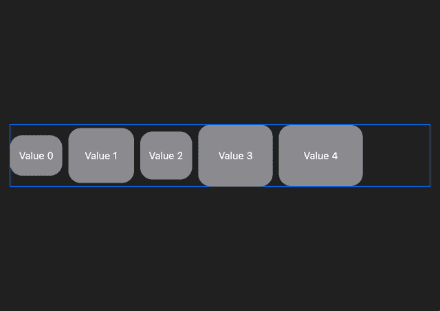
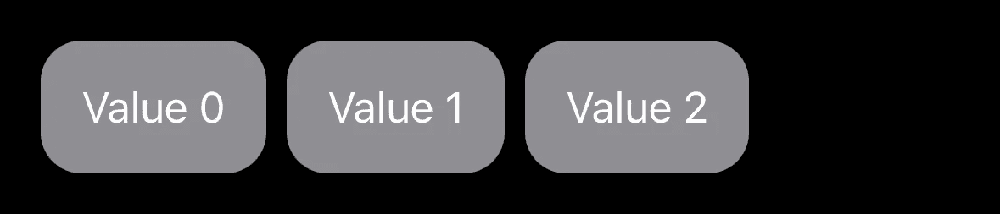
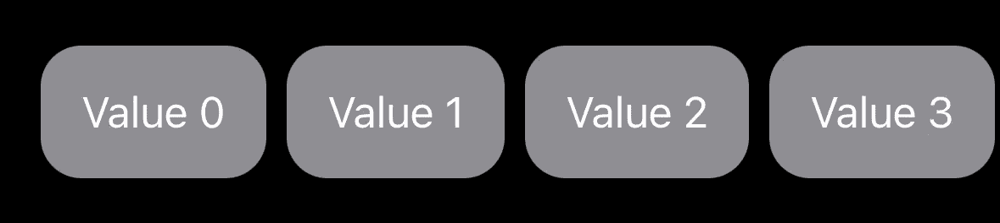
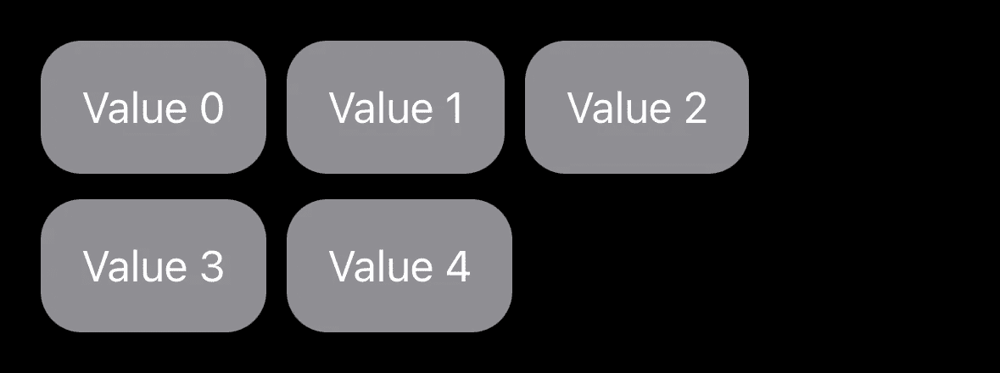

# 使用 SwiftUI 布局协议构建包装 HStack

> 原文：<https://betterprogramming.pub/building-a-wrapping-hstack-with-the-swiftui-layout-protocol-1e718239bf57>

## 如何创建一个通用的 SwiftUI 容器，它允许显示一组标记，这些标记可以换行到后续的行中。



我们即将制作的组件以 [Swift 包](https://github.com/ksemianov/WrappingHStack)的形式提供。

# 介绍

周一早上，您的项目经理给了您一项任务，向产品详细信息页面添加标签列表。你说“容易”,然后在 10 分钟内做出以下内容。

```
HStack {
    ForEach(tags) {
        TagView(text: $0.text)
    }

    Spacer(minLength: .zero)
}.padding(.horizontal)
```



在 QA 团队查看之后，当有许多标签时，他们报告了一个 bug。


你可以让它水平滚动。

```
ScrollView(.horizontal, showsIndicators: false) {
    LazyHStack {
        ForEach(tags) {
            TagView(text: $0.text)
        }
    }.padding(.horizontal)
}.frame(height: 56)
```



缺点是你必须事先知道标签视图的高度。

当标签不适合视图宽度时，设计团队要求在后续行上换行。而现在你的“容易”变成了“难”。你的一位同事建议用一个`UIViewRepresentable`包装一个自定义的`UICollectionView`。另一个尝试新的`Layout`协议。你决定用`Layout`...

# 布局协议

该协议有两个要求:

*   `sizeThatFits`控制视图需要多少空间
*   `placeSubviews`控制可用空间中子视图的位置

注意，在布局过程中可能会多次调用`sizeThatFits`。它将尝试不同大小的建议。在编写本文时，在 iOS 上，它通常会尝试传递所有可用空间。在 macOS 上，它还会尝试一个`.zero`大小的建议，以便可以计算最小窗口大小。因此，为了支持 macOS，我们需要计算视图的最小尺寸。

# 进场大纲

给定一个`.zero`提议，我们将最小尺寸作为子视图的最大尺寸。每当提案小于最小尺寸时，我们将提前返回最小尺寸。

```
func minSize(subviews: Subviews) -> CGSize {
    subviews
        .map { $0.sizeThatFits(.zero) }
        .reduce(CGSize.zero) { CGSize(width: max($0.width, $1.width), height: max($0.height, $1.height)) }
}
```

为了计算尺寸和位置，我们需要首先将子视图排列成行。

主要思想是迭代子视图，如果子视图的宽度+水平间距仍然适合容器的宽度，则增加 X 坐标，否则转到下一行。

这将允许我们获得所有子视图的 X 偏移量。然后，我们将迭代行，并通过最大高度子视图的高度+垂直间距来增加 Y 坐标。这将允许我们获得所有行的 Y 偏移量。

一旦我们有了行的排列，宽度将填满所有可用的空间。

```
let width = proposal.width ?? rows.map { $0.width }.reduce(.zero) { max($0, $1) }
```

高度将是最后一行的垂直偏移量+它的高度。

```
var height: CGFloat = .zero
if let lastRow = rows.last {
    height = lastRow.yOffset + lastRow.height
}
```

子视图将被放置在它们相应的偏移+边界最小点上。

```
for row in rows {
    for element in row.elements {
        let x: CGFloat = element.xOffset
        let y: CGFloat = row.yOffset
        let point = CGPoint(x: x + bounds.minX, y: y + bounds.minY)

        subviews[element.index].place(at: point, anchor: .topLeading, proposal: proposal)
    }
}
```

# 行排列

对于每一行，我们需要知道子视图的索引、大小和 X 偏移量。此外，整体行 Y 偏移，行宽度和高度。

```
struct Row {
    var elements: [(index: Int, size: CGSize, xOffset: CGFloat)] = []
    var yOffset: CGFloat = .zero
    var width: CGFloat = .zero
    var height: CGFloat = .zero
}

func arrangeRows(proposal: ProposedViewSize,
                 subviews: Subviews,
                 cache: inout ()) -> [Row] {
    let minSize = minSize(subviews: subviews)
    if minSize.width > proposal.width ?? .infinity,
       minSize.height > proposal.height ?? .infinity {
        return []
    }

    let sizes = subviews.map { $0.sizeThatFits(proposal) }

    var currentX = CGFloat.zero
    var currentRow = Row()
    var rows = [Row]()

    for index in subviews.indices {
        var spacing = CGFloat.zero
        if let previousIndex = currentRow.elements.last?.index {
            spacing = horizontalSpacing(subviews[previousIndex], subviews[index])
        }

        let size = sizes[index]

        if currentX + size.width + spacing > proposal.width ?? .infinity,
           !currentRow.elements.isEmpty {
            currentRow.width = currentX
            rows.append(currentRow)
            currentRow = Row()
            spacing = .zero
            currentX = .zero
        }

        currentRow.elements.append((index, sizes[index], currentX + spacing))
        currentX += size.width + spacing
    }

    currentRow.width = currentX
    rows.append(currentRow)

    var currentY = CGFloat.zero
    var previousMaxHeightIndex: Int?

    for index in rows.indices {
        let maxHeightIndex = rows[index].elements
            .max { $0.size.height < $1.size.height }!
            .index

        let size = sizes[maxHeightIndex]

        var spacing = CGFloat.zero
        if let previousMaxHeightIndex {
            spacing = verticalSpacing(subviews[previousMaxHeightIndex], subviews[maxHeightIndex])
        }

        rows[index].yOffset = currentY + spacing
        currentY += size.height + spacing
        rows[index].height = size.height
        previousMaxHeightIndex = maxHeightIndex
    }

    return rows
}
```

# 间隔

如果`nil`，我们将允许水平和垂直间距覆盖或使用系统提供的间距。`LayoutSubview`代理允许获取一对子视图的系统间距。

```
func horizontalSpacing(_ lhs: LayoutSubview, _ rhs: LayoutSubview) -> CGFloat {
    if let horizontalSpacing { return horizontalSpacing }

    return lhs.spacing.distance(to: rhs.spacing, along: .horizontal)
}

func verticalSpacing(_ lhs: LayoutSubview, _ rhs: LayoutSubview) -> CGFloat {
    if let verticalSpacing { return verticalSpacing }

    return lhs.spacing.distance(to: rhs.spacing, along: .vertical)
}
```

# 布局属性

`Layout`协议有一个可选的`layoutProperties`参数，允许控制`StackOrientation`。它会影响`Spacer`和`Divider`的处理方式。

例如，使用`stackOrientation = .horizontal`时，`Spacer`只会水平扩展。因此，它将允许在容器中强制换行。

它有一个警告，在分割的行之间将有两倍的间距，默认的系统间距为零。

```
static var layoutProperties: LayoutProperties {
    var properties = LayoutProperties()
    properties.stackOrientation = .horizontal

    return properties
}
```

# 对齐

我们将允许控制容器内部的对齐值。除了`Layout`协议没有提供实现各种文本基线对齐值的简单方法:`.leadingFirstTextBaseline`、`.centerLastTextBaseline`等。其余值对应于`UnitPoint`值。

```
extension UnitPoint {
    init(_ alignment: Alignment) {
        switch alignment {
        case .leading:
            self = .leading
        case .topLeading:
            self = .topLeading
        case .top:
            self = .top
        case .topTrailing:
            self = .topTrailing
        case .trailing:
            self = .trailing
        case .bottomTrailing:
            self = .bottomTrailing
        case .bottom:
            self = .bottom
        case .bottomLeading:
            self = .bottomLeading
        default:
            self = .center
        }
    }
}

let anchor = UnitPoint(alignment)
```

我们需要在`placeSubviews`中用锚值进行修正。

```
let xCorrection = anchor.x * (bounds.width - row.width)
let yCorrection = anchor.y * (row.height - element.size.height)
```

# 贮藏

我们将缓存容器的最小大小和行排列以提高性能。

行的排列取决于建议和子视图的大小。只要这些发生变化，就应该重新计算行的排列

```
struct Cache {
    var minSize: CGSize
    var rows: (Int, [Row])?
}

func makeCache(subviews: Subviews) -> Cache {
    Cache(minSize: minSize(subviews: subviews))
}

func updateCache(_ cache: inout Cache, subviews: Subviews) {
    cache.minSize = minSize(subviews: subviews)
}

func computeHash(proposal: ProposedViewSize, sizes: [CGSize]) -> Int {
    let proposal = proposal.replacingUnspecifiedDimensions(by: .infinity)

    var hasher = Hasher()

    for size in [proposal] + sizes {
        hasher.combine(size.width)
        hasher.combine(size.height)
    }

    return hasher.finalize()
}

// In `arrangeRows` beginning
let hash = computeHash(proposal: proposal, sizes: sizes)
if let (oldHash, oldRows) = cache.rows,
   oldHash == hash {
    return oldRows
}

// In `arrangeRows` end
cache.rows = (hash, rows)
```

# 使用

做完这些工作后，我们终于可以重新定义我们的标签列表了。

```
WrappingHStack(alignment: .leading) {
    ForEach(tags) {
        TagView(text: $0.text)
    }
}.padding()
```



# 限制

按照设计，容器不支持在垂直轴上无限增长的子视图。在这种情况下，你怎么定义身高呢？

# 最后的想法

我们已经以一种通用的方式编写了包装 hstack(有时也称为流布局)容器，可以处理各种各样的子视图。这绝对不容易，我们现在可以欣赏我们使用标准`HStack`和`VStack`的简单性。

在[https://github.com/ksemianov/WrappingHStack](https://github.com/ksemianov/WrappingHStack)查看完整代码。

*原载于*[*https://ksemianov . github . io*](https://ksemianov.github.io/articles/wrapping-hstack/)