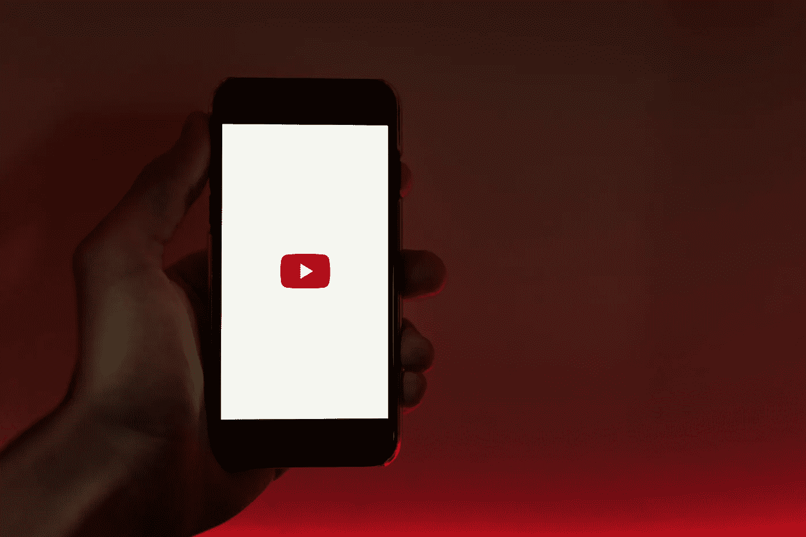
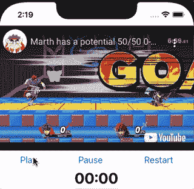
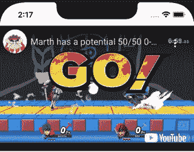
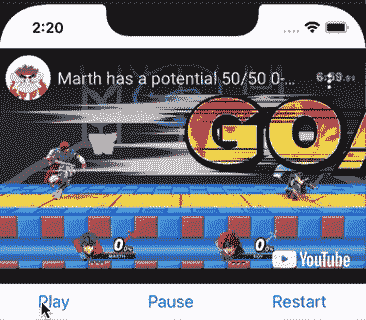
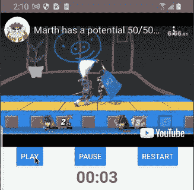

# 使用 React-Native WebView 构建 YouTube 组件

> 原文：<https://betterprogramming.pub/building-a-youtube-component-using-the-react-native-webview-808fc4e2d49b>

## 将 YouTube 播放器功能添加到 React-Native 应用程序中



照片由 [Szabo Viktor](https://unsplash.com/@vmxhu?utm_source=unsplash&utm_medium=referral&utm_content=creditCopyText) 在 [Unsplash](https://unsplash.com/s/photos/youtube?utm_source=unsplash&utm_medium=referral&utm_content=creditCopyText) 上拍摄

最近，我在开发一个需要访问 YouTube 视频的应用程序。令我惊讶的是，NPM 没有多少好的图书馆。在深入研究了 YouTube 和 React-Native 开发之后，我意识到 YouTube 希望你只使用他们的 embed。

这提出了一个有趣的问题。

如果我们使用的是基于浏览器的 JavaScript，那么仅仅从 YouTube 文档中复制并粘贴 JS 就太简单了。然而，在移动设备上工作时，我们没有同样的奢侈。幸运的是，React-Native 中的 WebView 提供了一个健壮的 API，允许我们在移动设备和 WebView 的浏览器之间进行通信。

在这篇博客中，我将解释我们如何利用这个 API 来创建一个我们可以从 React-Native 控制的 YouTube 组件。和往常一样，如果你在任何时候遇到困难，请点击这里查看完整的项目报告。

# 我们在建造什么？

今天，我们将构建这个简单的应用程序，通过 YouTube 嵌入播放视频。您将了解如何显示视频，以及如何在 WebView 的 JavaScript 和 React-Native 之间进行通信。



我们在 iOS 上运行的应用

# 入门指南

您首先要做的是使用以下命令生成一个空的 TypeScript 项目:

```
npx react-native init YoutubePlayer --template react-native-template-typescript
```

生成项目后，运行以下命令来安装`react-native-webview`:

```
npm i react-native-webview
```

最后，在项目中安装新的 Cocoapods。

```
cd ios && npx pod install
```

# 编写标记

当使用像 YouTube 播放器这样复杂的 web 组件时，我们不能只是弹出一个 URL 并观看 WebView 工作。为了支持这样一个功能丰富的组件，我们需要使用 [YouTube embed](https://developers.google.com/youtube/iframe_api_reference) 。

我建议首先在您的`src`目录下创建一个名为`iFrame.tsx`的文件。创建这个文件后，我们可以开始创建一个名为`buildIFrame`的函数。这个函数将构建我们的 HTML 代码的嵌入部分。

首先添加一个玩家`div`，我们可以用它作为嵌入的目标。

```
const buildIFrame = (videoId: string) => `
  <div id="player"></div>
```

接下来，我们将想要构建使 YouTube 播放器出现的脚本。我们从异步加载 iFrame 播放器代码开始。

```
...
var tag = document.createElement('script');
tag.src = "https://www.youtube.com/iframe_api";
var firstScriptTag = document.getElementsByTagName('script')[0];
firstScriptTag.parentNode.insertBefore(tag, firstScriptTag);
...
```

此时，我们需要创建 YouTube 播放器并定位我们创建的`player` div。我们的做法如下:

稍后会传入`videoId`,但是现在，您可以像这样从 React 原生尺寸中获得屏幕宽度。

```
import {Dimensions} from 'react-native';
const {width} = Dimensions.get('window');
```

到目前为止，您的`buildIFrame`函数应该如下所示。

下一步是设计我们的`iFrame`。请记住，这种风格是非常具体的。这是因为我们希望`iFrame`填充它的父视图。

最后，让我们创建一个方法，它从 YouTube 获取一个`videoId`，并使用它来构建整个 iFrame HTML 页面。

# 创建组件

现在我们有了需要的标记，让我们创建 WebView 组件。导航回您的`App.tsx`文件。此时，您希望导入 WebView 组件，并将其与我们刚刚创建的`buildHTML`函数一起使用。总之，该文件应该如下所示:

此时，如果您点击它，您应该可以观看视频。



视频应该能用

# 构建控件

为了创建控件，我们将向前面的`buildIFrame`函数添加更多代码。在网上，YouTube 播放器可以让你使用多种功能。我们在这个项目中使用的是播放和暂停视频，寻找时间，并获得视频中的当前时间。

我们将这些功能封装在 JavaScript 浏览器函数中，以便稍后可以从 React-Native 调用它们。这样做了之后，你的`buildIFrame`就会采取这种形式。

回到`App.tsx`文件，我们有一个简单的任务，将这些函数包装在 React-Native 函数中，这样我们就可以在浏览器中调用它们。从抓取 WebView 的引用开始。

```
const webRef = useRef<WebView>(null);
...
<WebView
  ref={webRef}
```

之后，您可以在 WebView 上调用任何您想要的 JavaScript 函数。以下是我们将在这个项目中使用的方法:

```
const playVideo = () => {
    webRef.current?.injectJavaScript('play()');
};const pauseVideo = () => {
    webRef.current?.injectJavaScript('pause()');
};const restartVideo = () => {
    webRef.current?.injectJavaScript('seekTo(0)');
};
```

如果我们加入几个按钮和一些简单的样式，我们的组件会以倒数第二种形式结束。

我们快到了！此时，您应该能够使用控件播放视频了。



控件现在应该可以工作了

# 显示计时器

我们最不想做的事情就是显示计时器。为此，我们必须每秒左右从 WebView 发布消息并将其发送到 React-Native。

我们可以使用`postMessage`函数将此功能添加到我们的 WebView 中。您可以将该片段添加到您的`iFrame.ts`中。

```
setInterval(() => {
  const data = {
    currentDuration: getCurrentTime()
  }
  window.ReactNativeWebView.postMessage(JSON.stringify(data));
}, 1000)
```

该函数现在应该包含设定的时间间隔，如下所示:

我们可以通过从 WebView 获取这些事件并使用状态显示它们来结束。您的最终`App.tsx`将如下所示:

您的最终结果应该是这样的:



在 Android 上运行的最终结果

# 最后的想法

随着 YouTube 成为互联网上的主要托管服务，能够在我们的应用程序中使用它真的很重要。以上，我给了你如何把它添加到你的应用程序的基础。

请随意设计您认为合适的控件样式，以适应您的用户体验！