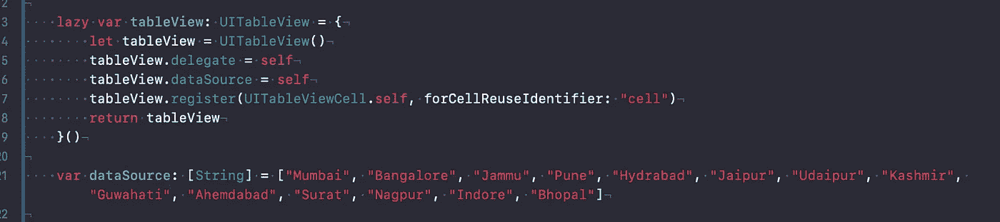
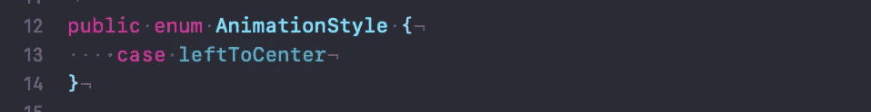
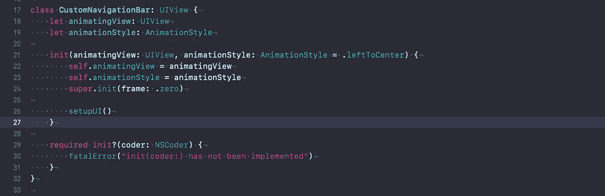
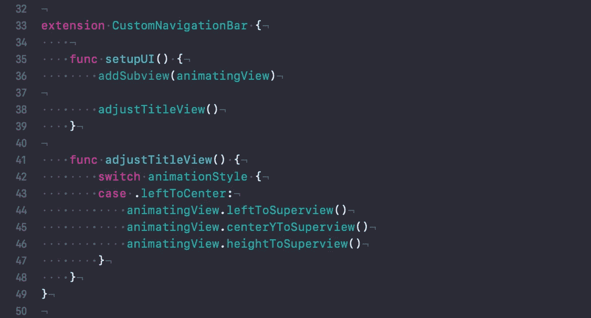
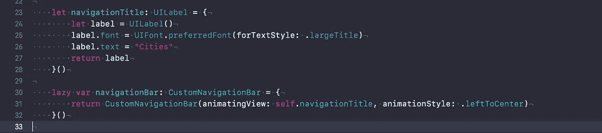
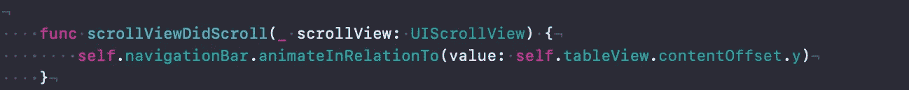
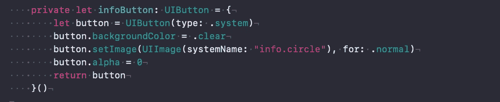
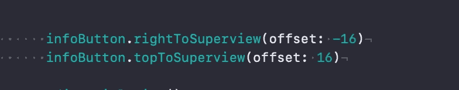
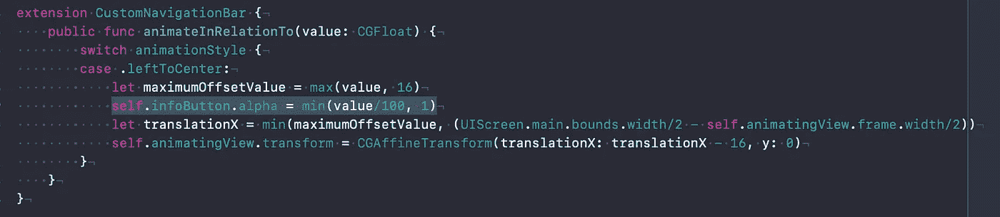

# 在 Swift 中构建一个动画 UINavigationBar

> 原文：<https://betterprogramming.pub/building-an-animating-navigation-bar-in-ios-13-96355c6822ce>

## 超越默认的导航栏功能

[瑞安唐](https://unsplash.com/@ryz0n?utm_source=medium&utm_medium=referral)在 [Unsplash](https://unsplash.com?utm_source=medium&utm_medium=referral) 上拍照。

# 我们在建造什么？

我们将建立一个自定义导航栏，有一个动画视图和右栏按钮。

我们将通过玩框架的轴(基本上是平移)来构建动画。这是最有用的，当你有一个模型演示，并希望你的 UX 脱颖而出！

# 先决条件

这是入门教程。您应该熟悉视图的框架和边界。此外，这篇文章采用了一种程序化的视图构建方法，但是动画部分通过故事板也是类似的。

了解 [CGAffineTransform](https://developer.apple.com/documentation/coregraphics/cgaffinetransform) 和 [TinyConstraints](https://github.com/roberthein/TinyConstraints) 者优先。

# 从哪里开始

我们的最终产品将是下面的动画。在 GitHub 上下载启动项目[。](https://github.com/arjunbaru/mediumArticles)

# 起始项目中有什么？

浏览代码，我们有一个`ViewController.swift`类，它有一个添加了不同城市数据源的表视图。

它还没有导航栏呢！

让我们创建一个 CustomNavigationBar 类**。**将`CustomNavigationBar.swift` 文件添加到项目中。

首先，我们将创建一个自定义枚举( `AnimationStyle` ) ，这个将指导视图的动画行为。

在本教程中，我们将只实现从左到中的动画。

由于我们使用的是 enum，我们可以根据需要在将来添加其他类型的动画。

让我们创建一个`CustomNavigationBar.swift` 类并添加下面的代码:

我们用动画视图和动画样式初始化这个类。

# 让我们来设置 UI

让我们将视图放置在左侧，以 Y 轴为中心，高度为超级视图的高度。

我使用 TinyConstraint 库作为一个工具来布置约束。您也可以使用 NSLayoutConstraint。只要确保你把它放在正确的地方。

# 是时候加入魔法了

添加以下代码:

我们在这里做的是相对于偏移表格/滚动视图平移 x 轴。

由于原点从左上角开始，我们将平移视图，并在到达超级视图的中心时停止。

为此，我们将取(`zero, ContentOffset`)的最大值，这样`-ve translation(of scrollView)`就可以被删除，并与超级视图的中心进行比较(取最小值)。然后我们将更新为翻译。

# 让我们连接导航栏

在`ViewController.swift`文件中创建导航栏和动画视图(在本例中是一个 UILabel ):

使用 ScrollView 的`scrollViewDidScroll(_ scrollView: UIScrollView)` 方法，传递 tableView 的`contentOffSet`:

建造并运行！

# **让我们添加导航栏按钮**并制作动画

添加以下代码:

使用 iOS 13 默认图像创建信息按钮

把它放在右上角

随着表视图偏移量的增加，alpha 也增加

# 看看最后的结果吧！

厉害！你可能想知道 iOS 13 的大导航栏是如何做到这一点的。嗯，这是另一个动画教程的主题。