# 用 Firebase 构建 API

> 原文：<https://betterprogramming.pub/building-an-api-with-firebase-109041721f77>


照片由[洛杉矶复活节](https://unsplash.com/@lastnameeaster?utm_source=medium&utm_medium=referral)在 [Unsplash](https://unsplash.com?utm_source=medium&utm_medium=referral) 拍摄

在这篇文章中，我将用谷歌的 Firebase 构建一个 API。我将用 [Firebase 云函数](https://firebase.google.com/docs/functions)和 [Express.js](https://expressjs.com/) 构建后端。

在开始之前，我推荐以下设置:

1.  安装在 Windows、Linux 或 Mac (OSX)电脑上的终端
2.  已安装节点 10.10
3.  NVM 安装了[和这里的说明](https://github.com/nvm-sh/nvm)
4.  一个谷歌账户
5.  [邮递员](https://www.getpostman.com/)已安装
6.  安装了运行终端命令`npm install -g firebase-tools`的 Firebase CLI

我将在这个 GitHub repo 中引用可用的代码[。GitHub repo 还包含一个邮递员集合；我建议导入它并使用它来测试您的项目。](https://github.com/andrewevans0102/how-to-build-a-firebase-api)

请注意，URL 路径中的`app id`特定于我部署的项目。您需要更改`app id`来匹配您在 Firebase 控制台中创建的项目。

如果您还不理解这一点，没关系——在初始项目建立之后，我将进一步讨论这一点。

# 基础知识

首先，我想回顾一下什么是 API 以及这些技术如何工作的一些基本概念。这完全是介绍性的，所以如果您已经熟悉了，可以随意跳过这一部分。

API 代表*应用编程接口*，指的是计算机系统用来相互通信的方法。

Google 的字典将 API 定义为:

> 一组函数和过程，允许创建访问操作系统、应用程序或其他服务的功能或数据的应用程序

您构建了一个 API，这样您的系统就可以与您正在构建的任何东西进行通信。API 可以包括网站的基本 REST 端点，甚至可以包括定义您构建的软件库的方法。

这就引出了下一件重要的事情，RESTful 服务。

RESTful 服务引用 [*表述性状态转移*](https://en.wikipedia.org/wiki/Representational_state_transfer) 并利用 HTTP 协议传递数据(通过 API)。HTTP 协议是我们每天在网站和互联网应用中使用的协议。

RESTful 服务使用不同的 HTTP 动词(或方法)在不同的系统之间传递数据。

典型的 HTTP 动词包括:

*   `GET` =检索数据
*   `POST` =创建或更新数据
*   `PUT` =更新数据
*   `DELETE` =删除数据

前面我也提到过*端点*；当我提到一个我需要点击的网站或服务时，这就是我要参考的。端点只是一种描述地址的奇特方式，我的系统将通过 HTTP 请求访问该地址。

关于 HTTP 请求的更多细节，请参考维基百科页面。

# 重火力点

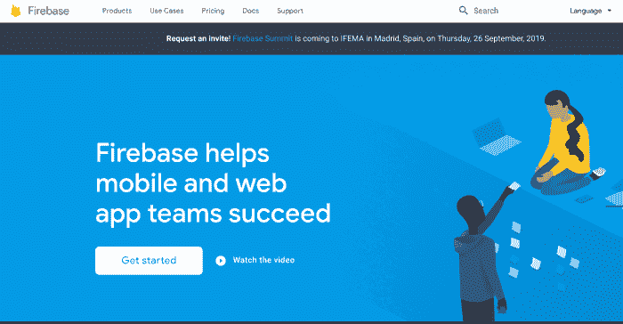

我正在为这个项目使用谷歌的 Firebase 平台。Firebase 是一个非常强大的平台，开发人员可以使用它快速构建应用程序。

Firebase 提供的常见服务包括:

*   [主持](https://firebase.google.com/docs/hosting)
*   [实时数据库](https://firebase.google.com/docs/database)
*   [NoSQL 数据库](https://firebase.google.com/docs/firestore)
*   [功能(类似于 AWS Lambda)](https://firebase.google.com/docs/functions)
*   [文件存储](https://firebase.google.com/docs/storage)
*   多得多！

要使用 Firebase，你只需要一个谷歌账户。

在这篇文章的剩余部分，我将为一个用 Firebase 构建的 API 设置后端。如果你想更深入地了解 Firebase，[请在这里查阅我的帖子](https://rhythmandbinary.com/2018/04/08/firebase/)。

# 初始设置

首先，进入[fire base 控制台](https://console.firebase.google.com/u/0/)。您应该会看到如下所示的内容:

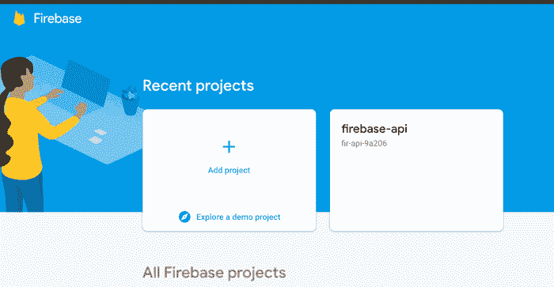

单击“添加项目”并为您的项目命名。

我建议接受这些分析，因为这对你和谷歌都有帮助。您可以稍后在控制台中参考分析信息(在您的项目被创建之后)。

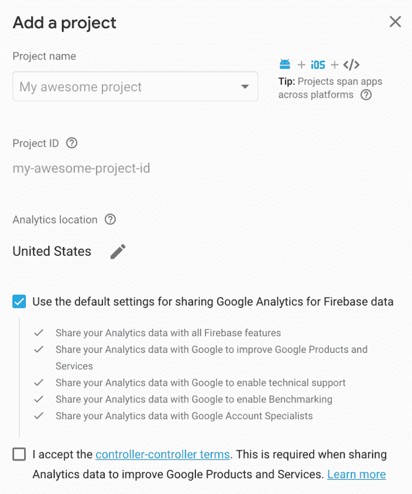

创建项目后，在控制台中打开它，然后单击左侧导航栏上的“database”以查看以下内容:

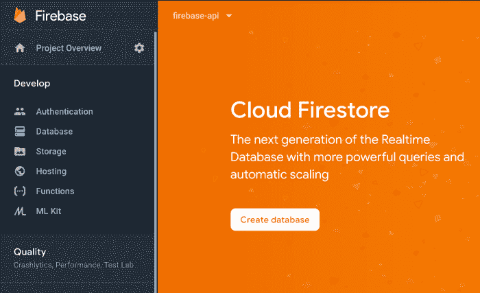

点击“云 [Firestore](https://firebase.google.com/docs/firestore) 下的“创建数据库”来创建您的初始数据库。

选择“测试模式”以启用所有读取和写入。您可以设置规则来指定数据库的安全性，以便以后进一步锁定数据库。请参考这里的 [Firebase 文档，了解更多关于锁定数据库实例的信息](https://firebase.google.com/docs/firestore/security/get-started)。

你还会被要求设置一个位置；默认应该没问题，但是您也可以尝试选择离您更近的数据中心。查看本页了解更多关于数据中心位置的信息。

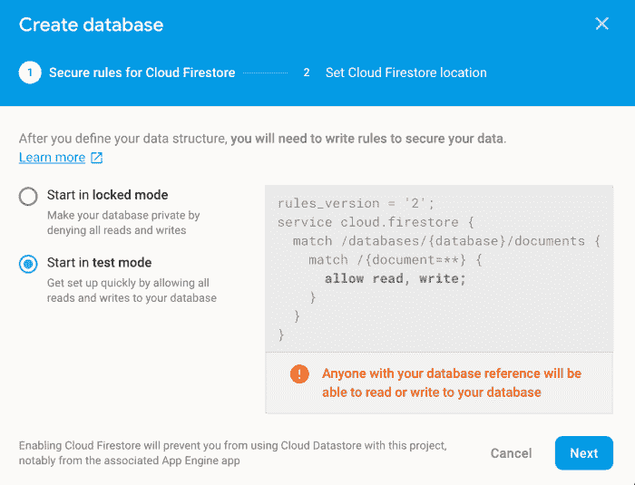

在控制台中设置好基本项目后，让我们切换到您的计算机来设置代码。

# 编写代码

在这一步中，我们假设您的计算机上已经安装了 Firebase CLI。如果你还没有这样做，我建议你按照这里的[指示](https://firebase.google.com/docs/cli)来设置。

接下来，转到您的终端，用`mkdir my-project`为您的项目创建一个文件夹。

接下来，`cd`进入那个文件夹，运行`firebase init`；您应该会看到如下所示的内容:

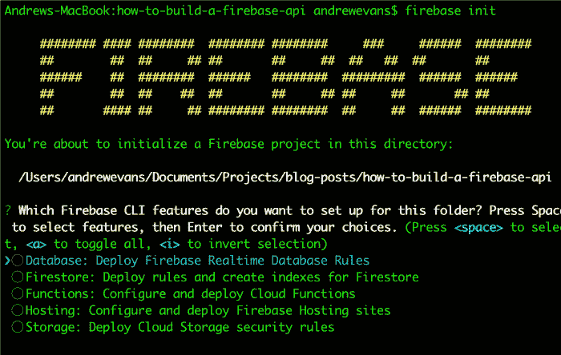

在选项菜单中选择“功能”。然后在下一个终端输出显示的列表中选择您之前创建的 Firebase 应用程序。

下一组选项相当简单。

*   选择`JavaScript`
*   为林挺选择`yes`
*   选择`yes`安装依赖项
*   你可以走了！

接下来，`cd`进入创建的`functions`文件夹。当您运行`init`命令时，它会生成一个`functions`文件夹供您使用。`functions`文件夹应该包含以下文件:

*   `index.js`
*   `node_modules`文件夹
*   `package-lock.json`
*   `package.json`

在你选择的终端编辑器中继续(我强烈推荐 [VS 代码](https://code.visualstudio.com/))，先看看`index.js`。

# 无服务器 API 和您的第一个端点

Firebase 函数使您能够使用 [Express.js](https://expressjs.com/) 库来托管无服务器 API。*无服务器*是指没有物理服务器运行的系统。

这有点用词不当，因为从技术上讲，它确实运行在服务器上；然而，你让提供商处理托管。传统的 API 要求您在云中或本地设置一个服务器来托管您的应用程序。

这意味着开发人员必须负责操作系统补丁和警报等。有了 serverless，除了你的代码，你什么都不用担心。这是 Firebase 最酷的部分之一！

因此，要在您的项目中使用 Express.js，请删除`index.js`文件，并在那里粘贴以下代码行:

使用`require`的第一行引入依赖项。我们还没有`express`或`cors`，所以让我们用下面的命令在终端中安装它们:

```
npm i express
npm i cors
```

带有`require`值的初始行导入我们将要使用的库。

以下是更详细的库:

*   `firebase-functions`是一个 [npm 模块](https://www.npmjs.com/package/firebase-functions)，使您能够创建功能。
*   `firebase-admin`是[Firebase admin SDK](https://firebase.google.com/docs/admin/setup)，它使您的功能能够控制所有后端 Firebase 服务。
*   `express`是让您创建服务器实例的 [Express.js](https://expressjs.com/) 库。
*   `cors`是一个 [npm 模块](https://www.npmjs.com/package/cors)，它允许你的函数在独立于你的客户端的地方运行。`app.use`为您的 Express 服务器实例启用 CORS。

带有`app.get`的代码部分创建了一个“hello world”端点。我们在这里使用的是[快速路由](https://expressjs.com/en/guide/routing.html)。有很多方法可以做到这一点。为了方便起见，我明确地定义了路线。

在企业环境中，您可能会使用快速路由器，并且代码可能看起来不那么冗长。要更详细地了解快速路由，我[推荐这里的教程](https://scotch.io/tutorials/learn-to-use-the-new-router-in-expressjs-4)。

出于我们的目的，`app.get` is 发出一个 HTTP `GET` 请求，并在`req`中捕获请求，在`res`中捕获响应。

当端点被调用时，它将返回一个“Hello World！”HTTP 状态代码为`200`的字符串。HTTP 中的状态代码用于确定响应。有很多，但是对于本教程来说，`200`是`success`，`500`会返回`error`。

带有`exports.app = functions.https.onRequest(app);`的部分暴露了您的 Express 应用程序，因此可以访问它。如果没有`exports`部分，您的应用程序将无法正确启动。

安装好包和初始代码后，我们就可以用`npm run serve`运行我们的项目了。这将在本地为您的功能服务，并且应该产生如下输出:

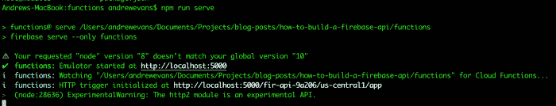

如果你注意到了，我确实收到了一个关于我的[节点](https://nodejs.org/)版本的警告。暂时忽略它；当我们开始访问数据库的时候，我会回来的。

另外，请注意，终端会输出本地运行的 API 的本地主机地址。您将直接从 Postman 调用它，因为这是您的 API 的“地址”。

在 localhost 上运行时，您的应用程序的 URL 将如下所示:

```
[<------domain---->]/[<-app id--->]/[<-zone-->]/app/[<-endpoint->]
http://localhost:5000/fir-api-9a206/us-central1/app/create
```

当我们进行部署时，URL 中唯一的不同是`[http://localhost:500](http://localhost:500)`将被替换为`zone + app id + cloudfunctions.net`，如下所示:

```
[<---zone + app id + cloudfunctions.net----->]/app/[<--endpoint-->]
https://us-central1-fir-api-9a206.cloudfunctions.net/app/hello-world
```

你需要使用你的应用 ID 值更新邮递员集合。要查看您的应用 ID，请转到 Firebase 控制台并单击“项目设置”，如下图所示:

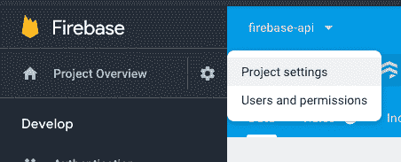

在那里，项目 ID(和一些其他设置)将被列出。我在这张截图里圈出来了:

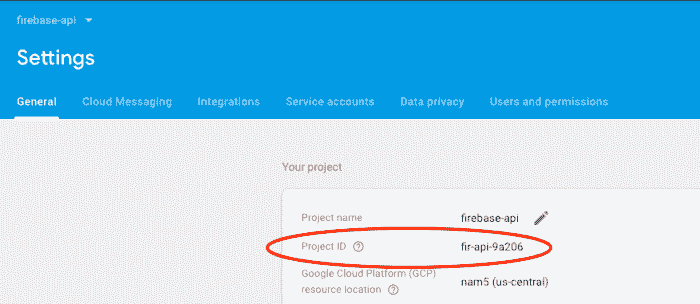

打开邮递员集合，编辑`localhost`文件夹下的`hello-world localhost`请求。

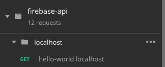

(如果您仍然对 Postman 有疑问，请在此处查阅[说明](https://learning.getpostman.com/docs/postman/collections/creating_collections/)。)

正如我提到的，更改 ID 值以匹配您的项目。当您运行`npm run serve`时，终端中列出的地址应该也有这个信息。

完成后，运行来自 Postman 的请求，您应该会看到以下内容:

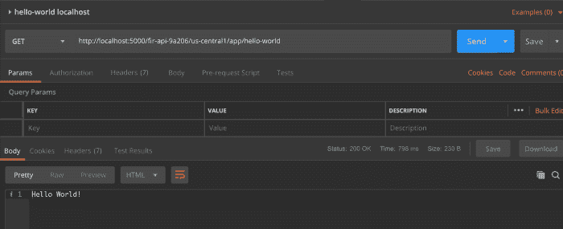

现在我们已经设置了初始端点，让我们继续添加数据库调用。

# 数据库调用

对于我们正在构建的 API，它只是对一系列项目的操作。我们将为这个项目列表设置`Create`、`Read`、`Update`和`Delete`(或 **CRUD** )函数。

在 Firebase 中，您有两种数据库使用选择。可以使用传统数据库，也可以使用云 Firestore。

对于本教程，我们将使用云 Firestore，因为它更容易使用，功能也更丰富。Cloud Firestore 是一个 [NoSQL 数据库](https://en.wikipedia.org/wiki/NoSQL)，这意味着你的数据被存储为集合中的文档。

这与 SQL 数据库中数据存储在表的行中的方式类似。由于数据访问和存储的性质，NoSQL 数据库通常性能更好，也更容易扩展。

在设置部分，我们向项目添加了一个云 Firestore 实例。要在本地使用 [admin SDK](https://firebase.google.com/docs/admin/setup) 与云 Firestore 交互，您需要通过服务帐户访问它。

服务帐户有他们使用的密钥；您可以通过下载密钥文件来运行这些权限。

为此，请转到 Firebase 控制台并打开您的应用程序。然后点击小齿轮箱和“用户和权限”,如下所示:

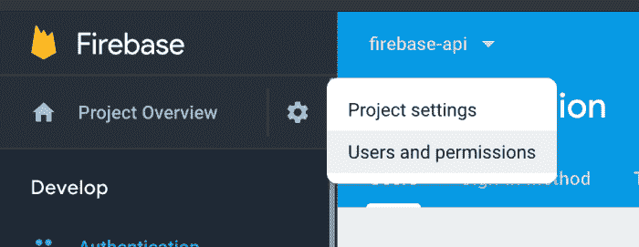

然后单击“服务帐户”选项卡，您应该会看到如下内容:

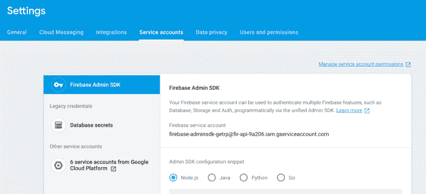

如果你注意到了，在屏幕的底部，他们为你提供了一些在你的项目中运行的代码。您唯一需要的是要引用的权限文件。

继续并点击“生成新的私钥”以便能够在您的项目中安装它。然后，将它存储在我们刚刚使用的`functions`文件夹中的`index.js`文件旁边。

你想叫它什么都可以；我给我的取名`permissions.json`。

然后，将以下内容添加到您的`index.js`文件的顶部:

这几行代码(1)加载到您的权限文件中，然后(2)用它来初始化您的应用程序。我还创建了一个变量`db`来表示我们的 Firestore 实例。这不是必需的，但可以使代码在以后变得更干净。

加载完这些值后，让我们为应用程序添加一个`create`端点。在`hello-world`端点下方，添加以下内容:

这段代码创建了一个端点`/api/create-item`，您可以对其进行`POST`调用。当发出`POST`调用时，它将主体中的`item`添加到数据库中名为“`items`的集合中，该集合具有您传入的值的 ID，这里称为`id`。

NoSQL 数据库中的收藏只是文献的收集者。对于特定的文档，您可以轻松地做到这一点。在使用 Firestore 时，我倾向于喜欢收藏，因为它们容易理解。您也可以将集合想象成类似于 SQL 数据库中的表。

如果你也注意到了，我在端点前加了前缀`/api`。这不是必需的，但是对于您创建的任何 API 来说通常都很方便。我还用我的请求指定了 ID 值。Firebase 将为您完成这项工作，但我认为如果我们在请求中明确定义这一点，会更容易理解。

添加了这段代码之后，让我们在终端中停止服务器(如果您还没有这样做的话)，然后用一个新的`npm run serve`重新启动它。

在 Postman 集合中，拉起“create localhost”`POST`请求。像之前一样修改`app id`值，并尝试请求。

运行它时，您应该会看到以下错误:

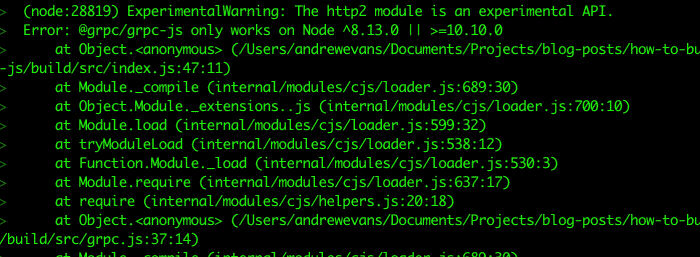

Firebase admin SDK 要求节点版本为 8.13.0 或 10.10。这就是为什么我要求[在第一节](https://github.com/nvm-sh/nvm)安装 nvm。这很容易解决。nvm 使您能够在本地终端中快速切换节点版本。

在您的终端中，运行`nvm use 10.10`，您应该看到以下内容:

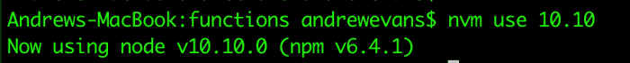

现在用`npm run serve`再次启动你的服务器，点击 Postman 上的端点。您应该会看到一个`200`成功。在终端中，还可以看到 API 被本地命中。

如果您遇到关于`onRequestWithOpts`或类似的错误，请执行`npm i firebase-tools`。

CLI 最近出现了一个错误:7.1.0 版修复了这个错误。在写这篇文章的时候，我发现我需要更新我的 Firebase CLI 版本来解决这个问题。查看本期[了解更多](https://github.com/firebase/firebase-tools/issues/1480)。

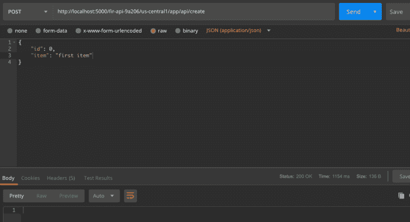

一个额外的酷功能是，你可以直接在云 Firestore 中看到你的数据。如果您跳转到 Firebase 控制台，单击左侧导航栏上的“database”链接，您应该会看到如下内容:

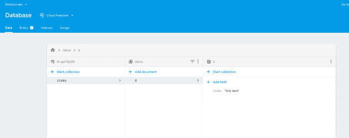

# 构建数据库端点

现在我们已经设置了`create`端点，让我们添加其余的操作:

*   `/read-item/:item_id` =读取特定项目(按 ID)
*   `/read-items` =阅读所有条目(全部收藏)
*   `/update-item/:item_id` =更新项目
*   `delete-item/:item_id` =删除一个项目

在很大程度上，所有的终点都是相似的。例外是当我传递带有`item_id`值的查询参数时。这一切都遵循基本的路由，您可以在 [Express.js 文档](https://expressjs.com/en/guide/routing.html)中看到。

此外，对于与 Firebase Admin SDK 的实际交互，我推荐这里的 [Firestore API 参考](https://googleapis.dev/nodejs/firestore/latest/index.html)。

要查看这些端点应该是什么样子(完成后)[请点击这里查看 GitHub repo 上的](https://github.com/andrewevans0102/how-to-build-a-firebase-api/blob/master/functions/index.js) `[index.js](https://github.com/andrewevans0102/how-to-build-a-firebase-api/blob/master/functions/index.js)` [文件。](https://github.com/andrewevans0102/how-to-build-a-firebase-api/blob/master/functions/index.js)

以下是其余端点的代码:

# 部署

所以现在我们有了一个全功能的 CRUD API。我们准备好部署了！

如果您正在开发一个企业应用程序(或者您将要维护的应用程序)，通常会构建一个持续集成持续部署(CICD)管道。这是一组将应用程序交付到生产环境中的自动化步骤。

有许多关于 CICD 最佳实践的文档。我推荐我在[发表的关于使用 Firebase 和 CircleCI](https://blog.angularindepth.com/deploying-an-angular-site-to-firebase-with-circleci-ed881cb6a2fa) 部署应用程序的有角度的深度博文。

对于我们的 API，我们对实际的部署步骤感兴趣。Firebase CLI 会用一个`firebase deploy`为您解决这个问题。

当您运行`firebase init`命令最初构建项目时，Firebase CLI 已经将部署步骤设置为 npm 脚本。我们现在可以使用`functions`文件夹中的`npm run deploy`来部署创建的项目。

npm 脚本非常强大。大多数现代 JavaScript 应用程序都以这样或那样的方式使用它们。我建议查看 [npm 文档以了解更多](https://docs.npmjs.com/misc/scripts)。

当你从`functions`文件夹中运行`npm run deploy`时，你应该会看到如下输出:

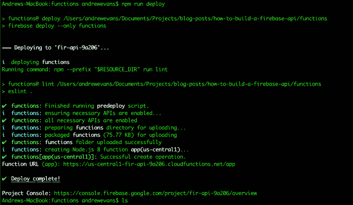

终端输出的行`Function URL`提供了您部署的函数的端点。回到 Postman 集合，查看`deployed`文件夹，找到一组请求来访问您部署的 API。

# 连接前端

现在我们已经构建了 API，我想展示一下如果您在客户端应用程序中使用它会是什么样子。

当讨论 API 时，通常会有生产者和消费者。生产者是 API 本身(或者至少是提供端点的东西)。消费者是使用这些端点的任何东西。通常，应用程序开发人员会使用 JavaScript 框架构建客户端应用程序，如 [Angular](https://angular.io/) 、 [React](https://reactjs.org/) 、 [Ember.js](https://emberjs.com/) 、 [Vue.js](https://vuejs.org/) 等。

客户端应用程序在浏览器中运行，支持动态解释 JavaScript 代码。这特别有用，因为很多时候开发人员需要某个地方来静态托管他们的 JavaScript 包。

这利用了 JavaScript 语言以及当今浏览器的许多进步。

如果你还记得第一部分，我们正在使用我放在这个 GitHub repo 上的代码。这个 GitHub 项目既有我们的后端 API 代码，也有我构建的用于与 API 交互的前端 Angular 应用程序。

基本应用程序由一个主页组成，被认为是一个*单页应用程序* (SPA)。应用程序对列表项进行基本的 CRUD 操作。

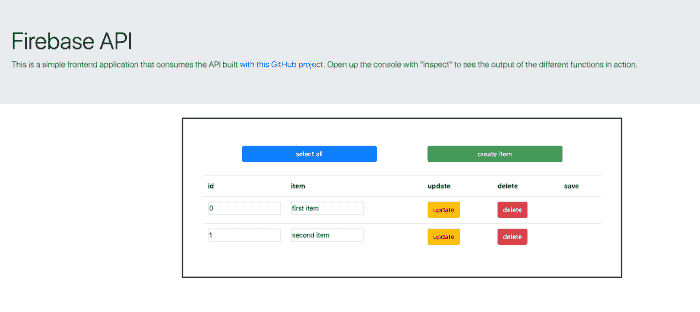

运行应用程序时，您还可以在浏览器的控制台中看到它的运行。如果您打开控制台(如果您使用 Chrome，请右键单击“inspect”)，您应该会看到以下内容:

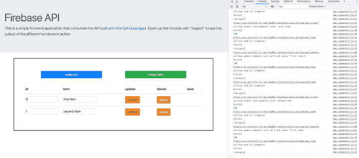

要使用我构建的客户端，首先`cd`进入我的 [GitHub 项目](https://github.com/andrewevans0102/how-to-build-a-firebase-api)的`frontend`文件夹。

要让应用程序在您部署的 API 的端点上运行，您只需要打开`/frontend/src/environments/environment.ts`文件。

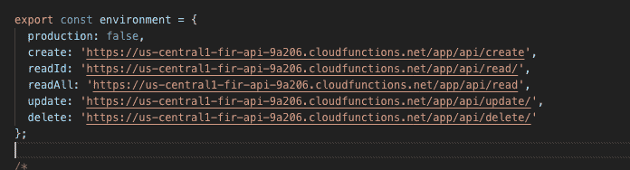

在这个文件中，您将看到一组端点。要使用我构建的客户端，首先将`cd`放入我的 GitHub 项目的`frontend`文件夹。

要使应用程序在您部署的 API 的端点上运行，您只需要更改这些值来匹配您项目中的 URL。

如果您还记得，一旦您部署了 API，Firebase CLI 就会向终端输出一个域。托管端点术语非常直观，如下所示:

```
[<----zone + app id + cloudfunctions.net----->]/app/[<--endpoint-->]
https://us-central1-fir-api-9a206.cloudfunctions.net/app/hello-world
```

继续用您项目中的端点值替换这个`environments`文件中的端点值。记住总是分别用相关路径如`/api/create`或`/api/read`结束每个端点。

一旦您替换了值，将`cd`放入`frontend`目录，并运行标准的`npm install`来安装依赖项。依赖项安装完成后，使用 Angular CLI 命令通过`ng serve`启动应用程序。

如果您在使用 CLI 时遇到错误，请查阅[Angular CLI 文档。](https://cli.angular.io/)

运行`ng serve`后，您应该在终端中看到如下内容:

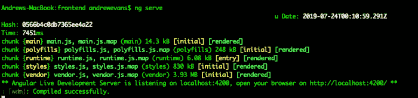

此消息意味着 CLI 已经构建了应用程序(使用 [webpack](https://webpack.js.org/) ),并且它当前正在端口 4200 上运行。如果您打开浏览器并转到`localhost:4200`，您应该会看到应用程序正在运行。

如果您查看项目的 app 组件，您会看到这些动作只是从我们创建的 API 对端点进行 JavaScript `fetch`调用:

因为这篇文章的重点是创建 API，所以我不会详细介绍这个 Angular 应用程序是如何工作的。我强烈推荐你查看一下[角度文档](https://angular.io/)和可用的教程。

如果你在谷歌上搜索一下，你会发现很多关于角度基础的很棒的*入门*帖子。我也强烈推荐博客 [Angular In Depth](https://blog.angularindepth.com/) 进行更深入的学习。

# 结束语


照片由[马库斯·斯皮斯克](https://unsplash.com/@markusspiske?utm_source=medium&utm_medium=referral)在 [Unsplash](https://unsplash.com?utm_source=medium&utm_medium=referral) 拍摄

恭喜你！您刚刚使用 Firebase 部署了一个 API。使用这个 API，您还可以做很多其他的事情，但是这里只向您展示了基本的东西。

我展示的客户端应用程序让您开始了解使用 API 的方法。我强烈建议查看 Express.js 站点教程，以获得路由呼叫和使用中间件的更深入的方法。我还推荐我在 Firebase 上的其他博客帖子:

*   [燃烧基地](https://rhythmandbinary.com/2018/04/08/firebase/)
*   [为什么 Firebase 云功能很棒](https://blog.angularindepth.com/why-firebase-cloud-functions-are-awesome-f4faeab630f7)
*   [angular fire 库如何让 Firebase 感觉像魔术一样](https://blog.angularindepth.com/how-the-angular-fire-library-makes-firebase-feel-like-magic-1fda375966bb)
*   [为什么用 JAMstack 构建很棒](https://blog.angularindepth.com/why-building-with-a-jamstack-is-awesome-49618fd21198)

我希望我在这里的帖子已经帮助你开始用 Firebase 构建 API。