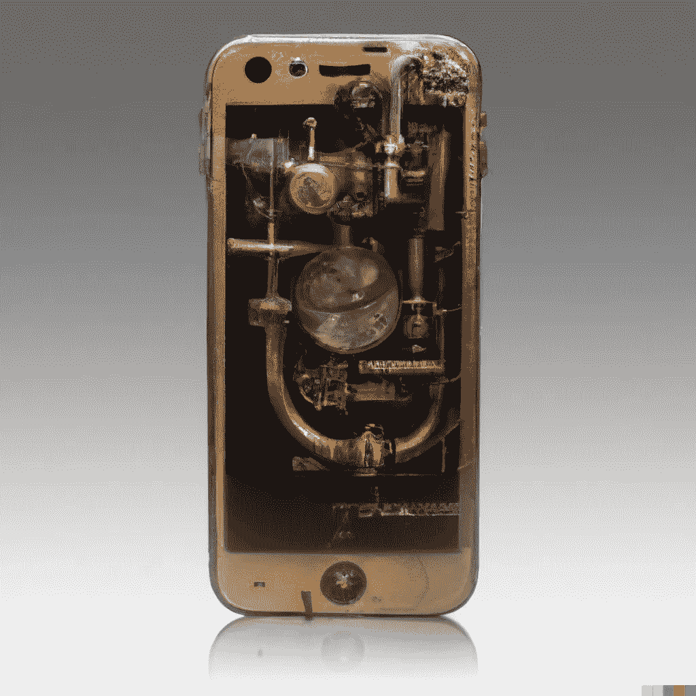
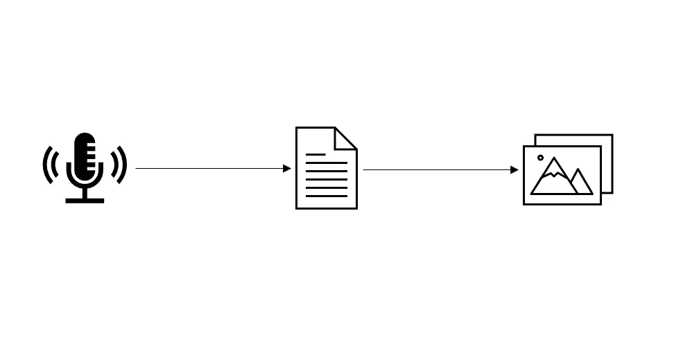

# 构建一个 Python Web 应用程序，将语音转换成文本，再转换成图像

> 原文：<https://betterprogramming.pub/building-an-application-that-turns-voice-into-text-into-image-9efca8713e29>

## 使用 DALL-E mini 和 assembly 将图像变为现实



DALLE-2 图片[来源](https://twitter.com/Dalle2Pics/status/1548823671875280904/photo/1)提示:“蒸汽朋克 Iphone 12”

# 介绍

语音、文本和图像是人类有史以来传递信息的三种方式。在这个项目中，我们将构建一个应用程序，它可以听语音，将语音转换成文本，然后将文本转换成图像。这一切都可以在下午完成。我们生活在一个非凡的时代！



语音到文本到图像

## 所需的背景知识:

*   DALL-E 是由 [OpenAI](https://en.wikipedia.org/wiki/OpenAI#DALL-E_and_CLIP) 组织创建的。这向世界介绍了人工智能生成的图像，并在大约一年前开始流行。*他们有一个免费的 API，可以做各种其他有趣的人工智能相关的功能。*
*   DALL-E mini 是 DALL-E 的开源替代品，像你我这样的修补者可以免费试用。这是我们将在本教程中利用的引擎
*   [DALL-E Playground](http://DALL-E Playground) 是一款开源应用，做两件事:1 .使用 Google Colab 创建并运行后端 DALL-E mini 服务器，该服务器提供生成图像所需的 GPU 处理。第二。通过 javascript 提供一个前端 web 界面，用户可以与之交互并在上面查看他们的图像。这个接口链接到 Google Colab 服务器。

# 这个应用程序做什么

1.  将 DALL-E Playground 的前端接口从 JavaScript 重新设计为 streamlit Python(因为 1。UI 看起来更好 2。它与语音转文本 API 和 3。Python 比较酷)。
2.  利用 AssemblyAI 的转录模型将语音转录成 DALL-E mini 引擎可以处理的文本输入
3.  聆听演讲并展示有创意且有趣的图像

# 设计

这个项目分为两个主要文件:main.py 和 dalle.py。

> 如果下面的文件摘要对你来说听起来像胡言乱语，坚持下去！因为在[代码](https://github.com/ahershy/speechtoimage)本身中，有许多注释更彻底地分解了这些概念！

`main`脚本用于 streamlit web 应用程序和语音到文本 API 连接。它包括配置 streamlit 会话状态，在 web 应用程序界面上创建按钮和滑块等可视功能，设置 WebSockets 服务器，填写`pyaudio`所需的所有参数，创建异步函数，以便在我们的应用程序和 AssemblyAi 的服务器之间并发地发送和接收语音数据。

dalle.py 文件用于将`streamlit` web 应用程序连接到运行 DALL-E mini 引擎的 Google Colab 服务器。该文件有几个功能，用于以下目的:

1.  建立到后端服务器的连接并验证其有效性
2.  通过发送文本输入进行处理来启动对服务器的调用
3.  检索图像 JSON 数据，并使用 base64.b64decode()解码数据

# 密码

请参考我的 GitHub [这里](https://github.com/ahershy/speechtoimage)看完整应用。我试着在我进行的过程中加入注释和每个代码块正在做什么的分解，所以希望它是相当直观的。此外，请参考原始项目的资源库[这里的](https://github.com/AssemblyAI-Examples/dalle-mini-python-app)以获得额外的上下文。

## 主文件:

## dalle 文件:

# 结论

这个项目是我希望有一天在我的房子里拥有的东西的概念证明。我想在我的墙上挂一个屏风，放在装饰框的中间。姑且称之为智能相框吧。这个屏幕将有一个内置麦克风，可以监听附近的所有对话。使用语音到文本的转录和自然语言处理，该框架将每 30 秒左右过滤并选择最有趣的单词分类。从那里，文本将不断地被可视化，以动态地增加气氛的深度。

想象一下，在聚会和家庭聚会期间，对话的视觉表现和主题被实时显示在墙上。有多少创意能从类似这样的东西中涌现出来？房子的情绪如何根据参与者的情绪而变化和变形？这个房子感觉起来不像一个无机结构，而更像一个参与者。想想很有意思。

唉，这个项目是一个有趣的方式来弄脏我们的手，玩这些概念。有点令人失望的是，DALL-E mini 没有像 OpenAI DALL-E2 这样的引擎那样具有极高质量的图像。尽管如此，我仍然喜欢学习这个项目背后的技术过程和原理。很可能在几年内，这些高分辨率图像生成服务的 API 将更容易访问和使用。感谢所有一路走过来的人。祝你每天在学习的道路上好运。

这个项目受到了 YouTube 教程的影响，所以请检查一下，因为我发现它很有帮助，他们值得表扬。

```
Check out some of my other articles if you found this one helpful/interesting:[Build an Alexa- or Siri-Equivalent Bot in Python Using OpenAI](/building-an-alexa-or-siri-equivalent-bot-in-python-ea07ed001445)[How to find land when you’re at sea using python](https://towardsdatascience.com/how-to-find-land-when-youre-at-sea-using-python-48111e5d9795)[I wrote a python script to play the lottery for me](https://towardsdatascience.com/understanding-mega-millions-lottery-using-python-simulation-d2b07d30a7cc)
```