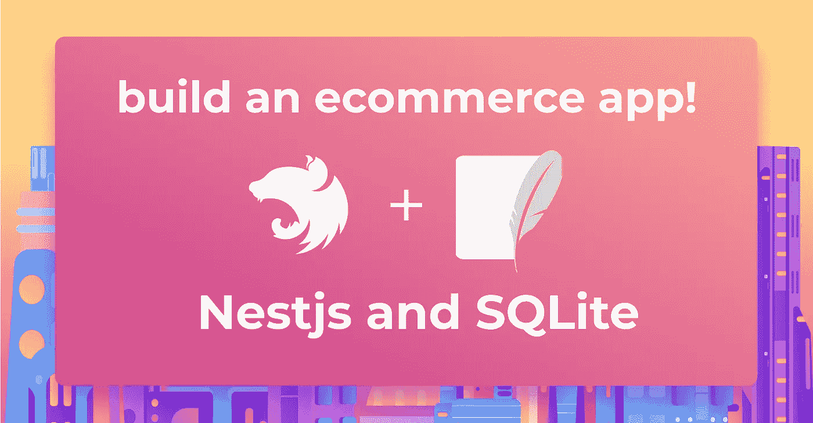
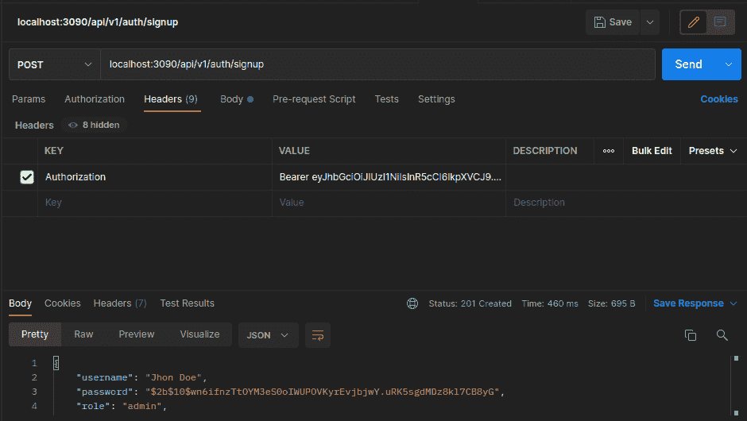
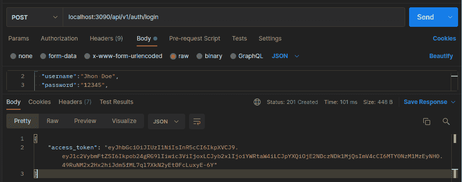
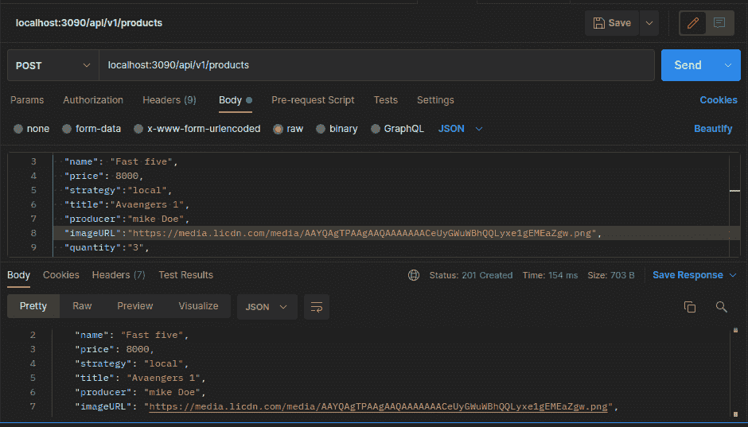
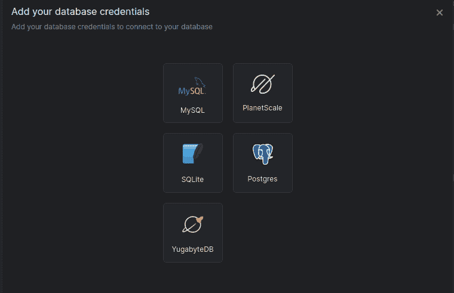
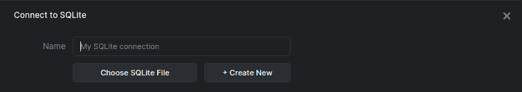
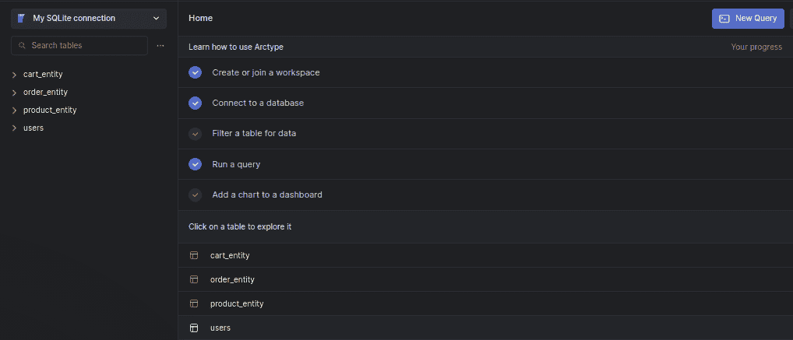

# 使用 Nestjs、SQLite 和 TypeORM 构建电子商务 API

> 原文：<https://betterprogramming.pub/building-an-e-commerce-api-using-nestjs-sqlite-and-typeorm-25a7978de666>

## 这是一种让顾客享受购物体验的迷人方式



# 介绍

Nestjs 是一个先进的 Node.js 框架，用于开发高效、可靠和可伸缩的服务器端应用程序。

很容易与 NoSQL 和 SQL 数据库集成，如 MongoDB、 [Yugabyte](https://arctype.com/postgres/connect/yugabyte-postgres) 、 [SQLite](https://arctype.com/sqlite/connect/sqlite-gui) 、 [Postgres](https://arctype.com/postgres/connect/client-postgres) 、 [MySQL](https://arctype.com/mysql/connect/client-mysql) 等。它支持流行的对象关系映射器，如 TypeORM Sequelize 和 Mongoose。

在本教程中，我们将使用 SQLite 和 TypeORM 创建一个电子商务应用程序。我们还将了解一个强大的 SQL 客户端和数据库管理工具 [Arctype](https://arctype.com) 。

我们开始吧！

# 先决条件

本教程是让您入门的实践演示。确保您满足以下要求:

*   您已经安装了[节点](https://nodejs.org/en/) ( > = 10.13.0，v13 除外)
*   您已经掌握了 JavaScript 的基础知识
*   [Arctype](https://arctype.com/) 已安装

# 项目设置

要开始使用 Nestjs，请使用下面的命令安装 Nestjs CLI:

```
npm i -g @nestjs/cli
```

安装完成后，使用下面的命令创建一个 Nestjs 项目:

```
nest new ecommerce
```

选择您的 npm 作为包管理器，点击 enter 按钮，然后等待 Nest 安装运行这个应用程序所需的包。

安装完成后，使用以下命令将目录更改为项目文件夹:

```
cd ecommerce
```

然后在您喜欢的文本编辑器或 IDE 中打开项目目录。之后，打开一个新的终端，使用下面的命令在开发模式下运行服务器(这将启用热重装，并允许我们在控制台上看到可能的错误):

```
npm run start:dev
```

# 安装依赖项

服务器启动并运行后，打开一个新的终端窗口，这样您就不会退出服务器。这将允许您在整个教程中看到对代码库所做的更改的效果。

现在安装以下依赖项:

*   [护照](https://www.npmjs.com/package/passport)
*   [护照-当地](https://www.passportjs.org/packages/passport-local/)
*   [Jwt](https://www.npmjs.com/package/jsonwebtoken)
*   [护照-智威汤逊](http://npmjs.com/package/passport-jwt)
*   [SQLIte3](https://www.npmjs.com/package/sqlite3)
*   [字体](https://www.npmjs.com/package/typeorm)
*   [Bcrypt](https://www.npmjs.com/package/bcrypt)

您可以使用下面的命令来完成此操作:

```
npm install --save @nestjs/passport passport passport-local @nestjs/jwt passport-jwt @nestjs/typeorm typeorm sqlite3 bcrypt
```

然后用下面的命令安装开发依赖项:

```
npm install --save-dev @types/passport-local @types/passport-jwt @types/bcrypt
```

你可以在国家预防机制安装软件包的时候喝杯咖啡。一旦安装完成，我们就动手干吧。

# 创建应用程序模块

有了运行应用程序所需的所有必需的包，让我们继续创建应用程序模块。为了构建一个干净且易于维护的应用程序，您将为该应用程序中实现的所有特性生成单独的模块。

因为这是一个电子商务应用程序，所以您将拥有身份验证、购物车、产品和订单。所有这些都将在它们自己独立的模块中。让我们从认证模块开始。

## 创建验证模块

使用以下命令生成身份验证模块:

```
nest g module auth
```

上面的命令在项目的 src 目录中创建一个 auth 文件夹，其中包含必要的样板文件，并在项目根模块(`app.module.ts` 文件)中注册该模块。

接下来，使用下面的命令创建一个产品、购物车和订单模块:

```
#Create a product module
nest g module product

#Create cart module
nest g module cart

#Create cart module
nest g module order
```

上面的代码将在项目的 src 文件夹中创建一个 product、cart 和 order 文件夹，并在项目的根 app 模块中注册这些模块。

# 设置 TypeORM 和 SQLite 数据库

安装好 app 模块后，设置 TypeORM 将您的应用程序连接到 SQLite 数据库并创建您的模块实体。首先，打开`app.module.ts`，用下面的代码片段配置 SQLite 数据库:

```
imports: [
 …
 TypeOrmModule.forRoot({
   type :"sqlite",
   database: "shoppingDB",
   entities: [__dirname + "/**/*.entity{.ts,.js}"],
   synchronize: true
 })
],
…
```

在上面的代码片段中，您使用 TypeORM `forRoot`将应用程序连接到 SQLite 数据库，指定数据库类型、数据库名称以及 Nestjs 可以找到模型实体的位置。

一旦服务器刷新，您应该看到在这个项目的根目录中创建了一个`shoppingDB` 文件。

# 创建应用程序实体模型

有了数据库设置，让我们为应用程序模块创建实体模型。我们将从认证模块开始。使用以下命令在身份验证模块文件夹中生成一个实体文件:

```
nest generate class auth/user.entity –flat
```

然后添加下面的代码片段，用下面的代码片段定义用户表属性:

在代码片段中，您导入了设置数据库表所需的装饰器。您还导入了您将很快创建的`cartEntity`和`orderEntity`类。使用`typeorm` 装饰器，我们定义了用户模型的数据库属性。

最后，我们在用户实体与`cartEntity`和`orderEntity`之间创建了一对一和一对多的关系。通过这种方式，您可以将购物车商品与用户相关联。这同样适用于用户的订单。

接下来，使用下面的命令创建产品实体类:

```
nest generate class product/product.entity –flat
```

上述命令将在产品模块文件夹中生成一个`product.entity.ts`文件。

现在用下面的代码片段配置产品表属性:

在上面的代码片段中，我们配置了产品表的属性，并创建了与购物车实体的一对多关系。

然后用下面的命令创建购物车实体:

```
nest generate class cart/cart.entity –flat
```

上面的命令将在 cart 模块文件夹中生成一个`cart.entity.ts`文件。现在，将下面的代码片段添加到您为配置购物车表属性而创建的文件中。

在上面的代码片段中，您配置了 cart 表的属性，并在 cart 实体和用户实体之间创建了多对一关系。

最后，使用下面的命令创建订单实体:

```
nest generate class order/order.entity –flat
```

上述命令将在订单模块文件夹中生成一个`order.entity.ts`文件。打开`order.entity.ts`，用以下命令配置数据库表:

在上面的代码片段中，您创建了用户实体之间的一对一关系以及与产品实体之间的一对多关系。

至此，您的数据库实体已经设置好并连接好了。现在创建您的业务逻辑来存储这些实体的记录。

# 创建应用服务

现在为这个应用程序中的模块创建服务。在这里，您将允许管理员将产品添加到产品表，验证用户，允许用户将商店中的产品添加到购物车，并通过他们的购物车订购产品。

## 创建身份验证服务

要创建身份验证服务，请运行以下命令为身份验证模块生成服务。

```
nest generate service auth/service/auth --flat
```

上面的命令将在 src/auth/service 文件夹中生成一个`auth.service.ts`文件。现在打开`auth.service.ts`文件，添加下面的代码片段:

在上面的代码片段中，您导入了`InjectRepository`、`Repository decorator`、`JwtService`和`bcrypt` 模块。然后，使用`InjectRepository` 装饰器，使`user.entity`类在 auth 服务中可用，提供在`user.entity`中执行 CRUD 操作的方法。

然后，创建一个注册方法，允许用户使用下面的代码片段在应用程序中注册:

```
async signup(user: Users): Promise<Users> {
       const salt = await bcrypt.genSalt();
       const hash = await bcrypt.hash(user.password, salt);
       user.password = hash
       return await this.userRepository.save(user);
   }
```

现在创建`validateUser`方法来验证用户的详细信息，创建 login 方法来为经过身份验证的用户生成 jwt 令牌。

现在，我们可以实现我们的 Passport 本地身份验证策略。在 auth module 文件夹中创建一个名为`local.strategy.ts`的文件，并添加以下代码:

在上面的代码片段中，您实现了一个`passport-local`策略。没有配置选项，所以我们的构造函数简单地调用`super()`而没有选项对象。

您还实现了`validate()`方法。Passport 将使用一组适当的特定于策略的参数为每个策略调用 verify 函数。对于`local-strategy`，Passport 需要一个带有以下签名的`validate()`方法:`validate(username: string, password:string): any`。

然后在 auth module 文件夹中创建一个`jwt-auth.guard.ts`文件，并使用下面的代码片段定义一个定制的 auth guard:

```
import { Injectable } from '@nestjs/common';
import { AuthGuard } from '@nestjs/passport';

@Injectable()
export class LocalAuthGuard extends AuthGuard('local') {}
```

您将使用代码片段中创建的`AuthGuard`来保护您的 API 路由免受未授权用户的攻击。

现在在 auth module 文件夹中创建一个`jwt-strategy`文件来验证用户，并使用下面的代码片段为登录的用户生成 jwt 令牌:

然后。在 auth module 文件夹的`auth.module.ts`文件中配置 jwt 模块。在此之前，在同一个 auth module 文件夹中创建一个`constants.ts`文件，用下面的代码片段定义一个 jwt secret:

```
export const jwtConstants = {
   secret: 'wjeld-djeuedw399e3-uejheuii33-4jrjjejei3-rjdjfjf',
}
```

您可以在生产中生成一个更安全的 jwt 秘密，但是出于演示的目的，我们将使用这个秘密。

现在，用下面的代码片段导入您的`auth.module.ts`文件中所有需要的模块:

```
…
import { JwtModule } from '@nestjs/jwt';
import { jwtConstants } from './constants';
import { JwtStrategy } from './jwt.strategy';
import { PassportModule } from '@nestjs/passport';
import { LocalStrategy } from './local.strategy';
import { TypeOrmModule } from '@nestjs/typeorm';
import { Users } from './user.entity';
…
```

然后，在导入数组中，用下面的代码片段配置 jwt:

```
…
imports: [
   PassportModule,
   JwtModule.register({
     secret: jwtConstants.secret,
     signOptions: { expiresIn: '60m' },
   }),
…
```

在上面的代码片段中，我们添加了`PassModule`包来允许`passport`处理用户的认证，并使用`JwtModule register` 方法配置了 jwt。我们传递我们在常量文件中创建的秘密，并指定生成的令牌的到期时间(您可以根据用例减少或增加时间)。

# 创建产品服务

设置身份验证服务后，使用以下命令生成产品服务:

```
nest generate service product/service/product
```

现在在`product`模块中打开由上述命令生成的`product.service.ts`文件，并添加下面的代码片段:

在上面的代码片段中，我们创建了 CRUD 服务。用户不能使用创建、更新和删除方法。只有管理员可以创建产品，删除或更新产品。

现在，打开`product.module.ts`文件，使用下面的代码片段使产品实体可访问:

```
imports: [TypeOrmModule.forFeature([ProductEntity])],
```

# 创建购物车服务

此时，管理员可以将产品添加到数据库中，经过身份验证的用户可以看到所有可用的产品。现在让我们允许用户将他们喜欢的商品添加到购物车中。首先，使用下面的命令生成一个购物车服务:

```
nest generate service cart/service/cart –flat
```

然后打开该命令生成的`cart.service.ts`文件，添加下面的代码片段:

您在上面的代码片段中导入了创建 Nest.js 服务所需的模块。因为您在购物车、用户和产品实体之间创建了关系，所以我们也在这里导入了它们。然后，创建一个构造器方法将这些实体绑定到`CartService`类。现在，创建一个向购物车添加商品的方法。

在上面的代码片段中，您创建了一个将`productId`、`quantity`和`user` 作为参数的`addToCart`方法。然后检查`user` 的购物车中是否已经有该商品。如果是这样，您将增加数量并更新该项目的总价。否则，将商品添加到用户的购物车中。

接下来，通过使用下面的代码片段在`cart.module.ts`文件中注册`cartEntity`、`productEntity` 、`userentity`和`productService` ，使它们在`cartService` 中可访问:

最后，创建一个`getItemsInCart`方法，该方法将一个用户作为参数，返回属于特定用户的所有购物车。

```
async getItemsInCard(user: string): Promise<CartEntity[]> {
       const userCart = await this.cartRepository.find({ relations: ["item",'user'] });
       return (await userCart).filter(item => item.user.username === user)
   }
```

# 创建订单服务

当用户完成购物后，他们可以订购购物车中的商品。使用以下命令生成订单服务:

```
nest generate service order/service/order –flat
```

现在打开运行上述命令生成的`order.service.ts`文件，并添加下面的代码片段:

您在上面的代码片段中导入了创建 Nest.js 服务所需的模块。因为您在购物车、用户和产品实体之间创建了关系，所以我们也在这里导入了它们。然后，您创建了一个构造器方法来将这些实体绑定到`OrderService` 类。现在，创建一个方法来订购用户购物车中的商品。

然后创建另一个方法，用下面的代码片段从数据库的订单数组中获取用户订单:

```
…
async getOrders(user: string): Promise<OrderEntity[]> {
       const orders = await this.orderRepository.find({ relations: ['user'] });
       return orders.filter(order => order.user?.username === user)
   }
}
```

最后，打开`order.module.ts`文件，使用下面的代码片段使用户、产品和购物车实体在`orderService` 中可访问:

# 创建应用控制器

成功创建应用程序服务后，让我们为应用程序服务创建 API 路由。

## 创建授权控制器

使用以下命令生成一个身份验证控制器:

```
nest generate controller auth/controller/auth –flat
```

现在打开运行上述命令生成的`auth.controller.ts`文件，用下面的代码片段配置授权路由:

## 创建产品控制器

配置授权控制器路由后，使用以下命令生成产品控制器:

```
nest generate controller product/controller/product –flat
```

打开运行上述命令生成的`product.controller.ts`文件，用下面的代码片段配置产品路线:

在上面的代码片段中，您为产品服务定义了 CRUD 路由。我们使用`UseGuard` 装饰器传递您的`JwtAuthGaurd` 来保护路由免受未授权用户的访问。

## 创建购物车控制器

现在，用下面的命令生成一个购物车控制器:

```
nest generate controller cart/controller/cart –flat
```

然后打开运行上述命令生成的`cart.controller.ts`文件，用下面的代码片段配置购物车路线:

## 创建订单控制器

配置好购物车路线后，使用下面的命令创建一个订单控制器:

```
nest generate controller order/controller/order –flat
```

然后打开运行上述命令生成的`order.controller.ts`文件，用下面的代码片段配置购物车路线:

至此，所有的 API 路由都已经配置好了。

# 测试应用程序

现在让我们用 Postman 来测试它们。一些测试的结果如下所示:



请随意测试其他路线，并在 Github 上的这里使用代码[。](https://github.com/Claradev32/ecomerce)

# 将 Arctype 连接到 SQLite 数据库

Arctype 是一个 SQL 客户端和数据库管理工具，使用起来很有趣。它使您可以直观地显示数据库表，并且可以使用 Arctype 在数据库中执行 CRUD 操作目录。将 Arctype 连接到 SQLite 数据库是一个简单的过程。要开始，请按照以下步骤操作:

首先，启动 Arctype。您将看到如下所示的屏幕，允许您添加凭据:



单击 SQLite 选项卡。这将打开下面的屏幕:



单击选择 SQLite 文件按钮并导航到您的项目文件夹。选择应用程序数据库文件，然后按“打开”按钮。按 save 按钮，您应该会看到您的数据库实体，如下面的截图所示。



# 结论

通过构建一个演示项目，我们已经了解了如何使用 Nestjs 和 SQLite 数据库创建一个电子商务应用程序。首先，我们从介绍 NestJS 开始。然后，我们创建了一个 NestJS 应用程序，使用 TypeORM 将该应用程序连接到 SQLite 数据库，并执行 CRUD 操作。

现在，您已经获得了您所寻求的知识，可以随意向应用程序添加额外的功能。