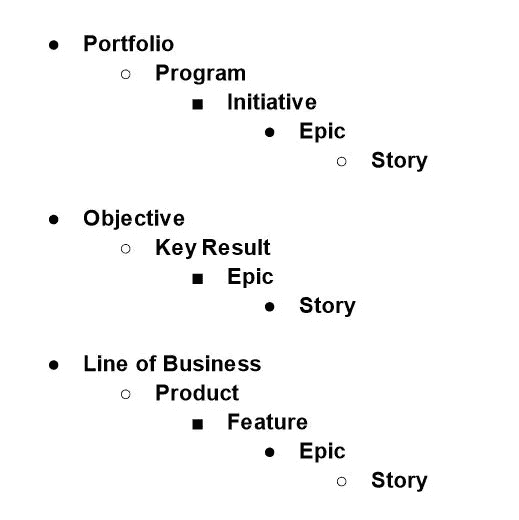

# 在吉拉建立有效的等级制度

> 原文：<https://betterprogramming.pub/building-an-effective-hierarchy-in-jira-cbb4cc025a1b>

## 配置吉拉以支持问题类型的层次结构

凯利·西克玛在 [Unsplash](https://unsplash.com?utm_source=medium&utm_medium=referral) 上的照片

# 概观

吉拉在 scrum 团队层面的最小配置上做得很好，但是技术项目经理和产品经理更需要将团队合作聚合成更大的努力。以下是一些成功配置层次结构的方法。

# 吉拉的等级制度是什么？

吉拉层级只是问题之间的父子关系。史诗通常是一组故事，但是史诗也可以分成更大的主题。重要的是要定义层次结构的深度，在不增加管理问题的用户开销的情况下提供价值。

在所有情况下，从史诗和以下的层次不应改变。只有当史诗有更大的作品需要被跟踪时，层次结构中的级别才应该被引入到史诗之上。

这些高层的主要受众是项目经理、工程经理、主管和执行官。因此，它不应该影响工程团队的工作方式。个人工程师和 scrum 团队需要花时间开发软件，不应该为了让管理层对世界有一个清晰的认识而增加工作。这些应该以对工程师透明的方式实现。在配置较差的环境中工作的工程师经常抱怨，自顶向下的命令增加了他们在工具上花费的时间。

问题类型层次结构示例:

最终，业务需求将决定层次结构的实际情况，但这个概念是通用的。

# 结构与高级路线图(产品组合)

开箱即用，吉拉没有很好地呈现等级制度。有几个插件具有这些特性，我想到了两个:结构和高级路线图(组合)

## **结构**

优点:高度可配置和灵活。支持所有吉拉链接类型。具有更好依赖性管理的额外甘特图插件。支持大量问题。能够直接编辑结构中的所有字段。可以根据层级配置从任何项目中动态引入问题。

缺点:因为它的高度可配置性，学习曲线可能会很高。这可以通过创建用户不需要单独配置他们自己的结构的模板来缓解。

## **高级路线图**

优点:适合小型团队。固定的，易于理解的层次结构。

缺点:对单一计划中的问题和项目的限制。固定的层级限制了灵活性。内置字段的操作不同于标准的吉拉字段，有些与其他插件不兼容。难以配置跨项目的动态问题。

# 自动化

自动化对于管理层级至关重要。随着级别数量的增加，需要更新多个问题或将更改汇总到父问题。如果认为管理层次结构中的所有这些级别会产生更多开销，那么采用率将会很低。

层级将从中受益的自动化类型:

## **状态汇总**

设计工作流以根据子问题自动更新父问题的状态。例如，当所有 Epics 都关闭时，则关闭父计划。这减少了手动更新父问题状态的开销。

## **预估累计**

与汇总状态类似，评估和工作记录可以汇总，以查看程序如何从其原始范围逐渐消失。

## 层级报告

实现层次结构的一个主要原因是分别报告不同的级别。手动报告几个层次结构中的所有问题需要复杂的 JQL，很少有人理解。

示例:有一个层次结构，包括项目组合、计划、计划和 Epic。要查看特定计划的所有问题，需要编写一个查询，查看该计划下的所有问题，这并不简单。一些插件，如 Scriptrunner，甚至 Structure 和 Advanced Roadmap 的内置查询功能都有帮助，但用户仍然需要成为吉拉专家才能编译这些查询。

但是，如果构建自动化来将上层问题摘要放入到它们后代的单独的、不可变的字段中，那么报告可能是轻而易举的事情。

示例:对于与上述示例相同的层次结构，其子代上有一个“项目”字段，在链接到该层次结构时，问题会自动填充该字段。要查看一个节目的所有史诗，查询简单地变成`type = Epic and Program = “Program A”`

# 结论

使用层次结构可能很棘手，但是使用正确的架构和自动化，对于企业规模的公司或遵循可伸缩敏捷框架(SAFe)的公司来说，这是非常有价值的。无论层次结构是用于组织间的问题分组，还是用于跟踪大型产品/项目，重要的是要注意它为使用该工具的团队带来的任何开销。

最终结果对单个工程团队是透明的，但是现在项目经理有了获得他们项目健康状况的可见性所需的结构。