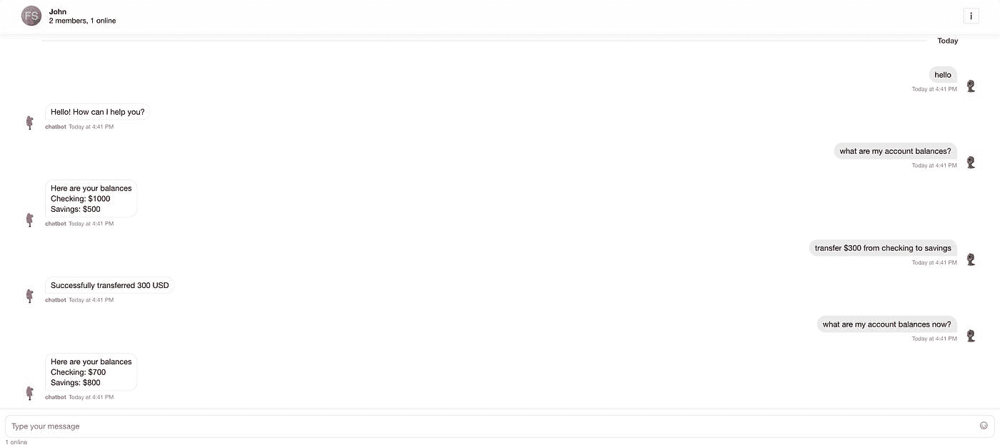
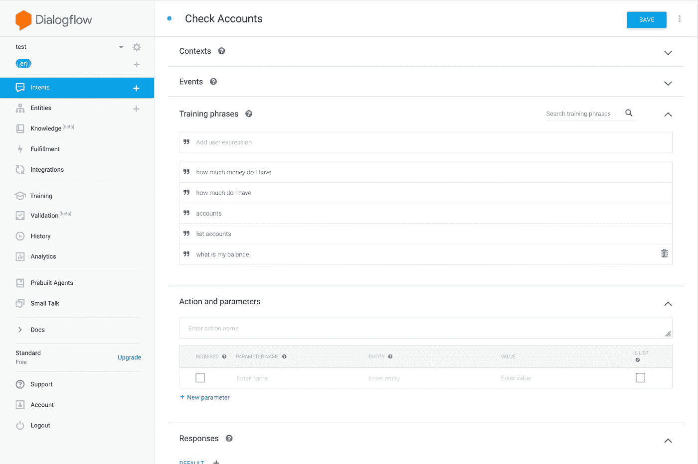
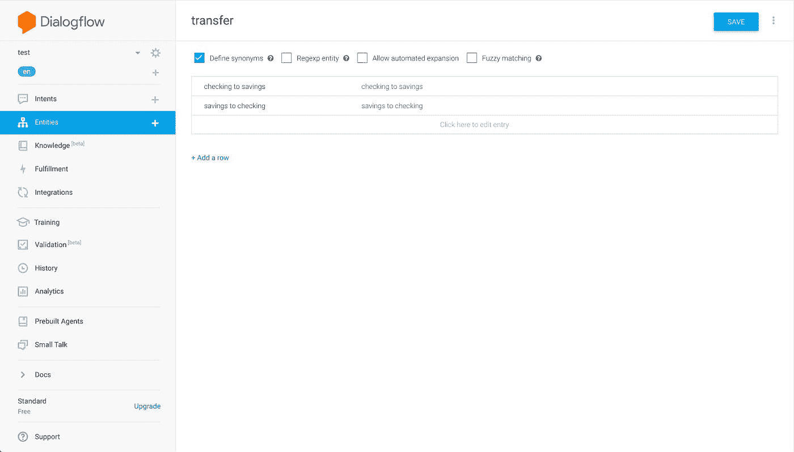
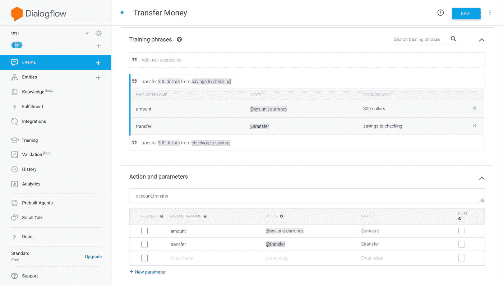
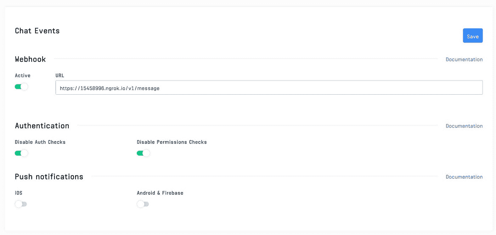
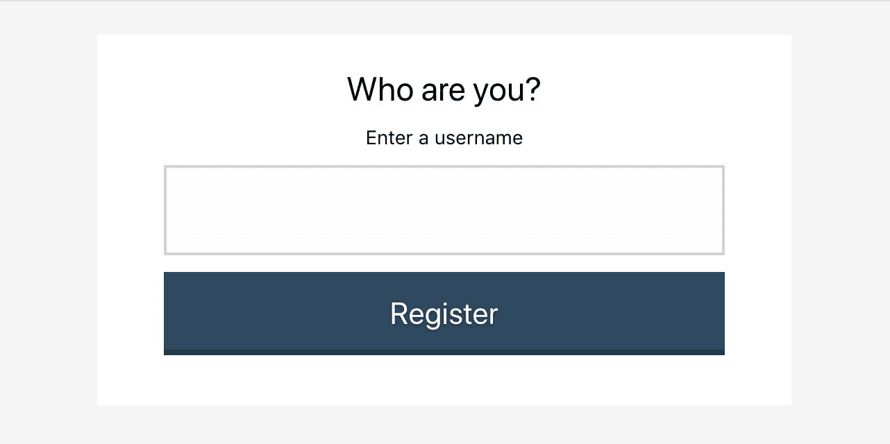
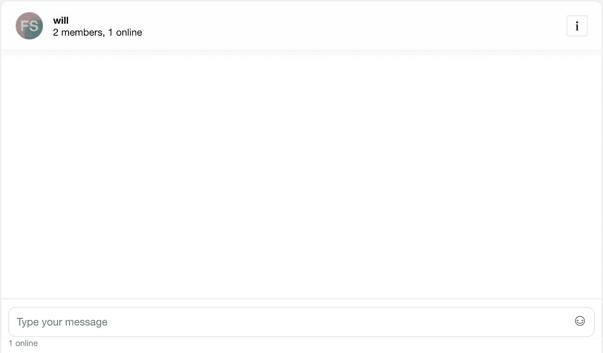

# 用 Stream React Chat、Virgil Security 和 Google Dialogflow 构建一个端到端的加密聊天机器人

> 原文：<https://betterprogramming.pub/building-an-end-to-end-encrypted-chatbot-with-stream-react-chat-virgil-security-and-google-c000bb585453>

## 安全是基本的互联网，对吗？

随着银行技术的进步，安全的实时通信对于任何现代银行应用都变得越来越重要。在保护客户隐私和数据的同时，提供客户期望的技术体验至关重要。

在本教程中，我们将通过使用[流聊天](https://getstream.io/chat/)结合[对话流](https://dialogflow.com/)，使用[维吉尔安全](https://virgilsecurity.com/end-to-end-encrypted-chat)进行加密，来创建一个完整的端到端加密聊天机器人解决方案。

结合这些服务，开发人员可以创建现代聊天机器人体验，同时保持敏感信息的加密。

该应用程序嵌入了 Virgil Security 的 [eThree Kit](https://github.com/VirgilSecurity/virgil-e3kit-js) 和 [Stream Chat React](https://github.com/GetStream/stream-chat-react) 的组件。React 应用程序与后端通信，后端使用 Stream 的 webhook 集成和 Dialogflow 来响应用户。该应用程序的所有源代码都可以在 [GitHub](https://github.com/psylinse/stream-banking-chatbot) 上获得。

Stream Chat、Virgil 和 Dialogflow 可以轻松构建一个具有出色安全性和所有预期功能的解决方案。

# 什么是端到端加密？

端到端加密意味着他们只能读取两个人之间发送的消息。为此，消息在离开用户的设备之前被加密，并且只能由预定的接收者解密。

Virgil Security 是一家供应商，它将使我们能够通过公钥/私钥技术创建端到端加密。Virgil 提供了一个平台和 JavaScript SDK，使我们能够创建、存储和提供强大的端到端安全加密。

在本教程中，我们将创建一个流聊天应用程序，该应用程序使用 Virgil 的加密来防止除预定方之外的任何人阅读消息。

您公司中的任何人，或者您使用的任何云提供商，都无法阅读这些消息。即使一个恶意的人获得了包含消息的数据库的访问权，他们所看到的也只是加密的文本，称为密文。

为了构建这个应用程序，我们将依赖几个库:

*   [流反应聊天](https://www.npmjs.com/package/stream-chat-react)
*   [维吉尔 SDK](https://www.npmjs.com/package/virgil-sdk)
*   [维吉尔加密](https://www.npmjs.com/package/virgil-crypto)
*   [谷歌对话流](https://github.com/googleapis/nodejs-dialogflow)

我们的最终产品将在发送消息到流聊天之前在浏览器中加密文本。加密的消息将通过 Stream 的 webhooks 转发到我们的后端。

在传递给 Dialogflow 进行解释之前，解密和验证将在后端进行。一旦确定了[意图](https://cloud.google.com/dialogflow/docs/intents-overview)，后端就会执行任何必要的动作，加密响应，并通过流通道进行转发。

我们的聊天机器人将有三个用户可以执行的意图，在我们不明白说什么的情况下有一个后备。这些是问候，检查余额，并转移帐户之间的钱。

一旦我们完成了，我们将有一个聊天机器人能够做到这一点:

为此，应用程序执行以下过程:

*   用户通过您的后端进行身份验证。
*   用户的应用程序从后端请求流身份验证令牌和 API 密钥。浏览器为该用户创建一个[流聊天客户端](https://getstream.io/chat/docs/#init_and_users)。
*   用户的应用程序从后端请求一个 Virgil 身份验证令牌，并向 Virgil 注册。这将生成他们的私钥和公钥。私钥存储在本地，公钥存储在 Virgil 中。
*   用户通过聊天机器人加入[流聊天频道](https://getstream.io/chat/docs/#initialize_channel)。
*   浏览器应用向 Virgil 索要 chatbot 的公钥。
*   用户键入一条消息并将其发送到 stream。在发送之前，该应用程序将聊天机器人的公钥传递给维吉尔，以加密消息。消息通过流聊天经由 webhook 中继到后端。流接收密文，这意味着他们永远看不到原始消息。
*   当后端收到消息时，应用程序使用 Virgil 解密消息。Virgil 使用发送者的公钥验证消息的真实性。
*   后端将解密后的文本传递给 Dialogflow，以确定用户的意图。Dialogflow 返回一个结果，其中包含后端决定如何响应所必需的信息。
*   后端接收 Dialogflow 响应，决定要采取的操作，并创建响应文本。
*   使用 Virgil，后端加密响应文本，并通过流聊天通道响应用户。客户端解密消息。

这看起来令人生畏，但幸运的是，Stream、Virgil 和 Dialogflow 为我们做了繁重的工作。作为使用这些服务的开发人员，我们的责任是正确地将它们连接在一起。

代码在包含在`frontend`文件夹中的 React 前端和位于`backend`文件夹中的 Express (Node.js)后端之间拆分。

查看每个文件夹中的`README.md`，查看安装和运行说明。如果您想继续运行代码，请确保在继续之前让`backend`和`frontend`都运行起来。

让我们浏览一下，看看每个步骤所需的必要代码。

# 先决条件

遵循本教程需要 React 和 Node.js 的基础知识。此代码旨在在您的计算机上本地运行。

你将需要一个与[流](https://getstream.io/accounts/signup/)、[维吉尔](https://dashboard.virgilsecurity.com/signup)和[谷歌对话流](https://dialogflow.cloud.google.com/)的帐户。

Dialogflow 有点棘手，所以请遵循他们的 [Node.js 库](https://github.com/googleapis/nodejs-dialogflow)和[如何使用 Google 的云 API](https://cloud.google.com/docs/authentication/getting-started)进行认证中的说明。

创建帐户后，将凭证放入`backend/.env`。您可以使用`backend/.env.example`作为需要凭据的证明人。

本教程使用以下软件包版本:

*   节点 11.14.0
*   纱线 1.17.0
*   流聊天 0.13.3
*   流聊天反应 0.6.26
*   维吉尔加密 3.2.0
*   Virgil SDK 5.3.0
*   Virgil e3Kit 0.5.3
*   对话流 0.12.2
*   快递 4.17.1

除了`node`和`yarn`之外，所有这些依赖项都在`backend/package.json`和`frontend/package.json`中声明。

# 步骤 1.1:设置对话流

为了让我们的聊天机器人正确响应，我们需要在我们的对话流中设置几个[意图](https://cloud.google.com/dialogflow/docs/intents-overview)和一个[实体](https://cloud.google.com/dialogflow/docs/entities-overview):

如果设置正确，您应该在 Dialogflow 控制台中看到这四个意图:

# 步骤 1.2 设置流网络挂钩

为了监控和回复用户的聊天信息，我们需要通过 [webhooks](https://getstream.io/chat/docs/js/#webhooks) 连接到 Stream。

从您的 Stream dashboard 中，导航至*聊天*->-聊天概述*并查找*聊天事件*部分。将 webhook 切换到*活动状态*，并添加您的服务器的 URL。*

对于本地开发，您可以使用类似于 [ngrok](https://ngrok.com/) 的服务来使您的本地主机在线可路由。我们将使用的路径是`/v1/message`来处理所有的流事件。

为了方便起见，我们将关闭授权/许可检查。在生产环境中，确保不要绕过这些，并实现必要的代码来保护您的流帐户。

你的 webhook 应该是这样的，带有你的 ngrok，或者其他的 URL，而不是 ngrok URL。

我们将在步骤 9 中查看`/v1/message`的实现。

# 步骤 2:设置后端以允许用户获取凭证

为了让 React 前端与 Stream 和 Virgil 交互，应用程序提供了三个端点:

*   `POST /v1/authenticate`:这个端点生成一个 auth 令牌，允许 React 前端与`/v1/stream-credentials`和`/v1/virgil-credentials`通信。为了简单起见，这个端点允许客户机是任何用户。前端告诉后端它想要认证为谁。在您的应用程序中，这应该替换为您的 API 的身份验证端点。
*   `POST /v1/stream-credentials`:返回 React 应用程序与 Stream 建立会话所需的数据。为了返回这个信息，我们需要告诉 Stream 这个用户的存在，并要求他们创建一个有效的 auth 令牌:

响应负载的形状如下:

*   `apiKey`:您的流实例的流帐户标识符。需要确定您的前端正在尝试连接哪个帐户。
*   `token` : JWT 令牌，对前端进行流授权。
*   `user`:这个对象包含前端需要连接和渲染用户视图的数据。

在这种情况下，前端只需要 auth 令牌。

# 步骤 3:用户通过后端进行身份验证

既然我们已经设置并运行了后端，那么是时候对后端进行身份验证了。如果您正在运行该应用程序，您将看到如下屏幕:

这是一个纯 React 表单，它接受所提供的输入，将其存储在状态中作为`sender`，并使用该信息对后端进行身份验证:

一旦我们用 auth 令牌创建了发送者身份，我们就可以连接到 Stream 和 Virgil。

# 步骤 4:用户连接到流

使用步骤 3 中的凭证，我们可以从后端请求流凭证。使用这些，我们将前端客户端连接到流:

这将从`Stream Chat React`库中初始化`StreamChat`对象，并使用后端生成的令牌对用户进行身份验证。

# 步骤 5:用户连接到 Virgil

同样，使用在步骤 3 中获得的凭证，我们要求后端生成一个 Virgil auth 令牌。使用这个令牌，我们从维吉尔的`e3kit`库中初始化`EThree`对象:

# 步骤 6:创建流聊天频道

一旦我们连接到 Stream 和 Virgil，我们就可以开始和我们的聊天机器人聊天了。为此，客户端在它们和聊天机器人之间创建了一个通道。

我们在状态中访问的客户机是在步骤 4 中创建的客户机。呼叫`.channel`将根据会员的身份创建或加入一个独特的频道。只有用户和聊天机器人被允许进入。

然而，这不足以保护 Stream 或其他人查看这些用户的消息。接下来，我们将使用维吉尔加密信息。

# 步骤 7:查找 Virgil 公钥

要在通过流通道发送消息之前对其进行加密，我们需要查找接收方的公钥:

我们状态中的`eThree`实例来自步骤 5。假设发送者的身份是`will`，这将返回一个类似如下的对象:

因为为了显示和方便起见，我们需要解密收到的消息，所以我们同时要求两个公钥。

# 步骤 8:发送方加密消息并通过流发送

我们拥有通过 Stream 发送安全的端到端加密消息所需的一切。该聊天了！首先，我们需要向用户展示聊天室:

这呈现了 Stream React 聊天组件，为我们的用户创建了出色的开箱即用体验。如果你继续看下去，你会看到这个:

注意我们包含自定义类`MessageInputEncrypted`的那一行。

该组件使用来自 Virgil 的发送者公钥来加密，然后在通过流通道发送消息之前包装流 React `MessageInput`组件:

现在所有流将看到的是密文！

# 步骤 9:后端从 Stream 接收一个 Webhook，将其发送给 Dialogflow，并作出响应

现在，我们可以在后端对发件人的消息做出反应，通过 Dialogflow 找出用户的意图，执行操作(如果有的话)，并做出响应。

由于 Stream 会向我们发送为我们的帐户发生的每个事件，我们需要首先决定是否应该采取行动。我们只想在有来自任何用户的`message.new`事件时做一些事情，除了`chatbot`:

一旦我们确定这是一条需要回复的消息，我们需要解密消息，解释它，决定如何回复，加密回复，并通过聊天频道发送。

为了解释消息，我们使用步骤 1.1 中配置的 Dialogflow 设置。我们解密用户的消息，并将解密的消息发送到 Dialogflow:

一旦我们理解了信息，我们就可以决定如何回应和采取什么行动。

在这个简单的应用程序中，我们有两个我们关心的显式操作，“检查账户”和“转账”。否则，我们退回到 Dialogflow 中配置的`fullfillmentText`。

这要么来自`Default Welcome Intent`要么来自`Default Fallback Intent`的意图。

在“检查帐户”的情况下，我们查找用户的帐户余额并作出响应。对于“转账”，我们确定方向，执行余额转账，然后响应:

服务器到此为止。即使在这个受限的示例中，您也可以看到 Stream、Virgil 和 Dialogflow 在构建安全聊天机器人时所提供的强大功能。

# 步骤 10:在客户端解密响应消息

最后，我们可以展示服务器。为了解密消息，我们遵循与步骤 8 相似的模式。如果你看看我们是如何创建`MessageList`的，你会看到一个名为`MessageEncrypted`的定制`Message`组件:

由于我们需要提供解密道具来向我们的自定义`Message`组件添加用于解密的道具，所以我们将它们添加到 Stream React 传递的道具中:

一旦我们有了我们需要的道具，我们就可以解密每条信息:

这个类在呈现来自流聊天反应的`MessageSimple`组件之前解密消息。

为此，我们首先使用 Stream 的`.isMyMessage`确定该消息是否是我们的消息。然后我们找到正确的公钥，并要求维吉尔解密。

一旦完成，我们就可以将密钥和其余的道具一起传递给流的`MessageSimple`组件。

`_isMounted`标志防止在消息被解密后更新组件。如果你滚动得很快，或者页面加载时有很多消息，就会发生这种情况。

# 下一步是什么

本教程旨在让您尽快上手并运行。因此，您的应用程序可能会缺少一些关键功能。以下是关于如何使用你的应用程序的一些提示。

*   配置更深入的聊天机器人体验。Dialogflow 有大量的功能，例如 [context](https://cloud.google.com/dialogflow/docs/contexts-overview) ，可以构建健壮的聊天机器人体验。
*   建立真实用户注册，保护身份注册。本教程简化了注册和检索有效令牌，以便与 Stream 和 Virgil 进行交互。
*   备份用户的私钥以恢复会话并用于多台设备。使用维吉尔的`eThree.backupPrivateKey(pwd)`将安全地存储私钥，以便在任何设备上恢复。