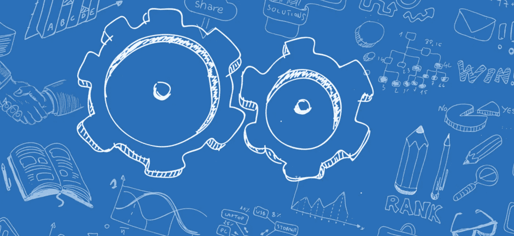

# 建立一种工程文化来完成工作

> 原文：<https://betterprogramming.pub/building-an-engineering-culture-to-get-things-done-e19ce87f4132>

## 这是一次旅行

现在，我们已经从作为独立实体的“开发”和“运营”完全过渡到 BizSecDevOps 工作方式，我们将能够支持平台和产品团队创造更好的 IT 体验。

但是权力带来了责任。我们真正需要的，是一种专注于代码的工程思维，这是我们做任何事情的基础。

当然，技术是我们向 DevOps 过渡的核心。从架构的角度来看，我们选择具有可重用组件的标准化生态系统。

这不仅适用于开发平台，也适用于整个组织中使用的 IT 服务，从网络服务到工作场所和安全措施。

更多的标准化有助于我们创建更安全的系统。在查看最近的网络犯罪活动时，我们看到攻击者利用第三方漏洞(例如 Log4J、SpringShell ),而同类最佳的方法只会让我们更容易受到攻击。我们应该在我们的游戏中处于领先地位——例如，快速修补——以保持我们的数字弹性。

当然，我们所做的改变都是为了我们的客户。但是这对我们的工作文化意味着什么呢？更具体地说，什么行为符合我们以客户为中心的开发运维愿景？

从创新的角度来看，如果我们不想成为一个*聪明的跟随者*——或者更糟，一个*数字落后者*——我们如何互动和工作？这个问题很重要，因为技术和文化是相辅相成的。为了能够成为*数字攻击者*和*推动者*，我们需要拥抱一种工程文化和心态，这种文化和心态专注于为我们的内部和外部客户制造出色、稳定和安全的产品。

# **小步前进，不断尝试，从失败中学习是根本**

这是从“被告知做什么”到在产品中心和平台服务中组织工作的新局面的一大步。工程思维以工程过程本身为中心。当一切都是代码时，我们需要关注工具、知识和技能。

正如一个好的木匠没有合适的工具和扎实的教育就不能工作一样，一个 IT 专家需要合适的工具和鼓励知识积累的环境。此外，实验是成为数字攻击者和推动者的基础。因此，犯错误是应该受到鼓励而不是惩罚的事情。

有了正确的工程思维，应该会带来更快的交付速度，对客户亲密度的明确关注，以及对你正在做的工作的影响的理解。

从逻辑上讲，这将转化为以正确的方式做正确的事情——用一个安全的基础来支持我所说的“稳定创新”。当然，我们仍然需要结构来做到这一点。

组织“学习”——工程文化的一部分，可能是最有趣的。我们将会看到像黑客马拉松这样的事情在我们的组织中发生，这是值得期待的。但这只是敏捷工作方式的一个方面。

# **新型领导**

我们的敏捷组织的新的、领先的原则(建立客户价值、自主和稳定的团队、对产品承担端到端的责任)，需要文化转变和新的技能。

例如，领导将倾向于支持对话而不是等级制度:领导者为团队的繁荣创造条件。但是，持续的学习应该得到奖励。

如果你能从中吸取教训，犯错误是可以的。考虑到敏捷性，我们还应该建立和维护简短的反馈循环:从小处着手，快速学习，并根据需要进行调整。最后，决策过程应该是数据驱动的:我们衡量并展示我们的结果，尽管仍然应该有直觉的空间。

这一切对你我意味着什么？一种新的文化和新的结构是很难接受的。但是就像罗马不是一天建成的一样，我们可以说我们行业中的一些高度数字化的金融服务通过采用敏捷的工作方式而领先。

我们最大的挑战是团队如何掌控方向盘。对代码和他们用代码创造的客户价值负责。只要我们愿意学习和改进，我们就能让我们的客户惊叹不已。

好消息是学习新事物会带来“有趣”的一面。创建工程文化是一个旅程。所以别忘了欣赏沿途的风景！