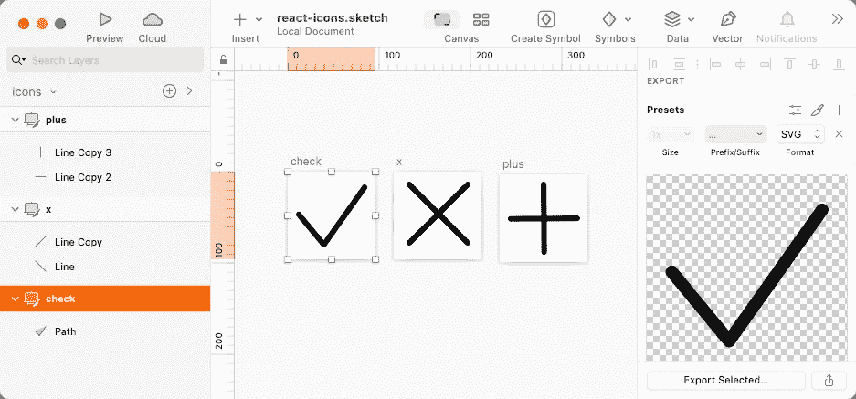
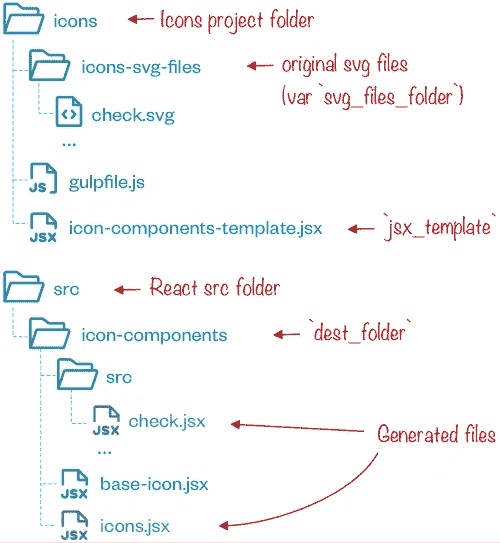
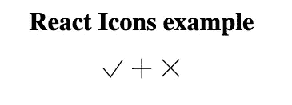

# 在 React 中构建图标系统

> 原文：<https://betterprogramming.pub/building-an-icon-system-in-react-16757d73cc35>

## 反应图标

## 将 svg 图标从``symbol``迁移到 React 组件:从 Figma 或 Sketch 开始构建图标集的简单 Gulp 工作流


照片由[布雷特·乔丹](https://unsplash.com/@brett_jordan?utm_source=medium&utm_medium=referral)在 [Unsplash](https://unsplash.com?utm_source=medium&utm_medium=referral) 拍摄

当我开始一个新项目时，我总是面临的任务之一就是定义一个图标系统。

作为一名设计师，我的目标是控制项目的所有元素，图标是非常常见的。

设计特定的图标并不总是必要的，我经常使用许多在线可用的库中的一个，但是当不可能时，除了设计方面，我总是试图优化它们的使用。

多年来，我定义了一个工作流，从设计到编码，除了不可避免的持续更新，它仍然有效。我从图标字体到 svg，从 Illustrator 到 Sketch，但是开发过程几乎是一样的。

# 经典的方式

我第一次接触图标是使用[图标字体](https://www.sitepoint.com/create-an-icon-font-illustrator-icomoon/)，但是当 svg 成为一个可行的选择时，我工作流程的目标变成了创建一个 SVG 文件，其中所有图标都被存储为[符号](https://css-tricks.com/svg-symbol-good-choice-icons/)。

为了更好地解释，我创建了一个带有三个图标的示例*草图*文件(当然，您的图标集将有更多)。你可以用 Figma、InkScape、Affinity Designer、Illustrator 或任何你喜欢的软件以同样的方式开始。



我现在使用 Sketch，因为它似乎是简单性和输出质量之间的最佳折衷，尽管它经常需要额外的关注来消除 SVG 代码中经常(实际上太频繁)生成的`transform`属性。

对于复杂的图标，我暂时切换到 Illustrator 或 InkScape，然后将结果粘贴到 Sketch 中。

Bjango 网站上有两篇有趣的文章可以帮助您选择更好的解决方案: [SVG 直通精度](https://bjango.com/articles/svgpassthroughprecision/)和[理想 SVG 导出](https://bjango.com/articles/svgexports/)。

绘制并导出图标后，每个图标都会有一个 SVG 文件，如下所示:

```
<svg  width="96" height="96" viewBox="0 0 96 96">
  <polyline fill="none" stroke="#000" stroke-linecap="round" stroke-linejoin="round" stroke-width="6" points="12 46.782 39.491 80 84.164 17"/>
</svg>
```

目标是通过创建一个新的 svg 文件来合并所有的 SVG 文件，它将每个图标封装在一个带有唯一 id 的*标签*中:

```
<?xml version="1.0" encoding="UTF-8"?>
<!DOCTYPE svg PUBLIC "-//W3C//DTD SVG 1.1//EN" "http://www.w3.org/Graphics/SVG/1.1/DTD/svg11.dtd"><svg  xmlns:xlink="http://www.w3.org/1999/xlink">
  <symbol id="check" viewBox="0 0 96 96">
    <polyline points="12 46.782 39.491 80 84.164 17" />
  </symbol>
  <symbol id="plus" viewBox="0 0 96 96">
    <line x1="12" x2="84.853" y1="48.692" y2="48.119" />
    <line x1="48.692" x2="48.119" y1="85" y2="11" />
  </symbol>
  <symbol id="x" viewBox="0 0 96 96">
    <line x1="17" x2="81" y1="14" y2="78" />
    <line x1="17" x2="81" y1="78" y2="14" />
  </symbol>
</svg>
```

请注意:

*   我们现在有了一个独特的`svg`标签来包装所有的图标
*   每个图标都被包裹在一个`symbol`标签中
*   每个`symbol`标签都有一个唯一的`id`(对应于原始文件名)和一个`viewBox`属性
*   每个表象属性(`fill`、`stroke*`等)都被移除

现在，我们能够以这种方式在 html 页面中嵌入图标:

```
<svg role="img">
  <title>Plus icon</title>
  <use xlink:href="icons.svg#check"></use>
</svg>
```

*(这是一个非常基础的实现，你可能需要添加更多的属性来提高可访问性，看看* [*可访问的 SVG 图标*](https://css-tricks.com/accessible-svg-icons/) *)。*

如果你只有三个图标，就像我的例子，手动合并它们并不是不可能的，但是如果你有很多图标并且/或者需要不止一次地更新它们，那就不是一个可行的选择。

我已经建立了一个简单的 [Gulp](https://gulpjs.com/) 文件来完成所有的工作。除了吞咽本身，它还需要:

*   [一饮而尽——svgmin](https://www.npmjs.com/package/gulp-svgmin)，一饮而尽实施 [SVGO](https://github.com/svg/svgo)
*   将所有的 svg 文件合并成一个文件
*   [吞咽-重命名](https://www.npmjs.com/package/gulp-rename)重命名我们的输出文件

```
/* eslint-env node */

const gulp = require('gulp')
  ,rename = require('gulp-rename')
  ,svgstore = require('gulp-svgstore')
  ,svgmin = require('gulp-svgmin')
;

const svg_files_folder = './icons-svg-files',
  output_file = 'icons.svg',
  dest_folder = './';

gulp.task('default', function() {

  return gulp.src([svg_files_folder + '/*.svg'])

    // https://github.com/svg/svgo/tree/master/plugins
    // https://github.com/svg/svgo#built-in-plugins
    .pipe(svgmin({
      multipass: true,
      full: true,
      plugins: [
        { name: 'cleanupIDs', params: { remove: true, minify: true } }
        , 'removeDoctype'
        , 'removeComments'
        , 'removeTitle'
        , 'removeDimensions'
        , 'collapseGroups'
        , { name: 'cleanupNumericValues', params: { floatPrecision: 4 } }
        , { name: 'convertColors', params: { names2hex: true, rgb2hex: true } }
        , 'removeStyleElement'
        , 'removeEmptyContainers'
        , { name: 'removeAttrs', params: { attrs: ['(filter|fill|stroke|fill-rule|stroke-linecap|stroke-linejoin|stroke-width|transform|style|class|data.*)', 'svg:(width|height)'] } }
        , 'removeUselessDefs'
      ]
    }))
    .pipe(svgstore())
    .pipe( rename(output_file) )
    .pipe(gulp.dest(dest_folder));
});
```

让我们看看我们的 gulp 文件:

*   首先，我们实例化三个变量(`svg_files_folder`、`output_file`和`dest_folder`)，以便于脚本的重用
*   `gulp.src`从源文件夹中收集所有 svg 文件(`svg_files_folder`)
*   `svgmin` svgmin 根据输入的参数将 SVGO 应用于所有文件(其他信息参见 [SVGO GitHub 自述文件](https://github.com/svg/svgo#readme))
*   SVG 文件现在可以被重命名并保存到`dest_folder`

*关于安装和使用 Gulp 的最详细信息，请看一下* [*快速启动页面*](https://gulpjs.com/docs/en/getting-started/quick-start/) *。*

这样，不管你有多少个图标，你都可以非常快速地构建你的图标文件，你只需要执行 gulpfile:

```
cd path/to/your/project/folder
gulp 
# or 
# gulp --gulpfile your-gulpfile-name.js
# if your file is not called `gulpfile.js`
```

这种方法肯定比使用多个文件或在 HTML 页面中嵌入 svg 代码更方便:http 请求的数量会减少，SVG 文件可以被缓存。

另一方面，您必须手动检查未使用的图标，这可能会不必要地使文件变得混乱。此外，设计包含`use`标签的 SVG 有时会很棘手。

# 切换到反应

通过使用 web 组件模块，我们不再需要在一个文件中收集所有图标，也不必检查未使用的图标。

我们可以将 svg 文件直接包含在我们的`jsx`文件中，或者更好的是，为每个图标创建一个组件以便于使用，如下所示:

```
import PropTypes from 'prop-types';

function Check(props) {
  return (
    <svg  width="96" height="96" viewBox="0 0 96 96" 
      fill="none" 
      stroke={props.stroke}
      strokeLinecap={props.strokeLinecap} 
      strokeLinejoin={props.strokeLinejoin}  
      strokeWidth={props.strokeWidth} 
    >
      <polyline points="12 46.782 39.491 80 84.164 17"/>
    </svg>
  );
}

Check.propTypes = {
  stroke            : PropTypes.string.isRequired,
  strokeLinecap     : PropTypes.string,
  strokeLinejoin    : PropTypes.string,
  strokeWidth       : PropTypes.number.isRequired
};
Check.defaultProps = {
  stroke            : '#000',
  strokeLinecap     : 'round',
  strokeLinejoin    : 'round',
  strokeWidth       : 6
};

export default Check;
```

`Props`不是真正需要的，但是它们允许你在其他项目中重用你的组件。您也可以使用 css 并以另一种方式构建您的组件，但是无论您选择哪种方式，您都必须处理几个 svg 文件。如果您意识到构建完文件后，需要进行修改，该怎么办呢？

幸运的是，我们的 gulpfile，经过一些调整，可以再次帮助我们。

第一步与前面的工作流程相同(准备并保存图标)，所有的更改都在 gulpfile 和我们需要准备的两个新文件中。

目标是为每个图标创建一个组件。因为它们将有相同的`<svg>`标签，我们将删除它，使所有的图标共享同一个标签。

在处理结束时，我们的目录树将如下所示:



来自[https://phosphoricons.com/](https://phosphoricons.com/)的图标

这是一个生成组件的例子(`check.jsx`):

```
/* GENERATED FILE */

import BaseIcon from '../base-icon';

export default function (props) {
  return (
    <BaseIcon {...props}>
      <polyline points="12 46.782 39.491 80 84.164 17"/>
    </BaseIcon>
  );
}
```

这是导入的`base-icon`文件(由所有`.jsx`图标文件导入):

```
export default function (props) {
  return (
    <>
      <svg  
        width="2em" height="2em" viewBox='0 0 96 96'
        stroke="currentColor" stroke-width="4" fill="none">
        {props.children}
      </svg>
    </>
  );
}
```

**免责声明**:注意，如上所述，本文仅旨在定义一种生成和管理图标的方法，所有风格和设计方面的考虑都留待以后的文章。详细地说，分配给`base-icon.jsx`文件的属性的唯一目的是使查看结果更加容易和直接。

现在让我们看看新的 Gulpfile 以及它是如何变化的:

```
/* eslint-env node */

const gulp = require('gulp')
  ,replace = require('gulp-replace')
  ,rename = require('gulp-rename')
  ,svgmin = require('gulp-svgmin')
  ,wrap = require("gulp-wrap")
  ,fs = require('fs')
;

const svg_files_folder = './icons-svg-files',
  dest_folder = '../src/icon-components/',
  jsx_template = './icon-components-template.jsx';

let icons_component_list = [];

gulp.task('icons_components', function () {
  return gulp.src([
    svg_files_folder + '/*.svg'
  ])
    .pipe(svgmin({
      multipass: true,
      full: true,

      // https://github.com/svg/svgo/tree/master/plugins
      // https://github.com/svg/svgo#built-in-plugins
      plugins: [
        { name: 'cleanupIDs', params: { remove: true, minify: true } }
        , 'removeDoctype'
        , 'removeComments'
        , 'removeTitle'
        , 'removeDimensions'
        , 'collapseGroups'
        , { name: 'cleanupNumericValues', params: { floatPrecision: 4  } }
        , { name: 'convertColors', params: { names2hex: true, rgb2hex: true } }
        , 'removeStyleElement'
        , 'removeEmptyContainers'
        , { name: 'removeAttrs', params: { attrs: ['(filter|fill|stroke|fill-rule|stroke-linecap|stroke-linejoin|stroke-width|transform|style|class|data.*)', 'svg:(width|height)'] } }
        , 'removeUselessDefs'
      ]
    }))
    .pipe(replace(/<\/?svg(.*?)>/g, ''))
    .pipe(wrap({ src: jsx_template}))
    .pipe(rename(function (path) {
      icons_component_list.push(path.basename);
      path.extname = '.jsx';
    }))
    .pipe(gulp.dest(dest_folder + '/src'));
});

gulp.task('icons_component_main', function(cb) {

  return fs.writeFile(dest_folder + '/icons.jsx',
    '/* GENERATED FILE */\n\n' +
    icons_component_list.map(item => {

      let module_name = (item.charAt(0).toUpperCase() + item.substr(1))
        .replace(/-([a-z])/g, function (g) { return g[1].toUpperCase(); });

      return `export { default as Icon${module_name} } from './src/${item}.jsx';`;
    }).join('\n'),
    cb);
});

gulp.task('default',
  gulp.series(
    'icons_components',
    'icons_component_main',
  )
);
```

它不再需要`svgstore`模块，而是使用:

*   [吞咽-更换](https://www.npmjs.com/package/gulp-replace)以移除`svg`标签
*   [大口包装](https://www.npmjs.com/package/gulp-wrap)用模板包装我们的`jsx`文件
*   [fs](https://nodejs.org/dist/latest-v16.x/docs/api/fs.html#file-system) ，节点文件系统模块

`output_file`变量已经被移除，但是我们添加了:`jsx_template`(模板文件的路径)和`icons_component_list`，这将收集图标的所有文件名来构建一个*聚合器模块*(稍后将详细介绍)。

第一个任务与其他 gulpfile 相同(访问 svg 文件并将 svgo 应用于所有这些文件)。

注意，使用的`svgmin`配置移除了(几乎)所有属性，如果你想保留其中一些属性，你可能需要一个模块(比如 [svg-to-jsx](https://github.com/janjakubnanista/svg-to-jsx) )来使它们适应 jsx 语法(比如`stroke-width`必须变成`strokeWidth`)。

下一步是使用`gulp-replace`和一个简单的正则表达式(`.pipe(replace(/<\/?svg(.*?)>/g, ''))`)删除`svg`标签。

然后我们可以使用`gulp-wrap`将我们的模板(`icon-components-template.jsx`)应用到结果代码中。

如你所见，这真的很简单。您只需创建一个包含所需内容的文件，并在您想要放置生成的代码的位置插入一个占位符(`<%= contents %>`)，剩下的工作将由`gulp-wrap`完成(显然，如果您更改了模板，您将需要再次运行 gulp)。

```
/* GENERATED FILE */

import BaseIcon from '../base-icon';

export default function (props) {
  return (
    <BaseIcon {...props}>
      <%= contents %>
    </BaseIcon>
  );
}
```

现在，您可以在 React 应用程序中嵌入图标:

```
import Check from './icon-components/src/check';
import Plus from './icon-components/src/plus';
import X from './icon-components/src/x';

function App() {
  return (
    <div className="app">
      <h1>React Icons example</h1>

      <p><Check /> <Plus /> <X /></p>
    </div>
  );
}

export default App;
```

这是结果:



但是我们可以做得更好。你还记得`icons_component_list`变量吗？我们在最后一个 gulp 任务(`icons_component_main`)中用过。它的作用是建立一个集合所有图标的文件:

```
/* GENERATED FILE */

export { default as IconCheck } from './src/check.jsx';
export { default as IconPlus } from './src/plus.jsx';
export { default as IconX } from './src/x.jsx';
```

现在我们可以用一种更简洁的方式通过同一个文件导入所有图标(我也给所有图标名称添加了一个前缀`Icon`，但这并不是真正需要的)。

```
import './App.css';
import {IconCheck, IconPlus, IconX} from './icon-components/icons';

function App() {
  return (
    <div className="app">
      <h1>React Icons example</h1>

      <p><IconCheck /> <IconPlus /> <IconX /></p>
    </div>
  );
}

export default App;
```

*React 图标系统文章:*

1.  **在 React 中建立图标系统** *(本文)*
2.  **下一步:**[React 中的样式图标—第一部分:从设计到代码](https://medium.com/@massimo.cassandro/styling-icons-in-react-part-i-1a99207a7bc)
3.  [React 中的样式图标—第二部分:双色调和非方形图标](https://medium.com/me/stats/post/ddd3c8b328de)

[*我的所有出版物*](https://medium.com/@massimo.cassandro/my-dev-publications-eacf6727e4a)