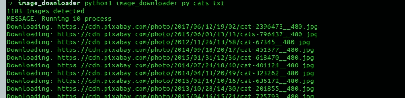

# 用 Python 构建具有多重处理的图像下载器

> 原文：<https://betterprogramming.pub/building-an-imagedownloader-with-multiprocessing-in-python-44aee36e0424>

## 有时下载大量图像需要几个小时——让我们来解决这个问题


照片由[贾尼尔·图农](https://unsplash.com/@tosshio?utm_source=unsplash&utm_medium=referral&utm_content=creditCopyText)在 [Unsplash](https://unsplash.com/s/photos/image?utm_source=unsplash&utm_medium=referral&utm_content=creditCopyText) 拍摄

我明白了——你厌倦了等待你的程序下载图像。当我不得不下载成千上万的图片时，有时要花几个小时，你不可能一直等你的程序下载完这些愚蠢的图片。你有很多重要的事情要做。

让我们构建一个简单的图像下载脚本，它将读取一个文本文件，并以超快的速度下载一个文件夹中列出的所有图像。

# 决赛成绩

这是我们最后要建造的。



# 安装依赖项

让我们安装大家最喜欢的`requests`库。

```
pip install requests
```

现在，我们将看到一些下载单个 URL 的基本代码，并尝试自动找到图像的名称，以及如何使用重试。

```
import requests

res = requests.get(img_url, stream=True)
count = 1
while res.status_code != 200 and count <= 5:
    res = requests.get(img_url, stream=True)
    print(f'Retry: {count} {img_url}')
    count += 1
```

在这里，我们重试下载图像五次，以防失败。现在，让我们尝试自动找到图像的名称并保存它。

```
# import more required library

import io
from PIL import Image

# lets try to find the image name
image_name = str(img_url[(img_url.rfind('/')) + 1:])
if '?' in image_name:
    image_name = image_name[:image_name.find('?')]
```

## 说明

假设我们试图下载的 URL 是:

[*https://insta gram . fktm 7-1 . FNA . FB cdn . net/VP/581 ba 4467732636 cab 13 a 38 c 7 BD 9 f 796/5e4c 7217/t 51.2885-15/sh 0.08/e35/s640x 640/65872070 _ 1200425330158967 _ 6201201266_ NC _ ht = insta gram . fktm 7-1 . FNA . FBC dn . net&_ NC _ cat = 111*](https://instagram.fktm7-1.fna.fbcdn.net/vp/581ba4467732636cab13a38c7bd9f796/5E4C7217/t51.2885-15/sh0.08/e35/s640x640/65872070_1200425330158967_6201268309743367902_n.jpg?_nc_ht=instagram.fktm7-1.fna.fbcdn.net&_nc_cat=111)

这真是一团糟。让我们来分解一下代码对 URL 做了什么。我们首先找到最后一个带`rfind`的前斜杠(`/`)，然后选择其后的所有内容。这是结果:

*65872070 _ 1200425330158967 _ 6201268309743367902 _ n . jpg？_ NC _ ht = insta gram . fktm 7–1 . FNA . FBC dn . net&_ NC _ cat = 111*

现在我们的第二部分找到一个`?`，然后只取它前面的任何东西。

这是我们最终的图像名称:

*65872070 _ 1200425330158967 _ 6201268309743367902 _ n . jpg*

这个结果非常好，并且适用于大多数用例。

现在我们已经下载了我们的图像名称和图像，我们将保存它。

```
i = Image.open(io.BytesIO(res.content))
i.save(image_name)
```

如果你在想，“我到底该怎么使用上面的代码？”那么你的想法是正确的。这是一个非常漂亮的函数，上面我们做的一切都被压扁了。这里，我们还测试了下载的类型是否是图像，以防我们找不到图像名称。

```
def image_downloader(img_url: str):
    """
    Input:
    param: img_url  str (Image url)
    Tries to download the image url and use name provided in headers. Else it randomly picks a name
    """
    print(f'Downloading: {img_url}')
    res = requests.get(img_url, stream=True)
    count = 1
    while res.status_code != 200 and count <= 5:
        res = requests.get(img_url, stream=True)
        print(f'Retry: {count} {img_url}')
        count += 1
    # checking the type for image
    if 'image' not in res.headers.get("content-type", ''):
        print('ERROR: URL doesnot appear to be an image')
        return False
    # Trying to red image name from response headers
    try:
        image_name = str(img_url[(img_url.rfind('/')) + 1:])
        if '?' in image_name:
            image_name = image_name[:image_name.find('?')]
    except:
        image_name = str(random.randint(11111, 99999))+'.jpg'

    i = Image.open(io.BytesIO(res.content))
    download_location = 'cats'
    i.save(download_location + '/'+image_name)
    return f'Download complete: {img_url}'
```

现在，“这家伙说的多重处理在哪里？”你可能会说。

这个很简单。我们将简单地定义我们的池，并将我们的函数和图像 URL 传递给它。

```
results = ThreadPool(process).imap_unordered(image_downloader, images_url)
for r in results:
    print(r)
```

让我们把它放在一个函数里:

```
def run_downloader(process:int, images_url:list):
    """
    Inputs:
        process: (int) number of process to run
        images_url:(list) list of images url
    """
    print(f'MESSAGE: Running {process} process')
    results = ThreadPool(process).imap_unordered(image_downloader, images_url)
    for r in results:
        print(r)
```

同样，你可能会说，“这些都没问题，但是我想马上开始下载我的 1000 张图片列表。我不想复制和粘贴所有这些代码，并试图找出如何合并一切。”

这是完整的剧本。它执行以下操作:

1.  将图像列表文本文件和进程号作为输入
2.  按照你想要的速度下载它们
3.  打印下载文件所花费的总时间
4.  还有一些很好的函数可以帮助我们读取文件名，处理错误等等

# 完整脚本

```
# -*- coding: utf-8 -*-
import io
import random
import shutil
import sys
from multiprocessing.pool import ThreadPool
import pathlib

import requests
from PIL import Image
import time

start = time.time()

def get_download_location():
    try:
        url_input = sys.argv[1]
    except IndexError:
        print('ERROR: Please provide the txt file\n$python image_downloader.py cats.txt')
    name = url_input.split('.')[0]
    pathlib.Path(name).mkdir(parents=True, exist_ok=True)
    return name

def get_urls():
    """
    Returns a list of urls by reading the txt file supplied as argument in terminal
    """
    try:
        url_input = sys.argv[1]
    except IndexError:
        print('ERROR: Please provide the txt file\n Example \n\n$python image_downloader.py dogs.txt \n\n')
        sys.exit()
    with open(url_input, 'r') as f:
        images_url = f.read().splitlines()

    print('{} Images detected'.format(len(images_url)))
    return images_url

def image_downloader(img_url: str):
    """
    Input:
    param: img_url  str (Image url)
    Tries to download the image url and use name provided in headers. Else it randomly picks a name
    """
    print(f'Downloading: {img_url}')
    res = requests.get(img_url, stream=True)
    count = 1
    while res.status_code != 200 and count <= 5:
        res = requests.get(img_url, stream=True)
        print(f'Retry: {count} {img_url}')
        count += 1
    # checking the type for image
    if 'image' not in res.headers.get("content-type", ''):
        print('ERROR: URL doesnot appear to be an image')
        return False
    # Trying to red image name from response headers
    try:
        image_name = str(img_url[(img_url.rfind('/')) + 1:])
        if '?' in image_name:
            image_name = image_name[:image_name.find('?')]
    except:
        image_name = str(random.randint(11111, 99999))+'.jpg'

    i = Image.open(io.BytesIO(res.content))
    download_location = get_download_location()
    i.save(download_location + '/'+image_name)
    return f'Download complete: {img_url}'

def run_downloader(process:int, images_url:list):
    """
    Inputs:
        process: (int) number of process to run
        images_url:(list) list of images url
    """
    print(f'MESSAGE: Running {process} process')
    results = ThreadPool(process).imap_unordered(image_downloader, images_url)
    for r in results:
        print(r)

try:
    num_process = int(sys.argv[2])
except:
    num_process = 10

images_url = get_urls()
run_downloader(num_process, images_url)

end = time.time()
print('Time taken to download {}'.format(len(get_urls())))
print(end - start)
```

将它保存到一个 Python 文件中，然后让我们运行它。

```
python3 image_downloader.py cats.txt
```

这里有一个到 [GitHub 库](https://github.com/nOOBIE-nOOBIE/image_downloader_multiprocessing_python)的链接。

## 使用

```
python3 image_downloader.py <filename_with_urls_seperated_by_newline.txt> <num_of_process>
```

这将读取文本文件中的所有 URL，并将它们下载到与文件名同名的文件夹中。

`num_of_process`是可选的(默认使用 10 个进程)。

# 例子

```
python3 image_downloader.py cats.txt
```


我喜欢任何关于如何进一步改善的回应。

编码快乐！