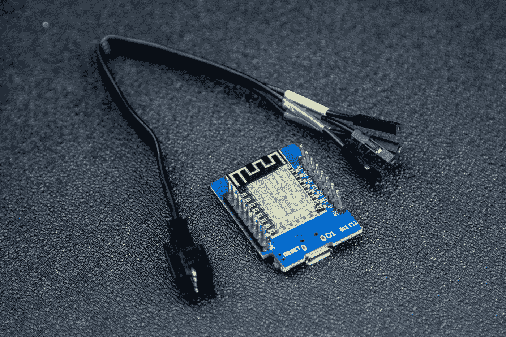
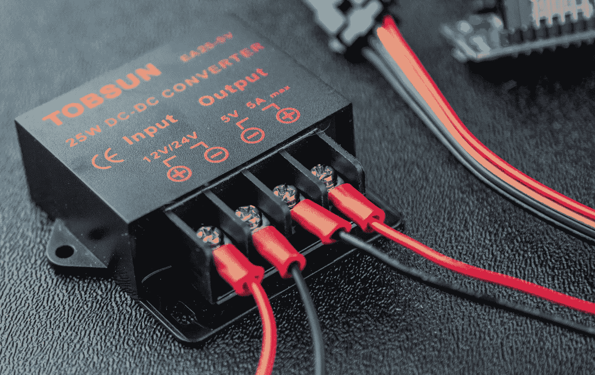
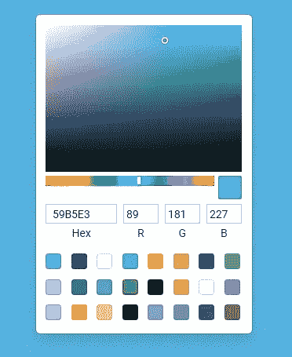

# 构建可通过互联网控制的 LED 灯条

> 原文：<https://betterprogramming.pub/building-an-internet-controllable-led-strip-cdbe1c846cd5>

## 当你让你的同事控制你的照明时会发生什么

我想通过添加一些照明来美化我办公室的背景，我想有什么比可控的 RGB LEDs 更好的呢？我还认为让我的同事能够改变我的照明颜色会很有趣，而且可能很有意思——我想直到我们在会议中过于分心。

# 它是如何工作的

起初，我想做一个轮询方法，我会轮询服务器，看看最新的颜色选择是什么，然后在本地更新点星。我对这个想法的主要不满是，这种方法的效率会有多低，因为需要几秒钟才能看到反映出来的变化(对本地用户和其他潜在用户都是如此)。

在我看来，最好的方法是使用 WebSocket。这样，每个人都可以立即看到变化，消除任何延迟。这也简化了服务器端的设置，因为我只需要托管一个简单的 WebSocket 服务器，不需要数据库或路由。

使用 WebSocket，每当用户发送一种新颜色时，服务器接收该消息并验证该颜色，然后将其转播给其他 WebSocket 客户端，以便它们知道所选择的新颜色。

显示系统如何工作的 GIF

## 硬件设置

我选择的 [DotStar 带](https://www.adafruit.com/product/2240?length=1)两端都带有 JST SM 连接器，所以我也购买了[匹配连接器](https://www.adafruit.com/product/578)，以便更容易地连接到我的设备。我在末端焊接并卷曲了母[杜邦连接器](https://www.mattmillman.com/why-do-we-call-these-dupont-connectors/)，这样我就可以很容易地从安装中移除设备，例如，如果我需要纠正一些代码的话。

带有杜邦母接头的 JST-SM 连接器+焊接有公接头的 D1 Mini

由于 DotStar 支持 [SPI](https://learn.sparkfun.com/tutorials/serial-peripheral-interface-spi/all) ，我选择了这种方式——阿达果[提到](https://learn.adafruit.com/adafruit-dotstar-leds/python-circuitpython#python-computer-wiring-3004880)这是首选方法，因为它比 [bit-bang 方法](https://circuitdigest.com/article/introduction-to-bit-banging-spi-communication-in-arduino-via-bit-banging)更快。我用的是 [D1 迷你](https://diyi0t.com/esp8266-wemos-d1-mini-tutorial/) ( [ESP8266](https://medium.com/@makvoid/experimenting-with-esp32-esp8266-microcontrollers-1a6e27ef15ca) )，所以我把 SCLK(黄色)接到了 D5，把 MOSI(绿色)接到了 D7，但这将根据你使用的设备而有所不同。

## 电源要求

由于我们有这么多的 led，需要一个足够安培数的好电源，因为微控制器不会提供足够的电流。Adafruit [建议](https://learn.adafruit.com/adafruit-dotstar-leds/power-and-connections#powering-dotstar-leds-3004522)如果你在全白和全亮度的情况下，估计每颗星的峰值电流为 60 毫安。我购买的灯带总共有 60 个 led，所以我最多只需要 3.6A。

Adafruit 销售一款 [12V 5A 电源](https://www.adafruit.com/product/352)，我将使用它为项目供电，但我们需要一个降压调节器将 12V 电源转换为 5V，因为 DotStars 只接受 5V 电压。我在亚马逊上找到了这个[转换器](https://www.amazon.com/gp/product/B00J3MHT1E/)，到目前为止效果很好，如果需要的话，还会给我一些空间来添加额外的部分。Adafruit 还出售一个[螺丝终端适配器](https://www.adafruit.com/product/368)，这样你就可以轻松地将你的电源连接到你的项目上，这也是我为这个项目挑选的。

12V 至 5V 降压稳压器

## 软件设置

正如我以前的一篇文章所提到的，我们能够在 ESP8266 上使用 MicroPython，所以我选择在这个项目中再次使用它。对我来说幸运的是，已经为 MicroPython 创建了一个 [WebSocket 库](https://github.com/danni/uwebsockets)和 [DotStar 库](https://github.com/mattytrentini/micropython-dotstar)，所以我可以轻松地加载这些库，这大大加快了我的开发速度。

## 计算机网络服务器

我使用 Node.JS 中的 [ws](https://www.npmjs.com/package/ws) 库设置了一个简单的 WebSocket 服务器。使用 [systemd](https://www.freedesktop.org/wiki/Software/systemd/) ，我将服务器设置为一个服务，这样它将无限期运行并为我们收集日志。当用户第一次连接时，服务器会转发上次选择的颜色，这样所有用户都会同步。因为只有我的微控制器将使用非安全服务器，所以来自该连接的消息不会转播到安全服务器。

## 微控制器

该脚本首先处理网络连接和启动 WebSocket 客户端。它试图每五秒钟读取一条消息，如果由于某种原因服务器打嗝，它无法阻止它等待消息，它将超时。不管它是否收到消息，它还会向服务器发回一条空消息，以帮助保持连接，帮助发现任何连接问题，并在需要时重新连接。

## 用户界面

用户界面非常简单，因为它没有做太多事情，所以我使用 [Angular](https://angular.io/) 和 [ngx-color](https://www.npmjs.com/package/ngx-color) 来提供颜色样本组件。它连接到同一个 WebSocket 服务器，获取所选的颜色，并将其转换为 RGB 值(因为这是 DotStar 最终使用的颜色)。这也使得验证更加容易，因为我们知道值只能是特定数字(0–255)之间的特定格式。

色样显示给用户以帮助他们选择新的颜色

# 结论

虽然这个项目进行得很快，但它仍然非常有趣！这个项目有很大的扩展空间，比如混合颜色、图案、颜色历史等等。我会继续修改这个想法，但我很有兴趣听听你对此有什么想法！

# 资源

*   [代码库](https://github.com/makvoid/Blog-Articles/tree/main/Interactive-LED-Strip)