# 用 React Native 构建一个 iOS 屏幕记录器

> 原文：<https://betterprogramming.pub/building-an-ios-screen-recorder-with-react-native-9e8c764c477e>

## 这比你想象的要容易得多


用 React Native 这样的跨平台工具构建一个屏幕录制器意味着必须编写大量的原生平台特定代码，所以跳过 React Native 是有意义的。然而，我将这个解决方案实现为 React Native 内置的一个更大的应用程序中的一个小功能。

我可能会做另一个教程，展示如何在 Android 中实现同样的事情。

如果你遵循这个教程，你也可以不用 React Native 就能使用大部分代码为 iOS 构建一个屏幕录制应用。

你需要一个安装了 iOS v12.0+的 iOS 设备，因为屏幕录制无法在模拟器上运行。

以下是我们将在本教程中涉及的主题:

*   如何用 React Native 编写原生模块？
*   iOS 广播上传扩展。
*   ReplayKit。
*   应用程序组—共享数据 b/w 目标

本教程将涵盖很多内容。到最后，它将不仅仅是一个你能制作的屏幕记录器。

# 完全码

一旦您按照本指南进行操作，如果您遇到任何问题，请使用此存储库作为参考。

[](https://github.com/linuxpi/ScreenRecordingRNDemo) [## linuxpi/ScreenRecordingRNDemo

### React 原生 iOS 屏幕记录器。在…上创建一个帐户，为 linuxpi/ScreenRecordingRNDemo 开发做贡献

github.com](https://github.com/linuxpi/ScreenRecordingRNDemo) 

让我们直接跳进来吧！

# 安装 React 本机 JS 组件

让我们假设您有一个使用`create-react-app` *设置的 React 原生项目。*

首先，我们创建一个组件，在您的应用程序中为屏幕录制相关操作提供一个 UI。我们将这个组件命名为`ScreenRecorder` ***。***

现在让我们添加一个状态变量，`recordings` —它将用于列出所有屏幕记录的文件路径。

# 我们的第一个本地模块

现在让我们在 Swift 中设置一个本地视图管理器。这用于显示记录按钮。

为此，我们使用 React Native 提供的`RCTViewManager`。它使我们的本机模块能够在 JavaScript 组件中使用。

使用文件`ScreenRecordingDemo.xcworkspace` *在 Xcode 中打开您的项目。* 这里的`ScreenRecordingDemo` 是我反应过来的原生项目名称。

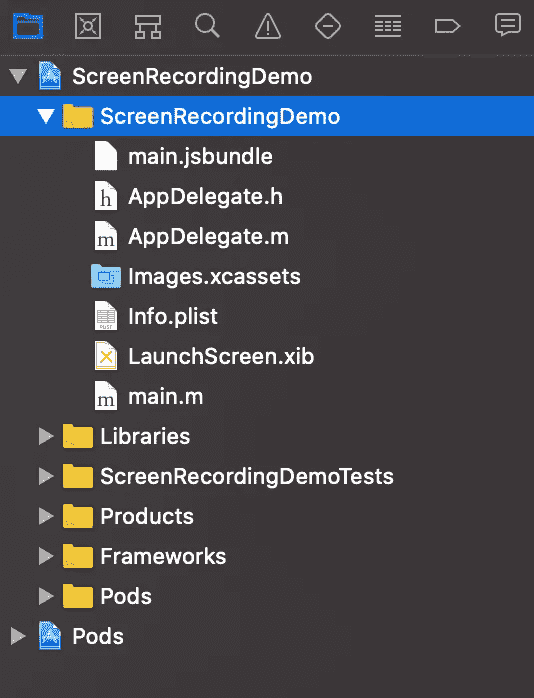

Xcode 中的项目浏览器视图

按下 **Cmd + N** 键，在选中的组中创建新的 swift 文件。命名为`RecordComponent`。你将被要求创建一个 Obj-C 桥接头——点击“创建桥接头”

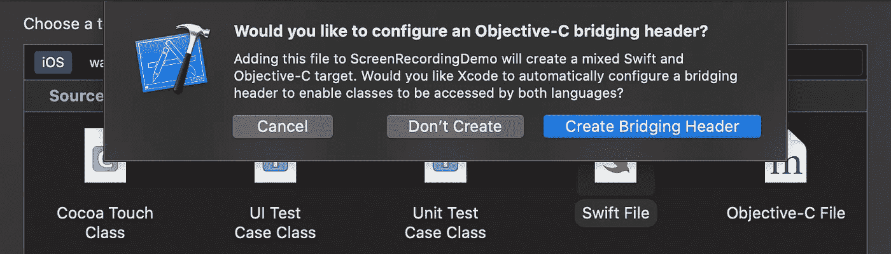

应该在项目浏览器中为您创建两个新文件— `RecordComponent.swift`和`ScreenRecordingDemo-Bridging-Header.h`。

*注意:桥接头文件只在你创建第一个本地文件时创建一次。*

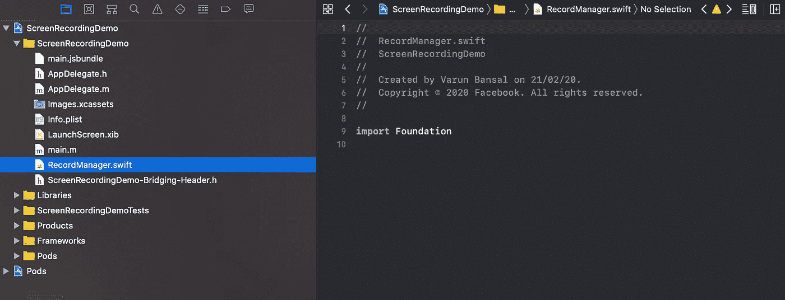

现在让我们为我们的`RecordComponent`写一些本机代码吧！

要使用 RCTViewManager，我们需要将下面的头导入到`ScreenRecordDemo-Bridging-Header.h` 文件中。

```
#import <React/RCTViewManager.h>
```

现在打开`RecordComponent.swift`*并创建一个新的类`RecordComponent`，它继承了`RCTViewManager`。*

*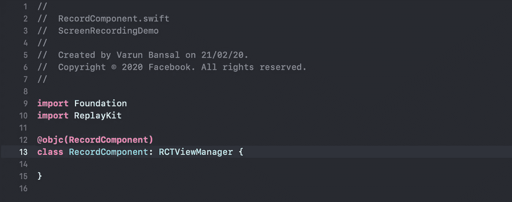*

*我们添加了`@objc(RecordComponent)` 来使该模块在 objective-C 文件中可用。*

*我们在这里实现的 record 按钮并不是普通的按钮——我们使用的是 ReplayKit 提供的`RPSystemBroadcastPickerView` 。*

*下面是它的代码:*

*我们已经覆盖了`RCTViewManager`的`view`方法来返回我们的记录按钮 UI。`RCTViewManager`的视图方法应该返回 UIView 的一个实例或者任何继承 UIView 的类。无论`view`方法返回什么，都以`RecordComponent`的名称显示在屏幕上。*

*我们创建一个`RPSystemBroadcastPickerView` 的实例，并对其进行一些修改后返回。*

*这里还有一点需要注意的是`#available(iOS 12.0, *)`检查。这是必要的，因为我们在这里编写的代码仅在 iOS12.0+上受支持。*

*现在让我们将`RecordComponent`添加到 React 原生 JS 组件中。*

# *在 JS 组件中导入本机模块*

*为了让 React Native 发现`RecordComponent`(本机模块)，我们需要在 objective-C 中调用 React Native 提供的一些函数，这样它就知道`RecordComponent`可供使用。*

*让我们为`RecordComponent.swift`创建一个相应的 objective-C 文件来调用这些函数——`RecordComponent.m` ——并添加以下代码:*

*`RCT_EXTERN_MODULE` 使`RecordComponent`在 React 原生代码中可用。*

*就这样，`RecordComponent`现在可以用在您的反应性 JS 代码中了。*

*让我们修改 ScreenRecorder.js 文件，向其中添加原生的`RecordComponent`。完成后，ScreenRecorder.js 的代码应该是这样的:*

*除了`requireNativeComponens`，这里没有任何意外。顾名思义，我们正在使用`RCT_EXTERN_MODULE` **获取我们导出的原生组件。***

*现在让我们在设备上运行应用程序。如果你从未在 iOS 设备上运行过 React 原生应用程序，你可能想要遵循这个[指南](https://facebook.github.io/react-native/docs/running-on-device)*

*应用程序应该是这样的:*

*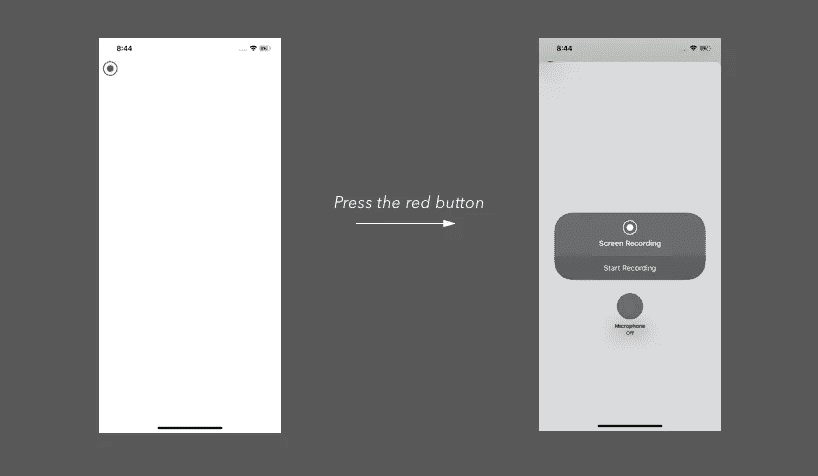*

**我们应用的第一稿**

# *设置 iOS 广播上传扩展*

*我们已经有了 record 按钮，现在我们需要将我们的应用程序添加到***Start Recording***picker 视图(右边的截图)，这样当我们开始记录时，我们的应用程序可以接收记录样本缓冲区。*

*为此，我们在应用程序中添加了一个*广播上传扩展*。*

*   *进入 Xcode，文件->新建->目标。*
*   *从列表中选择【广播上传扩展名】**。***
*   ***添加`ScreenRecordingExt`作为产品名称。***

***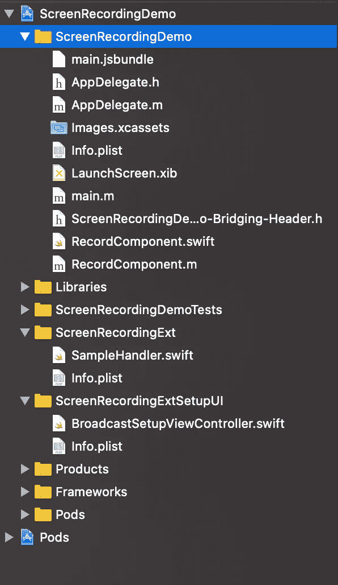***

***`ScreenRecordingExt`和`ScreenRecordingExtSetupUI`现在应该可以在项目浏览器中找到了。让我们用应用程序运行新的扩展，看看有什么变化。***

******

***从下拉列表中选择扩展名，然后单击播放***

******

***选择 UI 扩展并单击播放***

***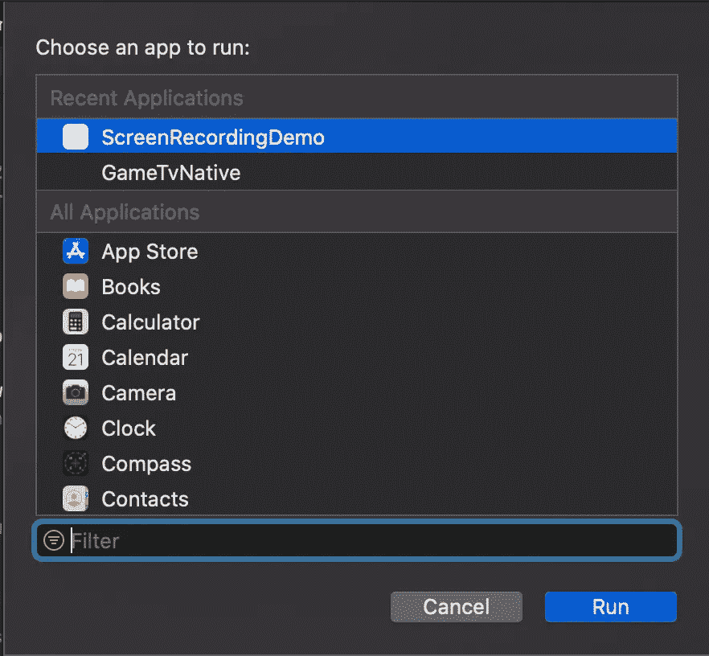***

***选择我们正在使用的应用程序***

****注意:我不得不分别运行两个扩展的构建来使它工作。如果你知道更好的方法，请在评论中告诉我！****

**现在，您应该能够在 picker 视图中看到我们的广播上传扩展:**

**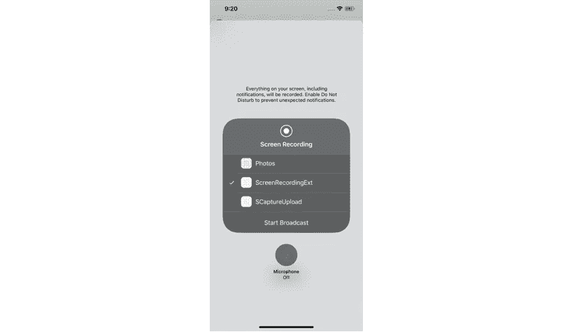**

**开始录音吧！**

# **使用 AVAssetWriter 保存录像**

**我们将使用`AVAssetWriter`将视频缓冲区保存到 iOS 应用程序的 documents 目录下的一个文件中。**

**让我们打开`ScreenRecordingExt`中的`SampleHandler.swift`。**

****

**在开始之前，我们将创建一个`FileSystemUtil`来帮助生成文件系统路径，我们将在那里写入我们的记录。针对我们的应用和扩展创建新的 Swift 文件:**

**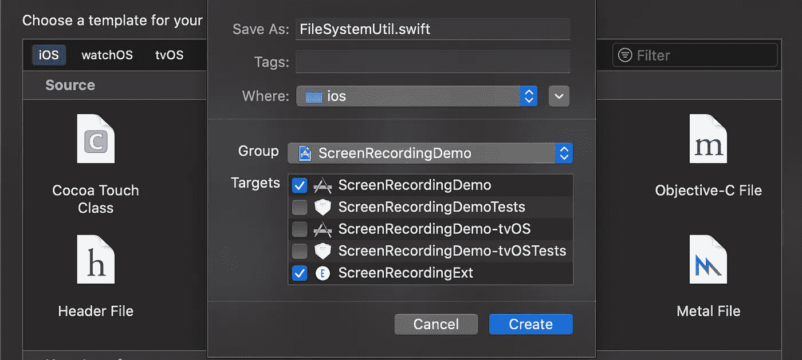**

**我们在这里将应用程序和扩展都作为目标，这样我们就可以在两个目标的代码中使用这个实用程序**

**下面是`FileSystemUtil.swift`的代码:**

**现在我们将修改`ScreenRecordingExt` 目标中`broadcastStarted`**`SampleHandler.swift`，来初始化我们的`AVAssetWriter`，并为视频输入做好准备。****

***代码如下:***

***我们在这里生成一个带有随机名称的文件 URL，并将其传送给`AVAssetWritter`。这是我们的最终输出将在录制完成后保存的 URL。添加一个 writer 输入后我们调用`.startWriting()` 使`AVAssetWriter`能够接受录音缓冲。***

**接下来，我们修改`*processSampleBuffer*` ***，*** 这个函数接收所有下面的样本缓冲用于记录。我们需要将这些缓冲区添加到我们在`broadcastStarted`中创建的`AVAssetWriterInput`中。**

**代码如下:**

**对于上面的代码，我得到了以下人员的帮助:[https://github.com/giridharvc7/ScreenRecord](https://github.com/giridharvc7/ScreenRecord)。这展示了 iOS 应用内屏幕记录器的实现。**

**现在我们来处理录音的最后一部分——收尾。**

**现在您应该已经知道我们将使用`broadcastFinished`函数。**

# **设置应用程序组**

**我们有一个保存录像的文件 URL。但在我们能看到录音之前，这是没有用的。**

**为此，我们必须使用应用组在我们的应用和扩展之间共享数据。我们保存的录音在我们的 extension 的 documents 目录中——extension 和应用程序在 iOS 上各自独立的沙箱中运行，因此我们无法直接从我们的应用程序访问 extension 创建的文件。**

**如果你想在应用和扩展之间共享数据，你必须将文件保存在应用组中。关于应用程序组的简单介绍，我推荐这个视频:**

**[https://www.youtube.com/watch?v=Jlr9cF9nDnU](https://www.youtube.com/watch?v=Jlr9cF9nDnU)**

**让我们创建我们的应用程序组。**

**在 Xcode 中，转到“签名和功能”并添加一个新功能:“应用程序组”**

**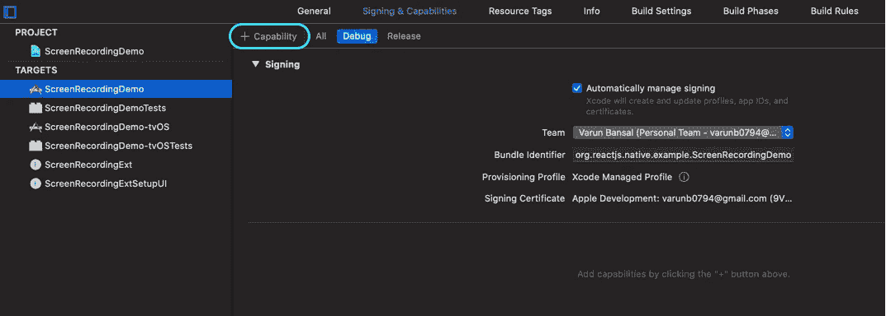**

**通过在`group.` 前缀后添加您的捆绑包 ID 来添加新的应用程序组。**

****

**创建应用程序组后的最终视图**

**现在转到目标列表中的`ScreenRecordingExtension`，添加“应用程序组功能”**

**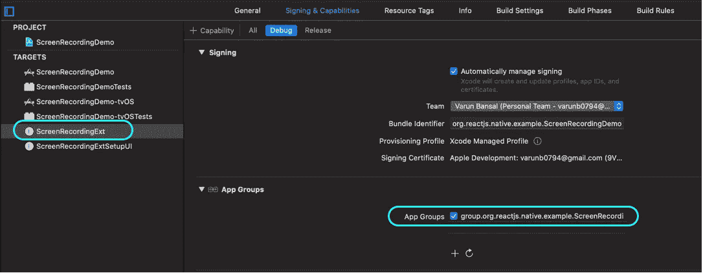**

**在扩展中选择相同的应用程序组**

**您之前添加的同一个应用程序组应该在这里可见。如果没有，请刷新列表并再次选中该框。**

**现在，您已经在应用和扩展之间创建了一个共享空间。对于我们完成的每个录制，我们会将文件复制到共享应用程序组，以便我们的应用程序可以访问该文件。**

**让我们修改一下`broadcastFinished`方法。**

**首先你会注意到我们创建了一个`DispatchGroup`。如果你曾经在任何其他编程语言中使用过线程，它们在这里实现相同的功能。因为我们的扩展在后台运行，而`finishWriting`下的代码将异步运行，所以后台线程将在`finishWriting`中的异步代码完成之前结束。所以我们创建了一个`DispatchGroup`来让后台线程等待，直到`finishWriting`执行完毕。**

**现在来看一下`finishWriting`正在做的事情——它只是将记录文件从我们的扩展的沙盒文档目录复制到共享应用程序组。**

# **列出所有录像**

**既然我们已经将记录文件复制到应用程序组共享容器，我们需要在我们的应用程序中列出它们。**

**让我们再创建一个本机模块，从 React 本机代码中获取应用程序组中的记录列表。我们将这个模块称为`SharedFileSystemRCT` ***。*** 只为你的 app 创建这个模块，不为扩展创建。**

**下面是`SharedFileSystemRCT.swift`的代码:**

**如果您熟悉 Swift 编码范式，代码非常简单。我们获取共享应用程序组中的文件列表，按修改日期排序，并用最终数据解析承诺。**

**为了暴露这个模块和它的函数来反应原生 JS 代码，我们需要使用`RCT_EXTERN_METHOD`，如本文开头所解释的。**

**现在，让我们设置一个`FlatList`来查看`ScreenRecorder.js`中的所有记录。**

**接下来，让我们实现`viewRecordings`，它将用于打开一个原生 UI 来将记录保存到`Files`应用程序，这样您就可以轻松地访问它。**

**为此，我们将在`RecordComponent.swift` 中创建一个方法，并将其公开给 JS 组件。**

**现在，让我们调用`showSaveFile` ***，*** 点击列表中的一项。**

**让我们运行应用程序，看看这是否可行！**

**当您单击列表中的某个项目时，系统会提示您保存记录。**

**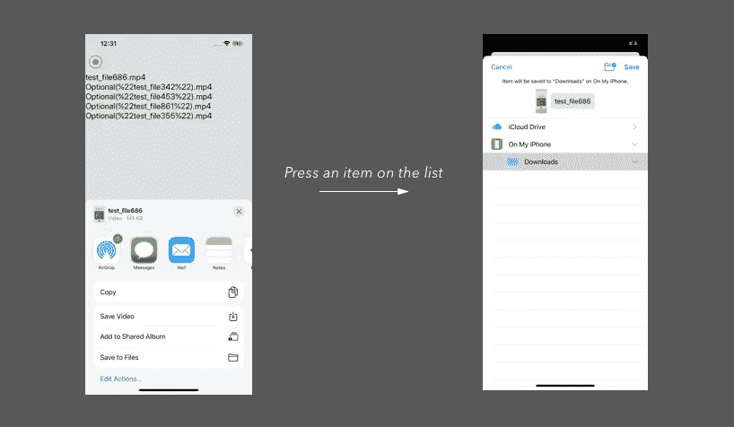**

**这就是你要的——一个 iOS 屏幕记录器。我同意 UI 可以更好。如果您愿意，您可以花一些时间根据自己的喜好来设计 UI。**

**这是一篇很长的文章，但是我希望你不仅仅是在学习构建一个屏幕记录器。希望你学到了很多概念，对你将来的各种任务有帮助。**