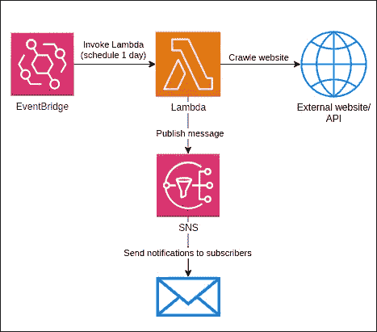

# 在 AWS 上构建要约通知服务

> 原文：<https://betterprogramming.pub/building-an-offer-notification-service-on-aws-99faad5d2806>

## 让我们在 AWS 上构建一个简单的网络爬虫应用程序，当某个产品有特价时，它会发送一个通知


[阿诺参议员](https://unsplash.com/@arnosenoner?utm_source=medium&utm_medium=referral)在 [Unsplash](https://unsplash.com?utm_source=medium&utm_medium=referral) 拍摄的照片

我喜欢花生酱，只要有卖的，我就会储存一些。因此，我想我将创建一个简单的应用程序，每当有该产品的报价时，它都会向我发送通知。为了创建这个应用程序，我需要:

1.  产品[网址](https://www.myprotein.com/sports-nutrition/all-natural-peanut-butter/10530743.html)，
2.  以及优惠在网页上的确切位置，这样我就可以提取这些信息了。对于这个产品，offer 位于`#pap-banner-text-value` HTML 元素中。

很可能您希望通过不同的事情得到通知，这样您就可以定制应用程序逻辑。也许你想在 GPU/XBOX/PS4 有货时收到通知，或者你想从 API 中提取数据并根据预定义的标准发送通知。应用程序发送通知的内容由您决定。

# 体系结构



架构图

我们将用于创建该应用程序的 AWS 服务有:

*   [AWS EventBridge](https://aws.amazon.com/eventbridge/) —用于调度 lambda 函数调用
*   [AWS Lambda](https://aws.amazon.com/lambda/) —用于抓取网站并向 SNS 主题发布消息
*   [AWS SNS](https://aws.amazon.com/sns/) —用于发送电子邮件通知

我们还将使用 NodeJS 实现 Lambda 功能，使用[无服务器](https://www.serverless.com/framework)来管理基础设施和部署应用程序。

# 设置开发环境

首先，我们必须安装无服务器 CLI。

```
npm install -g serverless
```

安装后，我们必须配置凭证。*如果没有，可以在 AWS 控制台上生成新的凭证。*

```
serverless config credentials --provider aws --key 1234 --secret 5678
```

安装完 CLI 后，我们可以创建一个新项目。

```
serverless create --template aws-nodejs --path offer-notification-application
```

上面的命令用一个`serverless.yml`文件和一个`handler.js`文件创建了一个框架项目，在这里我们将定义我们的基础设施，在这里我们将实现我们的 Lambda 函数。

# 履行

基于上面的架构图，我们将有一个 Lambda 函数，每天都会被调用。这个 Lambda 函数将获取目标网站的内容，每当发现一个报价时，它就向一个 SNS 主题发布一条消息。因为我们的 Lambda 函数将发布到一个 SNS 主题，因此它必须有必要的权限来做这件事。

我们还需要一个 SNS 主题，其中提供将被公布，以及一个电子邮件订户，需要通知每当一个新的消息发表在这个主题上。

下面的 serverless.yml 文件描述了上述体系结构。

无服务器. yml

我们还需要一个. env 文件，其中包含一个 EMAIL 环境变量，设置为我们希望接收通知的电子邮件地址。

现在，我们已经定义了我们的基础设施，我们可以继续编写我们的应用程序逻辑。

我们应该创建一个新的 src 目录，并将 handler.js 文件移到新创建的目录下，以使其结构更好。

我们的 Lambda 函数需要做的是获取目标网站内容，并检查是否有感兴趣的报价。为此，我们需要一些额外的包来获取站点( [axios](https://www.npmjs.com/package/axios) )并解析 HTML 内容( [cheerio](https://www.npmjs.com/package/cheerio) )，所以让我们用下面的命令安装它们。

```
npm install axios cheerio
```

现在，我们已经完成了实现应用程序核心逻辑的所有工作，对于该产品，它将如下所示。

handler.js

如您所见，`fetchOffer`函数获取网站内容，我们已经知道报价位于`#pap-banner-text-value` HTML 元素中，使用 cheerio 可以轻松提取其内容。

因为我只想在报价类似于`2 FOR 1 or 30 % off`时得到通知，所以我需要检查报价是否与其中一个正则表达式匹配。

在处理函数中，`fetchOffer`被调用，每当它返回一个提议时，它将被发布到 SNS 主题。

# 部署

现在，我们可以用一个命令将应用程序部署到 AWS。

```
serverless deploy
```

成功部署后，我们应该会收到一封发送到已配置电子邮件地址的确认电子邮件。在我们确认订阅后，我们将收到一封电子邮件，内容来自在该 SNS 主题上发布的每条消息。

要删除已部署的应用程序，请运行以下命令。

```
serverless remove
```

# 测试

我们可以通过使用下面的命令调用 Lambda 函数来轻松地手动测试部署的应用程序。

```
serverless invoke --function crawl
```

如果网站上有报价，我们应该会收到一封关于报价的电子邮件。

# 摘要

为了创建这个应用程序，我们使用了无服务器来定义基础架构和部署我们的应用程序。

我们还使用 AWS Lambda 运行我们的代码，使用调度事件触发 Lambda 函数调用，使用 SNS 向订阅者发送电子邮件通知。

如您所见，使用无服务器实现和部署这个应用程序到 AWS 非常容易。

你可以在 [GitHub](https://github.com/arszen123/offer-notification-application/tree/88d2862f45f3f8549842ccb6439e7948dd268978) 上查看这个库。

[](https://github.com/arszen123/offer-notification-application/tree/88d2862f45f3f8549842ccb6439e7948dd268978) [## GitHub-arszen 123/要约-通知-申请

### 一个简单的应用程序，建立在 AWS 上，不需要服务器，可以抓取一个网站的报价并发送电子邮件通知…

github.com](https://github.com/arszen123/offer-notification-application/tree/88d2862f45f3f8549842ccb6439e7948dd268978)