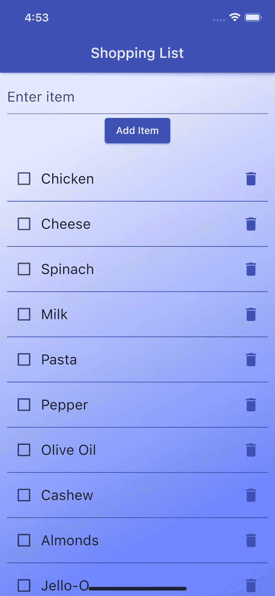
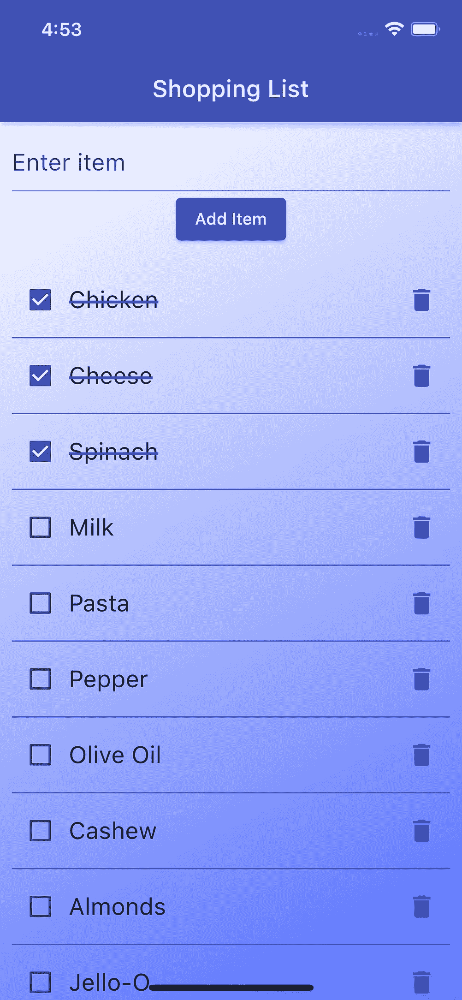
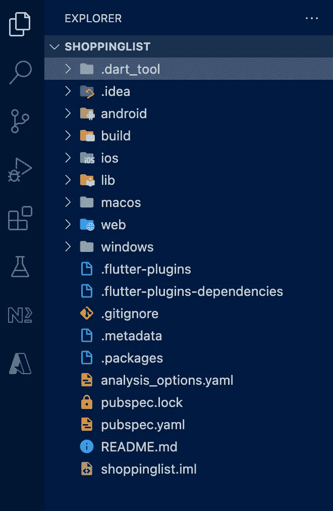
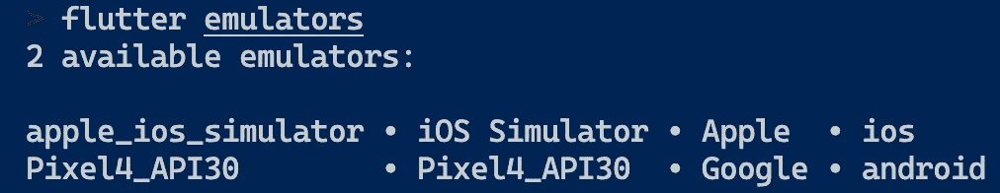
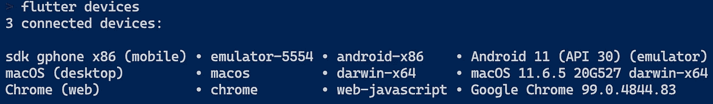
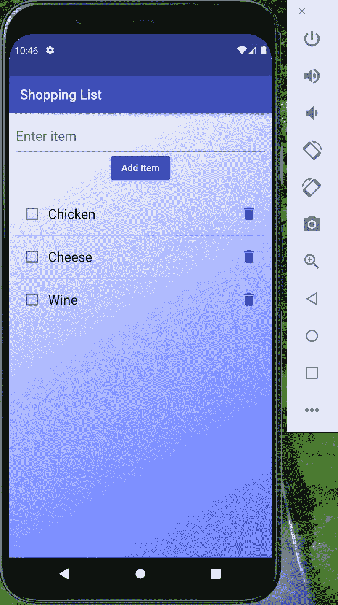

# 用 MongoDB Realm 构建离线 Flutter 应用程序

> 原文：<https://betterprogramming.pub/building-an-offline-app-with-mongodb-realm-8d4d00f8646f>

## 对于 Flutter 开发人员来说，为移动应用程序选择数据存储可能是一个令人畏惧的经历


卡斯帕·卡米尔·鲁宾在 [Unsplash](https://unsplash.com?utm_source=medium&utm_medium=referral) 上拍摄的照片

Realm 的移动数据库是 KeyValue pairs、SQLite 和 Firestore 的开源、开发人员友好的替代产品。几分钟内开始，为自己节省数周的工作。

Realm 首先是离线的，面向对象的，直观的，为移动设备而建。

在本文中，我们将使用 Flutter 和 Realm SDK 构建一个离线移动应用程序。

## 我们将建造什么？

我们将建立一个非常简单的购物清单应用程序，用户可以查看项目列表，添加新项目，切换和删除现有项目。



应用程序屏幕

## 你需要什么？

*   颤振安装和配置
*   你最喜欢的 IDE

## 我们开始吧

首先在你的终端上使用下面的命令创建一个 flutter 应用程序。

```
flutter create shoppinglist
```

这将在您当前的工作目录中创建一个名为 shoppinglist 的文件夹，其中将包含您的 flutter 应用程序的源代码，看起来如下所示。



在您喜欢的 IDE 中将目录作为项目打开。

## 将领域作为依赖项安装

接下来，我们将把 realm 作为依赖项添加到我们的`pubspec.yaml`中。这可以使用下面的命令来完成

```
flutter pub add realm
```

或者，您可以打开`pubspec.yaml`文件并添加 realm 作为依赖项:

```
dependencies:
  # other dependecies here
  realm: ^0.2.1+alpha
```

添加上述内容后，您需要运行下面的命令:

```
flutter pub get
```

就是这样。现在您已经拥有了开始使用 Realm 所需的一切。

## 创建模式

模式是任何领域应用程序中最简单的单元。模式定义了应用程序将使用的数据结构。

例如，我们购物清单中的一个`Item`可以有两个属性

*   文本:字符串
*   完成:布尔型

为了在我们的应用程序中表示一个项目，我们将创建一个模式。为此，在`lib`目录中创建一个名为`schemas`的目录。该目录将包含应用程序中使用的所有模式。

现在用下面的内容创建一个名为`item.dart`的文件。

> `@RealmModel`是一个`Annotation`类，用于定义`Realm`数据模型类及其属性。
> 
> `@PrimaryKey`表示主键属性。启用对象的快速查找并强制值的唯一性。它可以是
> 
> 应用于`RealmModel`类中的单个属性
> 
> `String`或`int`

## 从`RealmModel`类生成模式

现在我们已经定义了模式类，我们需要生成领域模式。领域模式是通过组合`_Item`和`RealmObject`类生成的。Realm 简化了我们的任务。我们需要做的就是运行下面的命令

```
flutter pub run realm generate
```

上面的命令将生成一个包含类`Item`的新文件`item.g.dart`。

## 使用领域

配置并打开一个领域

要使用 Realm，我们首先需要定义一个`Configuration`对象。构造函数接受您希望领域使用的模式列表。可选地，您可以传递一个`readOnly`和`inMemory`标志，指示您希望领域以只读模式打开或者领域被加载到内存中。

```
Configuration _config =
      Configuration([Item.schema], readOnly: false, inMemory: false);
Realm _realm = Realm(_config);
```

阅读所有项目

```
RealmResults<Item> items = _realm.all<Item>();
```

写/更新/删除操作在`transaction`块中完成。要创建一个事务块，使用`write()`并提供一个回调作为参数。我们在回调中执行写/更新/删除操作。

写一个项目

```
_realm.write(() {
    _realm.add<Item>(Item(text, false));
});
```

更新项目

```
_realm.write(() {
    item.done = true;
});
```

删除项目

```
_realm.write(() {
    _realm.delete(item);
});
```

关闭一个领域

```
if (!_realm.isClosed) {
    _realm.close();
}
```

## 为领域操作创建服务

为了管理我们的领域，我们将创建一个服务类，它将公开打开/关闭领域以及在我们的领域上执行查询/更新/删除操作的方法。

在`lib`目录下创建一个目录`services`。使用以下代码添加一个新文件`item_service.dart`

既然我们的核心业务逻辑已经准备好了，我们将继续构建 UI 组件和屏幕。

## 创建 UI 组件

> 在`lib`目录下创建一个目录`components`。这个目录将包含我们的 ShoppingList 应用程序中使用的所有 UI 组件。

项目列表视图

`ItemListView`本质上是一个 ListView，呈现我们购物清单中的项目列表。`ItemListView`组件需要三个参数:

*   `items` -项目对象列表
*   `onToggle` -切换项目时调用的回调函数
*   `onDelete` -删除项目时调用的回调函数

在`components`目录下添加一个名为`item_list_view.dart`的新文件，代码如下:

AddItemView

`AddItemView`由一个输入框和一个按钮组成。用户可以在输入字段中输入一个项目，当他们单击按钮时，应该会创建一个新项目。

`AddItemView`组件采用一个必需的参数:

*   `onAdd` -添加项目时调用的回调函数

在`components`目录下添加一个名为`add_item_view.dart`的新文件，代码如下:

购物列表视图

`ShoppingListView`由之前创建的组件`ItemListView`和`AddItemView`组成，并呈现一个聚合视图，用户可以在其中添加一个项目并查看现有项目的列表。

`ShoppingListView`组件需要四个参数:

*   `onAdd` -添加项目时调用的回调函数
*   `onToggle` -当项目被切换时调用的回调函数
*   `onDelete` -删除项目时调用的回调函数
*   `items` -项目对象列表

在`components`目录下添加一个名为`shopping_list_view.dart`的新文件，代码如下:

## 创建主屏幕

现在我们已经准备好了 UI 组件和 Realm 服务，我们可以在主屏幕上将它们缝合在一起。在我们的主屏幕上，我们将呈现我们的主应用程序和小时候的 ShoppingList。我们还将创建回调函数`onAdd`、`onToggle`和`onDelete`，并在这些函数中处理各种领域操作。

打开`lib`目录中的`main.dart`,用以下代码替换现有代码:

## 运行应用程序

就是这样。我们的应用程序已经准备好启动了。保存所有代码文件。

要启动 flutter 应用程序，我们将首先启动模拟器。让我们找到可用模拟器的列表。

```
flutter emulators
```



从上面的输出中选择一个仿真器 id，并使用下面的命令启动一个:

```
flutter emulators --launch Pixel4_API30
```

模拟器启动后，您可以使用下面的命令找到它的设备 id:

```
flutter devices
```



复制设备 id ( `emulator-5554`)，并使用以下命令运行 flutter 应用程序:

```
flutter run -d emulator-5554
```

> 如果您不喜欢命令，您可以使用 IDE 启动模拟器并运行 Flutter 应用程序。



## 提示和更多资源

现在您已经有了一个正在运行的领域应用程序，您可以继续添加更多的模式或更新现有的模式。

每当您对模式进行更改时，您都需要运行下面的命令来基于您的模式定义生成 RealmObjects。

```
flutter pub run realm generate
```

当您更新模式时，您可以运行带有 watch 选项的上述命令来生成/更新 RealmObjects。

```
flutter pub run realm generate --watch
```

请注意，当您更新您的领域方案时，您需要删除您当前的领域。要做到这一点，只需在打开您的领域之前执行以下代码。

```
Realm.deleteRealm(Configuration.defaultPath);
```

该应用程序的源代码可从[这里](https://github.com/markandeyp/flutter-shopping-list)获得

`Realm Flutter`目前处于`Alpha`阶段。Realm 是一个非常强大的生态系统，它不仅仅是应用程序的一个简单的离线数据存储。MongoDB 的领域团队正在努力制作各种领域特性，比如`Realm Sync`、`Realm Authentication`、`Realm Functions`等等。可供 Flutter 开发者使用。

要进一步探索 MongoDB 领域，您可以访问官方文档[这里](https://www.mongodb.com/realm)。