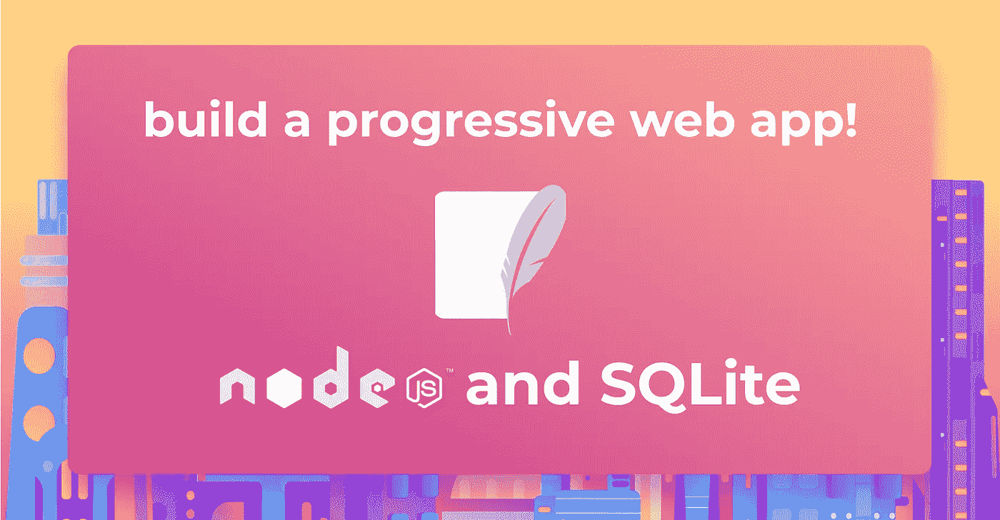
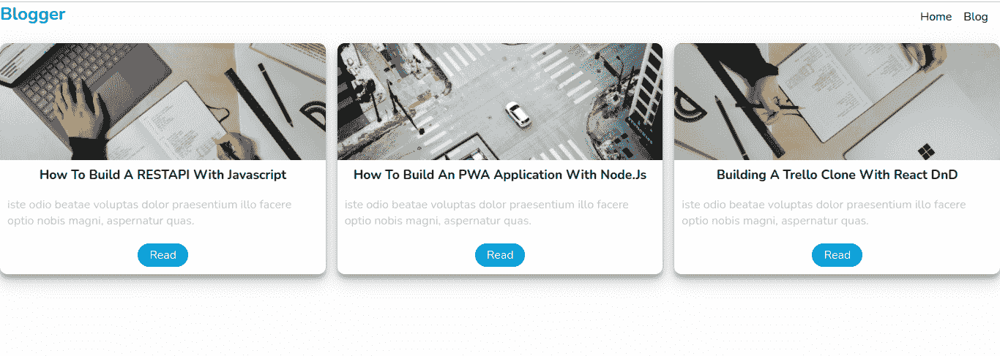
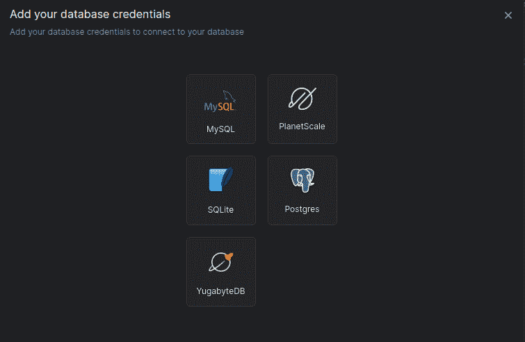
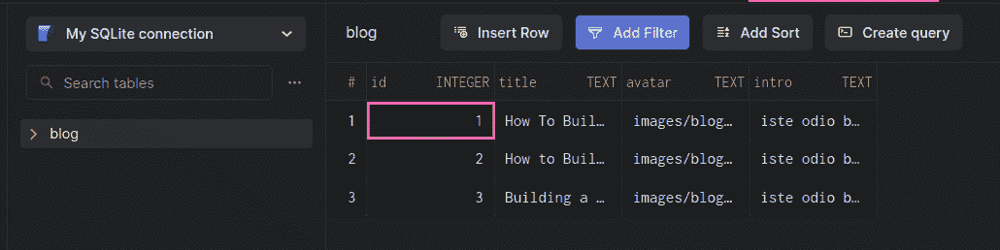
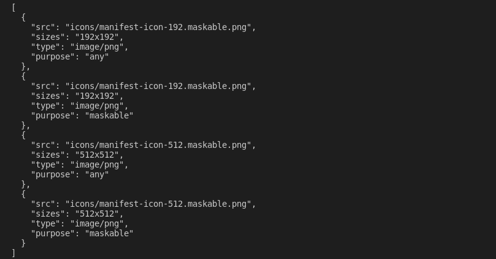
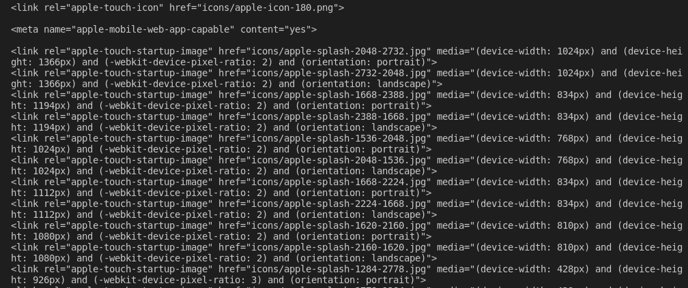
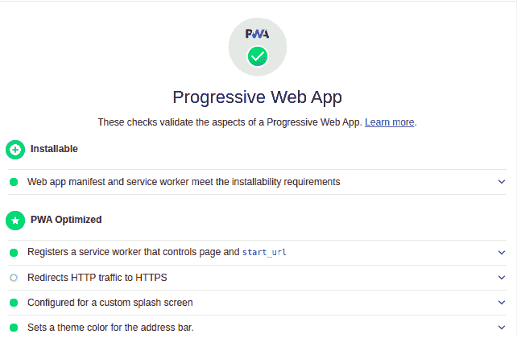

# 用 Node.js 和 SQLite 构建离线优先的应用程序

> 原文：<https://betterprogramming.pub/building-an-offline-first-application-with-node-js-and-sqlite-ae3836aec229>

## 渐进式 web 应用程序的逐步介绍



“离线优先”是一种应用程序开发模式，在这种模式下，开发人员确保应用程序的功能不会受到网络连接暂时中断的影响。渐进式 web 应用程序，感觉上像本地应用程序，但运行起来像 web 应用程序，通常是建立在这种范式上的。

本教程将教你如何用 Node.js 和 SQLite 数据库构建一个离线优先的应用程序。让我们从渐进式 web 应用程序的介绍开始。

# **PWA 简介**

[渐进式网络应用](https://developer.mozilla.org/en-US/docs/Web/Progressive_web_apps) (PWAs)是使用服务人员、清单和其他网络平台功能和渐进式增强的网络应用，为用户提供可与本地应用相媲美的体验。

就效率而言，PWAs 有时可以胜过原生应用。它们按需运行，并且始终可用，无需消耗宝贵的智能手机内存或数据。当选择 PWA 而不是相同应用程序的本机版本时，用户消耗的数据更少。他们仍然可以将 PWA 保存到他们的主屏幕；它不需要完全下载就可以安装。

# 我们在建造什么？

为了展示渐进式 web 应用程序的威力，我们将构建一个简单的博客应用程序。



用户将能够像其他 PWA 一样与它进行交互，例如 [Twitter PWA](https://love2dev.com/blog/twitter-pwa-windows-store/) 。让我们开门见山吧。

# **初始化 NodeJs 应用程序**

让我们把手弄脏吧。首先，我们将使用下面的命令创建项目文件夹:

```
mkdir PWA && cd PWA
```

然后，我们将使用以下命令初始化 Node.js 应用程序:

```
npm init -y
```

上面的命令为应用程序创建了一个`package.json`文件。

接下来，在我们的项目文件夹中创建以下文件夹结构:

📦┣📂公开
┃ ┣📂css
┃ ┣📂图标
┃ ┣📂图片
┃ ┣📂┃ ┗📜index.html
┗📜package.json

# **设置快递服务器**

使用我们的应用程序设置，让我们使用下面的命令安装 Express 来创建 Node.js 服务器:

```
npm install express
```

然后，我们将在 public 文件夹中创建几个文件夹和文件:

*   `css/style.css`文件
*   `js/app.js`文件

接下来，使用下面的代码片段在项目根目录中创建一个`index.js`文件:

在代码片段中，我们导入`express`来创建我们的服务器和`path`模块。我们配置了我们的`app`来使用`express.static`方法呈现我们的静态文件，该方法采用静态文件夹(public)的路径，然后我们创建了应用程序的根路径并呈现了`index.html`文件。然后我们配置了`app`监听`port 8000`。

# **连接到 SQLite 数据库**

为我们的应用程序设置好服务器后，让我们创建并连接我们的应用程序来保存我们的博客详细信息。要开始安装，请运行以下命令来安装 sqlite3 依赖项:

```
npm install sqlite3
```

然后，在`index.js`文件的入口点，添加下面的代码片段来创建应用程序并将其连接到 SQLite 数据库。

接下来，我们将创建一个博客列表，存储在数据库中，稍后用下面的代码片段呈现给客户端:

我们应用程序中的每个 block post 都有一个`id`、`title`、`avatar`和`intro`字段。

现在，创建一个名为`blogs`的数据库表，并用下面的代码片段保存我们刚刚创建的博客细节:

在代码片段中，我们使用`db.run`创建了一个表`blogs`。`db.run`方法将一个 SQL 查询作为参数，然后我们遍历我们的博客数组，并将它们插入到我们刚刚使用 js map 函数创建的博客表中。

# 查看数据库记录

现在，让我们来查看我们刚刚使用 [Arctype](https://arctype.com/) 创建的记录。要使用 Arctype 查看 SQLite 数据库中的记录，请执行以下步骤:

*   安装 Arctype
*   用`node index.js`运行应用程序，创建数据库
*   启动 Arctype，然后单击 SQLite 选项卡



*   单击选择 SQLite 文件按钮，找到运行服务器时生成的`db.sqlite`文件。
*   您应该会看到`blogs`表和我们创建的记录，如下图所示:



# 呈现页面

此时，我们已经将应用程序连接到一个 SQLite 数据库，并在数据库中插入了一些记录。现在，打开`index.html`文件并添加以下代码片段:

我们在上面的文件中创建了一个简单的标记，链接到我们的清单，我们将在下一节创建这个文件，`styles`和`app.js` 文件。

然后，我们将在我们的`index.js`文件中创建一个`blogs`路由来将博客返回到客户端。

```
...
app.get("/blogs", (req, res) => {
  res.status(200).json({
    blogs,
  });
});
...
```

在我们的`public/js/app.js`文件中，我们将向博客端点发送一个 get 请求，从我们的后端获取博客。然后我们遍历博客，将目标指向`container`类，并用下面的代码显示它们:

我们还将使用下面的代码片段在`public/css/style.css`中为我们的应用程序添加一些样式:

现在打开`package.json`文件并添加启动脚本。

```
"start": "node index.js"
```

至此，我们已经建立了我们的应用程序。但是，当服务器没有运行或者没有用于生产的网络连接时，我们不能运行我们的应用程序。让我们在下一部分进行设置。

# **优化应用**

我们需要让我们的应用程序兼容所有的屏幕尺寸。我们还将通过在我们的`index.html`文件的 head 部分添加下面的标记来添加一个主题颜色。

```
<meta name="viewport" content="width=device-width, initial-scale=1">
<meta name="theme-color" content="#16a0d6e7"/>
```

# 创建一份货单

我们需要描述我们的应用程序，以及当它安装在用户的设备上时应该如何表现。我们可以通过创建一个清单来做到这一点。

[](https://developer.mozilla.org/en-US/docs/Web/Manifest) [## Web 应用程序清单| MDN

### Web 应用程序清单是称为渐进式 web 应用程序(PWAs)的 web 技术集合的一部分，它是网站…

developer.mozilla.org](https://developer.mozilla.org/en-US/docs/Web/Manifest) 

在项目根目录下创建一个`manifest`文件，并添加以下配置:

```
{
    "name": "Blogger"
    "short_name": "Blogger"
    "start_url": "/",
    "display": "standalone",
    "background_color": "#0e9c95",
    "theme_color": "#16a0d6e7",
    "orientation": "portrait",
    "icons": []
}
```

在我们的清单中，我们定义了以下配置:

*   `name`:定义应用的显示名称。
*   `short_name`:定义安装后将显示在应用图标下的名称。
*   `start_url`:这告诉浏览器应用的根 URL。
*   `display`:这告诉浏览器如何显示应用。
*   `background_color`:定义应用程序安装时的背景颜色。
*   `theme_color`:定义状态栏的颜色。
*   `orientation`:定义应用程序显示时使用的方向。
*   `icons`:这定义了不同大小的图标或图像用作我们的应用程序主页图标。

手动创建我们的主屏幕图标可能是一项非常复杂的任务，但不用担心。我们将利用名为 [pwa-asset-generator](https://www.npmjs.com/package/pwa-asset-generator) 的第三方模块，使用下面的命令从公共目录中的主应用程序图标生成不同大小的图标:

```
#change directory to the public folder
cd public
#generate icons
npx pwa-asset-generator logo.png icons
```

上面的命令将在 public 文件夹中创建一个`icons`文件夹，其中包含我们的应用程序的许多图标，以及终端上的一些 JSON，我们将把它们粘贴到清单中的图标数组中。



清单中的图标数组应该如下所示:

此外，该命令还生成了指向所生成图标的标记链接。



将标记复制并粘贴到`public/index.html`文件中标记的 head 部分。

# **设置服务人员**

创建好清单后，让我们设置服务人员。服务工作器是一段 JavaScript 代码，您的浏览器在一个单独的线程中在后台运行，处理您为将来的请求保存的资产和数据的缓存，以便为您的应用程序提供离线支持。

所以，在公共文件夹中创建一个`blogger.serviceWorker.js`文件。对于服务人员，有许多事件(`push`、`activate`、`install`、`fetch`、`message`、`sync`)，但对于本教程中的演示，我们将涵盖`install`、`activate`和`fetch`事件。在此之前，我们需要创建一个数组来存储我们在应用程序中使用的所有资产。

```
const assets = [
  "/",
  "css/style.css",
  "js/app.js",
  "/images/blog1.jpg",
  "/images/blog2.jpg",
  "/images/blog3.jpg,"
];
```

然后，我们将监听`install`事件来注册并保存我们的静态文件到浏览器的缓存中。这个过程需要一些时间来完成。为了跳过等待，我们将使用`skipWaiting()`。

然后，每当服务工作者被更新时，我们需要清除缓存以删除旧的资产。为此，我们来听一下下面的`activate`代码片段:

在上面的代码片段中，我们对服务工作者使用了`waitUntil`方法。该方法等待操作完成，然后我们在删除它们之前检查我们试图清除的资产是否是我们当前应用程序的资产。

接下来，我们需要存储在缓存中的文件来使用它们。

当在页面上发出请求时，PWA 将检查我们的缓存，如果缓存中有数据，则从缓存中读取数据，而不是访问网络。然后，使用`respondWith`方法，我们覆盖浏览器的默认设置，让我们的事件返回一个承诺。当缓存完成后，我们可以返回对应于`evt.request`的缓存。当缓存准备好时，我们可以返回与`evt.request`匹配的缓存。

我们已经成功设置了我们的服务人员。现在让我们在应用程序中使用它。

# **登记服务人员**

现在，让我们用下面的代码片段在我们的`public/js/app.js`文件中注册我们的服务人员:

在这里，我们检查我们的应用程序的浏览器是否支持服务工作者(当然，不是所有的浏览器都支持服务工作者)，然后注册我们的服务工作者文件。

现在，用下面的命令运行应用程序:

```
npm start
```

在你的浏览器中点击`localhost:8000`进入应用程序。

# **谷歌灯塔检查**

现在，让我们使用 [Google Lighthouse](https://developers.google.com/web/tools/lighthouse) 检查来检查我们是否正确设置了 PWA。右键单击您的浏览器并选择“检查”在 inspect 选项卡上，选择 lighthouse 并单击 generate report。如果您的应用程序一切顺利，您应该会看到如下截图所示的输出:



我们已经成功创建了我们的第一个应用程序。您也可以停止服务器，在脱机模式下测试应用程序。

# **结论**

渐进式 web 应用程序(PWA)使用现代 API，通过单一代码库提供增强的功能、可靠性和可安装性。它们允许您的最终用户使用您的应用程序，不管他们是否有互联网连接。

您应该可以随意派生[库](https://github.com/Claradev32/Offline-first-App)并向项目添加额外的特性。

祝你好运！