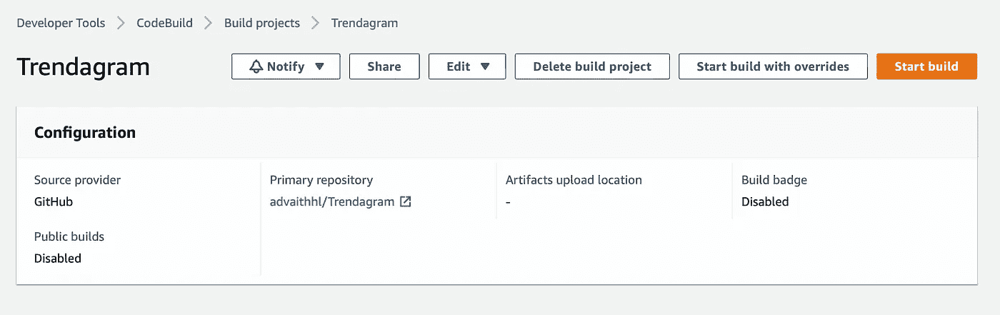
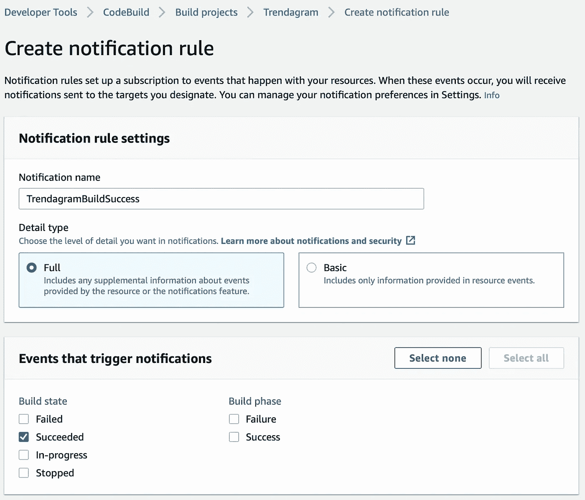
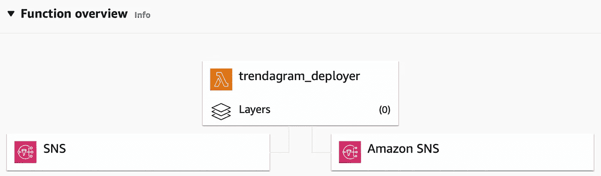

# 构建和管理 AWS Lambda 函数，该函数每小时发送 Twitter 趋势

> 原文：<https://betterprogramming.pub/building-and-managing-an-aws-lambda-function-that-sends-hourly-twitter-trends-962e55f57efa>

## 关于构建、部署和管理无服务器云功能的深入分析。

杰瑞米·贝赞格在 [Unsplash](https://unsplash.com?utm_source=medium&utm_medium=referral) 上的照片

我已经有一个推特账户很长时间了。我用它来关注我喜欢的人，获取他们的更新，并与他们要说的话保持同步。如果我使用的一些服务关闭，比如说 Reddit，我也会收到推文通知。

最近，我开始更加热衷于关注 Twitter 的趋势，这让我想到，“与其时不时地手动查看趋势，不如每小时更新一下 Twitter 的主要趋势？”。经过一番反复，我最终决定建立一个电报机器人，它每小时向我发送一条电报消息(一个我比 Twitter 更常用的平台)，其中包含 Twitter 的热门趋势。

现在，是的，我很确定有一个更简单的方法来做到这一点，如果已经有一个电报机器人做到这一点，我不会感到惊讶。但是我喜欢自己构建东西，在整篇文章中，我相信您会找到许多不同的方法来完成我在这里尝试做的事情。

正如您将看到的，我选择了一种不那么直接的方法，尤其是在为这样一个简单的项目分配基础设施时。我可以很容易地启动 AWS EC2 实例，并放入代码来获取趋势，向其发送消息，并使用 cronjob 调度运行，但我没有这样做。为什么？

我是 AWS 新手，我想探索它的各种选项。基本上，我试图建立一个机器人，以及做一点探索 AWS 的无数服务。现在我已经完成了机器人的构建，我对自己的发现非常满意。事实上，我如此高兴，以至于我想写我的第一篇关于它的媒体文章！

# 代码

首先，我需要至少有两个 API 才能工作:我使用 Twitter API v1.1 获取一个地方的趋势，使用 Telegram API 发送电报消息。我使用 Python 3.10 编写所有代码，并将 [tweepy](https://www.tweepy.org) 模块作为 Twitter API 的包装器。

我还没有为电报 API 使用包装器，因为我唯一要做的事情就是向`[sendMessage](https://core.telegram.org/bots/api#sendmessage)`方法发出 POST 请求，令人惊讶的是，这个方法用于发送电报消息。

我用我的 Twitter 开发者账户创建了一个名为`Trendagram`的 Twitter 开发者项目和一个名为`TrendagramApp`的应用程序。这相当简单，Twitter 有大量相关文档。我还为此创建了一个电报机器人，并将其命名为 TrendagramBot。这可以通过与[父亲](https://t.me/BotFather)交谈来完成。

与使用任何 API 一样，我必须保护一些敏感的细节，比如应用程序令牌、密钥等。，基本上是我不想放入版本控制的任何东西。我喜欢的方法是把所有这些东西放入命名整齐的环境变量中。

这在部署过程中特别有用，因为可以针对不同的场景(生产、开发等)轻松定义和更改环境变量。我需要三个环境变量来运行代码。它们是:

1.  `CHAT_ID`:这是我和机器人对话对应的电报聊天 ID。当我向 Telegram API 发出请求时，这是必需的，这样机器人就知道向哪个会话发送消息。
2.  `TRENDAGRAM_TELEGRAM_TOKEN`:这是唯一标识电报机器人的电报令牌。我在创建机器人时从机器人父亲那里得到了这个令牌。
3.  `TRENDAGRAM_TWITTER_BEARER_TOKEN`:这是我用来授权我对 Twitter API 的请求的 Twitter 不记名令牌。我已经使用了 [Tweepy 的 OAuth2 功能](https://docs.tweepy.org/en/stable/authentication.html#oauth-2-0-bearer-token-app-only)来初始化 API。

现在所有这些都准备好了，我准备开始编写代码向 Twitter API 发出请求。第一段代码是授权。

这里，我获得了承载令牌的环境变量的值，并使用它来初始化 API。然而，我还能做更多的事情。Python 使用了一种 [EAFP 编码风格](https://docs.python.org/3/glossary.html#term-EAFP)，所以让我们把它封装在一个 try-except 块中来记录一个错误，以防我的环境变量中没有设置无记名令牌。

我将它封装在一个函数中，如果没有抛出错误，这个函数将返回`api`。

添加另一个函数，该函数调用`get_api`函数并调用`[get_place_trends](https://docs.tweepy.org/en/stable/api.html#tweepy.API.get_place_trends)`方法来返回该位置的前 50 个趋势。位置是由一个非常过时的数字系统指定的，出于某种原因，Twitter 仍在使用这个系统，称为 [WOEID](https://en.wikipedia.org/wiki/WOEID) 。

代码将在 AWS Lambda 函数中执行，因此我创建了另一个名为`app.py`的模块，它具有 Lambda `handler`函数。

在这里，我得到了与电报相关的环境变量，如果可以，就调用上面给出的`get_trends`函数。然后，我迭代趋势，生成必须发送的消息内容。

最后，我使用 [requests](https://docs.python-requests.org/en/latest/) 库向 Telegram API 发出 POST 请求，将消息作为 TrendagramBot 发送给我与 Bot 的转换。

Lambda 函数的日志以日志流的形式通过 Lambda 的默认执行角色进入 AWS CloudWatch，在 AWS 领域，仅仅打印到标准输出被认为是可以的。

我还对应用程序文件进行了 Docker 化，这样 Lambda 函数将在 Docker 容器中运行。为此，我编写了如下 docker 文件:

AWS 为少数几种语言提供 Docker 镜像，作为你 Docker 化应用的基础，Python 就是其中之一。在 docker 文件的第一行，我从 AWS 获取了基于 Python 的 Lambdas 的最新图像。我为构建 Python 映像设置了一些推荐的环境变量，并使用 pip 在`requirements.txt`中安装包。我还将 Python 模块`trends.py`和`app.py`复制到由环境变量`LAMBDA_TASK_ROOT`描述的目录中，该环境变量是由 AWS 提供的基础映像中的[定义的。](https://docs.aws.amazon.com/lambda/latest/dg/configuration-envvars.html#configuration-envvars-runtime)

当容器运行时，被调用的函数是`app.py`中的处理函数，这在 Dockerfile 文件的最后一行提到。

现在，我可以轻松地部署这个应用程序，而根本不用 Dockerizing，因为 Lambda 本身就支持 Python 语言，但是我故意让 Lambda 函数作为 Docker 容器运行。这不是必须的，但老实说，我这么做只是为了学习一两件关于运行 Lambda 容器的事情。

如果您正在按照本文的思路做一些事情，您可以创建一个 Lambda 函数，选择 Python 语言，使用这段代码，然后就到此为止。但是，这有什么意思呢？😉

# 基础设施

在这一点上，我有了可以作为 Lambda 容器运行的功能代码(实际上，我可以运行带有作为`None`的`event`和`context`参数的`app.handler`函数，代码的行为与 Lamba 触发器相同)。所有代码都可以在 [GitHub](https://github.com/advaithhl/Trendagram) 上获得，git 是版本控制的选择，GitHub 是远程存储库主机的选择。

# 摘要

主要思想是让 AWS 构建代码，或者更具体地说，在每次推送 GitHub 时构建 Docker 映像。这个构建的图像是我的 Lambda 函数的基础。一旦这个 Lambda 函数使用基于最新代码构建的映像进行了更新，就应该每小时使用一次 cronjob 来触发它。就是这样！不完全是。让我们详细看看每个步骤。

# 构建代码

为了构建代码，我使用 AWS CodeBuild 和作为 GitHub 的源代码提供者，并将所有其他选项保留为默认选项。这样，每次推送 GitHub 存储库时，都会自动触发 AWS CodeBuild 作业。但是 AWS 如何知道如何构建代码呢？默认情况下，CodeBuild 会查找一个`buildspec.yml`文件，并根据那里提供的配置编译代码。

AWS [为](https://docs.aws.amazon.com/codebuild/latest/userguide/sample-docker.html#sample-docker-files)提供一个整洁的`buildspec.yml`文件来构建 docker 映像，并将构建好的代码推送到 AWS 弹性容器注册表(ECR)中，标签为`latest`。

已经创建了 CodeBuild 项目，用于构建映像并将其推送到 ECR。

除此之外，我还创建了一个发送 SNS 通知的通知规则。这可以通过点击“通知”>“创建通知规则”，并填写表格来完成。

成功完成构建时会触发此通知。

我创建了一个新的 SNS 主题来推送通知。这可以通过到目标，点击“创建目标”按钮，选择“SNS 话题”，并选择一个名称(我命名为我的`codestar-notifications-trendagram-codebuildsuccess`)来完成。是的，我知道，这个名字很乏味)。

默认情况下，这个主题没有订阅者(消息不会被任何服务监听)，但是我马上会谈到这一点。

到目前为止，我已经有了构建代码并将其推送到 AWS ECR 的基础设施。让我们从那开始更进一步。

## Lambda 部署者

在摘要部分，我已经提到一旦 Lambda 函数“用最新代码构建的映像更新”，我就可以每小时触发它。为了更新 Lambda 函数，我需要另一个 Lambda 函数，从现在开始我将把它称为“部署者”，原生运行在 Python 上。

此时，您可能想知道为什么我需要一个部署者函数来更新这个函数。这是因为据我所知，如果代码后端基于容器映像，AWS Lambda 函数不会自动更新它们的代码后端。

deployer 函数使用 AWS Python SDK 的`update_function_code` [方法](https://boto3.amazonaws.com/v1/documentation/api/latest/reference/services/lambda.html#Lambda.Client.update_function_code)([boto 3](https://aws.amazon.com/sdk-for-python/))，将容器的基础映像更新为最近构建并由 CodeBuild 推送到 ECR 的映像。一旦我有了正确的环境变量，这就很容易完成了(正如我们之前看到的，这只是为了确保敏感内容远离代码，而不是将配置与逻辑混淆)。

一旦被触发，`lambda_handler`将被调用，并且`update_function_code`所需的参数将从环境变量中加载。

`FUNCTION_NAME`对应于我想要更新的函数的函数 [ARN](https://docs.aws.amazon.com/general/latest/gr/aws-arns-and-namespaces.html) (在本例中是 Trendagram 函数)。`IMAGE_URI`对应 ECR 图像(最近建立的图像)的 ARN，`PUBLISH`对应环境变量`PUBLISH_ON_DONE`的值。这个变量可以是`True`或`False`，这取决于我是否想立即发布`FUNCTION_NAME`。

我给了它一个回退值`True`。一旦完成，就会调用实际的函数来更新代码，并将响应打印到标准输出中。

我已经为部署器添加了一个触发器，这样在来自`codestar-notifications-trendagram-codebuildsuccess`的每条消息上(再次，抱歉用了这个名字)，部署器都会运行。这很好，因为只有在代码成功构建后，消息才会通过这个 SNS 主题(这正是我想要部署 Trendagram 的时候)。

我还创建了另一个名为`trendagram_codedeploysuccess`的 SNS 主题，并将其设置为部署者的“目的地”。这将在每次成功运行 deployer 函数时通过 SNS 主题推送一条消息。

在 SNS 主题页面中，我添加了一个订阅，协议为`EMAIL`，端点为我的电子邮件 ID，这样我就可以在每次成功部署时收到一封电子邮件。这封邮件确实有点“难看”，因为它是直接来自 SNS 主题的原始 JSON，但我认为这没什么，因为我真的只需要确认到目前为止一切顺利。

部署者功能同`codebuildsuccess as the trigger and codedeploysuccess as the destination.`

## 趋势图触发器

此时，正在运行的 Trendagram 函数基于最新的代码。但是我还没有给它添加任何触发器。就像我之前说的，我需要每小时跑一次。为此，我使用 AWS EventBridge(以前的 CloudWatch Events)通过在“Schedule expression”字段中提供一个 cron 表达式来触发该函数。AWS 在这里提供了进度表达式格式[的详细信息。所有 cron 表达式都用 UTC 计算。](https://docs.aws.amazon.com/AmazonCloudWatch/latest/events/ScheduledEvents.html)

我将我的时区转换为 UTC，并发现我需要该函数在 UTC 的 3:30 到 15:30 之间每小时触发一次，因为当我居住的地方是晚上时，我不需要通知。对应的 cron 表达式竟然是`30 3-15 * * ? *`。这样，AWS EventBridge 将按照我定义的 cron 表达式触发 Trendagram 函数。

# 结论

在这篇文章中，我描述了如何使用服务组合来获取最新的 Twitter 趋势，并通过 Telegram 发送给我。我用 git 做版本控制，用 GitHub 存储代码，用 AWS CodeBuild 构建代码，用 AWS Elastic Container Registry 将构建好的代码存储为 Docker 映像，用 AWS Cloudwatch 记录一切，用 AWS Lambda 将构建好的代码部署并运行为 Docker 容器。

该代码支持主要的 Lambda 函数，该函数使用 Twitter API 获取趋势，并使用 Telegram bot API 发送趋势。按照给定的 cron 表达式，主 Lambda 函数由 AWS EventBridge 触发。

我还可以做更多的事情来进一步扩展这一点。我可以使用[三脚 OAuth](https://docs.tweepy.org/en/stable/authentication.html#legged-oauth) 来验证其他用户，也许可以得到他们的个性化趋势，而不是位置趋势。我可以通过其他平台发送趋势，比如[电子邮件](https://docs.python.org/3/library/email.html)。我可以添加一个 [AWS API Gateway](https://docs.aws.amazon.com/apigateway/index.html) 触发器，或者利用 Lambda 最新的[函数 URL](https://docs.aws.amazon.com/lambda/latest/dg/lambda-urls.html) 特性，作为随时显式触发 Trendagram 的方式。

归根结底，可能性几乎是无穷无尽的，我很高兴这些技术的存在，而且经常是免费的！

你怎么想呢?请在评论区告诉我你对此和整篇文章的想法。感谢你阅读我的文章，我希望你有一个伟大的一天！