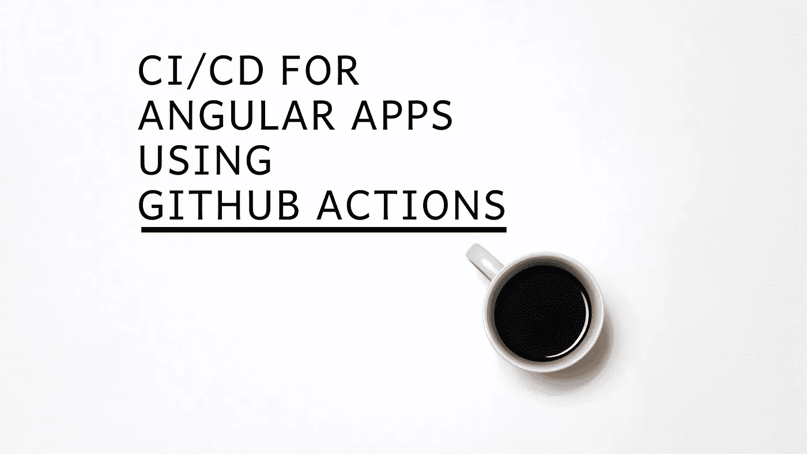
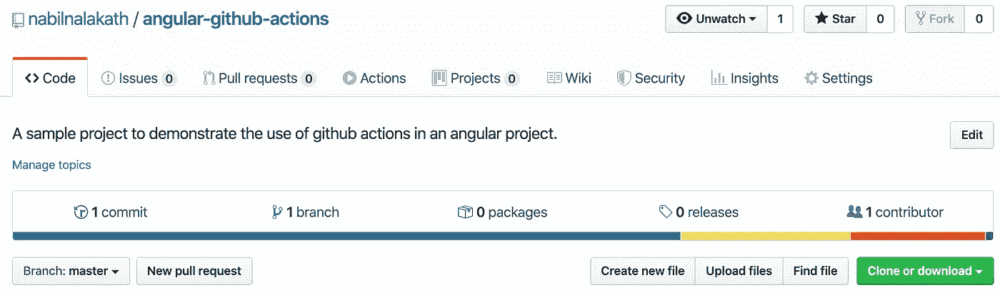
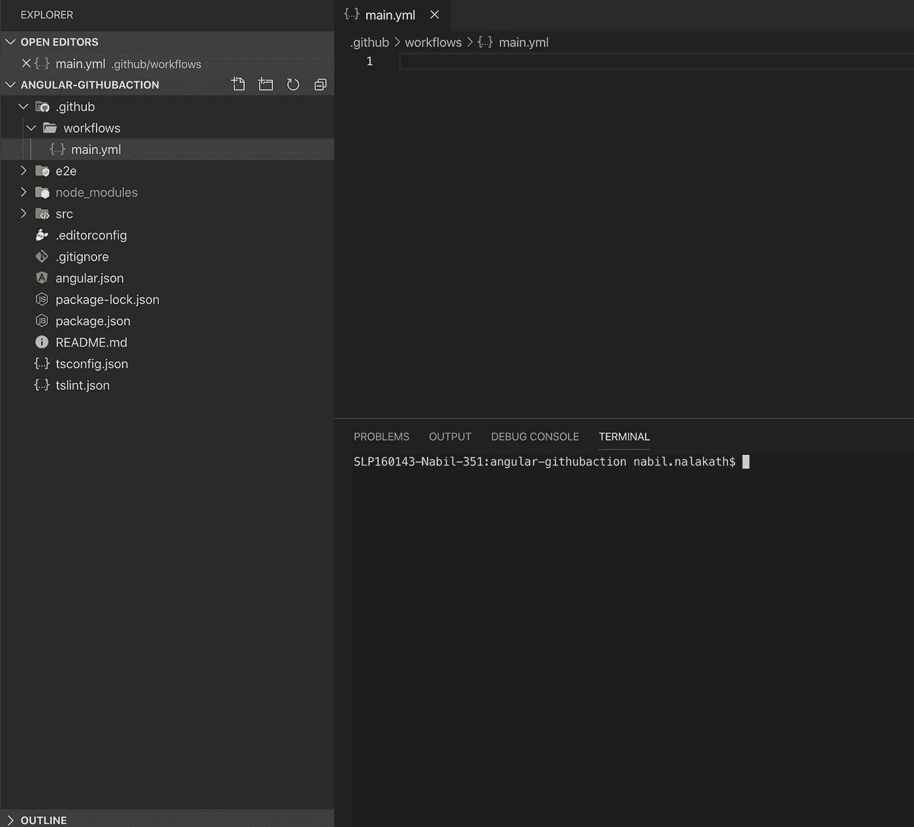
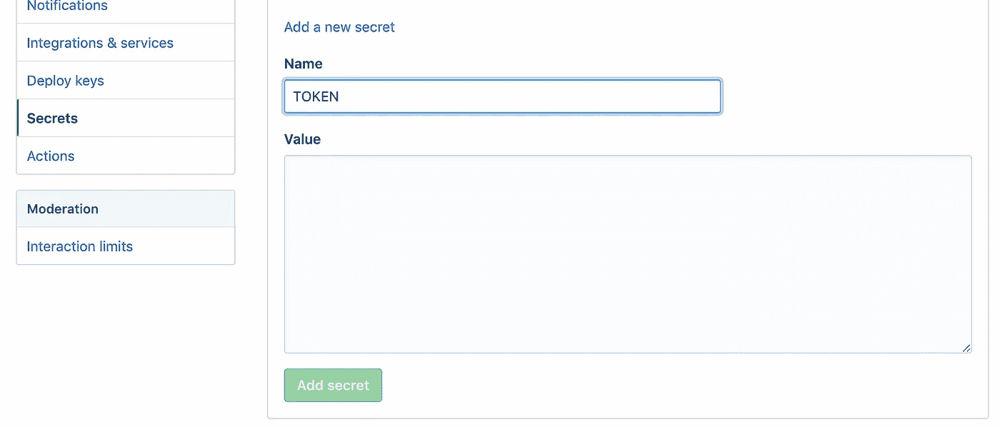
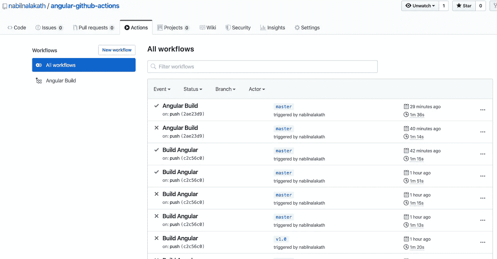
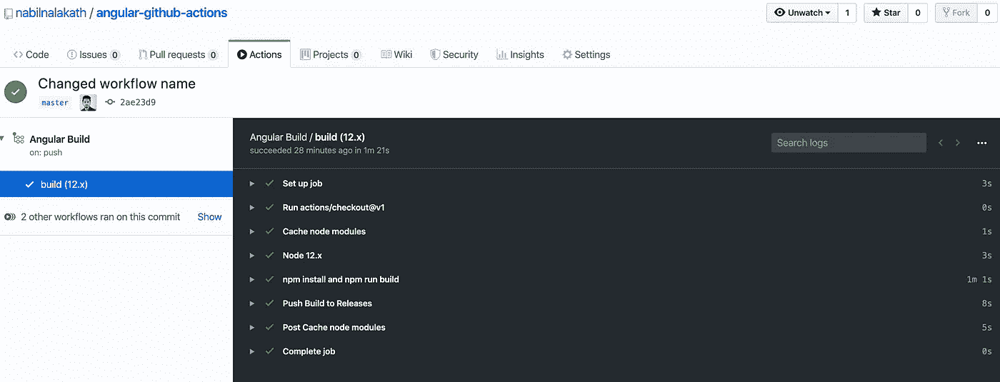
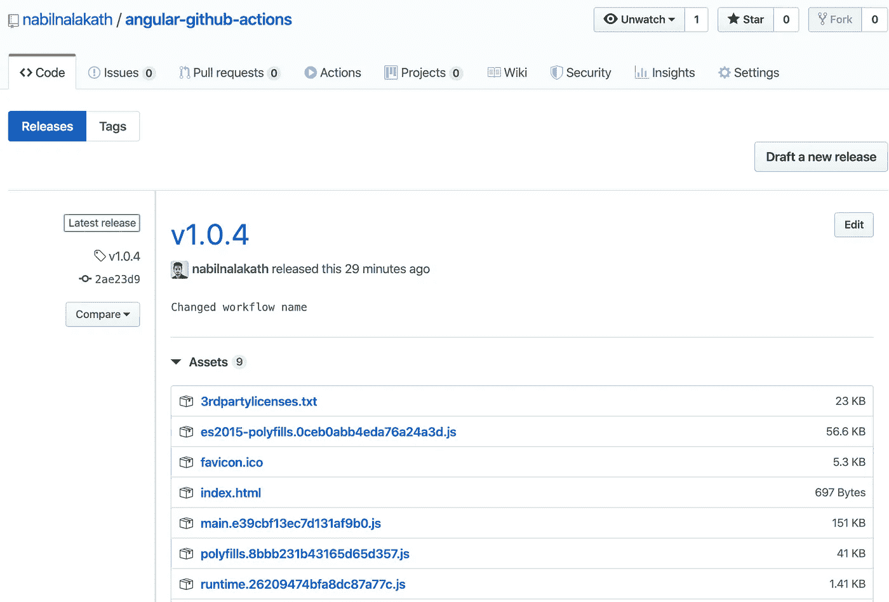

# 使用 GitHub 动作构建 Angular 应用

> 原文：<https://betterprogramming.pub/building-angular-apps-using-github-actions-bf916b56ed0c>

## 使用 GitHub 操作为 Angular 应用程序配置 CI/CD 工作流

背景图像—无飞溅

[GitHub Actions](https://github.com/features/actions) 是为 GitHub 上的项目添加 CI/CD 工作流的自动化工具。它目前面向公众开放，并完全免费用于开源项目。

在本文中，我们将讨论在 Angular 项目中集成 CI/CD 工作流的各个步骤。在 Angular 项目中，我们将关注 GitHub 动作配置。创建 Angular 应用程序的基础及其工作原理不在本文讨论范围之内。

让我们一步一步来。

# 1.创建 GitHub 项目

显而易见的第一步是创建一个 GitHub 项目，并将您的 Angular 项目与存储库连接起来。

如果您已经成功地完成了 Actions beta 的注册过程，您应该能够看到您的项目的一个新的“Actions”**选项卡，就在“pull requests”的旁边**

****

**存储库中的“操作”选项卡。**

# **2.添加工作流文件**

**GitHub 为许多最流行的平台提供了预定义的工作流。您还可以在可视化编辑器中自定义或创建新的。**

**但是在这个项目中，我们将采用手工的方法，用工作流命令创建一个 YAML 文件。**

**在 angular 项目的根文件夹中，创建一个新文件夹`.github,`，并创建一个子文件夹`workflows`。这是我们的工作流 YAML 文件将驻留的地方。**

**一个项目可以有多个工作流文件，比如构建、发布等等，但是为了简单起见，我们将只为这个项目使用一个文件。在工作流文件夹中创建一个名为`main.yml`的最终文件。**

****

**创建 GitHub 文件夹并添加工作流文件**

# **3.编写命令**

**我们定义的第一件事是我们希望触发工作流的事件。这可以是任何 GitHub 事件，如`push`、`pull_request`、`create`等，根据您的需求而定。**

**在这个项目中，我们将使用 push 事件。我们还可以向工作流添加一个名称来标识它。这里是`main.yml`的完整代码。为了更好地理解，我们将浏览每一行及其用法。**

**main.yml**

*   **`line 1`:当有人将代码推送到我们的 repo 时，我们希望触发我们的工作流。**
*   **`lines 3–8`:我们正在定义一个在`ubuntu-latest`上运行的作业`Build Angular`。每个作业都在虚拟环境的一个新实例中运行。一个作业可以包含一个或多个`steps`。我们还定义了我们想要运行的`NodeJS`版本。**
*   **这是我们工作流程的第一步。我们将使用一个名为`[checkout](https://github.com/actions/checkout)` *的 GitHub 动作从我们的库中提取源代码。*此操作将您的存储库签出到`$GITHUB_WORKSPACE`，以便您的工作流可以访问存储库的内容。**
*   **`lines 13–19`:由于我们需要在构建 app 之前安装项目所需的 npm 包，所以我们使用一个名为`[cache](https://github.com/marketplace/actions/cache)`的 GitHub 动作来缓存节点模块。我们配置这个步骤来跟踪我们的`package-lock.json`对 npm 包的任何更改，如果没有机会，我们就使用缓存中的模块。这将有助于我们加快构建过程。**
*   **`lines 20–23`:这里我们使用 GitHub action[setup-Node](https://github.com/marketplace/actions/setup-node-js-for-use-with-actions)，其中设置一个节点环境用于 actions。我们使用定义操作系统时设置的节点版本的引用。**
*   **`lines 24–27`:在这一步，我们运行`npm i`来安装所需的包，然后运行 Angular build 命令来创建构建包。在这个例子中，我使用了`npm run build:prod`,因为这是我在 package.json 中定义的构建命令。**

***在上述步骤中，您可以添加您在* `*package.json*` *中定义的任何命令。例如，您可以定义一个命令，该命令首先运行测试用例，然后创建构建。这完全取决于您的项目范围和需求。***

*   **`lines 28–32`:使用一个 GitHub 动作[*Create Release*](https://github.com/marketplace/actions/create-release)*将构建文件推送到存储库的 Release 部分。* 这里，我们在构建和指定`*`之后，指定构建文件存放的路径，以确保所有的构建文件都被推送到发布。**
*   **`secrets.TOKEN` 是一个 API 令牌，授予对存储库的访问权。在下一步中，我们将创建一个并将其添加到我们的项目中。**

# **4.添加 GitHub 令牌**

**我们大多数人都会在某个时候创建一个 GitHub 令牌来访问存储库。如果你还没有，这个过程非常简单明了。**

*   **进入 GitHub 设置中的[个人访问令牌](https://github.com/settings/tokens)部分。**
*   **生成一个可以访问存储库的新令牌，并复制其值。**
*   **在`<repo url>/settings/secrets`转到项目的存储库设置。在“*Secrets”*选项卡中，从您的工作流文件(本项目中为`TOKEN`)中添加一个具有相同令牌名称的新密码，并粘贴令牌值。**

****

**在存储库设置中添加新令牌。**

# **5.用标签推送代码**

**一旦我们创建了工作流文件并将令牌添加到项目中，我们就可以使用 release 标签将代码推送到 GitHub 并触发工作流。**

**在您的本地项目中，提交所有文件，包括`main.yml` 和使用`git tag`命令添加一个新的标签，并将代码与标签一起推送。**

**示例:**

**`git tag v1.0`**

**`git push origin v1.0`**

# **在 GitHub 中查看工作流和发布**

**一旦你推送了代码，你就可以通过`<repo URL>/actions`看到工作流程，通过`<repo URL>/releases`看到发布文件。**

****

**触发的工作流历史记录**

****

**为推送事件执行的工作流命令**

****

**在存储库的发布部分构建文件**

**就是这样。你可以在 [GitHub](https://github.com/nabilnalakath/angular-github-actions/) **上找到该项目的完整源代码。**如果您有任何问题，请发表在评论区**。****