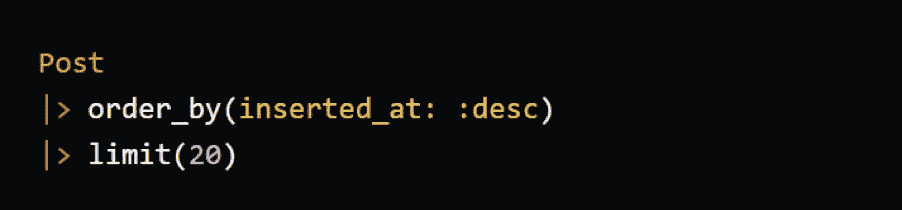
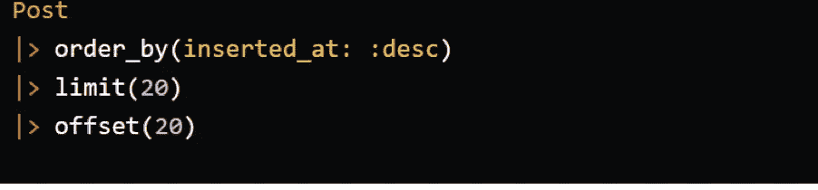
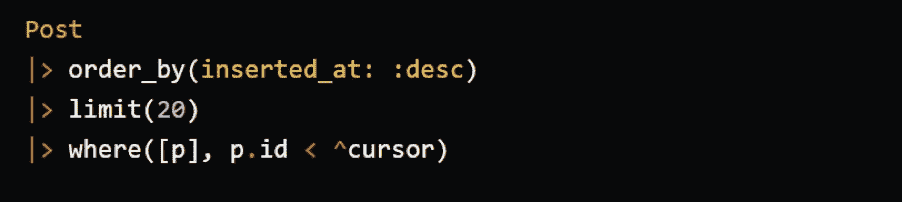

# 构建 API:游标分页和偏移分页的比较

> 原文：<https://betterprogramming.pub/building-apis-a-comparison-between-cursor-and-offset-pagination-88261e3885f8>

## 哪个对你的 API 最有意义？

[现场检查员](https://sitechecker.pro/)。

# 分页概述

当您有一个庞大的数据库需要发送给用户，并且您决定分块发送而不是一次性发送整个数据库时，分页就开始发挥作用了。几乎所有每天访问的站点都使用分页的概念。

在深入研究分页之前，您必须了解两种不同类型的分页。

## 基于光标的分页

光标被认为是这种分页类型中的一个关键参数。客户端收到一个名为`Cursor`的变量和响应。它是一个指针，指向需要随请求一起发送的特定项目。然后，服务器使用光标搜索另一组项目。基于光标的分页更复杂，在处理实时数据集时更受欢迎。

## 基于偏移量的分页

基于偏移量的分页是一种非常著名的技术，其中客户端请求具有特定限制(结果的数量)和偏移量(需要跳过的记录的数量)的参数。基于偏移量的分页易于使用，是静态数据的首选。

# 利弊

基于光标的分页被认为是最有效的分页方法之一，必须尽可能地集成。

与偏移分页相比，基于光标的分页的优点是:

*   不会跳过任何数据。游标分页不是发送一个行为类似于索引的偏移量参数，而是发送一个行为类似于指向数据库中特定记录的指针的游标参数，以显示最后一页离开的位置。
*   出色的实时数据能力。游标分页最显著的优点之一是它能够非常高效地管理实时数据。这背后的主要原因是游标不需要静态数据。因此，可以轻松地删除或添加新的行或项目，而不会影响每个页面的加载过程。随着时间的推移，实时应用程序越来越多，基于光标的分页越来越流行。但是，偏移分页需要静态数据。如果不是这种情况，那么要么该项被返回两次，要么被完全跳过。
*   大型数据集的有效管理。为了更好地理解这一点，首先必须了解偏移。偏移量是数据库在选择记录之前必须跳过的记录数。这意味着它不仅返回所请求的下一个数据集，还会扫描出现在它之前的所有其他数据。当偏移量增加时，这是一个重大问题。因此，假设页面中有一些小故障，页面需要大量的时间来加载和离开页面。

凡事都有利弊。基于光标的分页有其自身的缺点。与基于偏移量的分页相比，基于光标的分页的缺点是:

*   有限的排序功能。假设我们有一个基于名字和姓氏对用户表进行排序的任务。这可能成为游标的一个问题，因为游标需要实现唯一的顺序列来排序。大多数游标实现都基于时间戳列。因此，如果需要排序，那么游标不是最佳选择。人们可以尝试不同的技术来达到同样的效果，但这会减慢这一过程，甚至比胶印还慢。
*   游标的实现被认为有点棘手。游标实现起来可能并不困难，但是偏移量通常很容易实现。因此，如果希望快速实现分页，那么选择 offset 是正确的。如果数据是静态的，这尤其有益。因此，必要时可以避免并发症。
*   无限卷轴让人上瘾。当然，这主要不是一个游标问题，因为后端使用的偏移分页甚至可以实现无限滚动。然而，cursor 在实时应用程序中的广泛使用使其使用更加方便。无限滚动被认为是方便用户一次查看大量数据的用户界面。然而，这剥夺了用户浏览下一页的意识和决定能力，导致了非常上瘾的体验。

# 偏移实现

在为偏移量分页检索数据时，查询中通常需要两个参数:limit 和 offset。当数据库项目增加时，速度会变慢。发生这种情况是因为仍然需要读取数据库直到偏移的行数，以确定需要从哪里开始选择数据。

它通常具有最坏情况的复杂度 *o(n)* 。此外，这些大型数据库通常不是静态的，这将需要频繁的写入。在不同的页面上，生成的窗口通常会不准确。如果需要从数据库中获取最新帖子的第一页，必须使用以下查询:

为了知道第二页的结果，我们可以包括的偏移量是:

然而，当数据集增加时，这个过程变得很长。

# 光标实现

如上所述，游标分页是指向特定记录的唯一指针。在游标的帮助下，人们不再需要在`WHERE`子句的帮助下读取已经看到的所有行。因此，这使得它的复杂性 *o(1)* 。

不准确结果的问题是在读取特定行之后处理的，而不是依赖于记录是相同的这一事实。已知自由列表表示在给定权限中插入数据结构。从给定空闲列表中删除的单元恰好是最近由于“空闲”而被放在那里的单元因此，被放入空闲列表的最后一个单元被认为是被取下的第一个单元。给定的数据结构具有给定的属性(称为堆栈)。

借助以下使用游标分页的查询，可以实现相同的示例:

要使用游标，除了用于结果集中最后一项的游标之外，还需要从第一页返回结果。这是游标在结果集中向前移动的合理用法。但是，如果提取方向改变，检索记录的复杂性就会增加。

# 结论

实时应用程序中使用最广泛的分页是游标分页。这主要是因为向数据库中添加新记录的频率增加了。总是推荐使用光标方法，因为它消除了重复的项目，并且不会跳过任何项目。指针跟踪数据的位置以及下一步需要获取的项目。在不同的情况下，游标和偏移量各有优势。使用主要取决于被处理的数据。

但是，当查询静态数据时，性能成本可能不值得使用游标，因为在这种情况下复杂性会增加。很明显，与偏移分页相比，基于光标的分页是更好的选择。然而，选择正确方法的决定完全取决于用例以及分页对产品的影响。