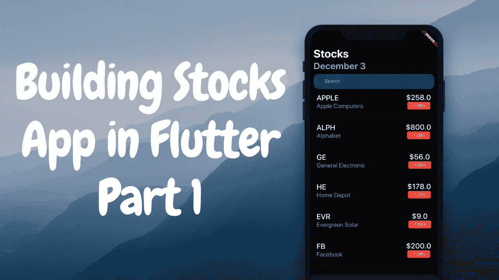
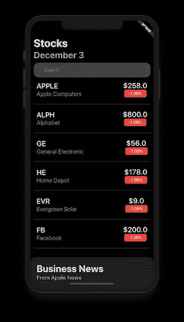
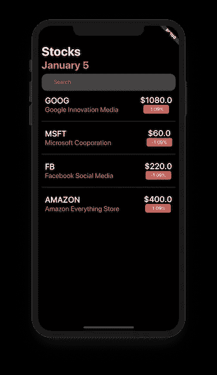
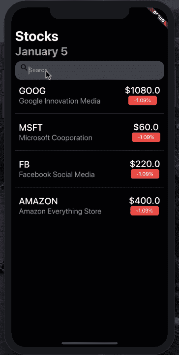

# 使用 Flutter 构建苹果股票应用程序(第 1 部分)

> 原文：<https://betterprogramming.pub/building-apple-stocks-app-using-flutter-part-1-ea1c7477d58d>

## 跨平台股票报价



在 SwiftUI 上最近的[帖子](https://medium.com/better-programming/building-apple-stocks-app-using-swiftui-part-1-296169ff4257)中，我们学习了如何在 SwiftUI 框架中创建苹果股票应用。

由于 [Flutter](https://flutter.dev/) 和 SwiftUI 有很多相似之处，我们认为使用 Flutter 框架实现同一个应用是个好主意。

在这篇由多个部分组成的文章中，我们将学习如何创建向用户显示股票的主页。

在以后的文章中，我们将介绍如何为 Flutter stocks 应用程序实现新闻列表页面。看一下完成的 app 的截图。



# 服务器之旅

我们的服务器使用 Express.js 包在 Node 中实现，并以 JSON 的形式返回硬编码的股票。服务器的完整实现如下所示:

没什么花哨的！

# 从 JSON Web API 获取股票

让我们从实现一个从 JSON API 获取数据的客户机开始。客户端将有一个单一的方法来获得所有的股票，并返回一个未来的响应。

我们使用 [HTTP](https://pub.dev/packages/http) 包来执行网络请求，但是非常欢迎您使用任何其他的 HTTP 库。web 服务的实现如下所示:

web 服务从我们的定制服务器获取股票，然后填充股票模型，该模型稍后作为`Future<List<Stock>>`返回给调用者。

股票模型实现如下:

`fromJson`工厂方法接受一个`Map`对象，然后基于 JSON 数据返回一个新的`Stock`实例。

接下来，我们需要在页面上显示股票数据。在我们进入用户界面实现之前，我们需要实现视图模型，它可以保存数据并向视图提供数据。

# 实现视图模型

视图模型负责携带数据，然后将数据绑定到视图。视图模型可以代表整个页面，甚至包含指向页面目标部分的子视图模型。

视图模型的实现如下所示:

`StockListViewModel`代表整个页面，`StockViewModel`代表将在列表中显示的单个股票单元格。

`fetchStocks`方法负责使用`Webservice`实例并检索所有股票。

获取股票后，结果被转换成一个由`StockViewModel`对象组成的数组，并赋给`StockListViewModel`的`stocks`属性。

`StockListViewModel`还扩展了`ChangeNotifier`类，使其能够通知监听器。一旦触发了`notifyListeners`方法，所有的侦听器都会得到通知，它们可以采取行动。

对于我们的例子，我们希望更新视图，以便它可以显示最新的股票。

为了从变更通知程序获得变更通知，您必须使用`ChangeNotifierProvider`。`ChangeNotifierProvider`是提供商包的一部分。更新`pubspec.yaml`以添加提供者包。

```
dependencies:flutter:sdk: flutter# The following adds the Cupertino Icons font to your application.# Use with the CupertinoIcons class for iOS style icons.cupertino_icons: ^0.1.2http: ^0.12.0+4provider: ^4.0.1
```

接下来，让我们看看如何将`StockListViewModel`实例传递给视图。

# 在视图中显示股票

为了显示股票，我们必须访问视图中的`StockListViewModel`。我们可以使用`ChangeNotifierProvider`来访问视图模型。

我们将把`StockListViewModel`的实例注入到我们的主页部件中。这在如下所示的`main.dart`文件中实现:

上面的代码确保了`StockListViewModel`实例对`HomePage`及其所有子部件可用。

在`HomePage`小部件中，我们使用`Provider.of<StockListViewModel>`来获取`StockListViewModel`的实例，然后我们在视图模型上调用`fetchStocks`函数。

`fetchStocks`将从 Web API 中检索股票，并填充`StockListViewModel`的`stocks`属性。

一旦设置了`stocks`属性，我们就调用`notifyListeners`方法，该方法使用`Consumer`小部件刷新视图。

小部件负责显示股票列表。`StockList`小部件接受一个参数，即股票列表。

如果你想了解更多关于 Flutter 应用中的数据流，那么看看[这篇](https://medium.com/better-programming/data-flow-and-delegation-in-flutter-apps-1a6fedce90ef)文章。`StockList`小部件的实现如下所示:

如果你运行这个应用程序，你将能够看到股票应用程序的运行。



# 搜索股票

目前，在文本字段中键入不做任何事情。我们需要根据用户的输入来过滤股票。搜索功能在`StockListViewModel`中实现，如下所示:

在搜索方法中，我们使用 *where* 特性根据用户输入过滤出股票。



就是这样！

# 结论

我真的希望你喜欢这篇文章。在第二部分中，我将介绍如何显示来自实时 Web API 的新闻，并添加拖拽手势来滑动/向下移动新闻视图。

# 资源

1.  [GitHub](https://github.com/azamsharp/AppleStocksFlutter)
2.  [在颤振视频中构建苹果股票](https://youtu.be/Gz3IEFe5PIw)