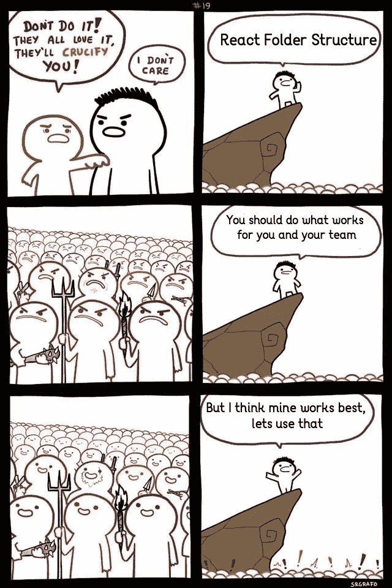
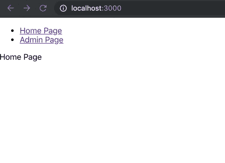
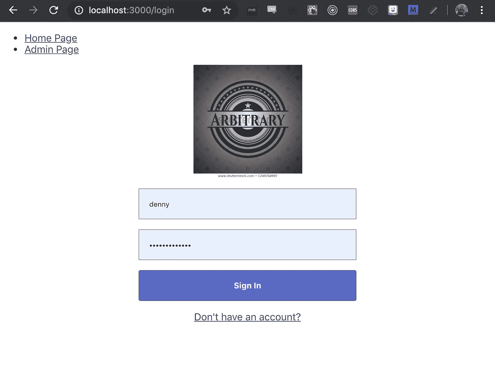

# 构建基本的反应认证

> 原文：<https://betterprogramming.pub/building-basic-react-authentication-e20a574d5e71>

## 在 react 路由器中使用钩子和上下文

Artem Sapegin 在 [Unsplash](https://unsplash.com/search/photos/react?utm_source=unsplash&utm_medium=referral&utm_content=creditCopyText) 上拍摄的照片

我一直在做一些建设应用程序的合同工作，当开始时，我有一个“绿地”的特权。我选择了一些常见的嫌疑人，[反应](https://reactjs.org/)(当然是用钩子！)、[风格化-组件](https://www.styled-components.com/)、[反应式-路由器](https://reacttraining.com/react-router/web/guides/quick-start)等。但是在开发它的过程中，我遇到了一个问题集——一个我每次都会遇到的问题:创建一个基本的身份验证系统。

老实说，我真的没有一个*标准的*方法来在 React 应用程序中进行身份验证。回顾我以前的工作，关于我如何处理令牌、组件和身份验证路由，这似乎是一个相当混杂的问题。因此，我选择了一种我最喜欢的管理身份验证的方法，对其进行了一点改进，并将使用 react-router 将其作为基本身份验证系统的基础。

注意:在我使用它之前，这个认证缺少了许多需要添加的部分，请查看结束注释以获得一些想法。但是这些都是开始的良好开端！

# 该认证系统的目标

*   **私人和公共路线**:这个应用程序将有基本的“登陆”页面，任何用户都可以访问。除此之外，注册和登录应该是声明性的公共途径。另一方面，将会有许多需要验证才能查看的页面。
*   **重定向至登录**:如果用户没有令牌，或者令牌刷新不起作用，当用户试图查看私有路由时，将自动重定向至登录页面。
*   **重定向到 referrer** :如果用户想要查看特定页面，但没有有效的令牌，他们将被重定向到登录页面。我们希望确保在登录后，他们被发送到他们最初想要的页面。默认为仪表板。
*   **认证令牌**:我们将使用令牌来读写认证。这些应该存储在本地存储，以便用户可以保持登录，如果他们离开网站。
*   **用户界面直观明了**:这真的不是什么用户界面方面的“考试”，但我认为我们的登录和注册页面必须简单，并遵循 Brad Frost [在这里](http://bradfrost.com/blog/post/dont-get-clever-with-login-forms/)列出的注意事项。

我们将尝试按顺序解决这些问题，以确保我们不会用太多的代码使流程过载。最好重构代码并理解整个过程，而不是从一开始就期望所有这些都能工作。我们在这里不会使用[Redux](https://redux.js.org/)——相反，我们将在 react 上下文中存储我们需要的数据，以保持简单。在引擎盖下，Redux 会做一些类似的事情，但该应用程序的大小还不足以保证目前使用 Redux。

让我们开始吧！

# 项目初始化

让我们用我们的基础项目做一些基础工作。这将在你自己的项目中，但是让我们假设我们是从零开始——只是为了更容易理解。如果您想继续，请查看 github 上的[完整代码——我们正在使用](https://github.com/DennyScott/react-router-auth) [Create React App](https://github.com/facebook/create-react-app) 设置基础项目，如下所示:

我不会在这个项目中为我的文件建立任何永久的架构。每个人都有自己的文件夹/文件架构风格，所以我想尽可能保持不可知论，以便人们遵循。

或者，也许我正试图避免引发人们不使用我的架构！

我们的下一步将是安装我们需要的软件包。我们正在安装[反应路由器](https://reacttraining.com/react-router/web/guides/quick-start)和[样式组件](https://www.styled-components.com/)和[轴](https://github.com/axios/axios)。

很好，现在让我们设置反应路由器。我们将修改我们的`App.js`组件，增加一些基本路线。现在，让我们添加一个公共的`Home`页面和一个公共的`Admin`页面。别担心，我们很快就会把它改成私人的。

请注意，我们将导入两个尚未创建的文件。我只是想让我们在进入我们正在制作的页面的细节之前看看路由器。

## **src/App.js**

我们现在还将为主页和管理页面创建这两个组件。让我们在`src`目录中创建一个名为`pages.`的新文件夹。我们将在这个目录中创建两个新页面。不出所料，它们将被命名为`Home.js`和`Admin.js.`，不过你不需要导入它们，因为我们已经在上面做了。

## **src/pages/Home.js**

## **src/pages/Admin.js**

这应该可以建立项目的初始结构。从这里，我们可以开始添加我们的认证系统的各个部分。一定要给它一个测试运行与`npm start.`你应该能够在页面之间导航，只有主页或管理页面应该显示。

# 等等，我们现在做了什么？

在我们继续之前，让我们确保对 spa 和 react-router 有一个基本的了解。如果您以前使用过路由器和 spa，欢迎您跳过这一部分！

Create-React-App 是一个非常棒的项目，可以处理大量创建新 React 应用程序的繁重工作。在幕后，有许多不同的部分需要放在一起，特别是模块捆绑。这是一个不同的话题，但对我们来说，它让我们只关注应用程序本身，而不必担心配置。

现在，我们有几种不同的方式向用户展示网页。传统上，网页是从 web 服务器提供给用户的。用户将访问一个类似于`[http://www.dennyssweetwebsite.com/hello](http://www.dennyssweetwebsite.com/hello,`)`的 URL，托管我的网站的服务器将收到请求，找出他们正在寻找的页面(在本例中为`hello`)，并返回用户`hello.html`，这是一个驻留在服务器上的 HTML 文件。

随着 web 变得越来越复杂，这些调用将解析到服务器应用程序，运行在类似于`PHP`的东西上，为用户生成 HTML 页面并返回数据。这里需要注意的关键一点是，用户指定的 URL 与 web 服务器上的路由直接相关。因此，生成和返回内容是一个实际的网络地址。

另一方面，Create React App 搭建了一个客户端[单页面应用(或 **SPA** )](https://en.wikipedia.org/wiki/Single-page_application) 。单页应用程序是完全驻留在用户浏览器上的 web 应用程序。当用户请求`www.dennyssweetwebsite.com`时，他们会收到我的整个应用程序。从那以后，我们实际上甚至不需要 URL。用户可以查看的内容可以直接由状态处理，而无需更改 URL。

问题是浏览器和用户仍然高度依赖 URL。浏览器允许你在历史中来回移动，给特定的页面做书签，等等。用户可能会标记特定的页面，并希望直接跳转到那里。他们甚至可以记住网址。同样，公平地说，URL 是分离我们内容的一个很好的方式，特别是当涉及到像基于路径的[延迟加载](https://reactjs.org/docs/code-splitting.html)这样的事情时。就此而言，许多单页面应用程序仍然使用路由系统来分割它们的内容。这只是读取给定的 URL，而不是将更改传递给服务器，而是显示给定 URL 的组件。基于路线渲染组件正是我们在上面的`App.js`中所做的。

好了，历史课结束了，让我们开始建造一些私人路线。

# 私人和公共路线

我们要设置的第一件事是一个新的路由组件，我们称之为`PrivateRoute`。这个装饰器将被任何需要在认证之后的路由使用。很简单，让我们在“src”目录下创建一个名为`PrivateRoute.js.`的新文件

## **src/PrivateRoute.js**

您会注意到我们还没有添加任何身份验证逻辑。我们只是呈现传入的路由，就像公共路由一样。不过，我们对 API 做了一些小改动。我们在这里使用[渲染道具](https://reactjs.org/docs/render-props.html)样式来代替路线。稍后当我们添加认证逻辑时，这将更有意义——现在，假设它与使用公共路线的`Component`道具做同样的事情。

现在，如果你看看渲染道具，很明显我们应该在里面有一些认证。但是我们还没有完全建立起来。我们没有使用 Redux，但我们可能希望在整个应用程序中使用认证数据。为了避免道具钻取，我们将使用[上下文 API](https://reactjs.org/docs/context.html) 。我们将有另一个关于上下文 API 范围的博客条目，但是现在让我们假设我们放入其中的数据可以在 react 树中的任何地方删除。在幕后，这就是 Redux 所使用的。

首先，我们要创建一个新的环境。我在 src 目录中创建了一个名为`context`的文件夹。在其中，我将创建一个名为`auth.js.`的新文件

## **src/context/auth.js**

这里我们创建了下一个上下文，以及一个[钩子](https://reactjs.org/docs/hooks-intro.html)来使用这个上下文，这个钩子叫做`useAuth.`,我们稍后再来讨论。到目前为止，还没有完成任何逻辑—它将提取在 AuthContext 中找到的任何数据。为了使用我们的新上下文，我们需要添加一个提供者来作出反应。我们将把这个提供者添加到`App.js`文件中。当我们这样做的时候，让我们改变我们的管理路径来使用新的`PrivateRoute`组件。

**src/App.js**

# 重定向到主页

我们的 PrivateRoute 在技术上是可行的，唯一真正让它“工作”的方法是让用户无法访问未经认证的页面。因此，让我们完成我们的第二个目标:如果他们目前还没有通过身份验证，将他们重定向到主页。稍后我们将把它连接到登录页面。

注意，我们正在为提供者传递值`false`。这意味着我们的`useAuth`钩子在检查身份验证时将总是返回 false 因此，所有私有路由都是不可访问的。不理想，但很适合我们现在测试！为了让这个功能正常工作，我们只需要将`useAuth`钩子添加到`PrivateRoute`组件中。

## **src/PrivateRoute.js**

在这里，我们使用钩子并提取存储在 AuthContext 中的任何值。稍后我们将使用令牌来更新这个值。目前，它被设置为 false。这意味着`isAuthenticated`将总是假的，所以当我们点击我们的 Route render prop 中的逻辑时，它将把我们重定向到主页。稍后，这将是登录页面，但是现在，如果您测试这个，您应该不能到达管理页面—您将停留在主页上。

为了确保这是可行的，尝试将`App.js.`中的 Provider 值更改为`true`,您现在应该可以自由地去任何您想去的地方。让我们将上下文值改回`false`并继续。

# 创建登录和注册页面

让我们创建一个登录和注册页面。我会试着尽可能做到简约，同时仍然遵循上面强调的布拉德·弗罗斯特的一些指导方针。也就是说，我们将从页面中使用的几个组件开始。首先，我们将在`src`、`components`和`img`中创建两个新文件夹。

让我们从一个`AuthForm`组件开始。为了简单起见，它将只有一些样式组件，我们将在登录和注册之间共享。

## **src/components/auth form . js**

组件非常简单明了。因为我们的重点主要是私有路由逻辑，所以我不打算花时间来描述它，但是我们将能够使用这些组件来构建我们的登录和注册页面。

我们需要预先设置的另一个部分是用于注册和登录表单的徽标。我刚刚在`src/img/logo.jpg`中放置了一个任意的徽标——一会儿你就会看到它在我们的页面中使用。

现在让我们制作登录和注册页面。

## **src/pages/Login.js**

## **src/pages/Signup.js**

这两者现在很相似，但将来会有更具体的逻辑。我们不会深入注册，但它是为你准备的！

接下来，我们需要添加这些新路线。由于这些用户使用它们登录或创建帐户，因此它们是公共路由。

## **src/App.js**

您现在应该能够通过输入 URL 跳转到登录和注册页面。我们可以稍后添加按钮，但您也应该能够通过点击登录/注册按钮下方的链接在两个页面之间来回导航。

最后一个补充:当用户试图进入 Private Route 时，我们希望将用户重定向回登录页面。这只需要在`PrivateRoute`组件的`redirect`中做一个小的更新。

## **src/PrivateRoute.js**

# 令牌认证

我们将在我们的 web 应用程序中添加基本令牌认证。我们不会深入探讨安全性——也许可以在另一篇博客文章中讨论。现在，我们将构建一个令牌系统，用用户名和密码调用登录端点，并将这些令牌存储在我们的状态和本地存储中。当我们访问私有路由页面时，我们将检查令牌的状态，如果没有令牌，我们将检查本地存储。如果两者都不存在，我们将用户定向到登录页面。你会注意到已经为此设置了很多部分——我们只需要插入一些逻辑。

第一步:用 auth provider 上下文的一些新状态更新我们的`App.js`。通过在上下文提供者中使用 state，我们允许上下文数据是动态的，也就是说，它们不需要在运行前设置。它们可以根据用户的输入而改变。

让我们看看实际情况。

## **App.js**

现在，任何使用我们的 AuthContext 的组件都可以获得令牌*并*设置令牌。让我们将这个逻辑插入到我们的登录页面中。此时，我们将使用 [useState 钩子](https://reactjs.org/docs/hooks-state.html)为我们的登录表单添加状态，并允许用户点击“登录”来触发登录流程。

注意:我已经添加了一个`Axios`呼叫。你可以在他们的 github 上了解更多关于 Axios 的信息。我们传递的 URL 显然不是真正的 URL——它需要指向分发令牌的某个地方。

## **Login.js**

我不打算进入注册流程——它几乎与登录流程相同。有几个不同之处:第二次需要密码字段，可能是一些其他个人信息，并且使用注册 URL 而不是登录。

现在，由于我们已经将它移到了令牌流中，并在`App.js`上修改了我们的 Auth 上下文中的对象，所以`PrivateRoute.js`中的`isAuthenticated`变量实际上指向了一个如下所示的对象:

即使没有赋值，我们的`isAuthenticated`也会为真，因为对象总是存在的。为了让这篇博客更加简单，我们假设拥有`authTokens`意味着你已经通过了认证。稍后，当调用发生时，我们的授权令牌被指示为过期，我们将清除这个令牌以及本地存储。当用户注销时也会发生这种情况。

让我们现在更新一下。首先，我们使用新的`useAuth`钩子从上下文中获取令牌。我们将检查是否已经设置了`authTokens`,如果它们确实呈现了组件，如果没有，我们将它们重定向回登录。

## **PrivateRoute.js**

# 注销和过期令牌

令牌身份认证的最后一部分是处理过期的令牌，或者在用户注销时删除令牌。第一部分将是注销流程，因为它会简单一点，并给我们一个强大的工作基础。

当注销时，我们可以假设我们的状态和本地存储中的所有令牌都需要删除。让我们在管理页面中制作一个简单的按钮。仅供参考，这将是该网页上的一个巨大的按钮。

## **Admin.js**

# 登录后重定向到推荐人(如果有)

让我们想想用户访问我们的 web 应用程序的方式。到目前为止，我们可以假设用户已经进入我们的主页，然后决定“我要登录”，所以他们导航到我们的`login`路线，登录，并被带到仪表板。

我的预期流将试图查看一个页面，需要一个认证令牌将重定向我登录。一旦我成功登录，我将被重定向回我最初试图查看的页面。现在，用户将被重定向到主页。让我们为登录状态添加一个 referer 值。

## **Login.js**

现在，当用户登录时，他们将被重定向到推荐网站或主页。让我们将这个新的状态通行证添加到我们的`PrivateRoute.js`的重定向中

## **PrivateRoute.js**

用户现在应该被重定向回他们最初试图查看的页面。

# 结束语

这是基本的走一遍。我们准备好生产了，对吗？嗯，我不会太舒服——还有很多工作要做。

其他一些可能很重要的事情有:

*   具有必要用户数据的用户对象
*   在初始应用程序装载时检查令牌，以确定它是否过期
*   级联权限，其中经理“限制”的意思是，经理和上面的任何人(例如，管理员)都有访问页面的权限。
*   更好的[安全性](https://developer.mozilla.org/en-US/docs/Web/Security)、[错误记录](https://reactjs.org/docs/error-boundaries.html)、加载等

也许那是改天的博客。希望这对每个人的基本开始都有帮助。这和我平时写的与表现相关的博客有些不同——有时写起来很有趣。

正如我所说的，这是一个基本的介绍，但是我发现自己更经常地使用这样的模式。随着我对博客的深入了解，我计划加入更多像这样的基本指南博客或组件设计博客。如果您有任何建议，请在我下面的链接中给我发一条推文。

# 参考资料和进一步阅读

 [## 不要耍登录表单的小聪明

### 随着时间的推移，我发现自己越来越讨厌登录表单。作为密码管理器，如 1Password(这是什么…

bradfrost.com](http://bradfrost.com/blog/post/dont-get-clever-with-login-forms/)  [## react——用于构建用户界面的 JavaScript 库

### 用于构建用户界面的 JavaScript 库

用于构建用户 interfacesreactjs.org 的 JavaScript 库](https://reactjs.org/)  [## 样式组件

### 组件时代的视觉原语。使用 ES6 和 CSS 的精华来设计你的应用，没有压力💅

www.styled-components.com](https://www.styled-components.com)  [## React 路由器:React 的声明式路由

### 学习一次，路线无处不在

reacttraining.com](https://reacttraining.com/react-router/web/guides/quick-start)  [## 为 JS 应用程序还原一个可预测的状态容器

### JS 应用程序的可预测状态容器

JS Appsredux.js.org 的可预测状态容器](https://redux.js.org/)  [## Facebook/创建-反应-应用程序

### 通过运行一个命令设置一个现代化的 web 应用程序。通过创建……为 facebook/create-react-app 开发做出贡献

github.com](https://github.com/facebook/create-react-app)  [## axios/axios

### 用于浏览器和 node.js - axios/axios 的基于 Promise 的 HTTP 客户端

github.com](https://github.com/axios/axios)  [## 单页应用程序-维基百科

### 单页应用程序(SPA)是一个 web 应用程序或网站，它通过动态重写…

en.wikipedia.org](https://en.wikipedia.org/wiki/Single-page_application)  [## 代码分解-反应

### 用于构建用户界面的 JavaScript 库

reactjs.org](https://reactjs.org/docs/code-splitting.html)  [## 上下文反应

### 上下文提供了一种通过组件树传递数据的方法，而不必每次都手动传递属性

reactjs.org](https://reactjs.org/docs/context.html)  [## 介绍钩子-反应

### 钩子是 React 16.8 中的新增功能。它们允许您使用状态和其他 React 特性，而无需编写类。这个…

reactjs.org](https://reactjs.org/docs/hooks-intro.html)  [## 使用状态钩子-反应

### 钩子是 React 16.8 中的新增功能。它们允许您使用状态和其他 React 特性，而无需编写类。的…

reactjs.org](https://reactjs.org/docs/hooks-state.html)  [## 窗口.本地存储

### 只读 localStorage 属性允许您访问文档来源的存储对象；存储的数据是…

developer.mozilla.org](https://developer.mozilla.org/en-US/docs/Web/API/Window/localStorage)  [## 网络安全

### 这里列出的面向 web 安全的文章提供的信息可以帮助您保护您的站点及其代码免受…

developer.mozilla.org](https://developer.mozilla.org/en-US/docs/Web/Security)  [## 丹尼斯科特/反应路由器授权

### 在 GitHub 上创建一个帐户，为 DennyScott/react-router-auth 开发做贡献。

github.com](https://github.com/DennyScott/react-router-auth)  [## JWT。超正析象管(Image Orthicon)

### JSON Web Token (JWT)是一种简洁的、URL 安全的方式，用于表示要在双方之间传输的声明。的…

jwt.io](https://jwt.io/)  [## 错误边界-反应

### 过去，组件内部的 JavaScript 错误会破坏 React 的内部状态，导致它发出神秘的…

reactjs.org](https://reactjs.org/docs/error-boundaries.html)