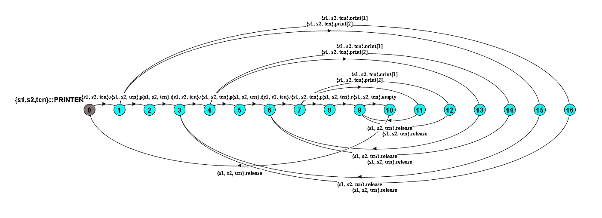
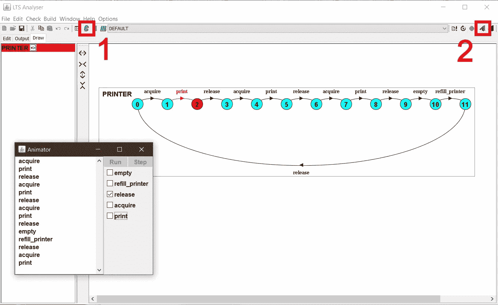
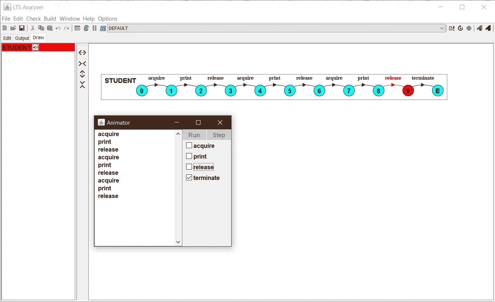
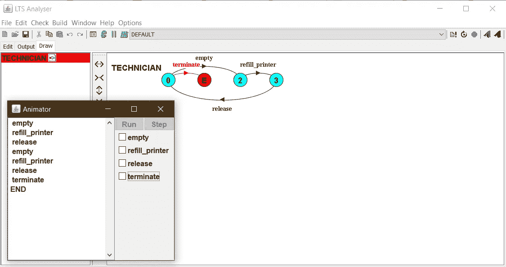

# 构建更好的并发性、有限状态流程和建模流程

> 原文：<https://betterprogramming.pub/building-better-concurrency-finite-state-processes-and-modeling-processes-ea0a06b8d529>

## 让我们构建更健壮的并发系统



由 LTSA 工具生成的状态图

你好，我是阿赛尔。今天，我将通过一个示例场景向您展示如何使用 FSP 为并发程序建模。

# FSP 是什么？

有限状态进程(FSP)是一种用于开发并发进程系统的抽象语言。

我们使用建模来获得对提议设计的充分性和有效性的信心。与大多数复杂的设计任务一样，通过采用多层次的抽象可以更好地理解并发性。

首先，系统的功能需求必须根据其期望的行为得到很好的理解。接下来，应该探索并发的可能角色。这最好使用线程的抽象来完成，而不需要致力于特定的实现。

在可能的范围内，实现并发性的机制的最终选择应该保持开放，以允许性能的微调和为各种产品配置不同地分发组件的灵活性。

# 让我们考虑如何使用一个叫做 FSP 的进程代数来描述并发进程

使用一个例子将使解释概念和模型变得更容易。让我们分析并模拟两个学生共享一台打印机打印文档，一名技术人员重新填充打印机的场景。

## 首先，我们可以分析打印机

*   打印机的最大纸张数量为三张。学生最多可以打印三份文档。
*   如果纸张计数为零，则必须重新填充

打印机过程

当用户(学生或技术人员)获得打印机时，它打印文档，释放文档，并返回到其初始状态。这被称为*重复行为。*

## 如何制作流程动画

要制作动画，首先你必须编译你写的代码，然后你必须导航到“绘制”标签。然后，点击动画按钮[2]。



制作打印机动画

在动画师中，你可以看到打印机已经打印了三个文档，并且它去补充。必须由技术人员来重新填充。那部分以后再分析。

## 接下来，我们来分析一下打印文档的学生

我们可以使用条件进程(`if`、`then`、`else`)来编写 FSP 代码。`DOCS_TO_PRINT = 3`是传递给流程的`3`参数。我们从`0`开始`PRINT`过程。`doc_count`是被索引的动作标签，导致被索引的动作:`PRINT[doc_count]`。

有条件过程的学生过程

同样的进程也可以使用保护进程来编写。

带保护进程的学生进程



制作学生流程动画

## 接下来，我们来分析一下为打印纸补充墨水的技术人员

对于如何继续，技术人员流程有多种操作选择。但是当它与学生进程同步时，立即终止将被阻止。



制作技术人员流程动画

## 最后，让我们看看复合过程

*   复合流程应该与所有子流程同步，为了做到这一点，我们可以定义一组名为`PRINT_Actions`的操作。
*   `terminate/s1.terminate`是一个重新标记的操作。通过使用那个`/`，我们将`s1.terminate`动作重新标记为终止。否则，动画师会显示`s1.terminate`、`s2.terminate`和`tcn.terminate`。
*   我们可以使用互斥的共享资源建模模式来同步用户和`PRINTER`

```
|| SHARED_PRINTER = (s1: STUDENT(2) || s2: STUDENT(3) || tcn : TECHNICIAN || **All_Users :: PRINTER**) 
```

这将允许一个用户获取资源，另一个用户释放资源。因此，当`PRINTER`与`USER`进程组合在一起时，这种组合确保了只有获得资源的同一个用户才能释放它。

打印机系统的复合过程

我希望这有助于你的 FSP 并发研究。干杯！