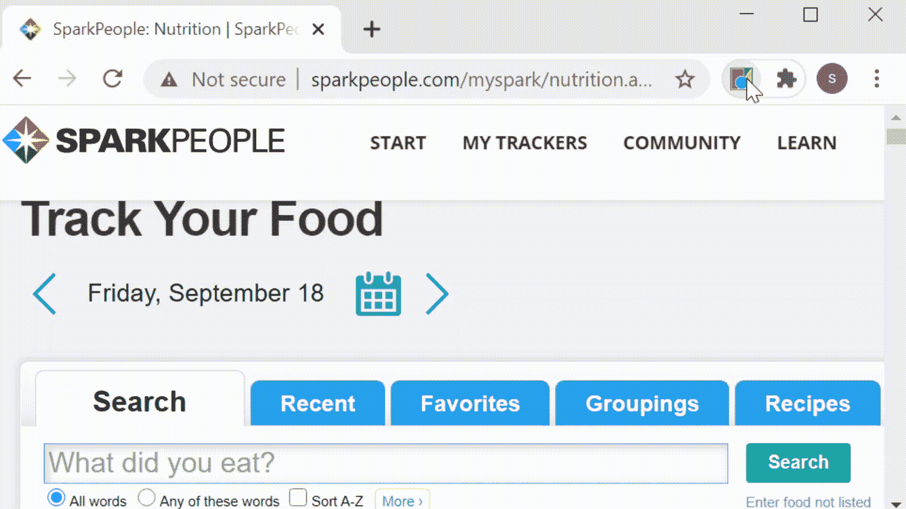
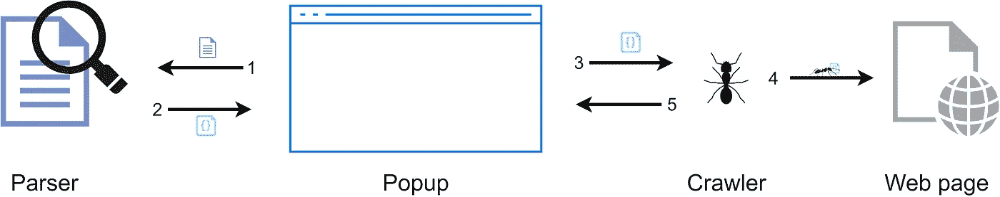

# 构建 Chrome 扩展:脚本间的通信

> 原文：<https://betterprogramming.pub/building-chrome-extensions-communicating-between-scripts-75e1dbf12bb7>

## 扩展领域的事情与你可能习惯的有些不同

改编自[rawpixel.com](https://www.freepik.com/rawpixel-com)在 [freepik](https://www.freepik.com/free-vector/communication-information-website-graphic_2922422.htm) 和 [WikimediaImages](https://pixabay.com/users/WikimediaImages-1185597/?utm_source=link-attribution&amp;utm_medium=referral&amp;utm_campaign=image&amp;utm_content=1326908) 在 [Pixabay](https://pixabay.com/?utm_source=link-attribution&amp;utm_medium=referral&amp;utm_campaign=image&amp;utm_content=1326908) 的资产。

不久前，我开始构建我的第一个 Chrome 扩展。最近，我进入了 web 开发的世界，并通过构建一个 React 项目进行了尝试，我觉得我拥有了迎接这一新挑战所必需的工具。

虽然我这样想并没有完全错，但如果说我不必重新思考我设计项目的方式，这并不是全部事实。

我在开发的早期就意识到了这一点。你看，当开发任何种类的应用程序时，随着我们的项目变得越来越大，我们将不可避免地将它分成单独的类、函数，最终是脚本。没有什么迫使我们这样做，但除非你想以翻拍 1958 年的 [The Blob](https://sourcemaking.com/antipatterns/the-blob) 结束，否则这样做是明智的。

# 脚本互操作性的简单方法

在我的例子中，扩展需要做以下事情:每当用户在文本字段中进行任何更改时，其内容都需要被解析，并相应地显示为其右侧表格中的条目。然后，只要“日志条目！”按钮，这些解析后的条目将用于调用网页上的更改。

扩展弹出窗口演示(未显示网页操作)

为此，我将代码的功能分解为以下脚本:

*   `popup.js`:包含弹出框及其组件的行为。例如，当文本被插入文本字段或按下按钮时会发生什么。
*   `parser.js`:包含按照特定规则解析文本并以特定格式返回解析结果的功能。
*   `crawler.js`:包含利用数据抓取网页以搜索特定元素并进行某些修改的功能。

这里有一个明显的相互依存关系。`crawler.js` 需要以某种格式呈现给它的数据，以便能够成功地抓取和修改网页。这些数据由`parser.js`提供，它从弹出窗口的文本字段接收输入，由`popup.js`管理。

交互图—蚂蚁资产由 [freepik](https://www.freepik.com/vectors/nature) 提供。

如果你像我一样，被 React 中使用 [ES6 模块](https://exploringjs.com/es6/ch_overviews.html#overview-entry-modules)的简单性宠坏了，你的第一个想法可能是说，“好吧，没问题。我就把`parser.js` 和`crawler.js` 中的相关函数导出来，在`popup.js`中导入。”

然而，我当时的普通 ES5 JavaScript 代码库有其他想法，当我试图将 ES6 特性集成到我的项目中时，我已经发现了让我的扩展脚本相互对话的正确方法。

*有趣的事实:在 ES6 集成的道路上，我最终确实实现了向*[*package*](https://parceljs.org/)*的飞跃(在*[*web pack*](https://webpack.js.org/)*让我质疑自己的人生选择之后，我可以向任何开始使用 bundlers 的人强烈推荐这款产品)。使用 bundler 的部分动机是需要* [*轻松引用外部库*](https://forum.freecodecamp.org/t/referencing-external-libraries-and-ui-components-in-vanilla-js-project/415730/7) *。*

*由于软件包预配置了* [*巴别塔*](https://babeljs.io/) *，所以我也能够使用 ES6 的特性，比如导入/导出，这使得我能够以更熟悉的方式处理不同的文件。然而，这并不是 Chrome extensions 的通信方式，我们很快就会看到这一点。*

# 内容和背景脚本

Chrome 扩展通常由各种内聚的部分或组件组成，每一个都有不同的职责。为了让所有这些组件一起工作，它们通过[消息传递](https://developer.chrome.com/extensions/messaging)进行通信。

在我们的例子中，`crawler.js` 需要与网页交互，因此被声明为所谓的[内容脚本](https://developer.chrome.com/extensions/content_scripts)。内容脚本是那些需要能够在网页上执行操作的脚本，比如 DOM 操作。

另一方面，`parser.js`不需要这样，但它仍然需要从`popup.js` 接收数据并发回。因此，我们将它声明为一个背景脚本。

顾名思义，后台脚本在后台运行。它的作用包括监听和响应浏览器事件(例如，关闭标签页，在扩展被安装(卸载)时执行操作)，以及发送和接收消息。

内容和后台脚本的声明在扩展的`manifest.json`中完成。

扩展的一部分 [manifest.json](https://developer.chrome.com/extensions/manifest) 显示了背景和内容脚本声明

# 消息传递 101

现在我们已经知道了足够多的信息，最终可以了解事情的本质。

`popup.js`作为这里的沟通发起者，需要发出两个信息。一个是当文本字段改变时，另一个是当按钮被点击时。根据接收者是谁，它使用两种方法之一来完成。如果接收方是内容脚本，则使用`[chrome.tabs.sendMessage()](https://developer.chrome.com/extensions/tabs#method-sendMessage)`。否则就是`[chrome.runtime.sendMessage()](https://developer.chrome.com/extensions/runtime#method-sendMessage)`。

## 非内容脚本通信

先说第二种情况。下面是一个在`popup.js`中可能会出现的例子:

从 popup.js 发送到 parser.js 的消息示例

这里，我们假设这段代码在文本字段发生变化时在`popup.js` 中执行。如您所见，我们已经传递了两个参数`runtime.sendMessage()`:一个必需的对象和一个可选的回调。对象应该包含什么完全由您决定，但是在我的例子中，我已经包含了两个属性。第一个是`msg`，包含一个字符串标识符，接收端检查该标识符以确定如何处理请求。第二个属性`data`，仅仅包含了修改后文本字段的新内容。

作为第二个参数传递给`runtime.sendMessage()`的回调函数必须只有一个参数。此函数处理此消息的收件人发送的响应。

*注:该消息的预期接收人为* `*parser.js*` *。然而，我们很快就会看到，任何监听* `*onMessage*` *事件的后台脚本都会收到它。这也是为什么在传递的对象中有一个像* `*msg*` *这样的属性很有用的另一个原因。它充当标识符，以便收件人可以确定邮件是否是给他们的。*

## 内容脚本通信

如前所述，当接收者是内容脚本时，我们使用`tabs.sendMessage()`。下面是在`popup.js`中可能出现的情况:

从 popup.js 发送到 crawler.js 的消息示例

你会注意到这一次我们没有直接发送信息。使用`tabs.sendMessage()`，我们需要知道将消息发送到哪个选项卡。为此，我们首先调用`[tabs.query](https://developer.chrome.com/extensions/tabs#method-query)()`，它检索所有匹配第一个参数中指定的属性的选项卡。因为我的扩展弹出窗口只有在我在一个特定的 URL 上时才会激活，所以我可以简单地在当前窗口中获取活动标签，并确保它就是我需要的那个。

*提示:要检索所有标签，传递一个空对象作为第一个参数。*

检索到的选项卡被传递给第二个参数中指定的回调。这是我们发送实际消息的地方，现在看起来应该很熟悉了。唯一不同的是，对于`tabs.sendMessage()`，我们需要传递相关选项卡的 ID。其余部分遵循与之前相同的结构。

## 接收和回复消息

在接收端，这很简单。在那里，我们使用`[chrome.runtime.onMessage.addListener()](https://developer.chrome.com/extensions/runtime#event-onMessage)`。本质上，它所做的是向`onMessage`事件添加一个监听器，每当使用我们见过的任何一种`sendMessage()`变体发送消息时，这个监听器就会被触发。

该方法将一个回调函数作为它的单个参数，当事件被触发时(即收到一条消息)调用该函数。这个回调又接受三个参数:消息的内容、发送者和一个函数，如果要发回响应，就调用这个函数。此函数接受 object 类型的单个参数。那是冗长的。让我们看一些代码。

如何在 parser.js 中接收消息的示例。注意请求中的 msg 字段如何被用作消息的标识符

# 好处:内容脚本之间的通信

到目前为止，一切顺利。但是如果我们不只是有一个内容脚本，就像这里的`crawler.js`一样，而是有两个想要交流的脚本，那会怎么样呢？继续我们正在运行的例子，假设我们将`crawler.js`分成两个独立的内容脚本:`finder.js`和`filler.js`。顾名思义，前者搜索网页上的某些元素，而后者用内容填充这些元素。

`finder.js` 希望能够将找到的元素发送给`filler.js`。“嗯，没什么大不了的，”我听到你说。我们就像之前一样用`tabs.sendMessage()`和`onMessage.addListener()`。虽然我不想带来坏消息，但也不尽然。事实证明，内容脚本不能直接通信。这实际上让我挠头了一段时间。幸运的是，解决方法很简单。

*有趣的事实:如果你想知道我为什么会遇到这个问题，因为我只有一个内容脚本，在某些时候，我不必要地将* `*popup.js*` *也注册为内容脚本，因此它的消息没有使用直接通信路径到达* `*crawler.js*` *。我已经改正了这个错误，但是学到的教训仍然存在。*

我们需要做的就是让一个后台脚本在这个交换中充当中间人。这看起来如下。不要被大小吓倒。出于显示的目的，我已经将三个脚本中的代码压缩成一个要点。

展示两个内容脚本之间通信的示例。请注意，每个代码片段都包含在各自的演员脚本中

本质上，除了一点逻辑上的变化，这里没有什么新的东西。我们使用后台脚本在通信方之间传递消息，而不是直接的点对点通信(即内容脚本)。

这里需要注意的一点是，我们在后台脚本的`addListener()`中返回了`true`。无需过多赘述，这将保持后台脚本的通信通道打开，以允许`filler.js`的响应到达`finder.js`。关于这方面的更多信息，请看一下 [Chrome 的文档](https://developer.chrome.com/extensions/runtime#event-onMessage)中对`runtime.onMessage.addListener()`的`sendResponse`参数的描述。

# 结论

谢谢你留下来！Chrome 扩展可能非常特殊，当你陷入困境时，互联网上通常没有太多内容。所以我希望你能从中找到一些有用的东西。

一如既往，我很高兴听到你的想法，并回答你可能有的任何问题。

# 资源

*   [项目回购](https://github.com/osharaki/sparkpeople-logger)
*   [Chrome 扩展:链接到更多资源的绝佳起点](https://developer.chrome.com/extensions)
*   [Javascript 模块的精彩介绍](https://medium.com/@crohacz_86666/basics-of-modular-javascript-2395c82dd93a)
*   [深度 Javascript 模块](https://exploringjs.com/es6/ch_modules.html)
*   [ES6 特性概述](https://exploringjs.com/es6/ch_overviews.html)
*   [斑点反模式](https://sourcemaking.com/antipatterns/the-blob)