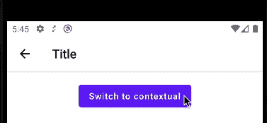
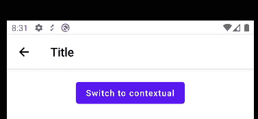

# 在 Jetpack Compose 中构建顶部应用程序栏的上下文模式

> 原文：<https://betterprogramming.pub/building-contextual-mode-of-top-app-bar-in-jetpack-compose-aecdfcfd3fef>

## 创建定制的 Android 用户界面变得简单多了


由 [Ales Nesetril](https://unsplash.com/@alesnesetril?utm_source=unsplash&utm_medium=referral&utm_content=creditCopyText) 在 [Unsplash](https://unsplash.com/s/photos/technology?utm_source=unsplash&utm_medium=referral&utm_content=creditCopyText) 上拍摄的照片

我们已经在 Whatsapp、Gmail、Contacts 等许多应用中看到了长按选择聊天、电子邮件或联系人时的上下文模式。它提供了一个显示上下文操作菜单的临时 UI。

在传统的视图系统中， [ActionMode](https://developer.android.com/reference/android/view/ActionMode) 是显示上下文动作的首选技术。在本帖中，我们将探索如何使用 Jetpack Compose 实现同样的功能。

# 我们将建造什么


# 不说话，只是代码？

好吧，如果你有兴趣直接跳到代码，这里的[是指向活动文件的链接，该文件包含实现上述结果的代码。](https://github.com/tusharkathuria/AndroidPlayground/blob/main/contextual-app-bar/src/main/java/com/tusharkathuria/androidplayground/contextualappbar/MainActivity.kt)

# 先决条件

这篇文章假设你已经知道 Jetpack Compose 和 Material Top App Bar 实现。请参考以下链接进行回顾:

*   [构建学习路径](https://developer.android.com/courses/pathways/compose)
*   [在撰写中浏览顶部应用程序栏](https://medium.com/google-developer-experts/exploring-jetpack-compose-topappbar-c8b79893be34)

# 我们开始吧

我们将从创建一个带有顶部应用程序栏和切换上下文模式的按钮的支架开始。点击按钮时，应用程序栏颜色会切换，并且会添加共享操作来指示上下文模式。

这样我们得到了以下结果:


# 更改状态栏颜色

我们还可以在切换上下文模式时更改状态栏的颜色。为此，我们将使用伴奏者的[系统 UI 控制器](https://google.github.io/accompanist/systemuicontroller/):

添加依赖关系:

```
implementation "com.google.accompanist:accompanist-systemuicontroller:$accompanist_version"
```

更改状态栏颜色:

通过这种改变，我们得到以下结果:



现在我们的工具栏有了一个全功能的上下文模式。但是如果能使用一些动画来使这种颜色的过渡平滑一些，那就更好了。接下来让我们试着这样做。

# 实现更平稳的过渡

让我们使用`[updateTransition](https://developer.android.com/jetpack/compose/animation#updateTransition)` API 来制作颜色变化的动画。用以下初始化替换颜色变量:

这导致以下结果:


这样，颜色变化现在是动画，但看起来有两个不同的过渡。这是因为状态栏的颜色变化是在副作用中完成的。要解决这个问题，我们需要获得对状态栏空间的完全控制。一旦我们有了这个控件，状态栏颜色的改变就可以像背景和内容颜色的改变一样进行。

# 在状态栏后面绘图

我们将使用`[setDecorFitsSystemWindows](https://developer.android.com/reference/androidx/core/view/WindowCompat#setDecorFitsSystemWindows(android.view.Window,boolean))` API 和伴奏者的 [Insets](https://google.github.io/accompanist/insets/) 的组合来控制状态栏后面的空间。

添加依赖关系:

```
implementation "com.google.accompanist:accompanist-insets:$accompanist_version"
```

在调用`setContent`之前，通过在`onCreate` 中添加以下代码，获得设备空间的边对边控制:

```
WindowCompat.setDecorFitsSystemWindows(*window*, false)
```

用`ProvideWindowInsets` *包裹撰写层次。*这使我们能够使用 insets 库提供的各种修改器。点击阅读更多[。](https://google.github.io/accompanist/insets/)

```
*setContent* **{** *ProvideWindowInsets* **{
        .
        .
        .
    }
}**
```

更新副作用来设置透明状态栏的颜色。这对于确保状态栏后面的内容(我们稍后将绘制它)是可见的非常重要:

```
*SideEffect* **{** systemUiController.setStatusBarColor(
        color = Color.Transparent,
        darkIcons = !isContextual
    )
**}**
```

将以下修饰符添加到 TopAppBar 调用中:

```
*TopAppBar*(
    .
    .
    . modifier = Modifier.*background*(statusBarColor).*statusBarsPadding*()
)
```

这将在顶部应用程序栏上方添加一个等同于状态栏高度的填充，并对其应用所需的颜色。

通过这些更改，我们得到了以下结果:



现在变化发生在一个单独的过渡中，但是现在我们在正常模式下看到顶部应用程序栏中不需要的顶部高度。Jetpack Compose 目前不提供任何方式来指定特定边上的高程。让我们使用一种变通方法来解决这个问题。

# 应用仅底部高程

让我们使用 [Philip Dukhov](https://stackoverflow.com/users/3585796/philip-dukhov) 建议的[变通方法](https://stackoverflow.com/a/69914668/4176416)来解决这个问题。

创建仅应用底部高程的自定义修改器:

将此修改器应用到顶部应用程序栏可组合:

```
*TopAppBar*(
    .
    .
    . modifier = Modifier.*background*(statusBarColor).*statusBarsPadding*().*bottomElevation*()
)
```

通过这些改变，我们得到了我们最终想要的结果如下:


有了这些，我们现在已经实现了顶部应用程序栏的全功能上下文模式。如果你想要一些自定义的颜色变化动画，你也可以在调用`animateColor` 时尝试应用自定义的[动画规格](https://developer.android.com/jetpack/compose/animation#animationspec)

# 后续步骤

*   构建一个自定义的顶部应用程序栏组件，该组件采用`isContextual`布尔参数。这将使我们能够在应用程序的所有屏幕上使用它
*   通过使用主题中的语义颜色而不是硬编码颜色来支持深色主题

# 资源

*   [GitHub 中的最终代码](https://github.com/tusharkathuria/AndroidPlayground/blob/main/contextual-app-bar/src/main/java/com/tusharkathuria/androidplayground/contextualappbar/MainActivity.kt)
*   [动作模式](https://developer.android.com/reference/android/view/ActionMode)
*   [伴奏系统 UI 控制器](https://google.github.io/accompanist/systemuicontroller/)
*   [Jetpack 中的动画合成](https://developer.android.com/jetpack/compose/animation#updateTransition)
*   [伴奏插图](https://google.github.io/accompanist/insets/)