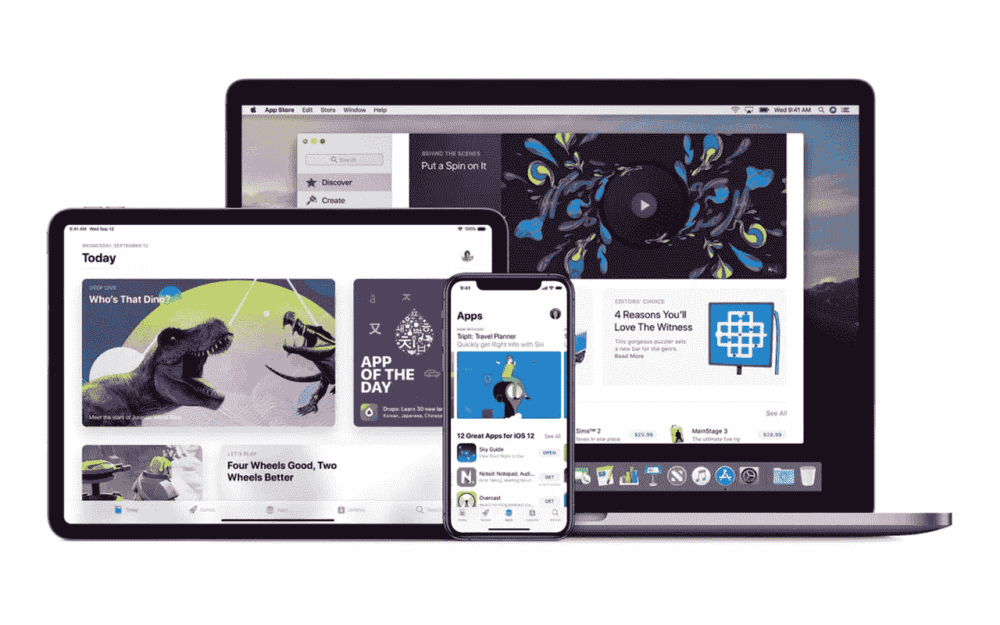
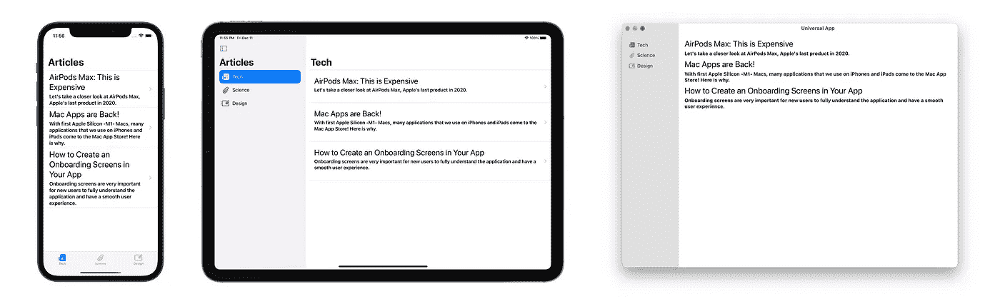
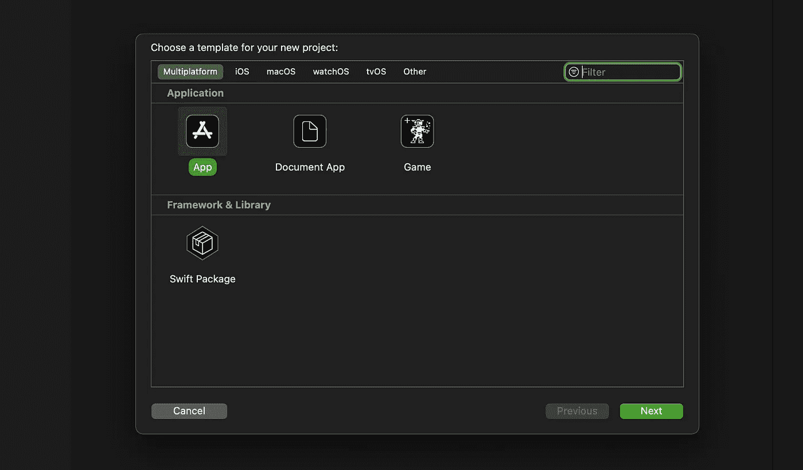
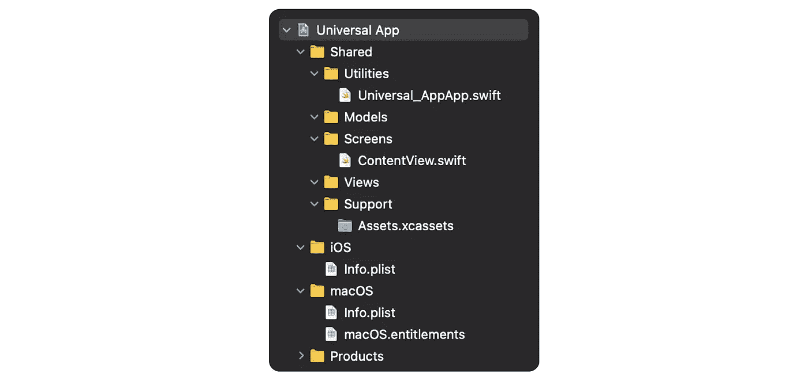
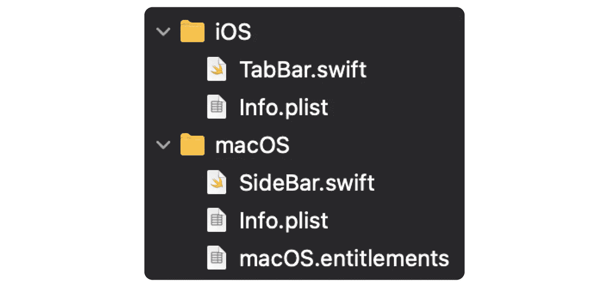
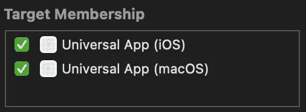

# 使用 SwiftUI 构建跨平台应用

> 原文：<https://betterprogramming.pub/building-cross-platform-apps-with-swiftui-3fea88cdb0ae>

## 让我们使用单一代码库构建一个移动和桌面应用程序


作者照片。

自从推出以来，通用应用程序(多平台应用程序)一直值得独立开发者和大公司考虑。作为一个想开发应用程序的独立开发者，特别是在 Mac 应用程序市场，通用应用程序对我来说真的很棒。

在本文中，我们将了解什么是通用应用程序，并开发一个简单的通用应用程序，以便我们可以更好地了解通用应用程序是如何工作的。

# 什么是多平台应用？

在 WWDC20 上发布了新的多平台应用程序概念。在此之前，我们能够开发一些类似的应用程序，但有了 WWDC20，SwiftUI 变得非常好——所以你实际上可以只用 SwiftUI 开发一个应用程序。这样，您可以在许多平台上运行 SwiftUI 代码。



除了 SwiftUI 之外，Mac Catalyst 也是一个非常好的工具，可以在多个平台上快速开发应用程序，但 Mac Catalyst 是一种仅用于将 iPad 应用程序转换为 Mac 应用程序的技术。此外，Mac Catalyst 只与 UIKit 框架一起工作。所以大部分人对 SwiftUI 还是比较兴奋的。

我对 SwiftUI 感到非常兴奋，因为你可以在 Mac、iPhone、*和* iPad 上运行你用 SwiftUI 2.0 编写的项目，根本不需要太多额外的代码。

由于通用应用程序，即使是独立开发者也可以不费吹灰之力将其应用程序打入 Mac 应用程序市场。这实际上是一个游戏改变者。两年前，由于 Mac 技术的原因，甚至一些较大的公司也不想进入 Mac 应用市场。

但多亏了像 Mac Catalyst 和 SwiftUI 这样的新技术，为 Mac 开发应用变得容易多了。如果你想在这些技术出现之前创建一个原生 Mac 应用，你必须使用 AppKit 框架。AppKit 框架很老了，所以互联网上与 AppKit 相关的内容要少得多。一些开发者抱怨苹果扼杀了 AppKit，但是，最终，多亏了这些新技术，像我这样的人——以前没有创建过 Mac 应用的人——可以像 iOS 应用一样开发 Mac 应用。

无论如何，我希望我能稍微解释一下 Mac 应用市场的总体状况。现在我们可以开始开发我们的应用程序了。当然，我们需要知道开发的要求。

## 要求

当然，为了开发一个通用的应用程序，我们需要遵守一些要求。于是，通用应用的概念随着 WWDC20 走进了我们的生活。

**我们的要求:** Xcode 12 和装有 macOS Big Sur 的 Mac。

现在，我们可以真正开始开发了！

# 编码时间

我们的应用程序将是一个非常简单的文章列表应用程序。我们要做一个非常简单的应用程序。也许我可以在以后写的关于通用应用的文章中进一步开发这个应用。



最终应用

## 创建新的 Xcode 项目

首先，让我们创建一个新的 Xcode 项目。我们需要创建一个多平台应用程序这个项目。



当然，你可以给这个项目取任何你想要的名字。之后，剩下的唯一一件事就是开始做你的项目。

在开发项目时，我给你的建议是把你的文件分成文件夹。在做这个项目时，你可以像我一样使用文件夹。



## 构建数据模型

在我们的项目中只有一个数据模型。因为我们的应用程序是一个商品显示应用程序，正如您所理解的，商品有一个数据模型。这个模型有四个属性:`id`、`title`、`description`、`type`。

```
**struct** Article: Identifiable {

    // MARK: - Properties
    **var** id = UUID()
    **let** title: String
    **let** description: String
    **let** type: String
}
```

当然，我们需要用`Article`模型创建的对象。我们将通过直接写入来创建这些数据。

```
**let** techArticles = [
    Article(title: "AirPods Max: This is Expensive", description: "Let's take a closer look at AirPods Max, Apple's last product in 2020.", type: "Tech"),
    Article(title: "Mac Apps are Back!", description: "With first Apple Silicon -M1- Macs, many applications that we use on iPhones and iPads come to the Mac App Store! Here is why.", type: "Tech"),
    Article(title: "How to Create an Onboarding Screens in Your App", description: "Onboarding screens are very important for new users to fully understand the application and have a smooth user experience.", type: "Tech")
]**let** scienceArticles = [
    Article(title: "Are Apple Products Becoming More Cheaper?", description: "In recent years, when I looked at the price of Apple's newly introduced products, I saw a slight decrease in the price of new products.", type: "Science"),
    Article(title: "Limit Properties", description: "Limits can also be evaluated using the properties of limits.", type: "Science"),
    Article(title: "Direct Substitution", description: "We can find any limit of a definite function with direct substitution. Let’s find out how we can do this!", type: "Science")
]**let** designArticles = [
    Article(title: "Euler Number", description: "What is the number of e that we usually encounter in calculators? What does it do? Let’s find out what this number is!", type: "Design"),
    Article(title: "Introduction of Limits", description: "Now that we have defined the limit, let’s try to better understand the limit by giving an example…", type: "Design"),
    Article(title: "Find Limits Using Graphs", description: "Graphs are a great tool for understanding the approaching values. Let’s see how this happens!", type: "Design"),
    Article(title: "Find Limits Using Tables", description: "A noteworthy method to understand limits. How, you ask?", type: "Design")
]
```

现在我们的数据模型和数据集已经准备好了，让我们创建界面元素来显示这些数据。

## 建筑视图

首先，让我们创建一个显示单个`Article`对象属性的`ArticleView`对象。

```
**struct** ArticleView: View {

    // MARK: - Properties
    **let** article: Article

    // MARK: - UI Elements
    **var** body: **some** View {
        VStack(alignment: .leading, spacing: 5) {
            Text(article.title)
                .font(.title)

            Text(article.description)
                .font(.headline)

            Spacer()
        }
        .padding()
    }
}
```

现在为了一起显示这些`ArticleView`元素，创建一个新的`View`对象。叫`ArticlesListView`。

```
**struct** ArticlesListView: View {

    // MARK: - Properties
    **let** articles: [Article]

    // MARK: - UI Elements
    **var** body: **some** View {
        Text("Hello, TurkishKit!")
    }
}
```

我们不会直接在`body`中创建`List`对象，因为当应用程序在 Mac 设备上打开时，最好相应地设置大小。正如你在下面看到的，我们用`frame`方法调整了 Mac 应用的大小。

```
**struct** ArticlesListView: View {

    // MARK: - Properties
    **let** articles: [Article]

    // MARK: - UI Elements
    **var** body: some View {
        #**if os**(macOS)
        **return**
            view
                .frame(minWidth: 400, minHeight: 600)
        #**else**
        **return** view
        #**endif**
    }

 **@ViewBuilder**
    **private var** view: **some** View {
        List(articles) { article **in**
            NavigationLink(destination: ArticleView(article: article)) {
                ArticleView(article: article)
            }
        }
        .navigationTitle("\(articles[0].type)")
    }
}
```

现在到了重要的部分:`SideBar`和`TabBar`。`TabBar`和`SideBar`元素对于我们应用程序的结构来说极其重要。通常我们用这些元素来划分我们的应用。在这个应用中，`TabBar`元素也将用于 iPhone 版本，`SideBar`元素将用于 iPad 和 Mac 设备。

让我们从`TabBar`元素开始。在这个元素中，我们唯一要做的就是排列我们的主屏幕。我们使用`tag`方法来准确定位屏幕。

```
**struct** TabBar: View {

    // MARK: - UI Elements
    **var** body: **some** View {
        TabView {
            ArticlesListView(articles: techArticles)
                .tabItem {
                    Image(systemName: "newspaper.fill")
                    Text("Tech")
                }
                .tag(0)

            ArticlesListView(articles: scienceArticles)
                .tabItem {
                    Image(systemName: "paperclip")
                    Text("Science")
                }
                .tag(1)

            ArticlesListView(articles: designArticles)
                .tabItem {
                    Image(systemName: "rectangle.and.paperclip")
                    Text("Design")
                }
                .tag(2)
        }
        .navigationTitle("Articles")
    }
}
```

让我们来看看`SideBar`元素。在`SideBar`元素中我们有一个基本的`View`元素，类似于`TabBar`元素:`List`。我们将使用`NavigationLink`对象在`List`对象中定向。

```
**struct** SideBar: View {

    // MARK: - UI Elements
 **@ViewBuilder**
    **var** body: **some** View {
        List {
            NavigationLink(
                destination: ArticlesListView(articles: techArticles),
                label: {
                    Label("Tech", systemImage: "newspaper.fill")
                }
            )
            .tag(NavigationItem.tech)

            NavigationLink(
                destination: ArticlesListView(articles: scienceArticles),
                label: {
                    Label("Science", systemImage: "paperclip")
                }
            )
            .tag(NavigationItem.science)

            NavigationLink(
                destination: ArticlesListView(articles: designArticles),
                label: {
                    Label("Design", systemImage: "rectangle.and.paperclip")
                }
            )
            .tag(NavigationItem.design)
        }
        .navigationTitle("Articles")
        .listStyle(SidebarListStyle())
    }
}
```

开发如下代码，以确保`NavigationLink`元素的正确定位。

```
**enum** NavigationItem {
    **case** tech
    **case** science
    **case** design
}**struct** SideBar: View {

    // MARK: - Properties
    **@State var** selection: Set<NavigationItem> = [.tech]

    // MARK: - UI Elements
 **@ViewBuilder**
    **var** body: **some** View {
        List(selection: $selection) {
            NavigationLink(
                destination: ArticlesListView(articles: techArticles),
                label: {
                    Label("Tech", systemImage: "newspaper.fill")
                }
            )
            .tag(NavigationItem.tech)

            NavigationLink(
                destination: ArticlesListView(articles: scienceArticles),
                label: {
                    Label("Science", systemImage: "paperclip")
                }
            )
            .tag(NavigationItem.science)

            NavigationLink(
                destination: ArticlesListView(articles: designArticles),
                label: {
                    Label("Design", systemImage: "rectangle.and.paperclip")
                }
            )
            .tag(NavigationItem.design)
        }
        .navigationTitle("Articles")
        .listStyle(SidebarListStyle())
    }
}
```

**重要提示:**你必须找到`SideBar`和`TabBar`元素的文件，如下所述——否则会出现问题。



如果您的文件不能相互通信，您可能需要编辑您的目标成员资格。我们的项目非常小，所以您可以在每个文件中打开两个现有的目标。



终于到了编辑`ContentView`的时候了。这里我们需要根据应用程序运行的设备来运行不同的元素。为此，我们将使用类似于`#if`的工具，我们之前也使用过，然后我们将使用`horizontalSizeClass`属性。感谢`horizontalSizeClass`，我们可以检测到运行应用的设备是 iPad 还是 iPhone。

```
**struct** ContentView: View {

    // MARK: - Properties
    #**if os**(iOS)
 **@Environment**(\.horizontalSizeClass) **var** horizontalSizeClass: UserInterfaceSizeClass?
    #**endif**

    // MARK: - UI Elements
 **@ViewBuilder**
    **var** body: **some** View {
        NavigationView {
            #**if** **os**(iOS)
            **if** horizontalSizeClass == .compact {
                TabBar()
            } **else** {
                SideBar()
            }
            #**else**
            SideBar()
            ArticlesListView(articles: techArticles)
            #**endif**
        }
    }
}
```

这样，我们的申请正式完成了！

# 结论

如你所见，制作通用应用程序很容易。但是，我不得不说你不能在通用应用中使用 UIKit 元素！这对一个稍微中等/大的项目来说确实不是一件好事，但是你可以通过使用额外的框架来解决这个问题/障碍。(也许以后我甚至可以写一篇关于这个的文章。)

总之，随着 SwiftUI 的进一步发展，开发更全面、更强大的通用应用程序将成为可能。显然，以 SwiftUI 目前的形式，很快开发出优质的独立项目是可能的。如果你是一个独立开发者，我认为你绝对应该考虑这个。

最后，记住你可以用 SwiftUI 为 watchOS 操作系统开发应用。用一个额外的 watchOS 扩展来制作一个几乎可以在所有苹果平台上工作的应用程序，一定非常令人着迷。如果你有兴趣为 Apple Watch 开发应用程序，你可以在我们在本文中制作的应用程序中添加一个 watchOS 扩展，并使这个应用程序在 Apple Watch 上工作！

您可以通过下面的链接访问我们在本文中创建的项目。

[](https://github.com/canbalkya/Universal-App-Basics) [## canbalkya/通用应用程序基础

### GitHub 是超过 5000 万开发人员的家园，他们一起工作来托管和审查代码、管理项目和构建…

github.com](https://github.com/canbalkya/Universal-App-Basics) 

```
**My Other Articles** - [What’s New in Swift 5.4?](/whats-new-in-swift-5-4-88949071d538)
- [How to Create Onboarding Screens in Your iOS App](/how-to-create-onboarding-screens-in-your-ios-app-e41b518db31f)
- [How To Use Firebase in SwiftUI’s New Application Lifecycle](/how-to-use-firebase-in-swiftuis-new-application-lifecycle-c77a8a306d63)
```

如果你想见我或有关于 iOS 开发等问题。你可以在这里和我进行一对一的会谈。