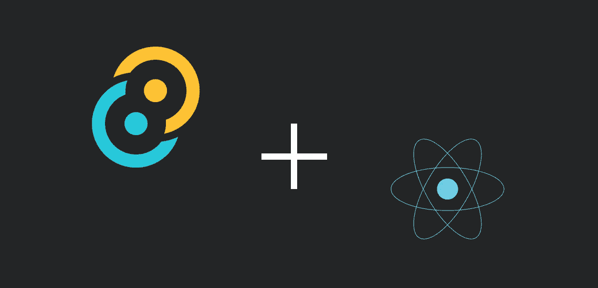
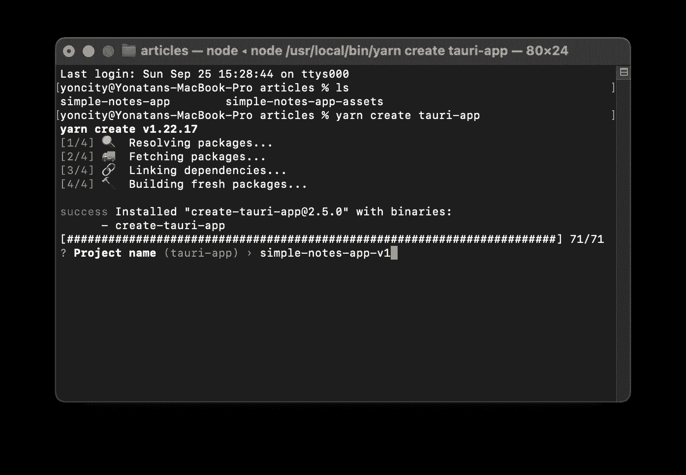
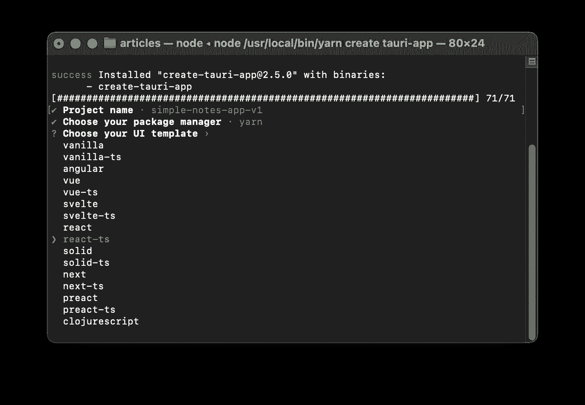
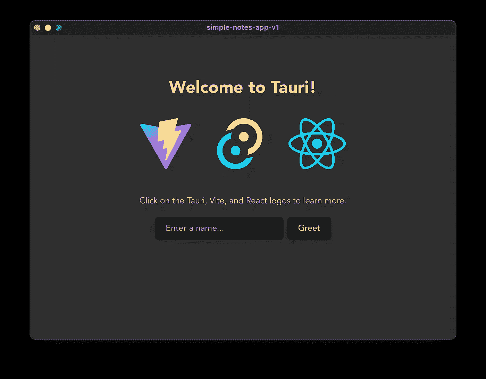
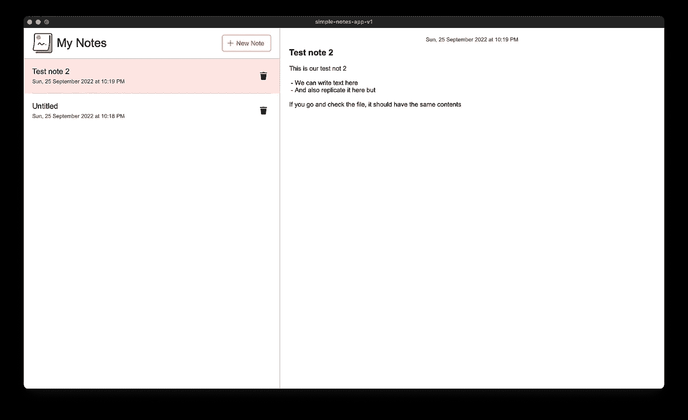

# 用 Tauri 和 React 构建笔记桌面应用程序

> 原文：<https://betterprogramming.pub/building-cross-platform-desktop-applications-with-tauri-part-ii-8d6ad1927093>

## 创建出色的跨平台应用



作者图片

大家好。今天，我们将看看如何使用`Tauri`和`ReactJS`开发一个简单的 Notes 桌面应用程序。

如果你想与你构建的项目进行比较，可以在 GitHub 库[中找到完成的项目。](https://github.com/Yoncity/simple-note-app)

# 摘要

本文的主要思想是向您展示如何利用 Tauri 和它的一些`api`来开发桌面应用程序，特别是使用`FileSystem (fs)`。[点击此处了解所有 API 的更多信息。](https://tauri.app/v1/api/js/)

`fs` API 为我们提供了一些可以导入和使用的常用功能(创建、读写文件和创建文件夹)。这将派上用场，尤其是如果你不想弄脏自己的手，并节省我们这么多时间。

那么，我们的`Notes app`流程开始了:

*   用户将能够创建笔记
*   当创建笔记时，我们必须为他们提供本地的`Save dialog`选项来指定他们希望将笔记保存在哪里
*   在他们想要的位置创建笔记文件，让他们添加内容。
*   一旦创建了笔记，我们将把它保存在`localStorage`中，这样我们就可以随时跟踪我们的笔记，不管它们存储在我们电脑的什么地方。
*   阅读保存在用户电脑上的便笺内容
*   当用户删除笔记时，删除文件

如你所见，我们将看到如何使用 Tauri 与`File system`交互来创建、读取和删除文件。我们还将讨论 Tauri 如何实现`allow list`来只允许某个 API 的某些特性，即限制我们的 note 应用程序使用`fs` API 来控制哪个文件夹。

## 放弃

本教程假设用户对`React`和编程有基本的了解。

# 入门指南

你需要几个工具来进行这个开发，幸运的是， [Tauri 的官方网站](https://tauri.app/v1/guides/getting-started/prerequisites)已经覆盖了我们。继续为您的适当平台安装他们指定的所有必需的依赖项。

完成后，您可能需要重启 bash，以便将`Rust`添加到环境变量中，但是最简单的方法是重启您的计算机。

现在，我们可以继续创建一个`Tauri`项目。我将使用`yarn`创建项目，但是你可以使用你喜欢的包管理器，如这里指定的。

要创建 Tauri 项目，请在您的终端中键入以下代码:

```
yarn create tauri-app
```

一旦完成，它会给你一个给它命名的选项。我们姑且称之为`simple-notes-app-v1`如下图:



之后，您可以选择您所选择的包管理器。然后继续选择本教程的`UI template.`，我们将使用如下所示的`react-ts`:



就是这样。现在我们有了`Tauri App`模板，我们可以开始导航到文件夹并安装如下所示的包:

```
cd simple-notes-app-v1yarn
```

一旦下载了我们所有的包，您可以运行下面的命令来看看我们的项目是什么样子的。

```
yarn tauri dev
```

如果一切顺利，您应该会看到编译后的应用程序，如下图所示:



现在，关闭应用程序，让我们继续添加两个要使用的包:

*   dayjs —用于处理日期和日期格式的包
*   sass——编写包含嵌套和变量的 CSS 的更好方式

要安装上述软件包，请在您的终端上运行以下代码:

```
yarn add dayjs sass
```

现在，剩下的唯一事情就是下载三个图标并把它们放在`/src/assets`中。

*   `[PlusIcon](https://github.com/Yoncity/simple-note-app/blob/main/src/assets/plus_icon.png)`:另存为`plus_icon.png`
*   `[NoteIcon](https://github.com/Yoncity/simple-note-app/blob/main/src/assets/note_icon.png)`:另存为`note_icon.png`
*   `[DeleteIcon](https://github.com/Yoncity/simple-note-app/blob/main/src/assets/delete_icon.png)`:另存为`delete_icon.png`

至此，所有必需的包、资产和依赖项都已安装完毕，可以开始运行了，所以让我们开始编写一些代码。

让我们从删除`/src/style.css`中的所有 CSS 代码开始。通常，我们会把所有我们想在我们的应用程序中重用的全局 CSS 都放进去，但是考虑到我们的应用程序将会是一个相当简单的应用程序，我们将会删除所有的内容，让文件为空。

现在我们也可以修改我们的`/src-tauri/tauri.conf.json`。默认情况下，该文件如下所示:

```
"allowlist": {
    all: true
}
```

由于我们希望我们的应用程序是安全的，而不是发布 Tauri 给我们的所有 API 代码，我们将只选择我们需要的功能。所以，你需要用下面的内容替换`allowlist`:

因此，开箱即用，我们可以看到，我们只给我们的应用程序访问`Document & Desktop`文件夹，如果用户试图保存这个范围之外的笔记，它不会允许他。[点击此处了解更多关于安全性的信息。](https://tauri.app/v1/api/js/fs#security)

现在，让我们用下面的内容替换`/src/App.tsx`的内容:

这里有很多东西需要解开，所以让我们一步一步地开始吧。首先，如果你注意到`HTML`的内容，它可能看起来有点奇怪`class name`。那是因为我们在用 [BEM](https://css-tricks.com/bem-101/) 。如果这是你第一次听说它，[在这里了解更多信息](https://css-tricks.com/bem-101/)。

我们有三个状态将存储我们的笔记相关数据:

*   第 15 行:这将存储我们将从`localStorage`中检索的所有笔记的列表。
*   第 16 行:这将存储当前活动便笺的`id`，以便我们可以读取和修改它的内容。
*   第 17 行:这将存储活动便笺的内容。当活动便笺改变时，我们将获取新活动便笺的文件并读取其内容，因此我们将它存储在一个状态中，以便在内容改变时可以触发重新呈现。

第 37–54 行包含了当用户点击`New Note`时将被调用的函数`addNote`，它将调用 Tauri `Save Dialog`，这将为用户提供选择保存便笺的文件名和位置的选项。

每当`Save Dialog`打开并且用户选择名称和位置时，它将返回一个`location + name`的字符串。但是如果用户关闭弹出窗口，它将为空，因此我们断言它在第 39 行有值。阅读关于[保存对话框](https://tauri.app/v1/api/js/dialog#save)的更多信息。

假设一切顺利，第 41 行将创建内容为空的`Note`。是的，就这么简单。剩下的代码是非常基本的编程，您可以自己阅读，或者如果您有更好的想法，可以用您自己的版本替换。阅读更多关于 [writeTextFile](https://tauri.app/v1/api/js/fs#writetextfile) 的内容。

第 78 行调用了`readTextFile`，它将`location`作为第一个参数，将 Options 作为第二个参数，但是我们现在不使用它。阅读更多关于`[readTextFile](https://tauri.app/v1/api/js/fs#readtextfile)`的内容。

第 25 行调用`removeFile`,我们将 location 作为第一个参数传递给它，并将从我们的计算机中永久删除该文件。更多阅读`[removeFile](https://tauri.app/v1/api/js/fs#removefile)` [。](https://tauri.app/v1/api/js/fs#removefile)

之后，删除`/src/App.css`，新建一个文件`/src/App.scss`。我们选择使用`scss`,因为嵌套 CSS 会更容易。`App.scss`应该看起来像下面的文件:

现在，我们可以在`src/helpers`文件夹中创建`getFromLocalStorage.ts`文件，如下图所示。这将处理我们如何在`localStorage`中设置、获取和更新我们的注释。

现在，让我们看看我们的应用程序是什么样子的。继续运行`yarn tauri dev`。如果一切正常，它将运行并打开应用程序，界面如上所示。

现在唯一剩下的事情是将应用程序构建成一个可分发的文件，我们可以与世界共享。但首先，我们需要编辑我们的应用程序的`identifier`，即必须对每个应用程序都是唯一的，有点像`id`。我们可以在`src-tauri/tauri.conf.json`中进行设置

```
"identifier": "com.yoncity.article.simple_note"
```

请随意设置您喜欢的`id`，只要确保您没有使用默认的。如果您这样做，Tauri 将返回一个错误，要求您更改它。

然后，您可以运行`yarn tauri build`，它将生成我们可以共享的可分配资源。它将为您当前的操作系统生成发布文件。[点击此处了解更多关于构建应用的信息。](https://tauri.app/v1/guides/building/)

你也可以随意改变一些东西，比如我们的应用程序的显示名称和图标。

# 结论

我们使用 Tauri 提供给我们的一小部分 API 构建了一个简单的 notes 应用程序。如果我们需要自定义函数，我们可以使用`Rust`编写并在前端调用这些函数。[点击此处阅读更多内容。](https://tauri.app/v1/guides/features/command)



请继续关注后续部分，它们展示了用 Tauri 实现的其他真实应用程序。