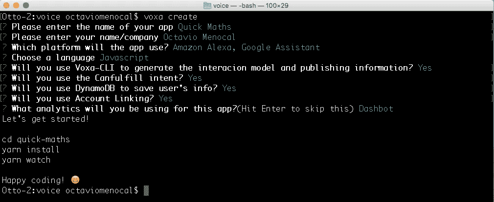
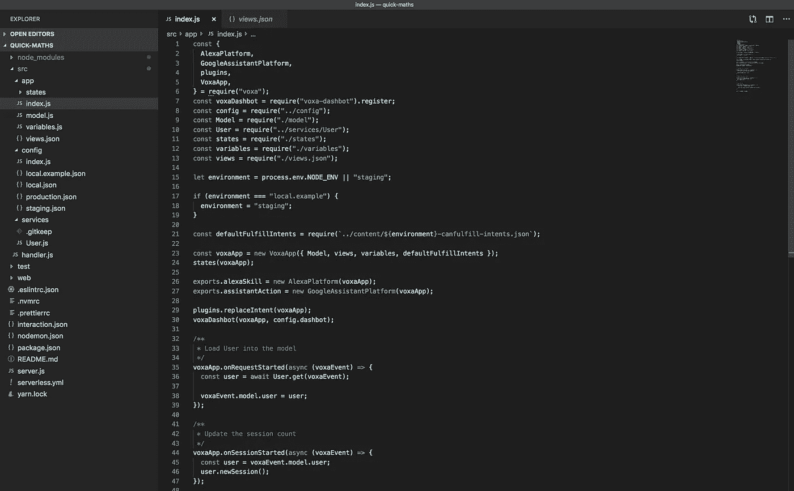
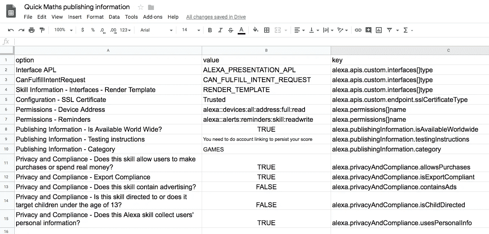
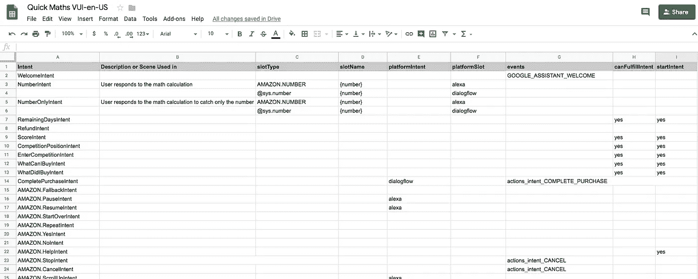
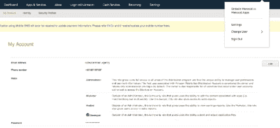
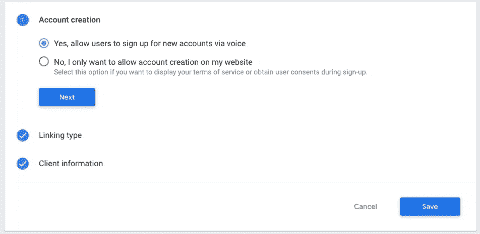

# 使用 VOXA 构建跨平台语音应用程序—第 2 部分

> 原文：<https://betterprogramming.pub/building-cross-platform-voice-apps-with-voxa-part-2-feb440ec5da0>

## 这是用 Voxa 创建跨平台语音应用系列的第二部分


由[亚采克·迪拉格](https://unsplash.com/@dylu?utm_source=unsplash&utm_medium=referral&utm_content=creditCopyText)在 [Unsplash](https://unsplash.com/search/photos/voice?utm_source=unsplash&utm_medium=referral&utm_content=creditCopyText) 拍摄的照片

在[上一篇文章](https://medium.com/better-programming/building-cross-platform-voice-apps-with-voxa-part-1-547f50675fa6)中，我简要解释了您可以使用 Voxa、 [voxa-cli](https://github.com/VoxaAI/voxa-cli) 工具以及我们将在本系列结束时创建的语音应用程序做些什么。

在本文中，我们将在您的帐户中创建 [Alexa 技能](https://developer.amazon.com/alexa/alexa-skills-kit/learn)和 [Google 操作](https://developers.google.com/actions/)。我们将创建电子表格来管理应用程序的 VUI(语音用户界面)部分。

当你在团队中工作时，这是非常有用的，其他人可以合作来提高你的 VUI。所以，让我们开始吧！


您可以使用谷歌电子表格来管理语音应用程序的 VUI(语音用户界面)。图片经由[www.pixabay.com](https://pixabay.com/illustrations/spreadsheet-file-miniature-icon-2127832/)

首先，我们需要使用 voxa-cli 创建一个项目。你可以在这里找到 [npm 包](https://www.npmjs.com/package/voxa-cli)。打开电脑上的终端窗口，键入:

```
npm i -g voxa-cli
```

此命令将在本地安装最新版本的 voxa-cli。命令完成后，您可以键入:

```
voxa create
```

这将引导您一步一步地使用一些选项设置您的项目:



创建 Voxa 项目的分步助手

你会被要求输入应用程序的名称、开发者的名字、平台和编程语言(JavaScript 或 TypeScript)。最后的一些问题与电子表格有关:交互模型、发布信息和`canFulfill`特性。

我们还将把我们的应用程序与 [DynamoDB](https://aws.amazon.com/dynamodb/) 和 [Dashbot](https://www.dashbot.io/) analytics 整合在一起，所以请务必对这些问题做出*是*的回答。

现在我们的基本代码已经创建好了，让我们来检查一下吧！您可以在终端中键入:

```
cd quick-maths; code .
```

这将使当前文件夹保留在项目的根目录下，并将使用 Visual Studio 代码打开它。



使用 voxa-cli 创建的 Voxa 项目的基本结构

运行`npm install`或`yarn install`创建`node_modules`文件夹。在我们的例子中，我们将使用`yarn`。

`src/app` 文件夹就是我们平时添加 app 逻辑的地方。我们将在下一篇文章中处理这个文件夹。

`src/app/index.js`文件是 app 的起点。正如我们在第 1 部分中解释的，Voxa 是一个 MVC 框架，所以我们将在下面的文件中考虑这些关键部分:

*   型号:`src/app/model.js` 文件。在对项目的每个请求中，您将可以访问一个`model`变量，在这里您可以调用所有的函数并访问模型的变量。
*   视图:`src/app/views.json` 文件。如果您使用 voxa-cli，该路径将更改为`src/languageResources`，工具将从交互模型电子表格中下载`VIEWS`，包括所有地区。如果您为动态内容定义变量，您可以在`src/app/variables.js`文件中定义这些变量。这些变量的值将从模型(`model.js`文件)中获取
*   控制器:`src/app/states`文件夹。您可以使用函数`voxaApp.onIntent`和`voxaApp.onState`和**定义所有意图和状态处理程序。**

Voxa 中状态文件的基本结构

我将把我的更改推送到不同分支中的[这个库:part2、part3、part4 和 part5:](https://github.com/omenocal/quick-maths-voice-app/)

`src/config`文件夹是您定义应用程序不同环境的地方。

Voxa-cli 添加了两个环境文件:生产和暂存。您可以通过将环境变量`NODE_ENV`设置为 staging、production 或您想要的环境来定义您想要使用的环境。

voxa-cli 还允许您从电子表格中下载意图、话语和视图。

还有另一个电子表格，你可以为你的 Alexa 技能定义所有的元数据信息:技能名称，权限，界面，描述，图像(URL)关键字等。

对于这个应用程序，我已经准备了两个公开的电子表格，你可以将它们复制到你的 Google Drive。

按照这个进入[发布信息电子表格](https://docs.google.com/spreadsheets/d/13Pwya7y26QsmOXVDv9a_Au1x9hPGn8jT8N2qoz2bCMQ/edit?usp=sharing)。



快速数学出版信息电子表格

在发布信息电子表格中，您会发现三个重要的选项卡:

*   为你的 Alexa 技能定义所有通用元数据信息。
*   `SKILL_ENVIRONMENTS_INFORMATION`:为 Alexa 和 [Dialogflow](https://dialogflow.com/) 定义端点。
*   `SKILL_LOCALE_INFORMATION@en-US`:定义特定于地区的信息，如图像、描述、关键字或示例短语。您也可以为其他地区创建其他选项卡，您只需要修改地区的后缀，如:`@en-GB`、`@de-DE`、`@es-ES`或`@it-IT`。

访问[交互模型电子表格](https://docs.google.com/spreadsheets/d/1uiXw38s6zzht1aPE2Iqe6dRYzXccKbn8lRpF9R6ivQ8/edit?usp=sharing)。



快速数学互动模型电子表格

在交互模型电子表格中，您会发现四个重要的选项卡:

*   `INTENT`:定义所有意图及其槽和类型。还有一个定义 Dialogflow 事件的列，如`GOOGLE_ASSISTANT_WELCOME`或`actions_intent_CANCEL`。您还可以添加特定于一个平台或另一个平台的意图，设置意图是否是一个`startIntent` (Dialogflow)或可以自动使用`CanFulfillIntent`界面(Alexa)。
*   `UTTERANCES_MAIN`:为您在`INTENT`选项卡中定义的每个意图定义所有话语。
*   `VIEWS_FILE@en`:定义你语音 app 的所有响应。您可以定义其他地区，就像发布信息电子表格中的`SKILL_LOCALE_INFORMATION`页签一样:`@de`、`@it`、`@es`、`@ru-RU`等。
*   `INVOCATION_NAMES`:为您拥有的每个环境定义调用名称。在我们的例子中，我们为生产环境设置了*快速数学*，为暂存设置了*快速数学暂存*。

现在，我们需要用电子表格的 URL 修改`interaction.json`文件。看看这个要点，看看你的文件应该是什么样的:

interaction.json 文件的基本结构

要下载这些资源，我们需要一个来自 Google Cloud 的密钥。你可以查看 [GitHub 资源库](https://github.com/VoxaAI/voxa-cli)，按照说明创建 Google Cloud 项目。

当你下载密钥文件时，将其复制到你的语音项目的根文件夹中，并命名为`client_secret.json`。现在，您可以运行:

```
yarn interaction
```

这将下载您的发言和回应。您将看到三个新文件夹:

*   `/src/content`:用 voxa-cli 下载的其他内容。例如，`{environment}-canfulfill-intents.json`文件。
*   `/src/languageResources`:从电子表格下载的视图。
*   `/speech-assets`:Alexa 和 Dialogflow 的交互模型。

你可以在这个库的这个[分支](https://github.com/omenocal/quick-maths-voice-app/tree/part2)中仔细检查项目到目前为止的进度，当我们按照一步一步的指示操作时，我用这个分支来推动我的变更。

现在，是时候在您的客户中创造技能和行动了。去亚马逊开发者控制台[创建一个叫做*快速数学*的技能。并且，在](https://developer.amazon.com/alexa/console/ask)[动作控制台](https://console.actions.google.com)中，创建一个*快速数学*动作。

对于 Alexa，转到*构建*选项卡，在 *JSON 编辑器*菜单下复制`/speech-assets/alexa/en-US/{environment}-interaction.json` 文件内容，这取决于您想要首先设置的环境。

如果您已经设置了 ASK CLI，您可以运行以下命令:

```
ask api update-model -s {SKILL_ID} -f speech-assets/alexa/en-US/production-interaction.json -l en-US
```

要更新技能元数据，您可以运行

```
ask api update-skill -s {SKILL_ID} -f speech-assets/alexa/production-manifest.json
```

对于 Dialogflow，进入*动作*菜单，点击*构建*按钮，进入 Dialogflow 控制台。

可以将`/speech-assets/dialogflow/{environment}/` 路径的内容压缩，上传到 Dialogflow。转到*设置*按钮⚙️，点击*导出和导入*选项卡。

点击*从 zip 文件中恢复*按钮，从项目中拖动 ZIP 文件。最后，进入*集成*菜单，点击*谷歌助手*按钮，点击*测试*按钮。

# Alexa 的帐户链接

先说 Alexa。进入开发者门户网站，在页面的右上角有一个按钮，上面有你账户名称的首字母，点击它，然后点击*设置*。

在这篇来自 Alexa 博客的[帖子](https://developer.amazon.com/blogs/post/Tx3CX1ETRZZ2NPC/Alexa-Account-Linking-5-Steps-to-Seamlessly-Link-Your-Alexa-Skill-with-Login-wit)中，你会看到如何创建账户链接的`LoginWithAmazon`配置的详细步骤说明。



逐步创建 LoginWithAmazon 配置

转到开发人员门户控制台中的技能配置。在*账户链接*菜单下，启用*账户链接*并粘贴以下值:

```
Authorization URI: [https://www.amazon.com/ap/oa](https://www.amazon.com/ap/oa)Access Token URI: [https://api.amazon.com/auth/o2/token](https://api.amazon.com/auth/o2/token)ClientID: from LoginWithAmazonClientSecret: from LoginWithAmazonClient Authentication Scheme: HTTP BasicScopes: profile, postal_codeDomain list: [amazon.com](http://amazon.com), [na.account.amazon.com](http://na.amazon.com)
```

# 谷歌的登录

转到操作控制台中的操作配置。在*账户链接*菜单下，按照以下步骤操作:

*   账户创建:选择*是*，允许用户通过语音注册新账户。
*   链接类型:Google 登录。

点击*保存*。



设置 Google 登录的步骤

# 最后的

完成这两个步骤后，我们就完成了语音应用程序的帐户链接集成。在下一篇文章中，我们将为游戏和比赛创建逻辑。

感谢阅读！请务必查看下一篇文章。