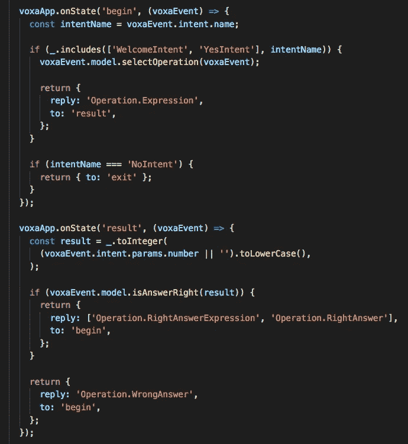
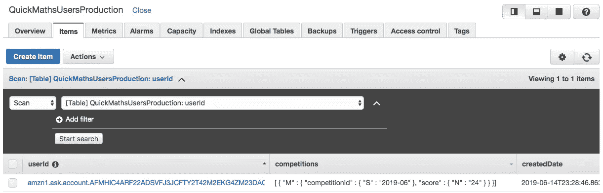
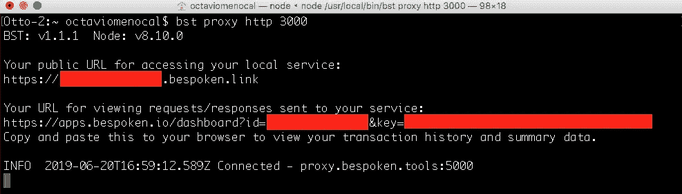
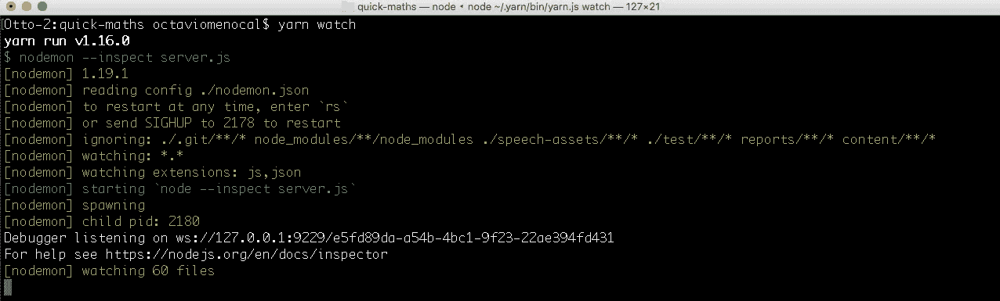
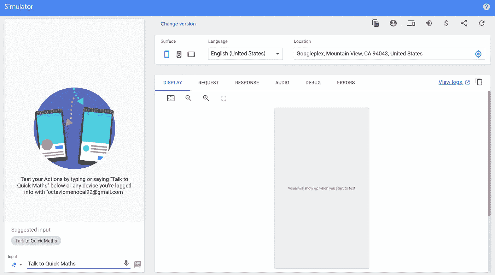
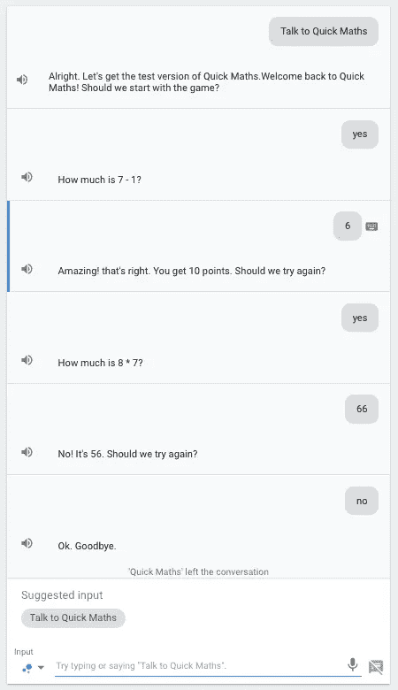

# 用 VOXA 构建跨平台的语音应用——第 3 部分

> 原文：<https://betterprogramming.pub/building-cross-platform-voice-apps-with-voxa-part-3-e738cd991fde>

## 在 VOXA 中创建跨平台语音应用系列的第三部分


由[罗迪翁·库察耶夫](https://unsplash.com/@frostroomhead?utm_source=unsplash&utm_medium=referral&utm_content=creditCopyText)在 [Unsplash](https://unsplash.com/search/photos/voice-cellphone?utm_source=unsplash&utm_medium=referral&utm_content=creditCopyText) 上拍摄的照片

在[之前的文章](https://medium.com/better-programming/building-cross-platform-voice-apps-with-voxa-part-2-feb440ec5da0)中，我们创建了 Alexa skill 和 Google Assistant 应用。我们还创建了 VUI 电子表格，您团队中的任何人都可以通过为您的语音应用程序添加意图、话语和响应来进行协作。此外，我们了解到，我们可以使用 VOXA-CLI 将所有这些信息下载到我们的 VOXA 项目中，并从头开始创建项目。最后，我们添加了链接到 Alexa skill 的帐户和 Google action 的 Google Sign-In。在本文中，我们将创建游戏的基本逻辑，获取用户信息，并在 AWS DynamoDB 中保持进度。

所以，让我们开始吧！


图片来自[www.pixabay.com](https://pixabay.com/images/search/equation/)

正如我们在本系列的第一部分中了解到的，VOXA 利用 MVC 原则来分离三个不同的层:模型、视图和控制器。我们将尝试在我们的应用程序中遵循这一模式:

*   **/src/app/model.js** 文件中的模型
*   **/src/languageResources** 文件夹中的所有视图。
*   **/src/app/states** 文件夹中的所有控制器。

你可以从快速数学模板下载代码，我已经把它推送到我的 GitHub 库的分支 [part3](https://github.com/omenocal/quick-maths-voice-app/tree/part3) 中。

让我们检查一下 model.js 文件。该文件太大，无法在此显示，因此请通过[该链接](https://github.com/omenocal/quick-maths-voice-app/blob/part3/src/app/model.js)将其签出到存储库中。

有两种重要的方法来生成游戏的主要逻辑:

`selectOperation(voxaEvent)`

和

`isAnswerRight(result)`

在`selectOperation`中，我们随机选择数字和运算符，让用户计算结果。我们暂时简化一下，一次只有两个数字和一个操作符。我们还确保结果永远不会是负面的。我们不希望用户在尝试计算 51–78 时失去理智，例如，这仍然是一个简单的操作，但我们希望用户参与我们的应用程序。如果他们在开始使用应用程序时得到这种操作，他们可能会停止使用它！

```
if (this.user.isFirstTime) {
  this.level = _.head(levels);
} else if (this.user.sessionCount <= 3) {
  this.level = _.nth(levels, this.user.sessionCount);
} else {
  this.level = _.sample(levels);
}
```

有了这段代码，我们就可以确保难度是根据用户开启技能的次数来决定的。

此外，您可能会发现这段代码很有趣:

```
const wordsNumber1 = ntw.toWords(this.number1);
const wordsNumber2 = ntw.toWords(this.number2);
const params = {
  operatorName: this.operatorName,
  wordsNumber1,
  wordsNumber2,
};

const speech = voxaEvent.t('Operation.Expression.calculation', params);
const durationTime = readingTime(speech);

console.log('speech', speech);
console.log('durationTime', durationTime);

this.speechTimeDiff += durationTime.time;
```

请记住，我们根据用户计算结果所用的时间给他们打分，但我们必须考虑 Alexa 持续的时间:

*   55 * 2 是多少？
*   105 + 203 是多少？
*   3512–512 是多少？

时间不能固定为一个单一的数字，所以我们使用[数字转文字](https://www.npmjs.com/package/number-to-words)和[阅读时间](https://www.npmjs.com/package/reading-time) NPM 包来计算它。这个时间不是 100%准确——它会根据 Alexa 和托管技能的服务器之间的互联网连接而变化。使用当前值，您会发现在本地测试您的技能时，它不是 100%准确，但是我发现在将代码部署到 AWS Lambda 函数时，它是相当准确的。

在`isAnswerRight`方法中，我们获取用户计算操作所用的秒数，并相应地给他们打分:

```
if (timeDiff <= 3000) {
  pointsEarned += 10;
} else if (timeDiff <= 6000) {
  pointsEarned += 8;
} else if (timeDiff <= 9000) {
  pointsEarned += 4;
} else {
  pointsEarned += 2;
}
```

在**/src/app/States/main . States . js**文件中，您可以看到我们用来控制这个流的主要状态:



VOXA 状态处理程序

对话是这样的:

用户:Alexa，打开快速数学

Alexa:欢迎回到快速数学！要不要从游戏开始？

用户:是的

Alexa:995-213 是多少？

用户:782

Alexa:太棒了！你得到 2 分。我们应该再试一次吗？

用户:是的

亚历山大:7 * 9 是多少？

用户:73

亚历克莎:不！是 63。我们应该再试一次吗？

用户:没有

亚历山大:好的。再见。

在 VOXA 中，我们控制我们想要返回的视图和我们期望下一次交互的状态。例如:

```
return {
    reply: [‘RightAnswerExpression’, ‘RightAnswer’],
    to: ‘begin’,
 };
```

`RightAnswerExpression`是一个具有独特指令的视图:`**say**`。在 VOXA 中，这意味着视图的内容将被附加到我们在相同状态或下一个状态中使用的下一个视图，直到我们设置了将响应返回给 Alexa 或 Google 的点。

`RightAnswer`是一个带有三个指令的视图:

*   **问**:Alexa 或者 Google 会给出的主要回应。这表示响应应该返回到语音平台，而不是另一个 VOXA 状态。
*   如果用户在主要发言后保持沉默，Alexa 或谷歌将给出重新提示。
*   **dialogflowSuggestions** :谷歌助手屏幕下方显示的建议。

VOXA 有几个指令，可用于渲染特定于平台的功能。例如:

*   **alexaCard** :为 Alexa 渲染一个链接卡、简单卡或基本卡
*   alexaAPLTemplate :呈现一个 APL 模板指令
*   **alexaRenderTemplate** :呈现 DisplayTemplate 指令
*   **dialogflowSuggestions** :为谷歌助手渲染建议芯片
*   **dialogflowTable** :为谷歌助手渲染一个表格
*   **googleCompletePurchase** :呈现 Google 的 DigitalGoods 指令

点击以下链接查看其他 Alexa 和谷歌助理指令:

[Alexa 指令](https://voxa.readthedocs.io/en/latest/alexa-directives.html)

[谷歌助手指令](https://voxa.readthedocs.io/en/latest/google-assistant-directives.html)

# AWS DynamoDB 集成

我们将使用 DynamoDB 表来存储用户的信息——他们的进度、记录的创建日期、他们开启技能的次数，以及您想要存储的任何其他数据。

转到您的 AWS 帐户并创建一个 DynamoDB 表。我创建了两个表: **QuickMathsUsersStaging** 和**QuickMathsUsersProduction**，因为我想拥有两种不同的技能，一种用于测试，另一种用于认证。



**QuickMathsUsersProduction**DynamoDB 表格视图

请记住将这类信息添加到项目的配置值中，这样您就不必在代码的几个部分中像这样定义重要的值。因为我们在不同的环境中使用不同名称的表，所以有必要将表的名称放在您的配置文件中的 **/src/config/** 文件夹中。

# 在本地测试技能

首先，确保您的项目中有本地文件。如果没有，可以简单的复制**/src/config/local . example . JSON**文件，创建 **/src/config/local.json** 文件。如果您使用 staging 中的相同配置，您可以选择 **staging.json** 文件来复制内容。

我们将使用一个优秀的工具进行本地调试: [Bespoken tools](https://www.npmjs.com/package/bespoken-tools) 。如果您的计算机中没有安装它，请下载并全局安装该软件包。

Bespoken 提供了一个代理命令，将来自 Alexa 或 Google Assistant 应用程序的请求重定向到您的本地机器，您只需在您的终端上运行:

*bst 代理 http <端口>*

运行这个程序，您将有一个代理在您喜欢的端口上运行。我总是用 3000，那是我最喜欢的一个！



在您计算机的端口 3000 本地运行的预定服务器

对于预订的 URL，您需要根据您想要运行的平台添加一个路径:

Alexa:[https://<YOUR-BESPOKEN-ID>. BESPOKEN . link/Alexa](https://dreamy-bradbury.bespoken.link)

谷歌:[https://<YOUR-BESPOKEN-ID>. BESPOKEN . link/Google action](https://dreamy-bradbury.bespoken.link)

现在，打开一个新的终端窗口，转到项目的根路径并运行:

*纱线手表*



使用**纱线观察**命令为语音应用启动 VOXA 服务器

这将启动项目的一个服务器，运行在端口 3000，等待来自 Alexa 或 Google 的请求。

我更喜欢用纱线工作，但你也可以运行 **npm run watch。**

转到 Dialogflow，确保你更新了所有的意图和话语。你可以通过压缩 dialogflow 文件夹中的所有内容来做到这一点:**/speech-assets/dialog flow/<environment>**，可以是 staging 也可以是 production。在您的代理中，转到设置按钮⚙，然后转到**导出和导入**选项卡。点击**恢复**按钮，拖放 zip 文件。然后进入左侧的履行菜单，粘贴你预约的网址:[https://<YOUR-BESPOKEN-ID>. BESPOKEN . link/Google action](https://dreamy-bradbury.bespoken.link)。

然后在 integrations 选项卡中，单击 Google Assistant 集成，并单击 TEST 按钮。这将把你带到谷歌行动的模拟器页面，我们可以在那里开始测试！



我们的快速数学谷歌行动的主视图

如果一切正常，你将有谷歌行动发送请求回你的电脑。同时，VOXA 将把结果保存在 DynamoDB 中。



快速数学谷歌行动对话示例

在您的终端窗口中，您将看到 bespoken 如何记录请求和响应，以及 VOXA 服务器如何记录我们正在记录的一些重要数据。你也可以打印任何你想检查的数据。

在这一点上，我们已经有一个 Alexa 技能和谷歌行动准备发送认证。我们只需要创建一个 lambda 函数来上传我们的代码。本指南不包括代码的部署，但我建议你上传你的代码到两个不同的 Lambda 函数——一个用于 Alexa 技能，另一个用于 Google 动作。

对于 Google Action，您还需要创建一个 API 网关，通过 Dialogflow 可以访问的 https 端点来公开您的 Lambda 函数。

# 最后的

我们将进一步发展。在下一篇文章中，我们将创建竞争流。这场比赛将显示前 10 名的球员与更多的分数在一个排行榜，使它更有趣。我们将为我们的应用程序添加订阅，每月仅需 0.99 美元！这将是一个学习如何将我们的语音应用货币化的好机会。我们将利用 Alexa 的技能内购买和谷歌的数字商品 API。

感谢阅读！请务必查看下一篇文章。

记住:不要把垃圾扔到海里！