# 用 VOXA 构建跨平台的语音应用——第 4 部分

> 原文：<https://betterprogramming.pub/building-cross-platform-voice-apps-with-voxa-part-4-f7de737b0cd5>

## 在 Voxa 中创建跨平台语音应用系列的第四部分

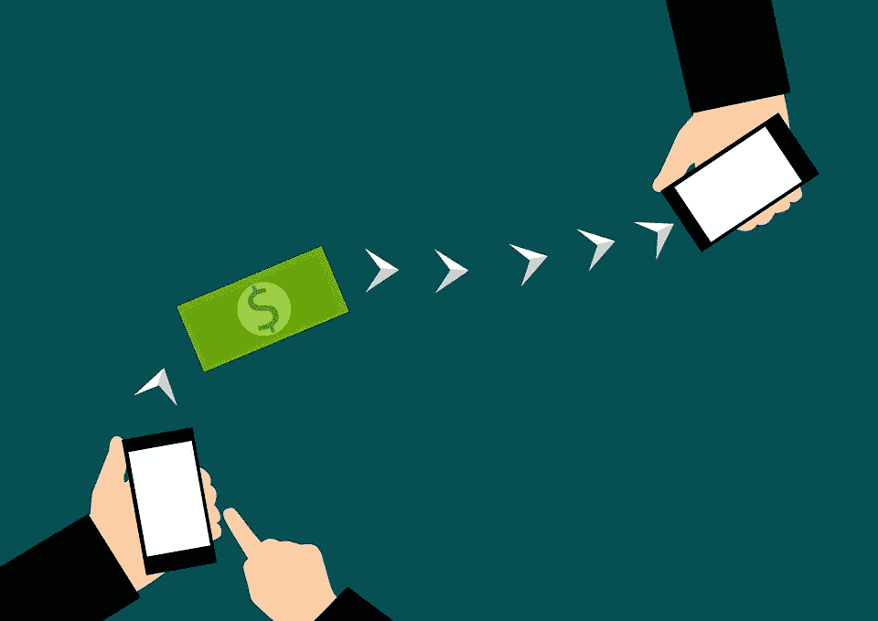

图片来自 www.pixabay.com

这是用 [Voxa](http://voxa.ai/) 创建跨平台语音应用系列文章的第四部分。

在[之前的文章](https://medium.com/better-programming/building-cross-platform-voice-apps-with-voxa-part-3-e738cd991fde)中，我们创建了我们游戏的逻辑，积分将如何计算，如何随机创建一个操作让用户计算结果，我们将我们的语音应用程序连接到 [DynamoDB](https://aws.amazon.com/dynamodb/) 以持久化用户在游戏中的进度。

这让我们可以向 Alexa 和 Google Assistant 商店发布一款语音游戏，但我想更进一步。

在本文中，我们将添加 Alexa 的 ISP 和 Google Assistant 的数字商品，以销售游戏中某个竞赛的月订阅。让我们看看如何做到这一点！

在 Alexa 和 Google Assistant 这两个语音平台中，有三种方法可以让你的语音应用赚钱:

*   权利:一次性购买，终身购买。
*   订阅:支付月费或年费以获得高级功能。
*   消耗品:反复购买应用程序的功能/产品，就像生活在游戏中一样。

我们将通过订阅为我们的快速数学应用程序举办月度竞赛。

用户将能够玩正常的游戏，但如果他们想参加比赛，他们必须每月支付 0.99 美元。

# Alexa 的 ISP

让我们从添加一个 Alexa ISP 订阅开始。确保您已经安装了 [ASK CLI](https://www.npmjs.com/package/ask-cli) 。转到项目的根文件夹，键入:

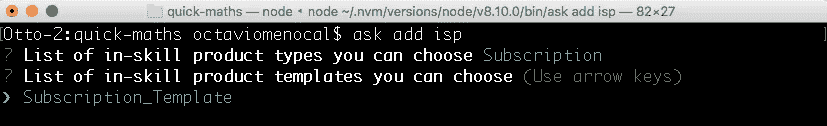

将 ISP 添加到你的 Alexa 技能中

选择*订阅*，命名为:`competition`。

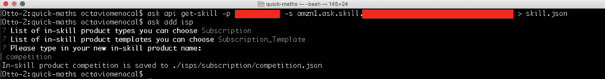

**竞赛** ISP 创建

JSON 文件将创建在根文件夹中，路径为:`./isps/subscription/competition.json`。

要部署您的 ISP 订阅，您可以使用命令:

```
ask deploy -t isp
```

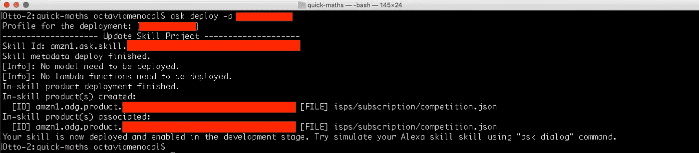

使用 ASK CLI 部署您的 ISP

这只会从`isps`文件夹中推送变更，而不是交互模型或`skill.json`文件内容。

你可以在分支 [part4](https://github.com/omenocal/quick-maths-voice-app/tree/part4) 下载项目的最新版本。在[6 月 3 日](https://developer.amazon.com/es/blogs/alexa/post/6704c2d4-eac1-4a97-b631-57d2a43a1cd3/developers-in-the-uk-and-germany-can-now-monetize-alexa-skills-with-in-skill-purchasing-isp)，亚马逊宣布 ISP 已经扩展到英国和德国，所以我们不仅要在美国销售我们的订阅，还要在英国销售

Google Assistant 确实从一开始就支持这个地区。在英国的价格是 0.99 英镑。

# 谷歌助手的数字商品

为 Google Assistant 设置数字商品稍微难一点。

嗯，你的第一个障碍是你需要购买一个域名来链接你的行动。就我而言，我以前不需要域名，所以我买了一个新的谷歌域名。

当你有了你的域，进入你的动作设置，*部署*标签，然后*品牌验证*菜单，点击*连接站点*按钮。

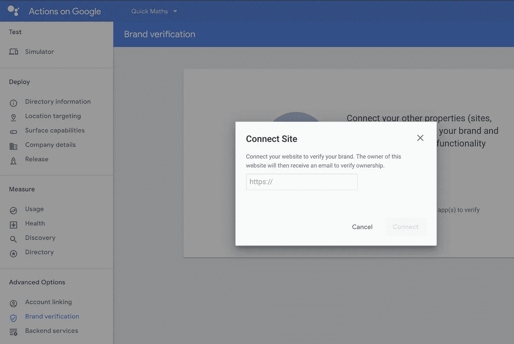

将您的领域与您的行动联系起来

输入您域名的网址，点击*连接*。

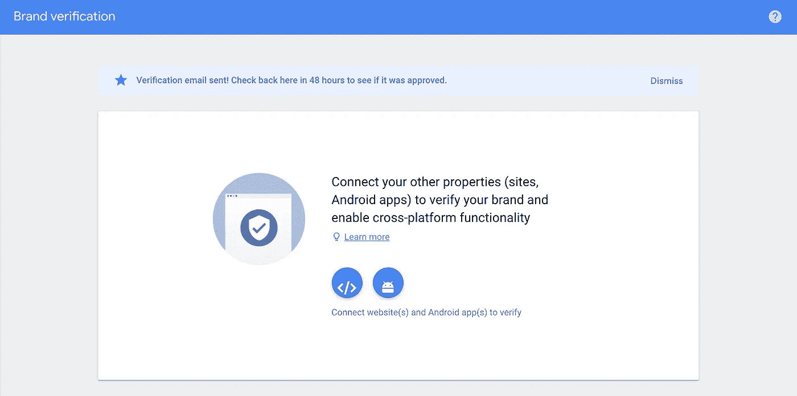

品牌验证请求已完成

您应该等待 48 小时，以获得您的域验证。因为我的域名是用谷歌域名创建的，所以验证的时间不到六个小时。

现在，是时候创建应用内购买订阅了。Alexa 在他们自己的开发者门户网站上管理 ISP。

对于 Google Assistant，您需要在您的[开发者游戏控制台](https://play.google.com/apps/publish)帐户中创建一个应用内产品。而且，这是你的行动需要的下一笔付款，在本文发表时，创建一个 Play console 帐户需要 25 美元。

当你进入 Google Play 控制台时，主视图是这样的。就我而言，我已经有了应用内购买。点击*创建应用*按钮创建新的订阅。

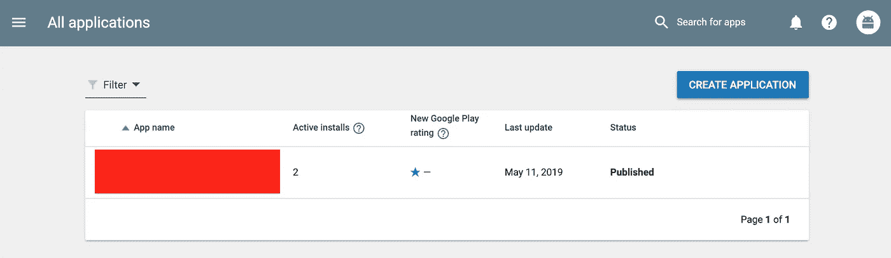

Play Store 应用程序的主屏幕

选择语言(默认为美国英语)并写下标题，然后点击`CREATE`。

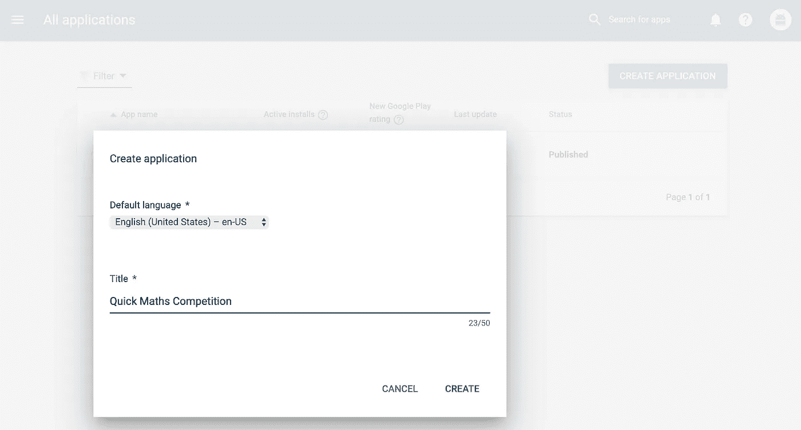

命名您的应用内订阅

然后，你需要像在谷歌助手里一样填写一些字段；描述、图片，更重要的是，有*计费*权限的空 APK。

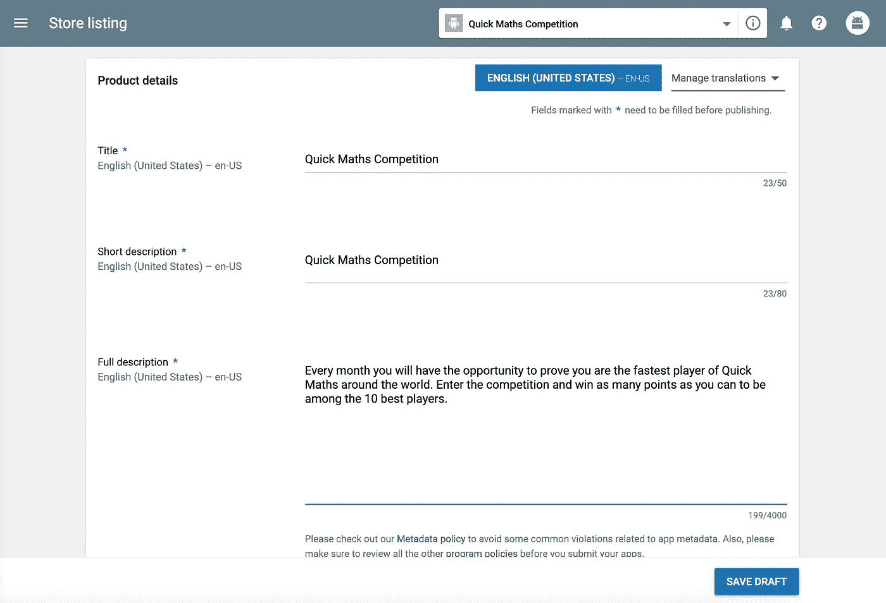

为你的应用内购买项目存储列表信息

然后，进入*应用发布*菜单，上传安卓应用的 APK。

根据文件，你不需要在商店里有一个公共应用程序，你只需要在其中一个渠道创建你的应用内购买。在这种情况下，我将在公测频道发布 APK。

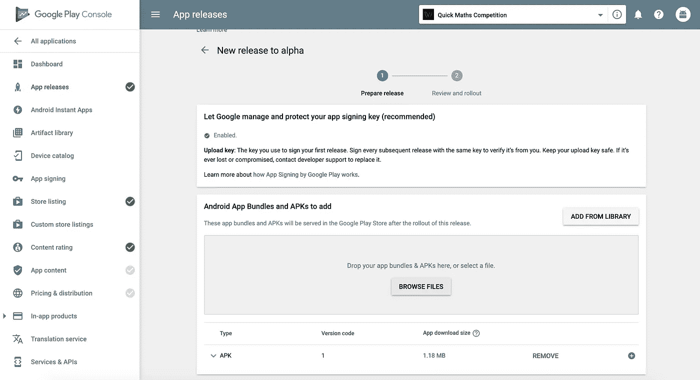

发布新版本的空 Android 应用程序

现在，您需要将您的网站链接到您的应用内订阅，以便 Google Actions 控制台可以将您的产品链接到您的操作。

进入*服务&API*菜单链接你的网站。

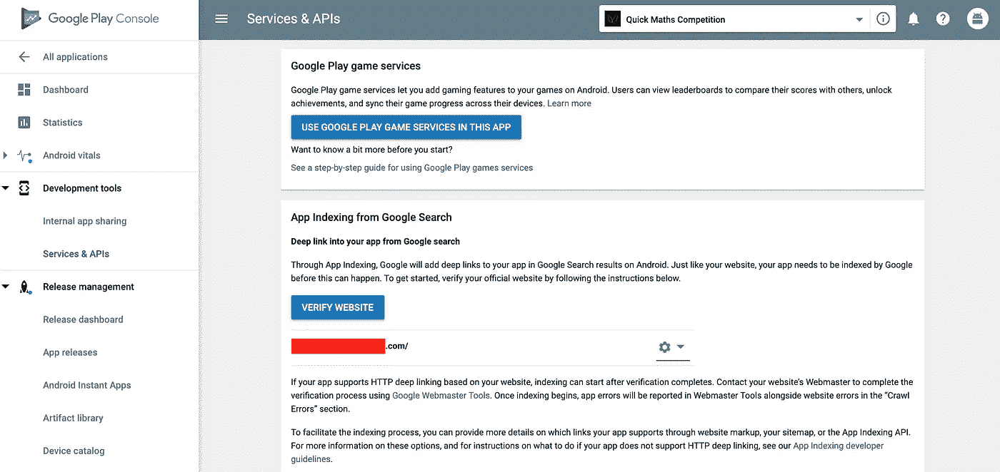

将您的网站链接到您的应用内订阅

在*内容分级*菜单中，为您的应用申请分级。若要对你的应用进行评级，你需要先上传你的 APK。最后，我们将返回应用发布菜单，提交应用进行认证。

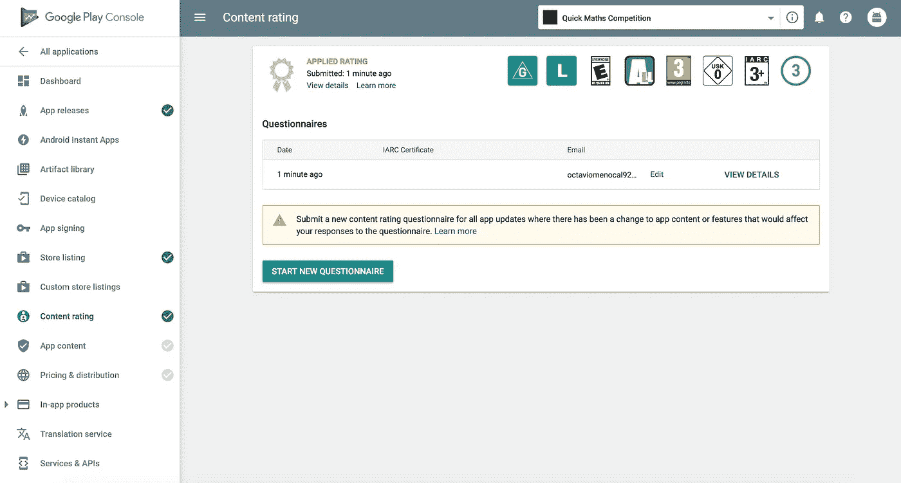

为你的应用内订阅评分

在 *Price & distribution* 菜单中，选择您希望订阅可用的国家/地区，默认情况下会选择 145 个国家/地区，其中四个因谷歌政策而被禁止。

您甚至可以修改每个国家的套餐价格。默认选择的数量是最小值。

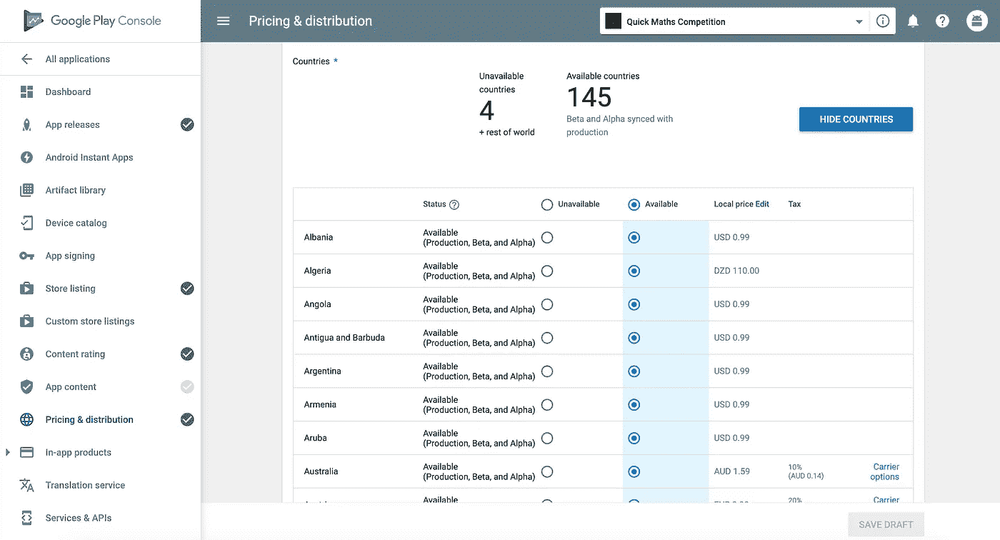

您希望将应用分发到的国家和价格

最后，在*应用内容*菜单中，为你的应用选择目标受众。

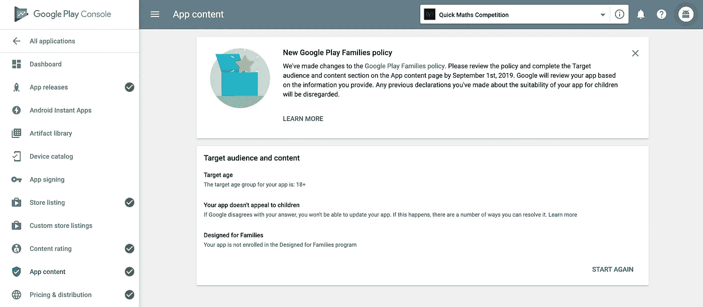

目标受众

检查所有绿色标记后，这意味着您已准备好提交您的应用程序进行认证。

进入*应用发布*菜单。然后，你必须等待几天，让你的应用内产品出现在谷歌控制台的操作中，对我来说，这需要从周六到周二(三天)。

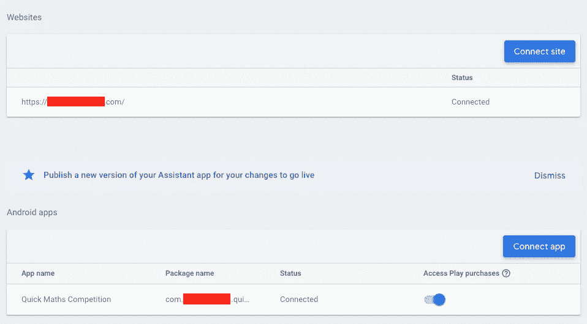

与您的行动相关的应用内产品

# 谷歌云控制台配置

既然您已经设置了 Google Play 控制台配置，我们应该获得一个 JSON 键，以便能够在 Google Play 中查询订阅。

在 Google Cloud 中查看项目配置的最简单方法是在*测试*菜单中，然后转到右上角并单击*设置*菜单，然后单击*管理用户访问*标签。

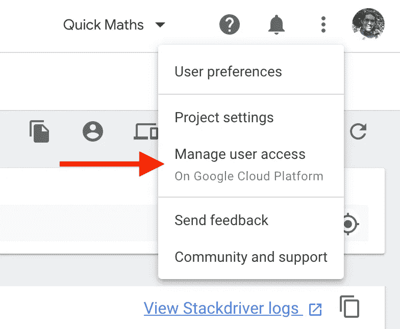

访问项目的谷歌云配置

这将把你带到 Google Cloud 中的 *IAM* 菜单，在这里你可以邀请其他人来测试你的应用程序。要获取密钥，请进入*服务账户*菜单。

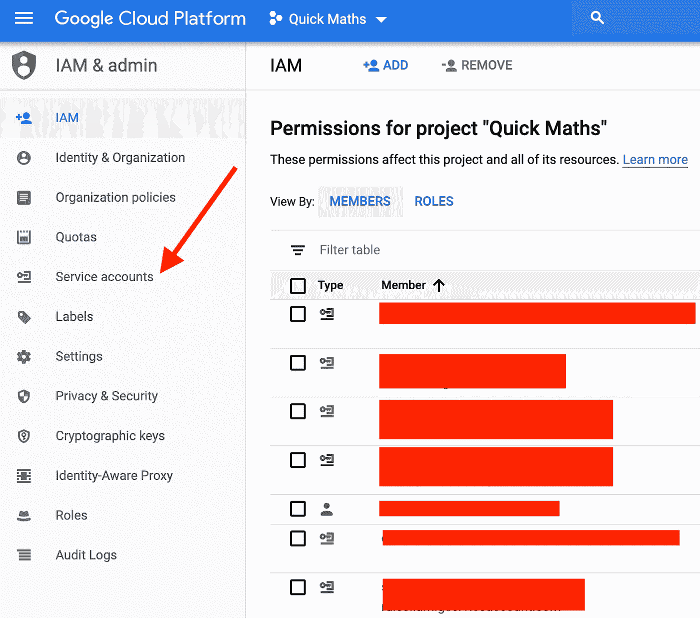

谷歌云控制台视图

点击 *CREATE SERVICE ACCOUNT* 标签，为您的密匙命名和描述，并为您的项目下载 JSON 密匙。确保将该文件放入项目的路径:`./src/client_secret.json`。

现在，转到 API 仪表板，单击*启用 API 和服务* 并查找操作 API 以启用它。

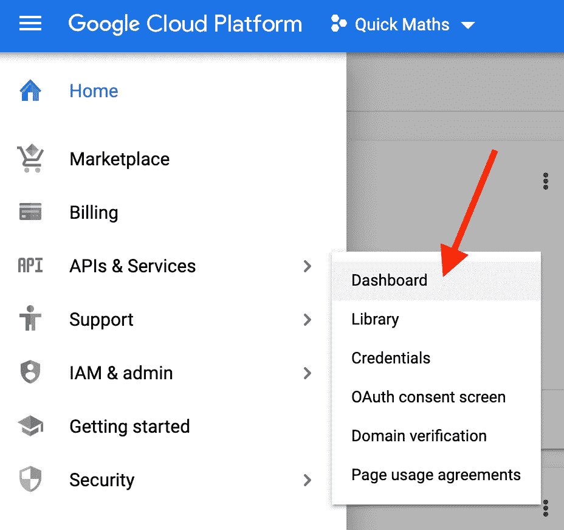

API 和服务

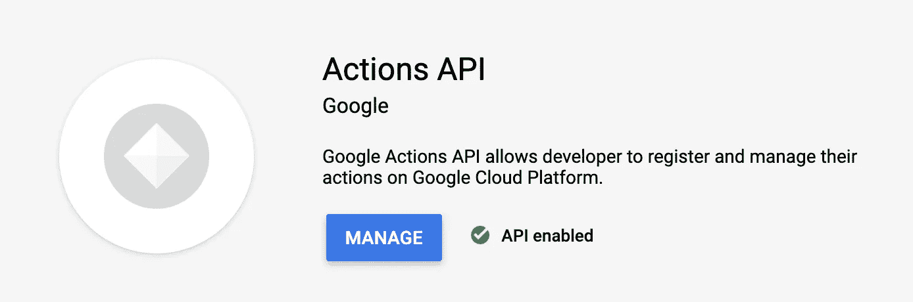

项目的操作 API

# 你需要检查的东西

这一节写于 9 月 1 日，也就是我开始写这篇文章的两个月后。

我一直在努力寻找为什么我会得到一个奇怪的没有记录的`INVALID_ARGUMENTS`错误。我甚至联系了谷歌团队，但他们不知道到底发生了什么。

过了这么久，我发现了错误。但这不仅仅是一个错误，更像是一个应该在文档中澄清的技术问题。

测试你的动作的用户不应该因为任何原因点击标签`Stop <actionName> from remembering me`。

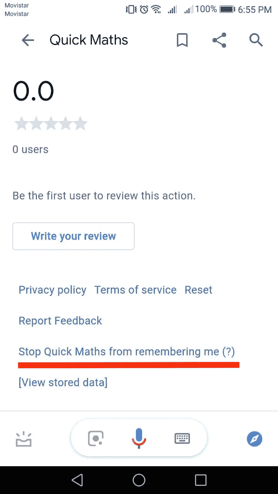

如果他们点击此选项，他们将被自动视为您应用程序中的*客人*，该用户不能购买您的订阅或任何其他数字商品。

如果用户是来宾，JSON 有效负载中的`conversationId`值是一个编号字符串，如`153982789723948`，而不是一个长字符串，如:

```
ABwppHEqSttOVOPiYZE8SJ35bO4qzHGxE7dhEi3W3s4P7kOA_34Lu0607awo9S2fgK1rAxIu8PxcHclUZsVQU
```

当你创建你的谷歌行动时，确保在你的账户中检查这一点，并且在你可能有麻烦的其他账户中检查这一点。

# 竞争逻辑

正如您在第 2 部分中注意到的，我们打算处理销售订阅的操作，例如当用户要求参加比赛或要求退款时，他们可以购买什么，他们购买了什么，要求他们的分数，以及比赛的剩余天数。

所有这些意图都在一个名为`competition.states.js`的新控制器文件中处理。

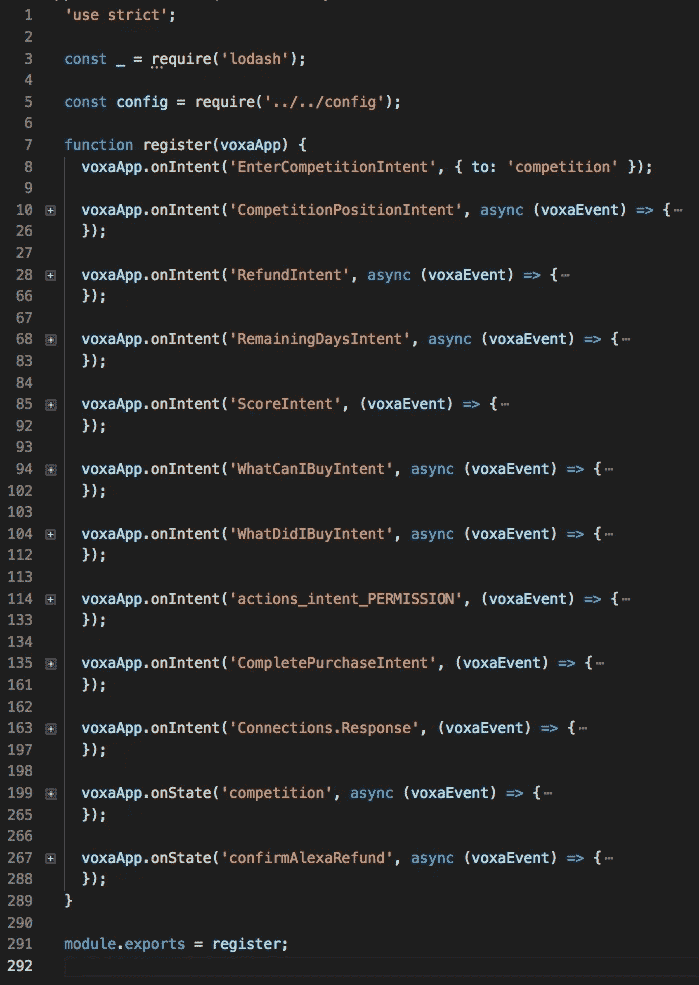

competition.states.js 文件

这个文件包含销售数字商品和 ISP 的所有处理程序和验证。我想强调的一个州是`competition`州:

一旦用户要求参加比赛，我们会检查用户是否已经订阅，让他们知道没有必要再次订阅。

然后，我们检查他们是否没有关联帐户。知道用户的姓名和电子邮件地址很重要。之后，我们分开验证，并检查 Alexa 和谷歌助理的验证不同。

对于 Alexa，我们检查他们是否允许访问他们的位置，这是为了在排行榜上显示他们来自哪里。Voxa 有一个很好的处理程序，可以通过简单的操作获得用户的地址:

```
const info = await voxaEvent.alexa.deviceAddress.getAddress();
```

对于 Google Assistant，我们需要访问用户的位置，所以我们发送一个`dialogflowPermission`指令来请求`DEVICE_PRECISE_LOCATION`和`DEVICE_COARSE_LOCATION`。

当用户接受或拒绝这个请求时，`actions_intent_PERMISSION` 状态将处理这个请求，我们验证他们是否授予了权限或不前进。

如果到目前为止一切正常，我们会向 Alexa 发送一个`alexaConnectionsSendRequest` 指令:

```
const buyDirective = await voxaEvent.alexa.isp.buyByReferenceName(
 config.alexa.subscriptionId,
 token,
 );return {
 alexaConnectionsSendRequest: buyDirective,
};
```

对于 Google Assistant，我们将使用的指令是`googleCompletePurchase`。你可以在他们的[数码商品指南](https://developers.google.com/actions/transactions/digital/dev-guide-digital)中了解更多完整的流程。

当在 Google Assistant 中触发购买流程时，它会在您的手机上显示这样一个屏幕:

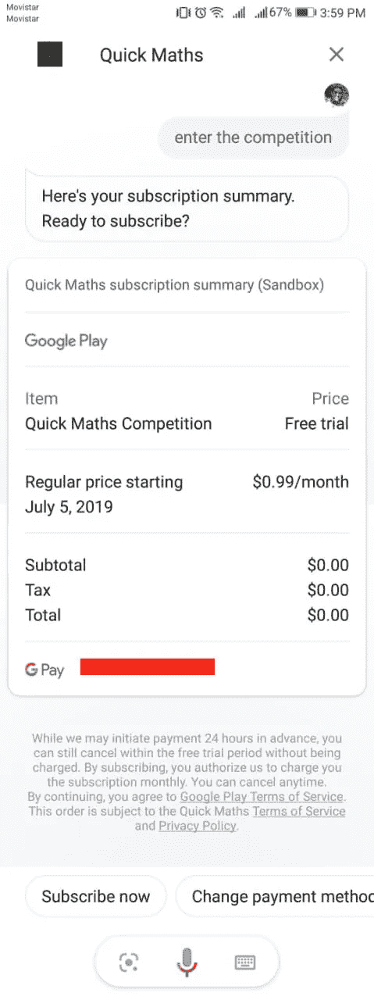

使用谷歌助手购买数字商品时的收据

当购买过程完成时，我们的 Voxa 应用程序将处理处于`Connections.Response` 状态的 Alexa 结果和处于`CompletePurchaseIntent` 状态的 Google 结果。

# 最后的

另一个有趣的代码是我们如何在设备屏幕上显示排行榜，我相信你会非常关注。

在[下一篇也是最后一篇文章](https://medium.com/better-programming/building-cross-platform-voice-apps-with-voxa-part-5-1f0aff32185)中，你将看到我们如何为 Alexa 添加 APL 模板，为 Google Assistant 添加表格卡，显示我们游戏的排行榜。

感谢阅读！