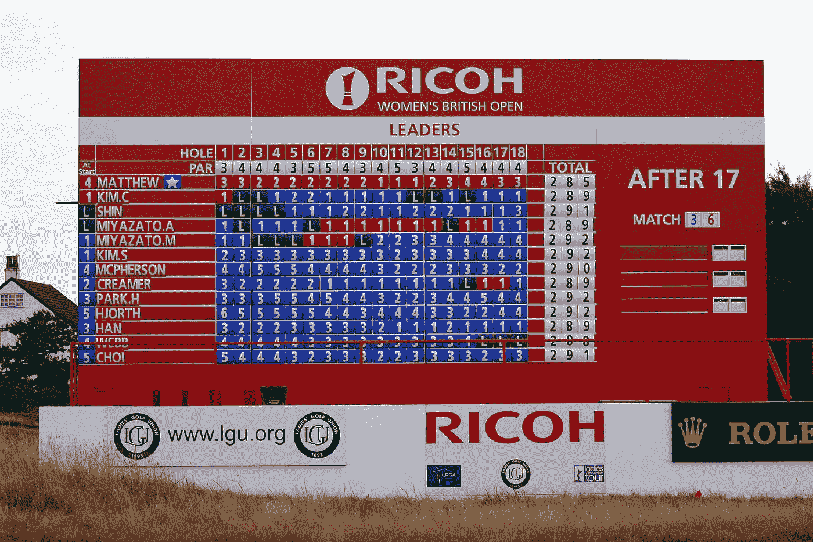
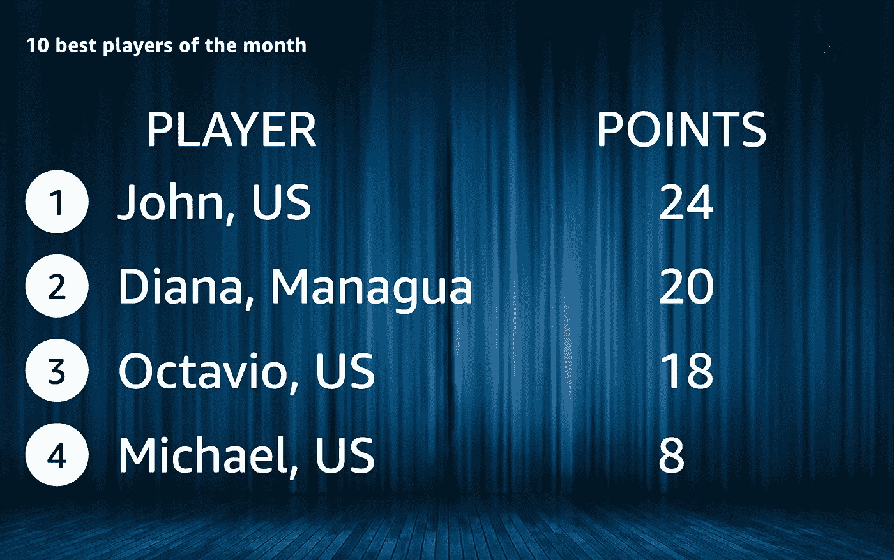
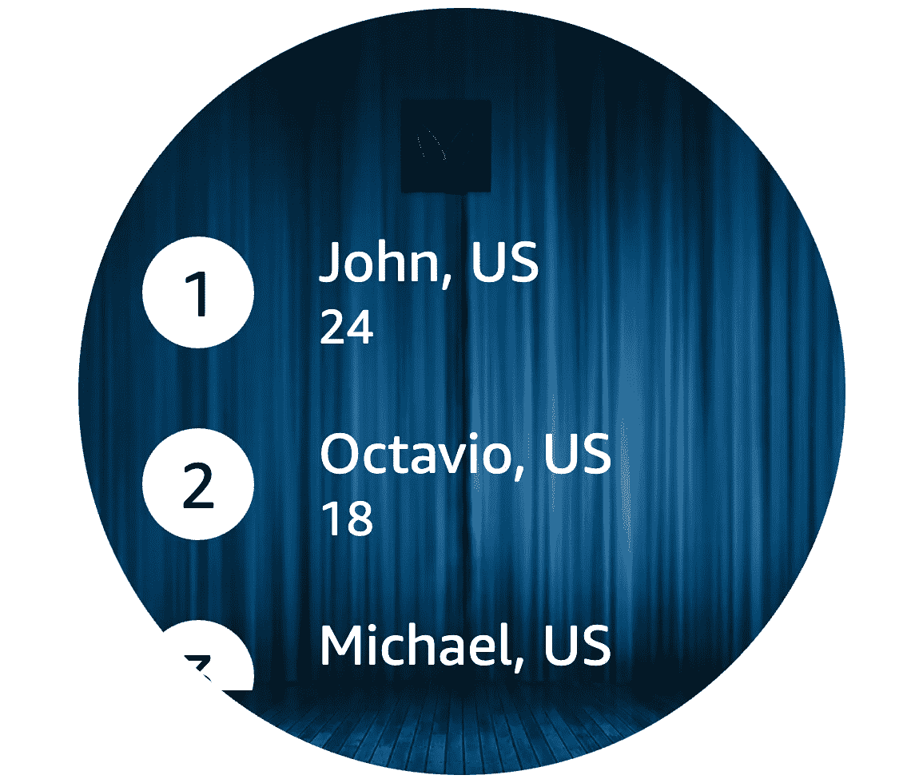
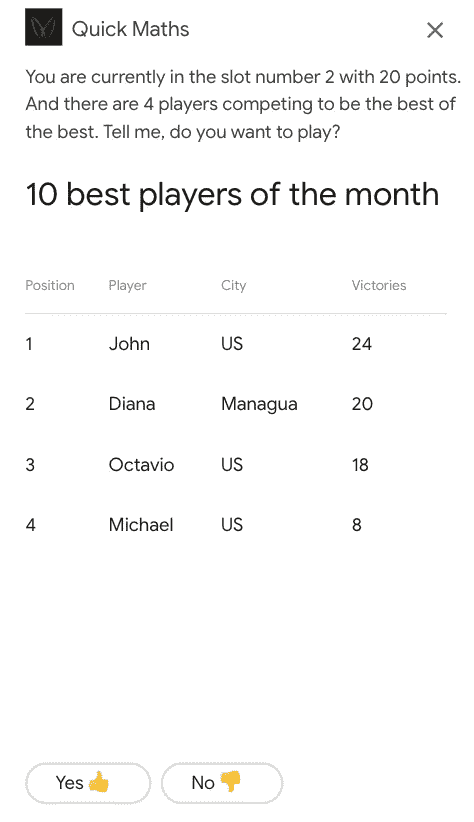
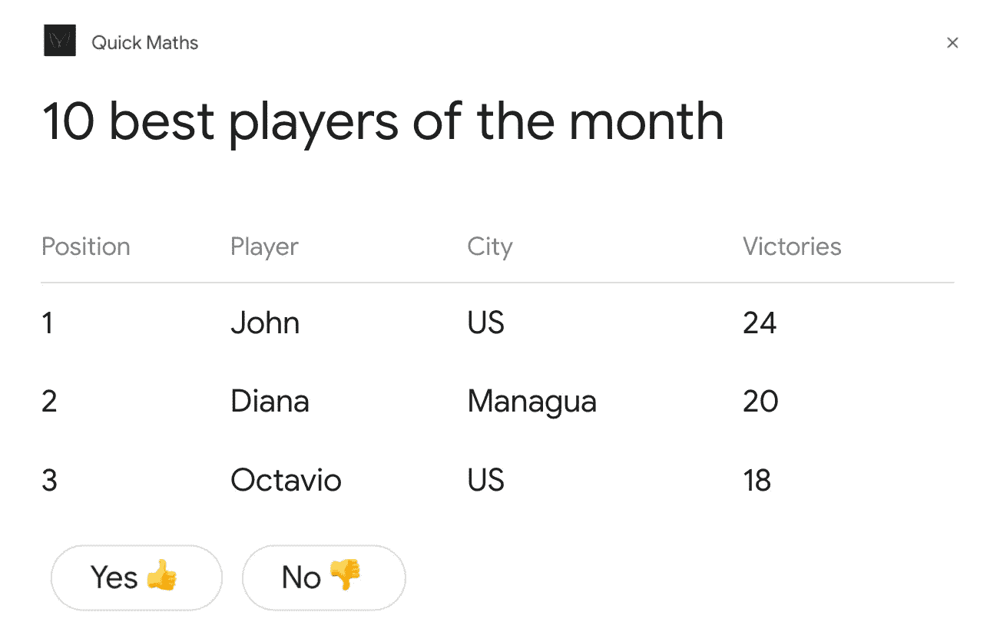

# 用 VOXA 构建跨平台的语音应用——第 5 部分

> 原文：<https://betterprogramming.pub/building-cross-platform-voice-apps-with-voxa-part-5-1f0aff32185>

## 如何为 Alexa 和 Google Assistant 创建可视化显示

图片来自 www.pl.wikipedia.org

这是关于如何使用 [Voxa](https://voxa.readthedocs.io/en/master/) 创建跨平台语音应用的系列文章的第五部分，也是最后一部分【这里是部分 [1](https://medium.com/p/547f50675fa6) 、 [2](https://medium.com/p/feb440ec5da0) 、 [3](https://medium.com/p/e738cd991fde) 和 [4](https://medium.com/p/f7de737b0cd5) 的链接】。在[上一篇文章](https://medium.com/better-programming/building-cross-platform-voice-apps-with-voxa-part-4-f7de737b0cd5)中，我们讨论了用户购买订阅的能力；Alexa 的技术内采购，以及谷歌助理的数字商品订阅。在这篇文章中，我们将学习如何为带屏幕的设备显示游戏排行榜，以及如何在 Voxa 中进行单元测试。

# Alexa 表示语言

[Alexa 呈现语言](https://developer.amazon.com/docs/alexa-presentation-language/apl-overview.html) (APL)是一套可视化组件，你可以利用它为带屏幕的设备创造美妙的视觉体验。在 APL 之前，亚马逊有[显示渲染模板](https://developer.amazon.com/docs/custom-skills/display-template-reference.html)接口，但是没有 APL 灵活。使用 APL，您可以更轻松地定制您的屏幕。在我们的源代码中，我们也支持 RenderTemplate 接口，因为仍然有一些设备的屏幕不支持 APL。如果你试图发送一个 APL 指令到一个非 APL 设备，技能将崩溃。

在我们的快速数学 Alexa 技能中，我们将使用 APL 向用户显示排行榜。如果他们是前 10 名玩家，他们将能够看到他们的位置、姓名、城市和分数。如果他们不允许在任何一个平台上访问他们的地址，我们将只显示他们的地区；如果是 en-US，我们就抢美国部分，如果是 en-GB，我们就抢 G.B。

APL 排行榜屏幕将如下所示:

第二代 Echo Show 中的排行榜

回音区的排行榜

你可以在回购的 [**part5**](https://github.com/omenocal/quick-maths-voice-app/tree/part5) 分支中找到显示该头寸表的代码，具体在`./src/app/model.js`文件中

`showWinnersDashboard`功能

对于谷歌助手，我们使用的是[表卡](https://developers.google.com/actions/assistant/responses#table_cards)。这个网格将我们的排行榜分组以显示位置，类似于我们在 Alexa 中所做的，给两个应用程序相同的体验。

谷歌助手(手机)中的排行榜视图

Google Assistant 中的排行榜视图(Smart Display)

`showWinnersDashboard`函数构建在两个平台上呈现模板所需的 Voxa 指令。对于 Alexa，它验证设备是否支持 APL，并返回一个`alexaAPLTemplate` Voxa 指令。否则，它将返回一个`alexaRenderTemplate`指令。如果这是一个 Google 动作，它会构建`dialogflowTable` Voxa 指令。

# Alexa 技能的单元测试

你可以使用`[alexa-mime](https://npmjs.com/package/alexa-mime)`包为 Alexa 技能创建单元测试。这个包允许你创建带有 YML 结构的测试。它使用了 [Alexa 技能测试框架](https://github.com/BrianMacIntosh/alexa-skill-test-framework)。在 test 文件夹中，您可以找到一个测试以下场景的示例:

*   用户第一次启动技能。
*   用户听到首次用户消息并接受，开始游戏。
*   用户听到运算“5 + 5”，Alexa 询问结果。
*   用户答对，得十分。Alexa 询问用户是否想继续，但用户停止了游戏。

另一个单元测试有点不同。用户回答错误，Alexa 询问用户是否要再试一次。用户这次接受并正确回答。

属性`beforeEach`帮助你模拟任何函数、数据库或 API 操作。属性将帮助您重置或清除任何模拟操作。这些操作可以在这个文件中找到:`./test/main.spec.js`。

为了模拟 [DynamoDB](https://aws.amazon.com/dynamodb/) 操作，我们使用了`[aws-sdk-mock](http://npmjs.com/package/aws-sdk-mock)`包。为了模拟对 Alexa 设置端点的 API 调用，我们使用了`[nock](https://www.npmjs.com/package/nock)`包。我们还使用`[simple-mock](https://www.npmjs.com/package/simple-mock)`包模仿 [Lodash](https://lodash.com/) 包中的一些功能，帮助我们随机化应用程序的操作核心流程。

您可以创建任意多的`.yml`文件，将您的用例分组到`./test/use-cases/`文件夹中。

# 更多信息

在这一点上，你应该可以发送你的快速数学竞赛 Alexa 技能和谷歌行动认证。您可以在我的存储库的 [part5](https://github.com/omenocal/quick-maths-voice-app/tree/part5) 分支中找到完整的项目:

 [## omenocal/快速数学语音应用程序

### 这个应用程序是使用 RAIN 开发的 voxa3 框架编写的。

github.com](https://github.com/omenocal/quick-maths-voice-app) 

控制 VUI 的电子表格，意味着 Alexa 技能的清单信息，以及两个平台的意图/话语已经在`interaction.json`文件中了。您应该创建自己的电子表格来复制该文件中提供的信息。

# 结束了

这是一系列五篇文章的结尾，这些文章向您展示了如何使用多平台框架 Voxa 为当前两个主要的语音平台:Alexa 和 Google Assistant 创建 VoiceFirst 游戏。我希望你觉得它有用，并期待听到你下一步的构建。感谢阅读！

记住:不要把垃圾扔到海里！