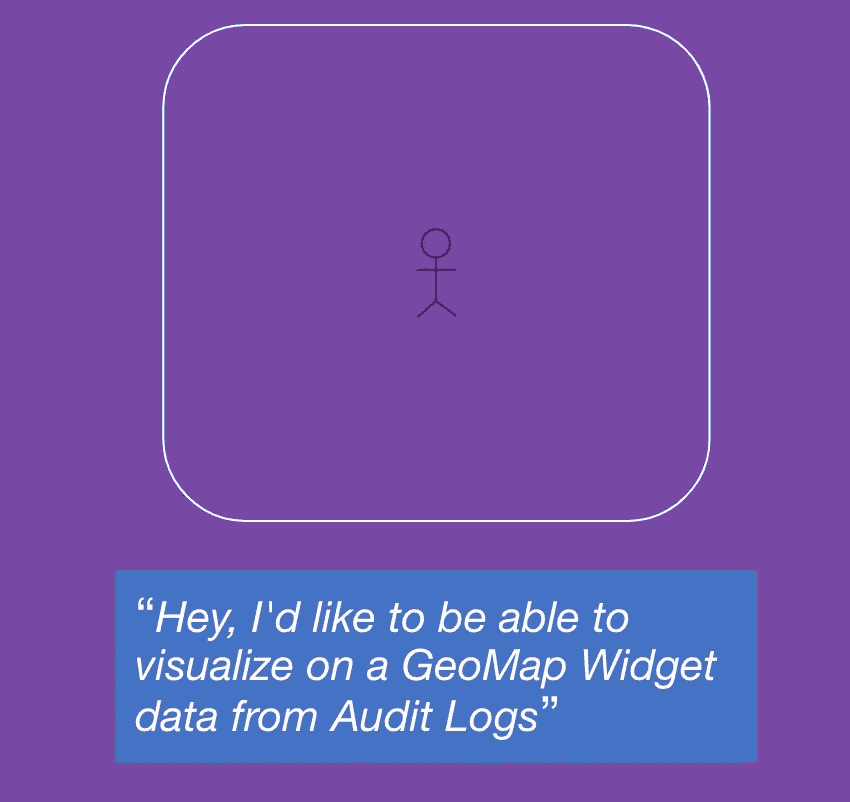
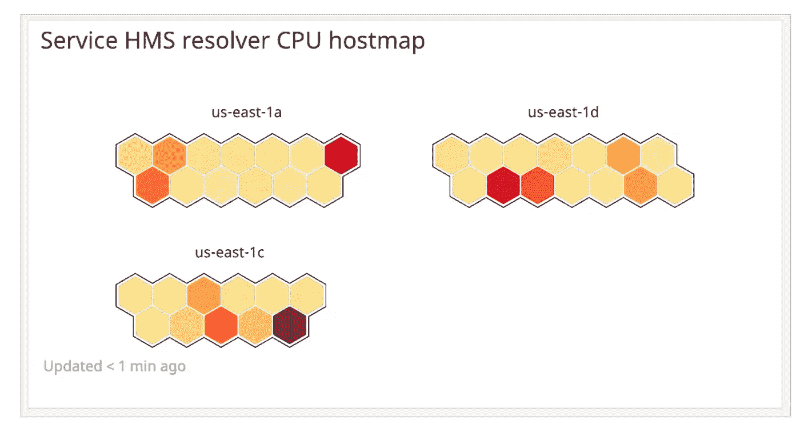
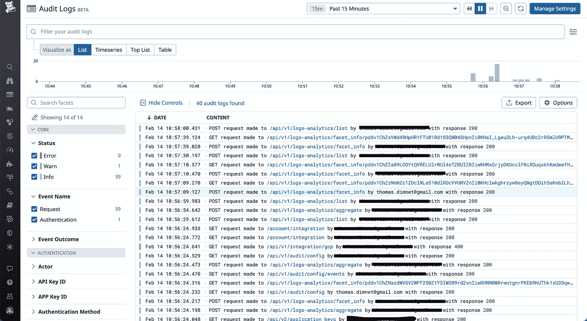
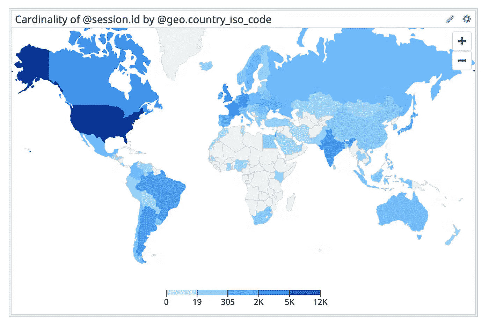
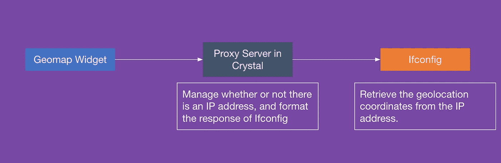
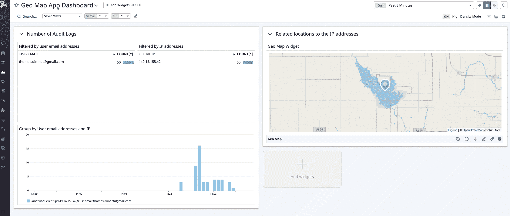

# 使用 Datadog UI 应用程序构建自定义数据可视化

> 原文：<https://betterprogramming.pub/building-custom-data-visualizations-with-datadog-ui-apps-1d863018670b>

## 如何在 Datadog 中创建自定义 GeoMap 小部件


一个带有自定义部件的仪表板——来源:作者

本文是由两部分组成的博客系列的第二部分。 [*在第一部分中，*](/a-tale-of-two-engineers-discovering-the-crystal-programming-language-104b1fdbe525) *我们介绍了 Crystal，一种提供 C/C++性能和 Ruby 可读性的编程语言。我们使用 Crystal 创建了一个代理服务器，用于检索与 IP 地址相关的地理位置坐标。在第二部分中，我们将了解如何利用 Datadog 应用程序来创建自定义的 Geomap。*

要阅读这篇博文，您需要一些编程和监控的基础知识。**data dog 的知识可能有用，但不是必需的**。我们将创建的 UI 应用程序将使用 React 和 TypeScript。我们将一起分析每个代码片段。

您可以在这个 Github 资源库上找到完整的[项目代码，并按照自述文件中的安装步骤进行操作。](https://github.com/DataDog/apps/tree/master/examples/geomap)

**在这篇文章的最后，您将拥有一个自定义的 Geomap 小部件，显示与地理坐标**相关的标记，换句话说就是纬度和经度。借助 UI 应用程序，您还可以在 Datadog 中创建自己的自定义小部件，并监听与 SDK 上下文切换相关的事件。

我们开始吧！

# 这一切都始于客户的痛点…



这一系列的两篇博客文章从一个客户的问题开始

我们的故事从一个客户和一个功能请求开始:**这个客户想要在 Geomap 小部件上显示来自 Datadog 审计日志的数据**。对于不了解 Datadog 及其特性的新手来说，这是定义的时刻，因为术语审计日志或仪表板小部件不一定会说话。所以还是一步步来吧！

**仪表板是 Datadog 的基本工具之一:它们允许您显示、跟踪和跟踪关键数据，以监控基础设施的健康状况**。每个仪表板都由小部件组成。您有分发小部件、事件流小部件、热图小部件，还有 geomaps 小部件。



一个与 CPU 利用率相关的主机映射小部件——来源:[https://docs.datadoghq.com/dashboards/widgets/hostmap/](https://docs.datadoghq.com/dashboards/widgets/hostmap/)

现在我们来看看[审计日志](https://docs.datadoghq.com/account_management/audit_logs/)。**审计日志让你知道谁在你的组织中使用 Datadog，以及如何使用**。例如，借助审计日志，您将能够知道谁修改了一个重要的仪表板或监视器，以及修改的原因。**如果你熟悉 AWS，审计日志可以和 CloudTrail** 相比。使用审计日志，您将能够检索诸如执行的操作(毕竟它是一个日志)、事件的类型、状态以及执行该操作的用户的 IP 地址和电子邮件等信息。



审核我的个人 Datadog 帐户上的活动日志

这就是定义，我告诉你会很快！**您现在应该能够理解最初的陈述**:“该客户希望在 Geomap 小部件上显示 Datadog 审计日志数据”。顺便说一句，你甚至应该指出已经有 Geomap 小部件了(因为我刚才提到了它们！)

# 是的，已经有一个 Geomap 小部件



现有的 geomap widget-source:[https://docs.datadoghq.com/dashboards/widgets/geomap/](https://docs.datadoghq.com/dashboards/widgets/geomap/)

那么现有的 Geomap 小工具有什么问题呢？服务和数据不兼容！

事实上，**要使用 geomap 小部件，您需要真正的用户监控服务，或者 RUM 作为它的昵称**。该服务为您提供了对用户活动和体验的实时端到端可见性。换句话说，多亏了 RUM，您将能够监控网页的性能、错误管理和产品的使用。 **RUM 在“客户端”工作，即浏览器和 iOS 或 Android 应用**。要显示这个 geomap 小部件，您还需要精确的数据:国家的 ISO 代码；该 ISO 必须对应于 alpha-2 ISO 格式。

**问题是在我们的例子中，客户想要使用另一个服务:审计日志**。此外，客户希望从他们的 IP 地址中获得用户的纬度和经度。这个地理位置将会显示在地理地图上。

# 基于 IP 地址检索地理信息，并在地图上显示这些信息



如果您还没有这样做，您可以[从这个 Github 库](https://github.com/DataDog/apps)克隆这个项目，并使用 Docker 和 docker-compose 启动它。请注意，您将需要一个带有 API 密钥和应用程序密钥的 Datadog 帐户。该项目包含三个文件夹:

*   对应于我们在水晶中的代理。如果你想回到这个话题，[欢迎回到这篇博文](/a-tale-of-two-engineers-discovering-the-crystal-programming-language-104b1fdbe525)。这个代理将在 8080 上运行。
*   `datadog-app`，我们的 Datadog 应用程序，其中包含我们的自定义小部件。该应用程序将在端口 3000 上运行。
*   `setup`，这是一套安装脚本。这不仅会创建并配置您的 Datadog 应用程序，还会创建一个包含小部件的仪表板。

您可以用这个 CURL 请求测试代理:

```
curl --location --request GET 'http://localhost:8080/json?ip=8.8.8.8'
```

这是代理返回的内容:

下面的 gif 向你展示了这个项目的实际情况。左侧是传统的 Datadog 小部件:两个表和一个时间序列。右边部分是我们的 Datadog 应用程序。**目测两者没有区别**。



**为了改变地图和标记的位置，我们通过模板变量**。这对于过滤仪表板的一个或多个小部件非常有用。这里，我们在用户的电子邮件和 IP 地址上使用模板变量。然后，UI Apps 客户端检索这些数据，并将其注入到 Geomap 小部件中。

# 构建自定义 Geomap 微件

如果你还不清楚 Datadog 中的 UI 应用是什么，你应该知道这是一个功能**允许开发者通过定制的小部件、模块和侧面板**来扩展 Datadog 的原生功能。换句话说，这意味着您现在可以直接在仪表板中运行任意 JavaScript 代码。**假设您想要一个 Datadog 不支持的数据可视化，**例如 Geomap**，您可以编写一个应用程序将该功能扩展到 Datadog** 。

要了解如何初始化 Datadog 应用程序，我邀请您查看官方文档或我的另一篇文章[，这篇文章致力于在 Redis](/inspect-and-delete-redis-keys-with-a-datadog-app-6e623e2695a6) 上创建 Datadog 应用程序。**这两个资源不仅能让你创建第一个 Datadog 应用程序，还能让你创建第一个定制小部件和第一个模态**。事实上，这里的想法是集中在如何显示 geomap 和它上面的标记。可以打开文件:[GeoMap/data dog-app/src/widget/GeoMap/index . tsx](https://github.com/DataDog/apps/blob/master/examples/geomap/datadog-app/src/widget/GeoMap/index.tsx)

如果你懂 TypeScript 或者 JavaScript，你应该已经熟悉这部分了。请注意，应用程序的 SDK 是通过`ui-extensions-sdk`库导入并初始化的。此外，`ui-extensions-react`库用于检索`useTemplateVariables`钩子。

然后我们将定义我们的钩子。第一个是地理坐标。**由于小部件是用 TypeScript 编写的，我们需要创建一个接口**。第二个钩子来自上面导入的库，它允许我们从客户机检索 IP 地址。

然后，我们将为我们的应用程序添加一个生命周期。**每次 ip 地址状态会发生变化，我们都会进行 API 调用来检索地理坐标**。这些数据将通过 setLocation 方法集成到本地状态。

最后，如果我们有纬度和经度，我们显示带有 GPS 坐标和标记的地图。否则，我们不显示任何内容。在不到 60 行代码中，我们能够创建一个定制的 Geomap！

既然您已经看到了如何创建一个定制的数据可视化，下一步将会看到如何通过将它提交给 Datadog 来将它分发给尽可能多的人。好消息是我正在写一篇关于它的博客！无论如何，我希望你喜欢这两个系列的文章，我会看到你未来的冒险(与小晶体)。