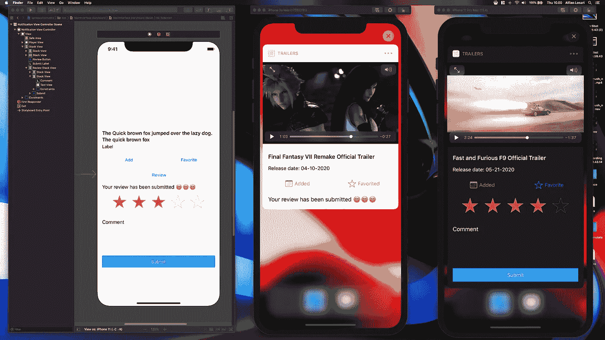
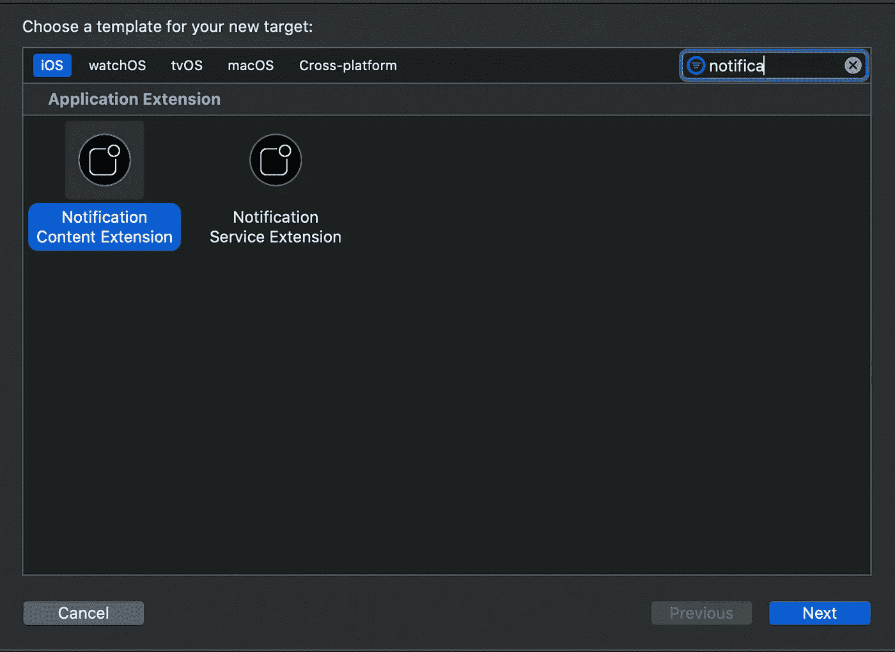
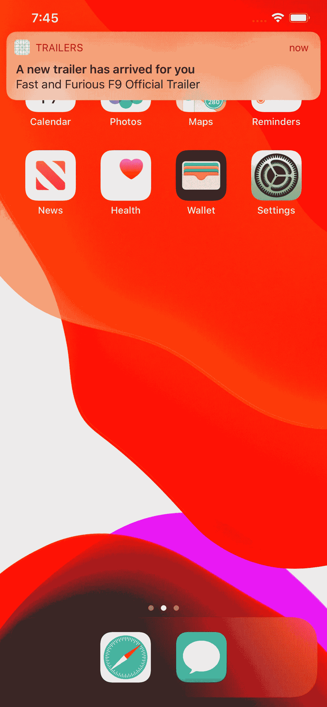
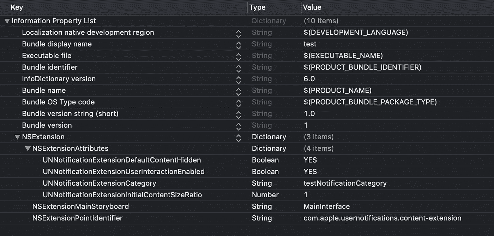
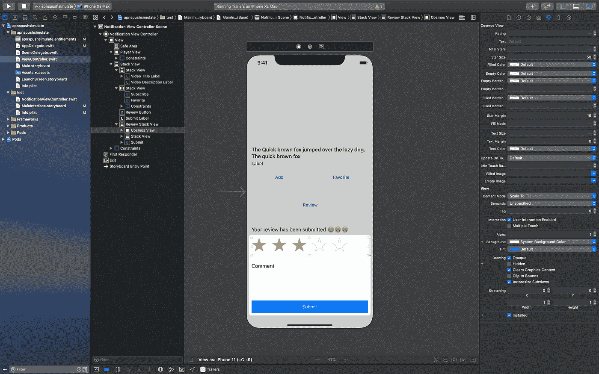

# 在 iOS 中构建自定义交互式远程推送通知

> 原文：<https://betterprogramming.pub/building-custom-interactive-remote-push-notification-in-ios-4ffdba0b5281>

## 创建一个交互式自定义推送通知用户界面，以显示带有添加和收藏按钮的视频预览

iOS 中的自定义交互式推送通知

从 iOS 10 开始，苹果已经随着新框架`UserNotifications`和`UserNotificationsUI`的引入，为推送通知提供了丰富的通知支持。

使用这些框架，我们可以使用以下功能定制我们的推送通知:

1.  自定义推送通知的类型和`content/UI`。

2.为每种类型的通知提供自定义操作和响应。

3.在将收到的推送通知发送给用户之前，对其内容进行变更。

4.定制推送通知的自定义触发器，例如在特定的时间间隔或地理区域。

除了所有这些丰富的通知支持，苹果还在 iOS 13 中添加了新的交互式自定义 UI 支持。以前，我们只能在像 iPhone UI 这样的动作表中定制供用户选择的动作。

通过交互式通知，我们可以在推送通知中提供任何我们想要的用户界面和交互。

这一新增功能是推送通知的真正变革者。例如，我们可以提供像文本字段、开关、滑块、步进器这样的控件，以及我们想要的任何自定义控件。

最后，我们可以自由定制我们想要的推送通知预览。

# 我们将建造什么

在本文中，我们将构建一个交互式自定义推送通知 UI，以显示一个带有按钮的预告片的视频预览，供用户添加和喜爱它们。

用户还可以使用星号提供评级，并使用文本字段进行评论。下面是要做的任务列表:

*   设置项目和依赖项。
*   注册推送通知权限、类型和类别。
*   模拟远程推送通知进行测试。
*   设置通知扩展目标信息列表。
*   为通知内容设置用户界面。
*   在代码中处理接收通知和 UI 交互。

要在模拟器中模拟远程推送通知，您需要从 Apple 开发者网站下载并安装 Xcode 11.4 beta。

 [## 苹果开发者

### 现在是开发苹果平台的最佳时机。

developer.apple.com](https://developer.apple.com) 

您可以从下面的 GitHub 资源库下载完整的项目。

 [## alfianlosari/iocustominteractivepushnotification

### 一个简单的演示展示了交互式自定义推送通知用户界面，有几个自定义用户界面…

github.com](https://github.com/alfianlosari/iOSCustomInteractivePushNotification) 

# 设置项目和相关性

首先，使用您唯一的包标识符创建一个新的 Xcode 项目。

然后，导航到项目的*签名和功能*选项卡。点击`+ Capabilities`按钮，从列表中选择推送通知。目的是将推送通知与项目的 App ID 关联起来。

接下来，我们将为自定义内容通知 UI 添加新的应用程序扩展目标。在菜单栏中，点击`File > New > Target`。在过滤器文本字段中，键入*通知*。

最后，从列表中选择*通知内容扩展*。输入名称，点击*完成*。之后，您可以在警告对话框中激活该方案。关闭项目。

创建通知扩展

接下来，我们将为项目初始化 [CocoaPods](https://cocoapods.org/) 并声明依赖项。

使用终端，导航到项目文件夹，并键入`pod init`。之后，使用文本编辑器打开`Podfile`,并将依赖项添加到应用程序的目标中。要添加两个依赖项:

1. [XCDYoutubeKit](https://github.com/0xced/XCDYouTubeKit) —使用`AVPlayer`播放 YouTube 视频的库。(警告:YouTube 的政策只允许应用程序使用`WebView`和`iFrame`来播放应用程序内的视频)。

2.[Cosmos](https://github.com/evgenyneu/Cosmos)——我们可以在应用程序中使用的星级控制。

Podfile

运行`pod install`将所有依赖项安装到所有目标上。打开 Xcode 中的`project.xcworkspace`开始。尝试使用`Command + B`进行构建，以确保一切顺利进行。

# 注册推送通知的权限、类型和类别

接下来，我们需要使用`UNUserNotificationCenter`在我们的应用程序中注册允许推送通知的权限。

我们在`(_:didFinishLaunchingWithOptions:)`内的`AppDelegate`中添加代码来完成这项工作。确保在源文件的顶部导入`UserNotifications`框架。

下面是这样做的步骤:

1.首先，我们调用`requestAuthorization`，传递授权选项数组。在这种情况下，我们需要`alert`、`badge`和`sound`。

2.其次，我们初始化`UNNotificationCategory`，传递唯一的类别字符串标识符。在这种情况下，我们不想有自定义动作，所以我们传递一个空数组。

3.最后，我们调用`setNotificationCategories`，在数组内部传递我们的自定义通知类别类型。

# 模拟远程推送通知进行测试

Xcode 11.4 终于引入了一个新功能，在本地模拟远程推送通知。

开始很简单。我们需要创建包含有效负载的`apns json`文件。我们还需要在`aps`旁边添加一个额外的键，就是包含我们应用的应用 ID 的`Simulator Target Bundle`。

文件的扩展名必须使用`.apns`而不是`.json`。你可以看看下面的样本文件`apns`。

在这种情况下，我们还为`videoId`和`description`提供了额外的键，因此我们可以检索`YouTube`视频 URL 并在自定义 UI 中显示自定义描述。

要测试通知，请运行应用程序并接受通知权限。然后，把 app 放到后台，把`apns`文件拖放到模拟器里。

拖放。apns 文件

# 设置通知扩展目标信息列表

我们需要向`notification content`应用程序扩展`info.plist`添加额外的键。在`NSExtension > NSExtensionAttributes`字典下，确保添加了所有这些键和值:

1.`UNNotificationExtensionDefaultContentHidden`。本设定键决定是否隐藏默认的推送通知标题和正文标签。在我们的例子中，我们想要隐藏它，所以我们将值设置为`NO`。

2.`UNNotificationExtensionUserInteractionEnabled`。这个键决定是否使用户界面交互。我们将此设置为`YES`。

3.`UNNotificationExtensionCategory`。我们需要使用我们在`AppDelegate`注册的通知类型类别标识符来设置这个值，它是`testNotificationCategory`。

4.`UNNotificationExtensionInitialContentSizeRatio`。预览第一次出现时的初始内容大小比例。我们将此设置为默认值，`1`。

通知扩展信息列表

# 设置通知内容预览的用户界面

让我们转到通知内容预览界面。打开通知扩展目标中的`MainInterface.storyboard`。以下是要遵循的步骤:

1.将视图拖到视图控制器画布上。添加这些约束:`Align top, leading, and trailing to Safe Area`。将`height constraints`设置为`240`。将此视图重命名为`Player View`。这是嵌入了`AVPlayer`视图的视频播放器视图。

2.拖动一个`Stack View`到`Player View`下面的视图控制器。添加这些约束:`Top Space to Player View with 16`。`Align leading, trailing, bottom to Safe Area`。将`axis`设置为`vertical`，将`alignment and distribution`设置为`fill`，将`spacing`设置为`16`。将其重命名为`Outer Stack View`。

3.拖动堆栈视图作为外部堆栈视图的子视图。在这个堆栈视图中添加两个标签，视频标题标签和视频描述标签。将`axis`设置为`vertical`，将`alignment and distribution`设置为`fill`，将`spacing`设置为`4`。将视频标题标签行限制设置为`2`。

4.拖动堆栈视图作为外部堆栈视图的子视图。在这个堆栈视图中添加两个按钮，一个订阅按钮和一个收藏按钮。将`axis`设置为`horizontal`，将`alignment`设置为`fill`，将`distribution`设置为`fill equally`，将`spacing`设置为`4`。

5.拖动一个`Button`作为外部堆栈视图的子视图，将其重命名为`Review Button`。将`text`设置为`Review`。

6.拖动一个`Label`作为外部堆栈视图的子视图，将其重命名为`Submit Label`。将文本设置为*您的审核已提交*！

5.拖动堆栈视图作为外部堆栈视图的子视图。将`axis`设置为`vertical`，`alignment and distribution`设置为`fill`，将`spacing`设置为`24`。将此重命名为`Review Stack View`。

6.拖动视图作为查看堆栈视图的子视图。将类别设置为`CosmosView`。在属性检查器中，将起始边距设置为`16`，将星形大小设置为`50`。将高度限制设置为`59`。

7.拖动堆栈视图作为查看堆栈视图的子视图，位于宇宙视图下方。在这个堆栈视图中添加一个标签，注释标签，`TextView`和`Button`。将`axis`设置为`vertical`，将`alignment and distribution`设置为`fill`，将`spacing`设置为`8`。将高度限制设置为`100`。确保将注释标签文本设置为`comment`。

8.拖动`Button`作为底部查看堆栈视图的子视图。将文本设置为`Submit`，并将高度约束为`40`。

在故事板中设置通知用户界面

# 在代码中处理接收通知和 UI 交互

打开`NotificationViewController.swift`文件。有一个`NotificationViewController`类继承了`UIViewController`并实现了`UNNotificationContentExtension`。

当推送通知到达时，调用`didReceive(_:)`方法，传递有效负载。以下是对视图、属性设置、`didReceive`和交互处理器的代码处理的简要概述:

1.在源文件的顶部导入所有需要的框架，`AVKit`、`UserNotifications`、`UserNotificationsUI`、`XCYoutubeKit`和`Cosmos`。

2.您还需要声明标签、按钮、视图和文本视图的所有属性。

3.当用户点击相应的按钮时，声明所有的`@IBAction`方法处理。在这种情况下，订阅、收藏、审阅和提交处理程序。

4.用属性观察器声明用于存储`isSubscribed`和`isFavorited`状态的属性。在这种情况下，按钮的文字和颜色根据`boolean`状态而变化。

5.声明用于存储视图高度的常数。对于这个例子，我已经计算了视图展开或折叠时可能的高度。

6.在`viewDidLoad`中，设置按钮和堆栈视图的初始视图状态。`Review Stack View`和`Submit Label`隐藏；第一次出现时间视图。

7.在`didReceive`中，我们检索内容并为标题和描述设置标签的文本。此外，我们获取`videoID`并使用`XCDYouTubeClient`来获取传递标识符的视频 URL。

8.在我们成功检索到`URL`之后，用 URL 初始化`AVPlayerViewController`，将视图嵌入到“Player View”容器视图中，并播放内容。

9.当用户点击查看按钮时，取消隐藏查看堆栈视图。当他们点击提交按钮时，隐藏查看堆栈视图并显示提交标签。对于订阅和收藏，切换属性以更新按钮的文本和颜色。

在构建和运行它之前，确保将故事板中的所有`@IBOutlets`和`@IBActions`连接到代码。

要进行测试，只需将`apns`文件拖放到模拟器中，确保使用正确的应用 ID。你可以尝试使用你的视频标识符来播放文件的`videoId`值。

您可以从浏览器地址栏中的 YouTube 视频的 URL 参数中检索到这一点。

# 结论

就是这样！祝贺你在构建自定义交互式推送通知 UI 方面取得的成就。使用这项新功能，您可以探索许多可能性和用例。

为了处理主应用程序和扩展目标之间的数据共享，您需要创建一个`app group id`。然后，您可以初始化共享的`UserDefaults`来存储和检索本地数据。

你可以在苹果文档中探索更多关于`UserNotifications`框架的内容。

 [## 用户通知

### 面向用户的通知向您的应用程序用户传达重要信息，无论您的应用程序是否…

developer.apple.com](https://developer.apple.com/documentation/usernotifications) 

让我们坚持终生学习吧！