# 为故事书和网络应用程序构建黑暗模式

> 原文：<https://betterprogramming.pub/building-dark-mode-for-storybook-and-web-applications-99d3a0b76312>

## 黑暗模式完全指南


由[斯登冲锋枪·里特菲尔德](https://unsplash.com/@stenslens?utm_source=medium&utm_medium=referral)在 [Unsplash](https://unsplash.com?utm_source=medium&utm_medium=referral) 拍摄的照片

[深色模式](https://en.wikipedia.org/wiki/Light-on-dark_color_scheme)是一种在深色背景上使用浅色文本、图标和 UI 元素的配色方案。相反的配色方案被称为轻模式。

以下是用户选择黑暗模式的原因:

*   黑暗模式下的光需要更少的能量来显示。
*   科学表明，从长远来看，负极性(暗模式)对眼睛的伤害小于亮模式。
*   对于一些 UI 设计来说，黑暗模式是时尚和时髦的。

以下是用户选择照明模式的原因:

*   大多数电子设备的默认设置是灯光模式。
*   光模式是 skeuomorphic 方法。
*   强光模式在强光下阅读效果更好。

暗模式是选择，亮模式是必须。当它被称为支持黑暗模式时，它意味着同时支持黑暗和光明模式。自 2015 年以来，黑暗模式获得了很大的吸引力。如今，复杂的 web 应用程序同时支持这两者。

这是关于以下主题的完整指南:

*   [故事书的黑暗模式](#fe99)
*   [网络应用的黑暗模式](#eecb)

# 故事书的黑暗模式

[Storybook](https://storybook.js.org/) 是一个开源工具，用于构建独立的 UI 组件和页面。这允许我们一次处理一个组件。它简化了 UI 开发、测试和文档。

为故事书建立黑暗模式需要几个步骤:

*   [在 Create React 环境中设置故事书](#d8ca)。
*   [安装插件，](#b506) `[storybook-dark-mode](#b506)`。
*   [遵循初始配色方案的优先顺序](#baf8)。
*   [使用故事书按钮控制主题和背景](#2055)。
*   [自定义故事书设置](#0b4e)。

## 在 Create React 环境中设置故事书

我们使用 [Create React App](/an-in-depth-guide-for-create-react-app-5-cra-5-b94b03c233f2) 作为探索故事书的基础。以下命令创建一个 React 项目:

```
npx create-react-app storybook-darkmode
cd storybook-darkmode
```

输入命令`npx sb init`，故事书就安装好了。虽然我们已经安装了故事书 6.5，但它类似于我们为故事书 6.3 所描述的[。](/an-in-depth-look-at-storybook-6-8c44cd6895ee)

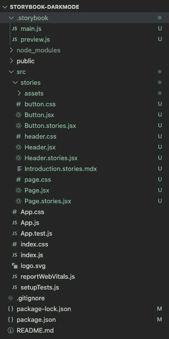

作者图片

它用两个配置文件创建了文件夹`.storybook`:

*   `main.js`:配置故事文件位置，插件，自定义网络包和巴别塔配置。
*   `preview.js`:设置装饰器、参数和全局类型的全局设置。

键入命令`npm run storybook`，示例故事书在`http://localhost:6006`运行。

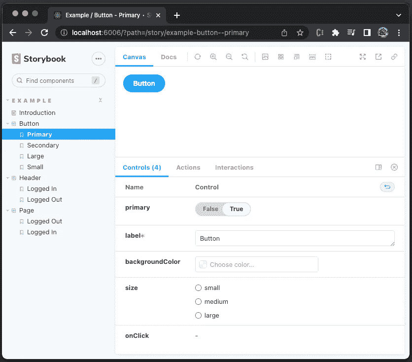

作者图片

默认情况下，Storybook 处于光照模式。

## 安装插件，故事书-黑暗模式

是一个故事书插件，支持黑暗和光明模式之间的切换。这个插件每周有 183.5k 的下载量，它的使用量正在赶上 Storybook。看这两条汇合的线，猜一猜。2020 年是不是每个故事书都自带`storybook-dark-mode`的一年？

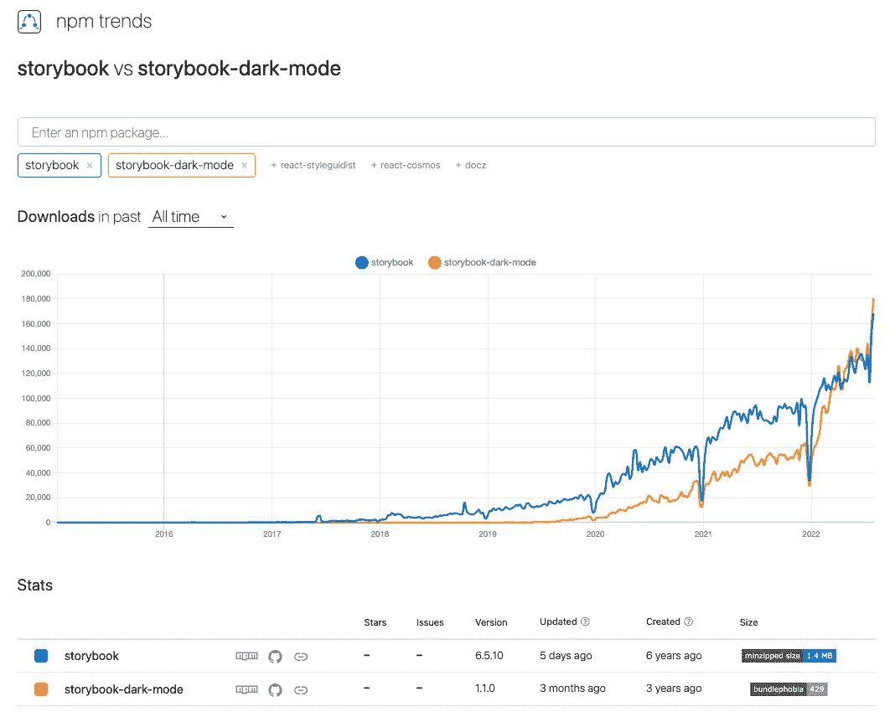

作者图片

让我们安装`storybook-dark-mode`:

```
npm i --save-dev storybook-dark-mode
```

在`.storybook/main.js`中，我们在下面的代码中包含了 addon，`'storybook-dark-mode'`(第 11 行):

键入命令`npm run storybook`，Storybook 处于黑暗模式，因为 macOS 已经设置为黑暗模式。

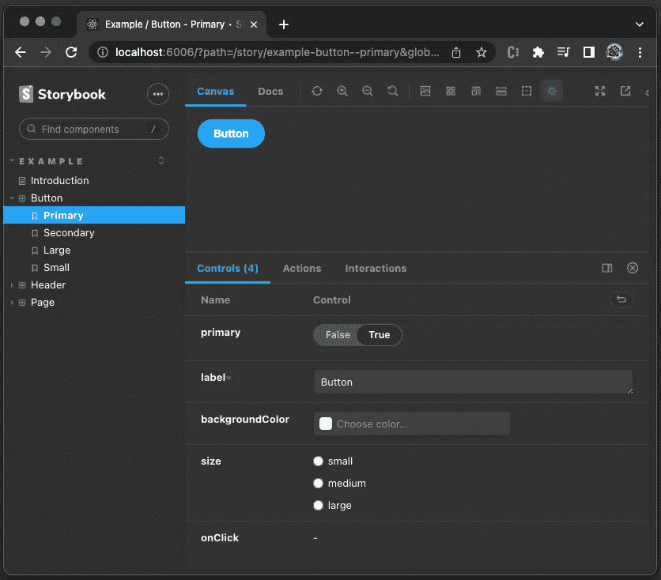

作者图片

## 遵循初始配色方案的优先顺序

以下是为初始配色方案定义的优先顺序:

1.  如果用户以前已经设置了配色方案，请重新使用该配色方案。

在本地存储器中，键`sb-addon-themes-3`保存主题对象，其中`current`设置为颜色方案。在以下示例中，`current`被设置为`light`:

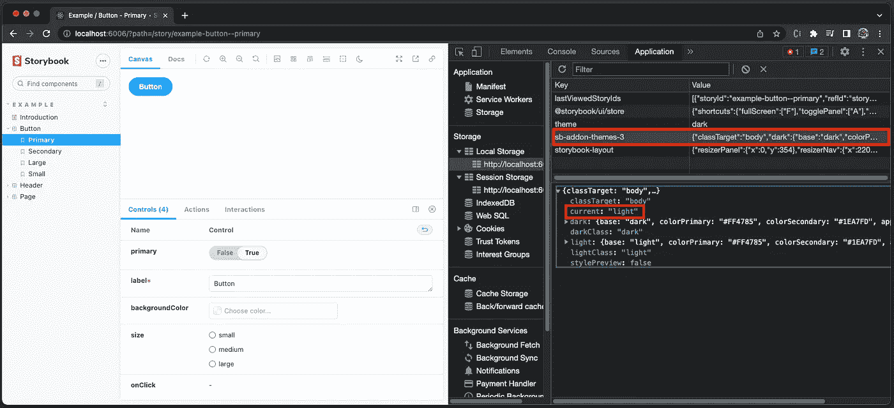

作者图片

2.使用在`.storybook/preview.js`中为`current`参数配置的值。在以下示例中，`current`被设置为`light`(第 3 行):

3.使用操作系统颜色方案首选项。

以下是 macOS 上的配色方案偏好设置:

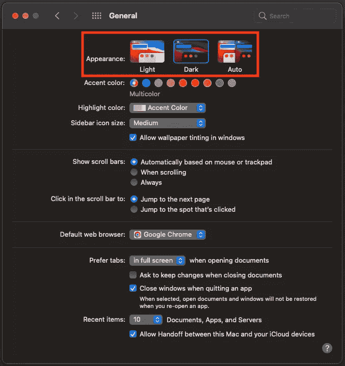

但是，由于[的一个已知问题](https://github.com/hipstersmoothie/storybook-dark-mode/issues/179)，已配置的`current`参数(#2)成为第一优先。

## 使用故事书按钮来控制主题和背景

故事书启动后，有一个更改主题按钮(在下面的红色框中)，可以在黑暗(月亮)和光明(太阳)模式之间切换。

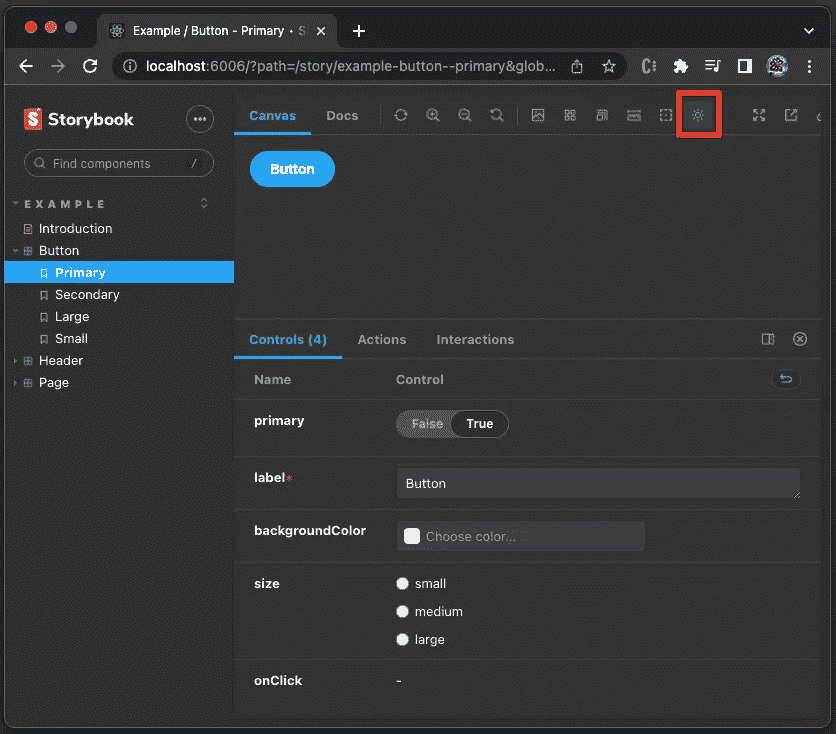

作者图片

除了“更改主题”按钮，还有一个“更改背景”按钮(在下面的红框中),用于更改预览的背景，与配色方案无关。

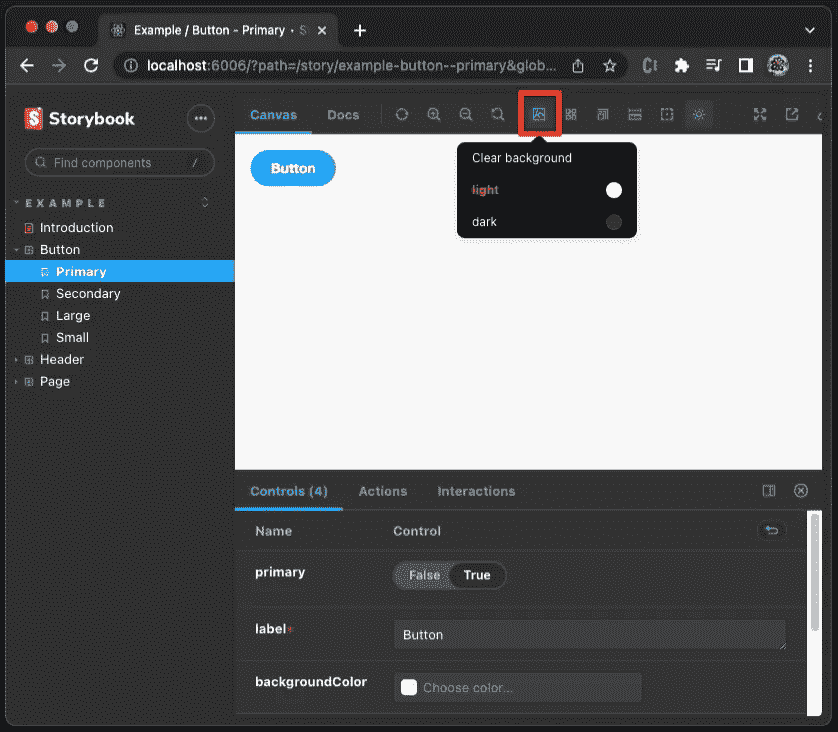

作者图片

如果你觉得有两个控件比较混乱，可以用`.storybook/preview.js`中的如下设置隐藏这个改变背景按钮。

## 自定义故事书设置

事情进展顺利。然后我们转到文档选项卡。


作者图片

我们发现 show code 部分并不处于黑暗模式，尽管在 Canvas 选项卡中相同的部分处于黑暗模式。

我们能把它定制成黑暗模式吗？

是的，我们可以。

将以下`darkMode`设置放入`.storybook/preview.js`:

当在暗模式和亮模式之间切换时，第 2 行和第 3 行将`darkClass`或`lightClass`添加到`body`元素。第 4 行将`darkClass`或`lightClass`配置为预览 iframe 中的`body`元素。

让我们检查元素。


作者图片

预览 iframe 中的`body`元素具有类`darkClass`。show code 部分在类`docs-story`的`body`中。使用 [6 种配置故事书全局样式的方法](/6-ways-to-configure-global-styles-for-storybook-faa1517aaf1a)中描述的技术，我们可以在`.storybook/preview.js`中导入样式表。

增加`.storybook/style.css`如下:

将样式文件导入`.storybook/preview.js`。

show code 部分现在处于黑暗模式。

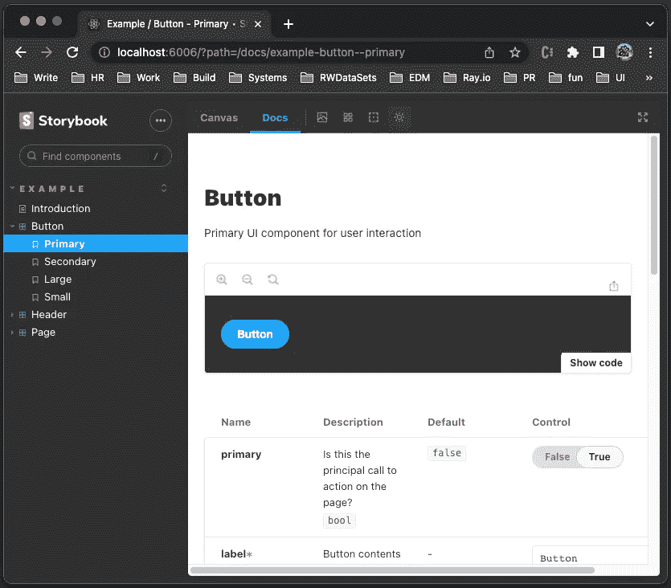

作者图片

同样，我们可以根据需要定制其他故事书设置。

# Web 应用程序的黑暗模式

我们可以借用 Storybook 的想法来为 Web 应用程序设置黑暗模式。

*   [遵循初始配色方案](#f9c4)的优先顺序。
*   [用](#57df) `[ThemeProvider](#57df)` [换](#57df) `[styled-components](#57df)`。
*   [用黑暗模式实现 Create React App](#9361)。

## 遵循初始配色方案的优先顺序

以下是初始配色方案的优先顺序:

1.  如果用户以前已经设置了配色方案，请重新使用该配色方案。

在本地存储器中，`my-color-scheme`键保存配色方案，`dark`或`light`:

```
const storageKey = 'my-color-scheme';
```

2.使用操作系统颜色方案首选项。

[之前的一篇文章](/implement-dark-mode-using-javascript-css-and-third-party-libraries-50e27817c790)解释了如何使用媒体查询`matchMedia()`来获得操作系统的配色方案偏好。黑暗模式意味着下面的陈述是正确的。

```
matchMedia('(prefers-color-scheme: dark)').matches
```

3.默认使用灯光模式。

如果什么都没有设置，我们将灯光模式作为默认设置。

```
const defaultMode = 'light';
```

下面是总结的算法:

## 在样式化组件中使用 ThemeProvider

`[styled-components](/styled-components-a-css-in-js-approach-755f6a196c42)`是一种 CSS-in-JS 方法——一个 JavaScript 库，它将每个 JavaScript 组件与其所有的 CSS 规则和依赖项捆绑在一起。

我们定义了黑暗模式主题和光明模式主题。

然后根据选择的主题定义`Container`样式。

`ThemeProvider`是一个上下文 API，它用`theme`道具提供了一个主题上下文。每个包装的组件都可以动态地访问这个属性。

将`Container`放入`ThemeProvider`中，它会接收到正确的主题。

## 使用黑暗模式实现创建 React 应用程序

要使用`styled-components`，我们需要安装软件包:

```
npm i styled-components
```

`styled-components`成为`package.json`中`[dependencies](https://medium.com/better-programming/package-jsons-dependencies-in-depth-a1f0637a3129)`的一部分。

下面是最后的`src/App.js`:

*   在第 2 行，`styled`和`ThemeProvider`从`styled-components`导入。
*   在第 6–9 行，定义了黑暗模式主题。
*   第 11–14 行定义了灯光模式主题。
*   在第 16–19 行，`Container`样式是通过所选主题定义的。
*   在第 26–41 行，颜色方案按照优先顺序设置。
*   在第 43–47 行，按钮处理程序在黑暗和光明模式之间切换，并更新本地存储。
*   在第 50 行，`ThemeProvider`的主题被设置为所选的配色方案。
*   在第 55–57 行，按钮被设置为基于颜色方案的适当文本，单击它在暗模式和亮模式之间切换。

由于`background-color`和`color`是在主题中定义的，所以它们应该从`src/App.css`中的`App-header`类造型中移除。

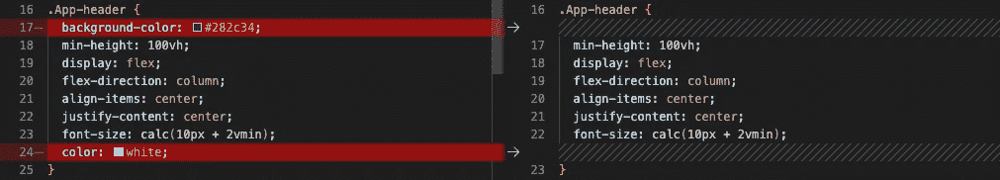

作者图片

执行`npm start`。我们可以通过点击按钮在深色和浅色模式之间切换配色方案。

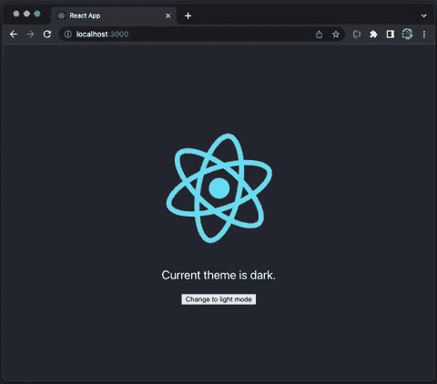

作者图片

# 结论

黑暗模式现在很流行。当它被称为支持黑暗模式时，它意味着同时支持黑暗和光明模式。我们已经给出了如何为故事书和网络应用程序构建黑暗模式的完整指南。

感谢阅读。

如果你有兴趣，可以查看一下[我的 web 开发文章目录](https://jenniferfubook.medium.com/jennifer-fus-web-development-publications-1a887e4454af)。

*注:感谢 S . Sreeram 和悉达多 Chinthapally 与我一起参与* [*多米诺骨牌产品*](https://www.dominodatalab.com/) *的黑暗模式项目。*