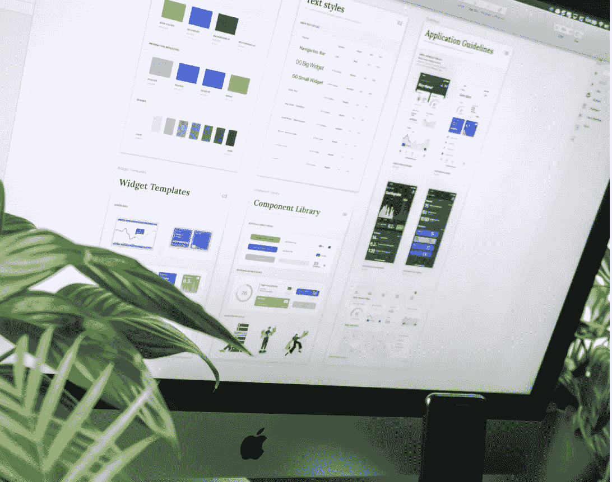
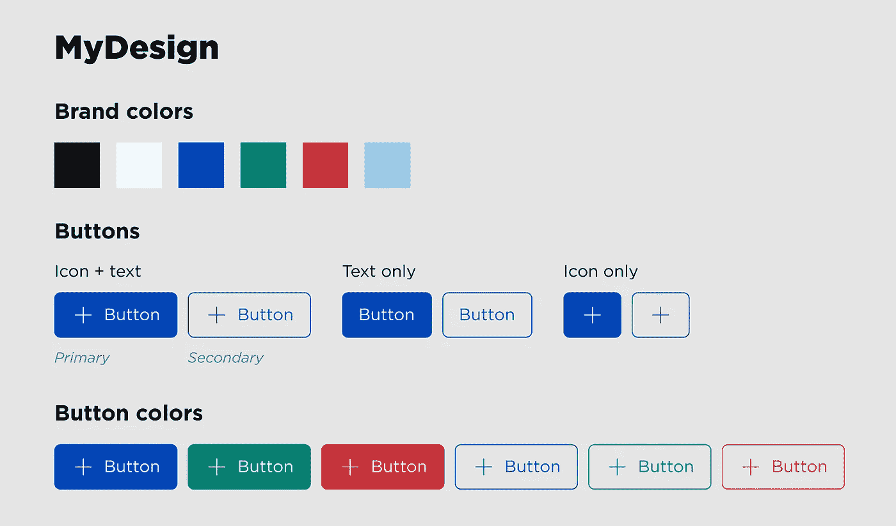

# 颤振中的建筑设计系统

> 原文：<https://betterprogramming.pub/building-design-systems-in-flutter-d52d66004070>

## 在颤振中实现可扩展和自以为是的设计系统的技巧和诀窍

照片由 [Balázs Kétyi](https://unsplash.com/@balazsketyi?utm_source=medium&utm_medium=referral) 在 [Unsplash](https://unsplash.com?utm_source=medium&utm_medium=referral)

尼尔森诺曼集团(UX 研究咨询公司)对设计系统的定义如下:

> “设计系统是一套标准，通过减少冗余来管理大规模设计，同时在不同页面和渠道之间创建共享语言和视觉一致性。”

不像名字暗示的那样，设计系统的规则不仅仅适用于设计师。一个良好构建和实现的设计系统的真正价值是将这些规则强加给设计师和开发人员，创造一致性，让两个学科专注于更高层次的挑战，而忽略组成一个有凝聚力的应用程序的组成部分的单调乏味。

你可能听说过类似于 [Bootstrap](https://getbootstrap.com/) 和 [Ant Design](https://ant.design/) for web 的设计系统，或者可能是 AirBnB 的[设计语言系统](https://airbnb.design/building-a-visual-language/)。即使他们不去从屋顶上喊出来，成功的设计公司可能有一个设计系统。这使得他们可以专注于应用程序的身份和功能，而不必考虑按钮、横幅、文本等单独的部分。

作为一名设计师，我不想在开始设计一个页面的时候就必须考虑按钮是什么，并且详尽地为开发人员创建规范。作为一名开发人员，我不想被交付一个设计，看到一个我不得不第十次从头构建的按钮。一个好的设计系统及其实现的对应物(在我们的例子中，是一个颤振库)解决了这些问题。

我们将跳过讨论设计系统是如何形成的，谁制定了标准，以及它是如何被记录的。相反，我们将假设我们有一个定义良好的设计系统，并将其称为`MyDesign`。我们的工作是在 Flutter 中构建`MyDesign`的组件，并让它们准确地代表我们的设计系统定义的标准。我们将特别关注一组按钮部件:

过于简单的设计系统

本文接下来的内容是我学到的一些技巧和诀窍，这些技巧和诀窍导致了成功的、可伸缩的和可重用的设计系统实现。

# 命名很重要

作为开发人员，我们知道语义对于采用和入职非常重要。但是在设计系统的情况下，这延伸到我们友好的邻居设计师。我们正在创建一种共享语言，因此应该使用这种语言来实现我们的小部件。

在描述组件时，尽量使用与设计者相同的名字。这确保了在设计和实现之间来回工作时没有沟通错误。将这种方法也应用到小部件的配置中。如果一个按钮有一个“前导”和“尾随”图标，而不是“左”和“右”，在你的部件类的字段中使用相同的术语。在`MyDesign`按钮的例子中，我们可以看到它们反映了填充材料(升高)和轮廓按钮，但被命名为主要和次要。我们的实现应该遵守这个命名方案。

设计系统的实现通常独立于它们支持的应用程序。这是一个有益的解耦，这样业务逻辑就不会渗透到设计实现中，并且您的库可以作为一个依赖项跨多个消费应用程序重用。我发现正因为如此，设计系统提供的小部件前缀也是有益的。`MyButton`而不是`Button`有助于区分应用程序中的哪些小部件是本地的，哪些不是，以及避免与 Flutter 和其他应用程序依赖项提供的许多小部件发生名称冲突。

# 独立定义设计标志

设计令牌是设计系统的“原语”——在组件和定义的标准中重复使用的常量值。像颜色、间距、文本样式和图标这样的东西通常作为“标记”包含在设计系统中，是独立于使用它们的小部件进行定义的好选择。Material design 已经通过`Colors`和`Icons`类以及默认`Theme`对象的`textTheme`实现了这一点，默认`Theme`对象包含预定义的文本处理，如正文和标题样式。

定义一组颜色标记

# 使用组合

颤振是建立在[积极的可组合性](https://docs.flutter.dev/resources/inside-flutter#aggressive-composability)之上的，你的设计系统库也应该如此。利用 Flutter 丰富的材料设计目录和 Cupertino 小部件，并根据您的系统规格进行定制。这从所有将使用小部件的地方抽象出样式。通过创建可以组合到其他小部件中的小部件，避免在小部件之间重复代码。用`MyDesign`按钮，我们将组成材质的按钮作为基础。在更复杂的系统中，您可能有自己的基本组件，这些组件可以组合成多个其他组件。

# 减少 API 面

试着让你的部件尽可能简单。遵循最少知识的[原则](https://en.wikipedia.org/wiki/Law_of_Demeter)——小部件应该只消耗正确显示和运行所需的输入。这也意味着您的小部件不能以意想不到的方式使用。

如果您正在使用一个材质小部件并为您的设计设计样式，您可能不需要小部件允许的所有配置。材料部件应该是高度可配置的，但是您的部件可能不是。减少那些参数！

像`ElevatedButton`这样的小部件在传递给孩子时非常灵活(需要任何`Widget`)。在`MyDesign`中，按钮只允许文本和图标作为子元素，所以我们将重新输入小部件的字段，以确保只接受有效值，并允许构建函数抽象出构建按钮内部的复杂性。

MyDesign 按钮的第一个粗略实现

# 使用枚举来强制有效输入

这个技巧是对上述建议的扩展。在许多情况下，微件的字段类型可能允许不符合设计系统规则的值。例如，`MyDesign`的按钮只允许品牌调色板中的一部分颜色。我们不会让我们的小部件接受一个`Color`类型参数(从而允许颜色不正确的按钮)，我们将创建一个枚举来表示和限制那些被允许的配置。

在 Dart 2.17 的[增强枚举](https://dart.dev/guides/language/language-tour#enumerated-types)之前，这将导致一个小麻烦，即必须使用`Map`或 switch case 将这些枚举值映射回我们的构造函数或构建函数中的有效类型。但是，使用增强的枚举，我们可以定义带有 final 字段的枚举，将每个枚举值连接到它所表示的值。

现在我们的按钮遵循了我的设计的颜色规则

# 继承风格

不硬编码值总是一个好主意。我们主要是通过将设计符号分离成常量来解决这个问题。然而，在我们的代码中使用`MyColors.blue`代替`Color(0xff0000ff)`仍然会使我们的设计系统受到不必要的约束。如果设计系统需要更改，我们的令牌允许在一个单独的地方编辑值，如果我们需要一个全新的主题呢？这是应用程序中亮暗主题的常见做法。

静态常量变量无法解决主题中用户的偏好。因此，像材料设计一样，通过修改属性来使用从全局`Theme`继承的样式，它附带或通过创建[主题扩展](https://api.flutter.dev/flutter/material/ThemeExtension-class.html)。

# 使用命名构造函数

这可能取决于个人偏好，但是 dart 的[命名构造函数](https://dart.dev/guides/language/language-tour#named-constructors)可以帮助减少样板文件并增强小部件的语义。

查看我们的`MyDesign`主按钮和次按钮，我们知道在构建内部结构时有重用的代码，但是我们仍然需要分别使用材料`ElevatedButton`和`OutlineButton`。我们可以创建两个独立的小部件`MyPrimaryButton`和`MySecondaryButton`，并提取一个小部件来构建子部件。或者，我们可以有一个带有命名构造函数`MyButton.primary`和`MyButton.secondary`的小部件。

这些构造函数可以设置一个私有字段，告诉我们在我们的构建方法中做什么。由于逻辑和构建方法增加了复杂性(代码共享比协调多个小部件通信更容易)，这种方法比多个小部件更有价值。出于语义目的，以这种方式“分组”小部件的变体也是有价值的。有了 IDE 代码完成，输入`MyButton.`会给出可用变体的“目录”,这是多小部件方法所没有的好处。

使用命名构造函数对变体小部件进行分组

# 结论

你可以对你的设计系统有多严格就有多严格。在许多情况下，信任开发人员遵守口头或书面规则可能就足够了。但是，构建利用与设计者共享的术语并严格执行系统规则的小部件，可以导致更快的从设计到开发的移交，并使未来的开发人员更容易入职。

## 附加阅读

设计跨设备灵活的系统是非常重要的。查看我关于颤振中[响应式布局的文章。](https://medium.com/better-programming/responsive-layout-in-flutter-4b510cedfd5a)

如果你想支持我的写作并获得完整的媒体访问权限，请考虑使用我的推荐链接加入。你订阅的一部分给我，并创造更多这样的文章！

 [## 加入我的介绍链接媒体-卡尔文古德曼

### 阅读卡尔文·古德曼(以及媒体上成千上万的其他作家)的每一个故事。您的会员费直接支持…

medium.com](https://medium.com/@calpoog/membership)