# 从头开始构建一个 Flutter Web 应用程序，并通过持续部署来托管它

> 原文：<https://betterprogramming.pub/building-flutter-web-app-from-scratch-and-hosting-it-with-continuous-deployment-fde0c20ed711>

## flutter Web+GitHub Actions+Firebase 托管


图片来源:作者

颤振已经有一段时间了，而且会一直呆在这里。

我非常喜欢在 Flutter 中开发移动应用程序。自从 Flutter for the web 现在处于测试阶段以来，也有一段时间了，我想尝试一下，看看我是否可以用我的单一整洁的代码库捕获另一个平台。

我们将在本文的各个部分讨论以下内容:

1.  构建一个 web 应用程序。
2.  将其部署到 Firebase 主机。
3.  使用 GitHub Actions(也称为持续部署)自动化这个推动部署的过程。

我们将从头开始在您的系统中安装和配置 Flutter。我们走吧！

# 第一节。构建您的第一个 Flutter Web 应用程序

1.  创建一个新的颤振项目，这是默认的颤振计数器应用程序。
2.  打开终端并输入以下命令:

```
flutter channel dev
flutter upgrade
flutter config --enable-web
```

*   由于在 dev 分支上可以使用 Flutter web，我们需要确保我们的项目 Flutter channel 也被设置为`dev`。
*   升级到最新的 dev 分支更新。
*   为 web 启用颤振。

3.现在，您应该能够通过以下方式构建自己的 web 应用程序:

```
flutter build web
```

这将在项目目录的`build/web`中生成可部署的构建包。

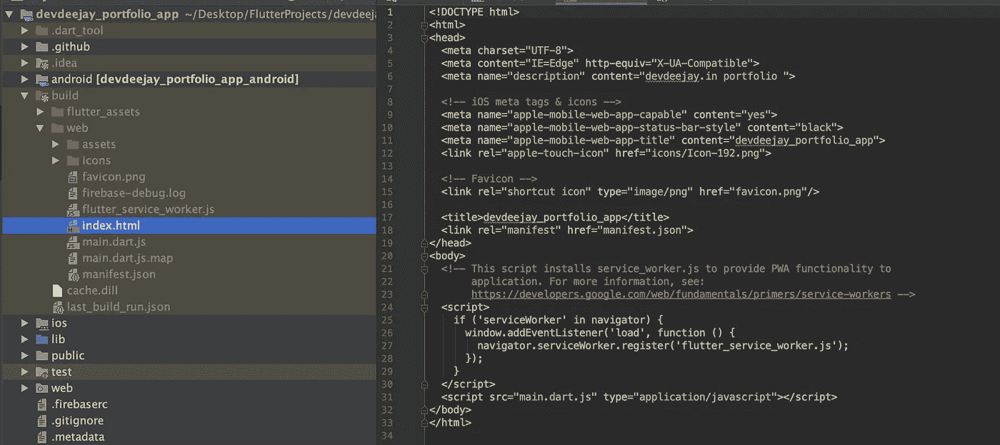

4.最后，让我们执行以下操作来运行我们的 Web 应用程序:

```
flutter run -d chrome
```

这将打开 Chrome，并在那里提供您的 web 应用程序。

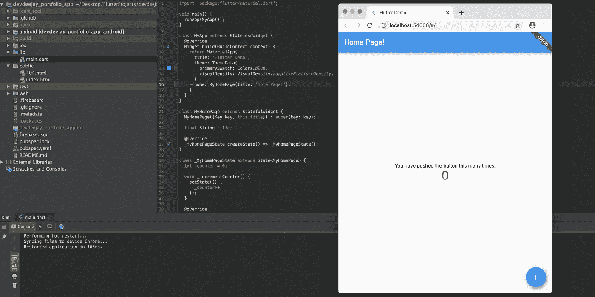

就是这样。您可以使用热重载继续构建您的 Flutter web 应用程序，就像任何其他 Flutter 项目一样。

5.创建一个 GitHub 项目，并将所有代码放在主分支中。这在下面的第 3 节中是需要的。

# 第二节。部署到 Firebase 主机(手动)

1.  转到 Firebase 并创建一个帐户。
2.  创建一个 Firebase 项目。
3.  在计算机中创建一个新文件夹来管理文件内容的托管。这也可以在您的项目中。打开此文件夹中的终端。
4.  安装 Firebase CLI。

```
// For Windows, Mac, Linux
sudo npm install -g firebase-tools
```

5.初始化火焰基地。

```
firebase init
```

*   这将带您在 CLI 中完成多个步骤，非常简单。

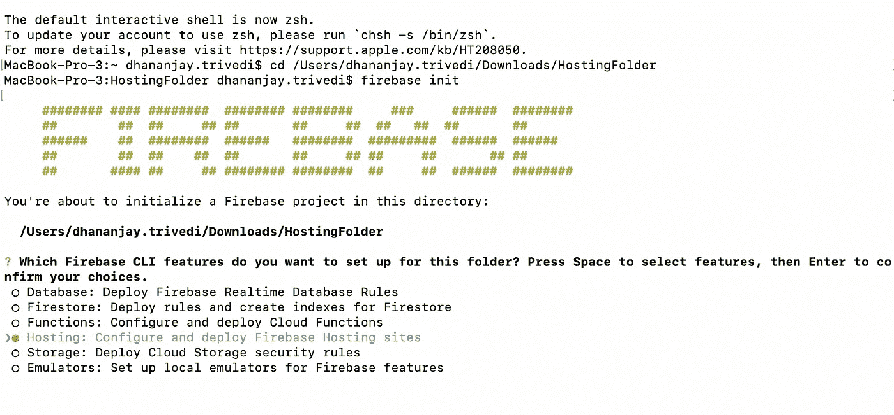

我们想使用托管服务。

*   它会要求您选择一个现有的项目。选择您已经创建的 Firebase 项目。
*   它将要求您创建一个公共目录。只需按回车键。
*   将应用程序配置为单页应用程序。只需输入`N`。
*   您应该会看到以下消息:

```
**✔ ** Firebase initialization complete!
```

保持终端开放。

6.打开您为托管创建的文件夹。这将是内容:


7.复制你的 Flutter 项目中`build/web`的内容并粘贴到上面的`public`文件夹中。

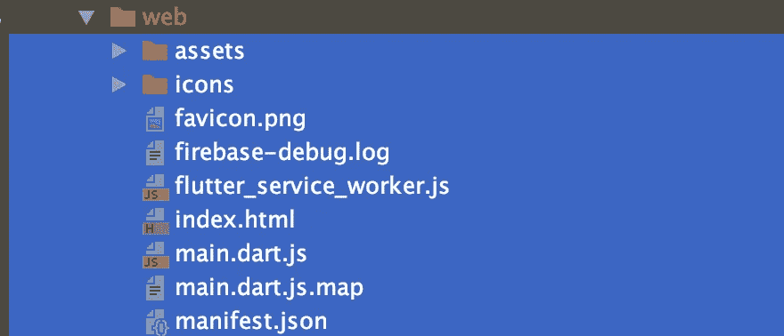

从 build/web 复制并粘贴所有内容。

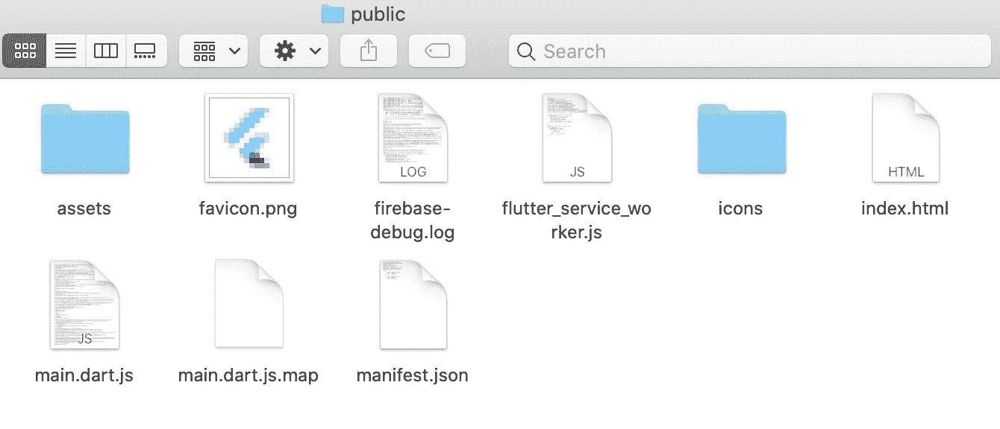

到我们创建的公共文件夹

8.回到终端，执行以下操作:

```
firebase deploy
```

它应该是这样的:

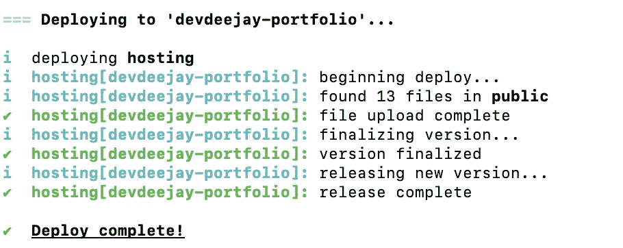

您将在终端中看到托管 URL，并且应该在那里看到您部署的 Firebase web 应用程序。

现在，您已经创建并部署了您的 Flutter web 应用程序。干得好！


# 第三节。实施持续部署

现在是 2020 年，术语*持续部署*已经出现了一段时间，仍然是一个热门话题。这是开发人员生产力的金药丸。

仅以我们构建和部署的上述项目为例。这是一个最简单的项目，但我们仍然必须遵循以下流程:

*   编写代码
*   推给 GitHub
*   构建应用程序版本
*   将其复制到托管文件夹
*   部署到 Firebase 主机

随着时间的推移，遵循这个步骤列表将花费大量可以自动化的员工时间。

想想大项目。随着时间的推移，您可以节省数周的时间来

*   构建新功能
*   构建一个辅助项目
*   学习新的东西
*   休息一段时间

随着持续部署，我们将把我们的代码推送到 GitHub，它将负责生成所需的构建和部署到 Firebase 主机。

这可以通过其他工具实现，但是今天我们将使用 GitHub Actions。

[](https://github.com/features/actions) [## 功能* GitHub 操作

### GitHub Actions 现在拥有世界一流的 CI/CD，可以轻松实现所有软件工作流程的自动化。构建、测试和…

github.com](https://github.com/features/actions) 

在我们开始之前，需要进行一些配置。

## 与 GitHub 共享您的 Firebase 密钥

由于现在我们的应用程序将自动部署到 Firebase 主机，我们需要与 GitHub 共享我们的 Firebase 密钥。

1.获取您的 Firebase 密钥

*   打开你的终端。

```
firebase login:ci
```

*   它将打开一个登录页面，并通过您的 Firebase 帐户登录。
*   回到终点站。你会看到你的 firebase 键，如下图所示。

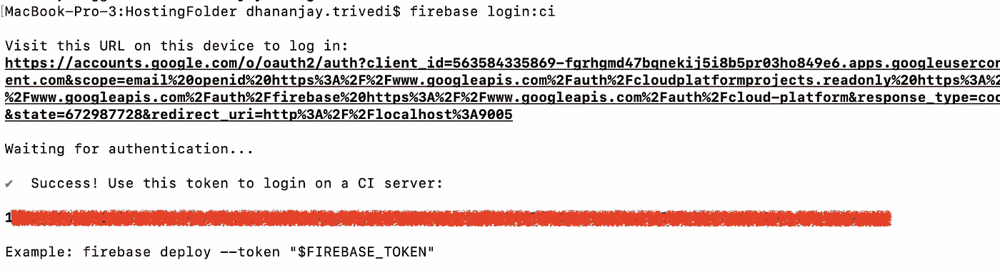

*   复制这个 Firebase 令牌。

2.将此保存到您的 GitHub repo

由于它将留在这个公共回购中，我们将需要加密我们的令牌。

GitHub 为此提供了一个很好的解决方案。跟随:

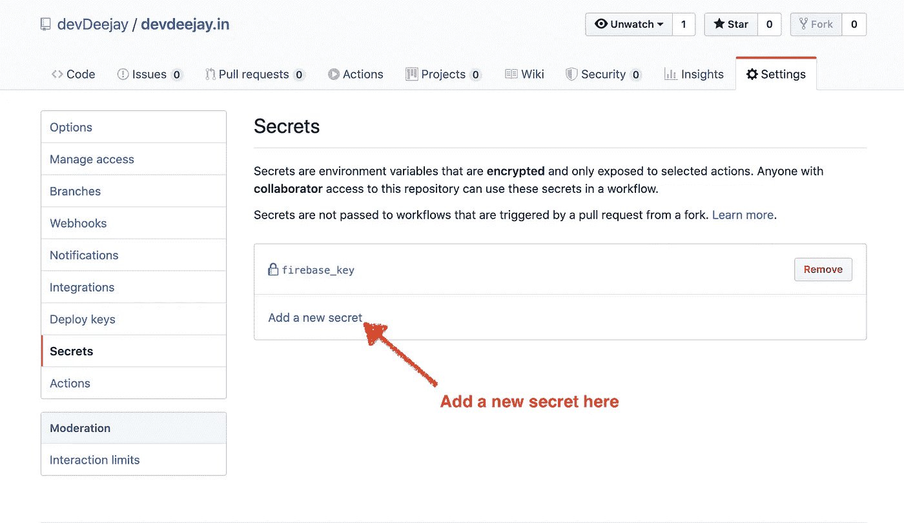

只需将您的令牌粘贴到这里，并给它一个唯一的名称，您将在以后使用它。我已经给了名字`firebase_key`。

3.在您的项目中初始化 Firebase

```
firebase init
```

这将在 GitHub 操作的部署中使用。

## 使用 GitHub 动作进行持续部署

转到您的 GitHub 项目。

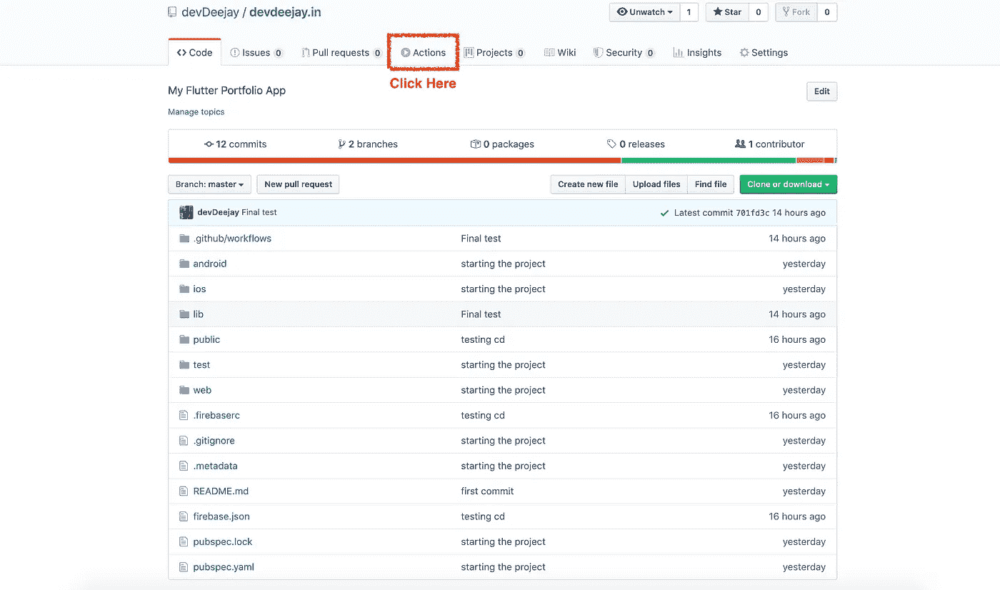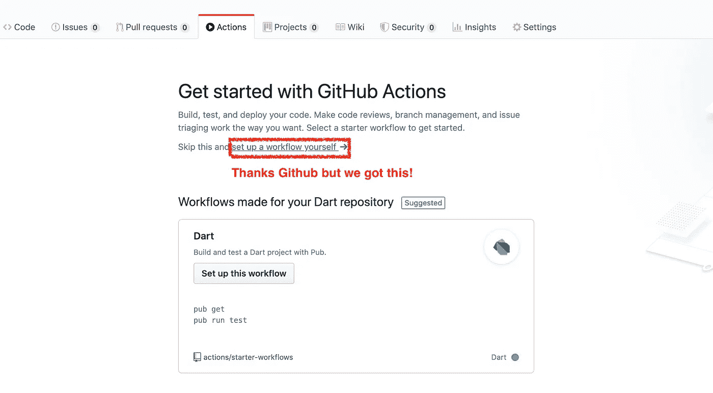

工作流是您希望通过 GitHub 操作实现自动化的一组作业/指令。

让我们通过点击“自己设置工作流”来创建我们的工作流您将看到一个编辑器打开，如下所示:

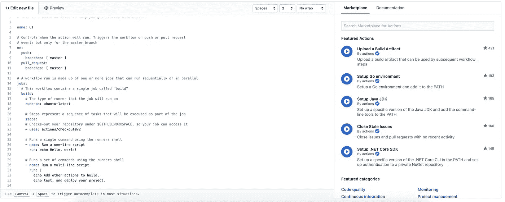

这是我们在`.yml file`中编写指令集的地方

下面是一个带注释的脚本，可以帮助你理解。

(这里有一个到[未注释脚本](https://gist.github.com/devDeejay/0b2e011fa82a504f35d62563b674c6bc)的链接)

最后，单击开始提交按钮。

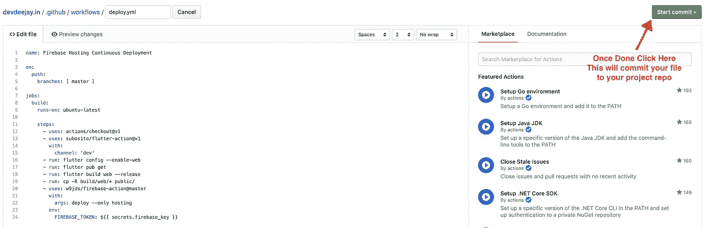

这将向您的项目添加一个`.github`文件夹，其中包含一个名为`workflows`的文件夹，该文件夹将包含您的`.yml`文件。

# 就是这样！测试一下

现在让我们做一些更改，并将我们的代码推送到主分支。

转到 Actions 选项卡，您将看到一个以您的提交消息的名称排队的进程。我的是`CD Completed`。

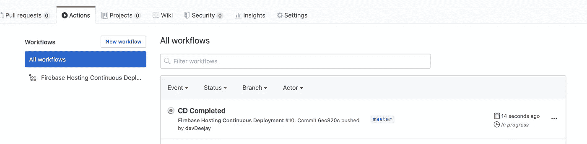

点击它进一步探索。

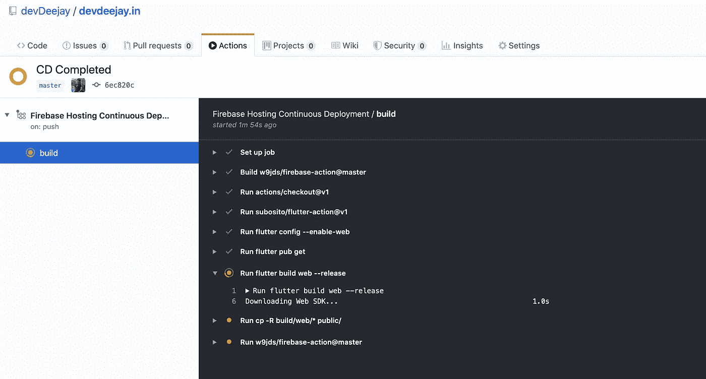

等待它结束。您可以单击箭头来展开该过程，以查看详细的日志。

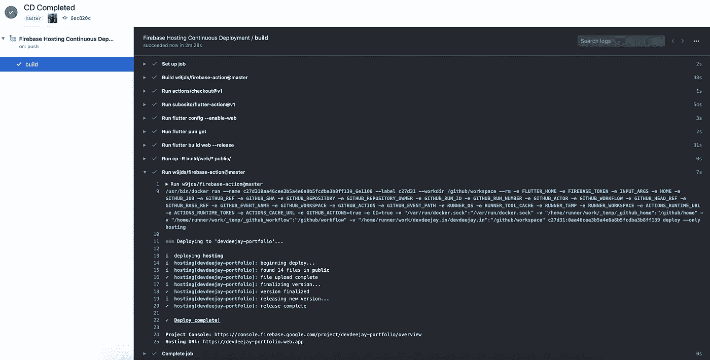

一旦完成，您可以在日志中看到它已经部署到 Firebase 主机。

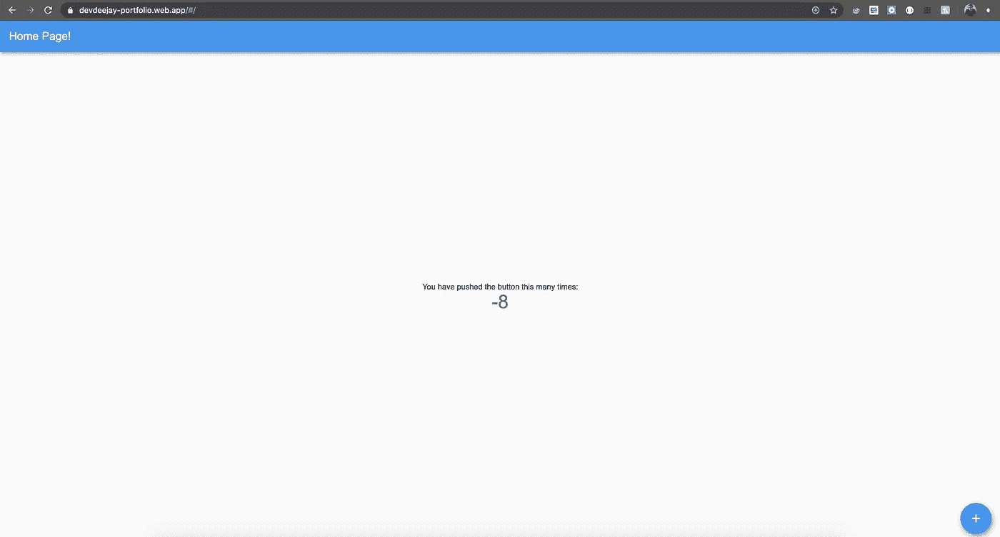

我相信你能看到我做了什么改变。

这就对了。你成功了！

# 这是你今天做的事情

*   从头开始构建一个 Flutter web 应用程序
*   把它部署到 Firebase 向全世界展示
*   使用 GitHub Actions 自动完成从构建到部署的过程，为您将来节省大量时间。