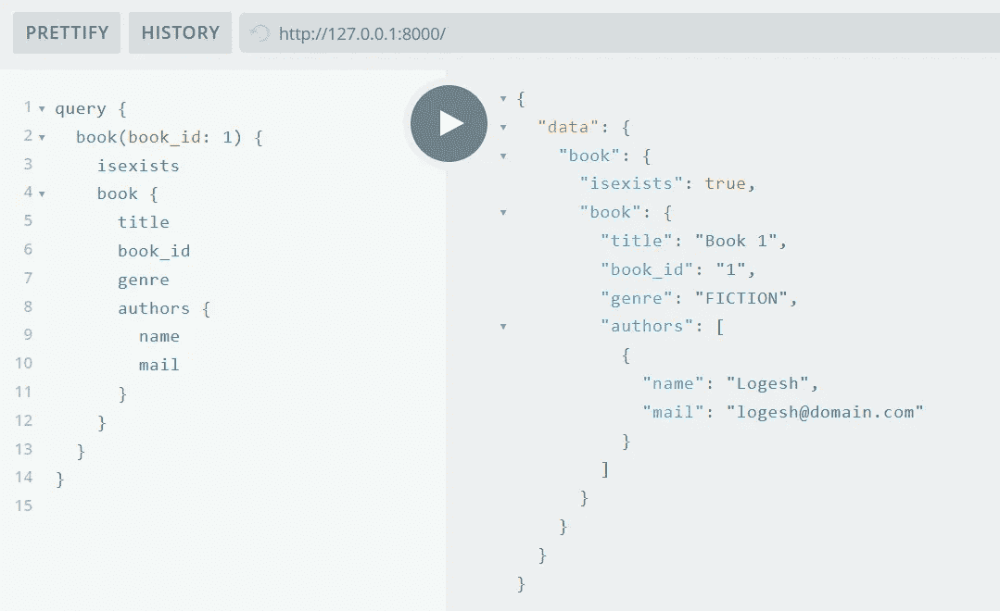
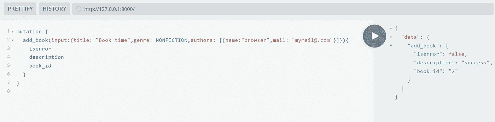
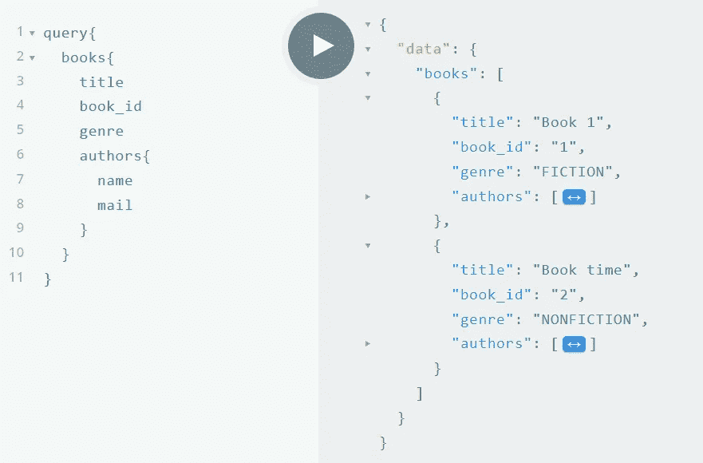
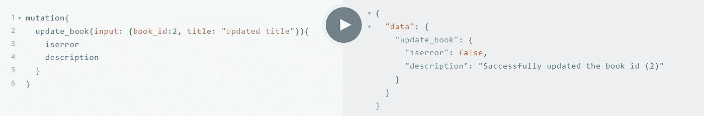
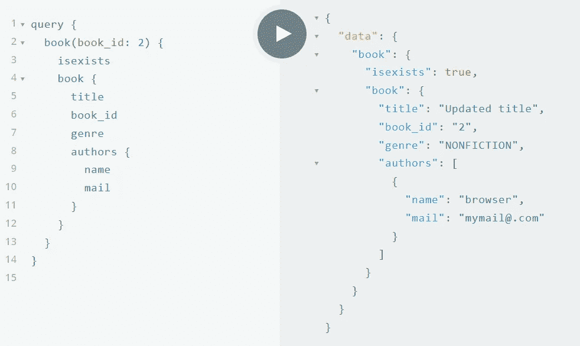
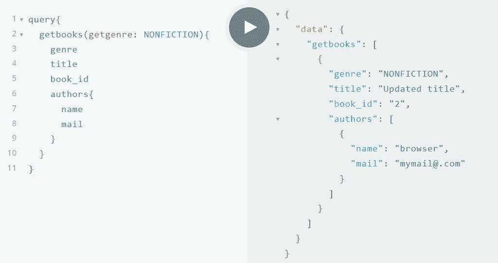
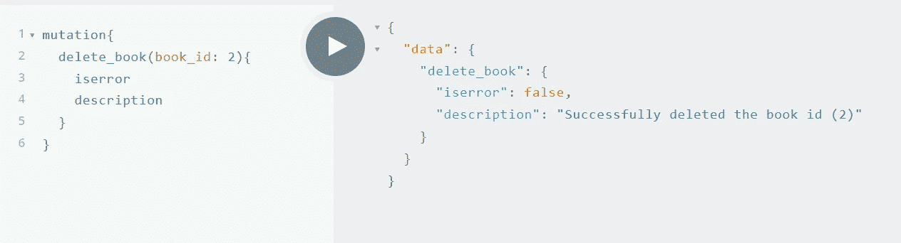
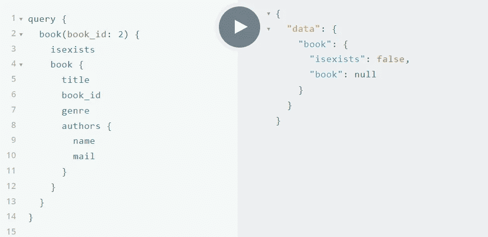

# 使用 Python 中的模式优先方法构建 GraphQL 服务器

> 原文：<https://betterprogramming.pub/building-graphql-server-using-schema-first-approach-in-python-68aeee38bcc3>

## 轻松处理 CRUD 操作


道格拉斯·洛佩斯在 [Unsplash](https://unsplash.com?utm_source=medium&utm_medium=referral) 上拍摄的照片

模式优先的方法什么也不是，但是我们首先为我们的 GraphQL 服务定义模式，然后我们通过匹配我们定义的模式中的定义来实现代码。

为此我们将使用`Ariadne`库。

> Ariadne 是一个 Python 库，使用模式优先的方法实现 GraphQL 服务器。— [阿里阿德涅](https://ariadnegraphql.org/)

# 项目概述

我们将构建 GraphQL 服务器来处理书店中图书的 CRUD 操作。

简单地说，我们将把这本书的信息存储在我们的数据库中。为了使这个项目更简单，我没有使用任何类型的数据库，只是使用了内存存储，更侧重于 GraphQL 部分。

## 服务器操作

*   添加书籍
*   按 ID 获取图书
*   按流派列出书籍
*   列出所有的书
*   更新图书
*   删除这本书

# 构建 GraphQL 服务器

## 库安装

我们高度依赖于`Ariadne` 库，所以我们必须安装它。

```
pip install ariadne
```

我们必须让我们的 GraphQL 服务器成为 HTTP 服务器，接收 HTTP 请求，执行 GraphQL 查询，并返回响应。

为此，我们可以使用 ASGI ( *异步服务器网关接口*)服务器，如[uvicon](http://www.uvicorn.org/)。

```
pip install uvicorn
```

# 定义我们的模式

> 我邀请您按照自己的方式和要求来定义模式和实现代码。这里我们将看到我定义模式的方式。

我计划用一些 GraphQL 对象类型来保存关于我们的书`store`中的`Books`的一些信息。

现在我有 2 个对象类型和 1 个枚举类型来描述一本书。

`**Book**` 类型有如下字段:

*   `title` —字符串类型，不可空
*   `book_id` — ID 类型
*   `genre` —枚举类型
*   `author`—`Author`类型的数组，不可空

`Author`类型:

*   名称—字符串类型，不可为空
*   邮件-字符串类型

`**BookGenre**` 枚举类型:

*   有两个值(`FICTION`、`NONFICTION`)

以上类型是处理`Books`信息的基本类型。

现在我们继续定义 GraphQL 服务的入口点。

## 查询类型

我有上面的查询类型，有 3 个字段。

*   `book` —通过在参数中提供`book_id`来获取图书详情
*   `books` —获取可用书籍列表
*   `getbooks` —获取所请求流派的书籍列表。`getgenre`参数是可选的，默认值为`FICTION`。

```
type **GetBookResult**{
    ***isexists***: Boolean!
    ***book***: Book
}
```

`**GetBookResult**` 类型有 2 个字段:

*   `isexists` — Boolean 类型，不可空，表示给定`book_id`的图书信息是否存在
*   书籍—书籍类型

## 突变类型

突变类型有 3 个字段

*   `add_book` —通过提供输入在我们的书店中创建图书资源，响应是请求的状态。
*   `update_book` —更新现有图书信息，响应是该请求的状态。
*   `delete_book` —删除具有给定图书 id 的图书，并返回操作状态。

以上类型用于突变类型的`**add_book**` 字段。

`UpdateInput`和`PutStatus`类型用于`Mutation`类型的`**update_book**` 字段。

```
type **DeleteStatus**{
    ***iserror***: Boolean!
    ***description***: String
}
```

`DeleteStatus`类型用于`Mutation`类型的`delete_book`字段。

我们到达了模式定义的末尾。开始实现代码。

# GraphQL 服务器实现

## 内存存储

正如我前面提到的，我将使用内存中的数据存储(只是一个变量)来存储书的信息。

```
**BOOK_STORE** = [
    {
        "title": "Book 1", "book_id": 1, "genre": "FICTION",
        "authors": [{"name": "Logesh", "mail": "logesh@domain.com"}]
    },
]
```

这里我有一个初始模拟数据。

## 样板代码

我们可以用两种方式加载我们的模式:

*   通过在变量中定义我们的模式
*   通过在单独的`.graphql`文件中定义我们的模式

例如，在第一种情况下:

```
from ariadne import QueryType, gql, make_executable_schema, MutationTypefrom ariadne.asgi import GraphQLtype_defs = **gql**("""
        type Query {
            book(book_id : ID!): GetBookResult
            books: [Book]
        }
    """)query = QueryType()
mutation = MutationType()schema = make_executable_schema(type_defs, query, mutation)
app = GraphQL(schema, debug=True)
```

对于第二种情况:

```
from ariadne import QueryType, make_executable_schema, MutationType, load_schema_from_pathfrom ariadne.asgi import GraphQLquery = QueryType()
mutation = MutationType()book_type_defs = load_schema_from_path("**book_schema.graphql**")
schema = make_executable_schema(book_type_defs, query, mutation)
app = GraphQL(schema, debug=True)
```

在上面的代码中，我们可以看到我已经从外部文件加载了我们的模式。

## 助手功能

我写了一些帮助函数，比如从`BOOK_STORE`中获取图书信息:

上面的函数用于从`BOOK_STORE`变量(我们的数据库)中获取给定 ID 的图书

该函数用于检查给定 ID 的图书是否存在。

这个简单的函数用于创建一个惟一的 id，这是在创建一本新书时需要的。

通过提供图书 ID 从`BOOK_STORE`变量中删除图书。

这个函数用于获取给定流派的书籍列表。

## 下决心者

现在我们已经准备好实现我们的 GraphQL 服务器解析器了。

对于查询类型的`**book**` 字段，我们使用上面的函数来解析查询，并返回带有我们在模式中的请求响应类型中提到的键(字段)的字典。

以上解析器函数用于解析查询字段— `books`和`getbooks`。

现在转向突变型。

以上函数用于在我们的`Book`商店中创建一本新书。

`resolve_update_book` 功能用于更新已有的图书。

此功能用于通过提供图书 id 来删除图书。

现在我们已经解决了我们的问题，转而为客户服务。

# 为客户服务

通过使用`uvicorn`，我们将使我们的 GraphQL 服务器通过 HTTP 提供服务。

执行下面的命令来启动服务器。

```
uvicorn main:app
# uvicorn <filename>:<GraphQL object>
```

运行在 http://127.0.0.1:8000 上的 Uvicorn

## 查询书



## 突变 add_book



## 查询书籍



## 突变更新 _ 本书



## 查询书



## 查询 getbooks



## 突变删除 _ 图书



## 查询书



我们还可以使用 Postman 作为 GraphQL 客户端。

在本文中，我们看到了如何用 Python 构建我们自己的 GraphQL 服务器(模式优先方法)。

你可以在我的 [Github](https://github.com/LogeshVel/GraphQL_basics_using_ariadne) 上找到这个项目。感谢阅读。