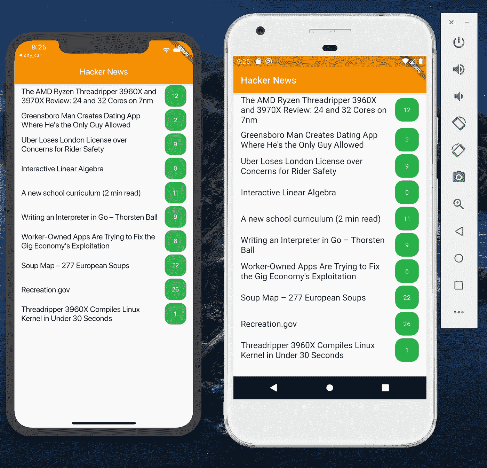
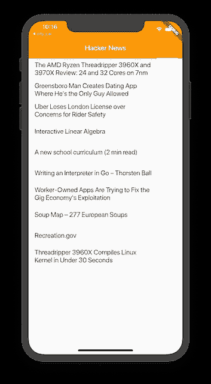
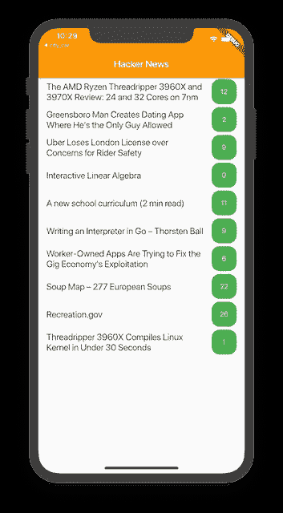

# 如何在 Flutter 中搭建一个黑客新闻 App

> 原文：<https://betterprogramming.pub/building-hacker-news-in-flutter-a03a716dce2f>

## 在任何设备上获取并显示当天的头条新闻



在过去的几个月里，我一直在努力学习我的关于 [Flutter](https://flutter.dev/) 的新中级视频课程，该课程将在 Udemy 冬末或早春推出。

在这篇文章中，我将讲述如何制作一个应用程序来显示来自[黑客新闻](https://news.ycombinator.com/)的故事，以及评论。

Hacker News 提供了一个优秀的、文档完善的 JSON API，可以公开获得。你可以在 GitHub 上查看 API [。](https://github.com/HackerNews/API)

# 获取头条新闻

第一步是实现一个 web 服务来获取头条新闻。有几个软件包可以在 Flutter 中执行网络任务。

为了简单起见，我们将使用 [http](https://pub.dev/packages/http) 包。通过在`pubspec.yaml`文件中添加 http 包来安装包，如下所示:

在 [VS 代码](https://code.visualstudio.com/)中，一旦保存了`pubspec.yaml`文件，就会自动下载包。如果您想手动安装软件包，只需运行:

```
flutter pub get
```

我们将在一个`Webservice.dart`文件中实现我们的`getTopStories`方法。实现如下所示:

我们使用 http 包来调用以下 URL:

[https://hacker-news.firebaseio.com/v0/topstories.json?print=pretty](https://hacker-news.firebaseio.com/v0/topstories.json?print=pretty)

如果您查看来自上述 URL 的响应，您将意识到它返回了一个故事 id 数组。我们使用这些 id 来检索实际的故事，并利用`Future.wait` 来等待所有的响应。

一旦评估了所有响应，就向调用者返回一个`Future<List<Response>>`。

[](https://www.udemy.com/course/flutter-dart-mvvm-design-pattern/?referralCode=3E32698D188E47553501) [## 终极手摇& MVVM -建造真实的项目

### Google Flutter 框架风靡全球。Flutter 允许开发人员编写一个单一的代码库…

www.udemy.com](https://www.udemy.com/course/flutter-dart-mvvm-design-pattern/?referralCode=3E32698D188E47553501) 

# 显示热门故事

`TopArticleList`小部件负责向用户显示顶级黑客新闻。我们在`initState`方法内部调用`_populateTopStories`，如下面的实现所示:

构建功能负责为应用程序创建用户界面。实现如下所示:

下面的截图显示了结果:



黑客新闻应用头条页面

# 显示文章的评论

目前，一个故事不显示与该故事相关的评论数量。下面的 JSON 端点返回一个特定的故事，以及评论的 id，由 JSON 响应中的子属性表示。

【https://hacker-news.firebaseio.com/v0/item/8863.json? 打印=漂亮

为了满足这一需求，我们更新了`Story`模型，将`commentIds`包括在内，如下所示:

进行更改后，运行应用程序，您将看到更新后的结果，如下图所示:



附有评论的故事

最后一部分是查看与每个故事相关的评论。完整的代码可以在 [GitHub](https://github.com/azamsharp/hacker_news_flutter) 上找到。

[](https://www.udemy.com/course/flutter-dart-mvvm-design-pattern/?referralCode=3E32698D188E47553501) [## 终极手摇& MVVM -建造真实的项目

### Google Flutter 框架风靡全球。Flutter 允许开发人员编写一个单一的代码库…

www.udemy.com](https://www.udemy.com/course/flutter-dart-mvvm-design-pattern/?referralCode=3E32698D188E47553501)