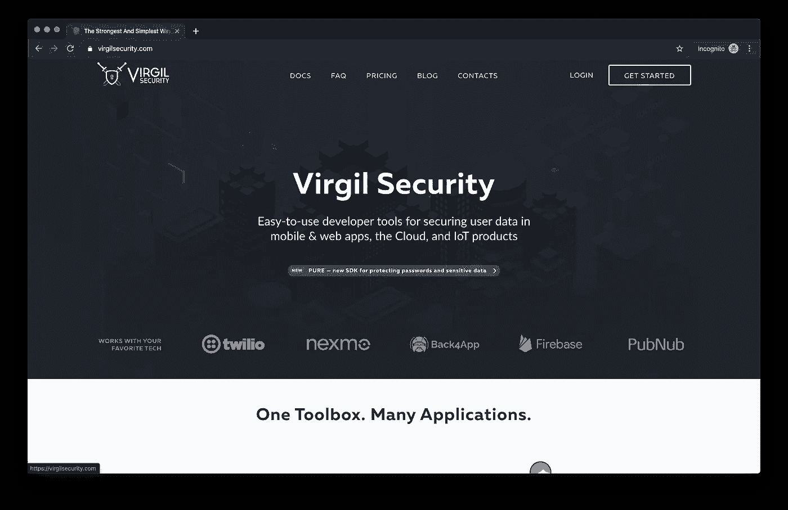
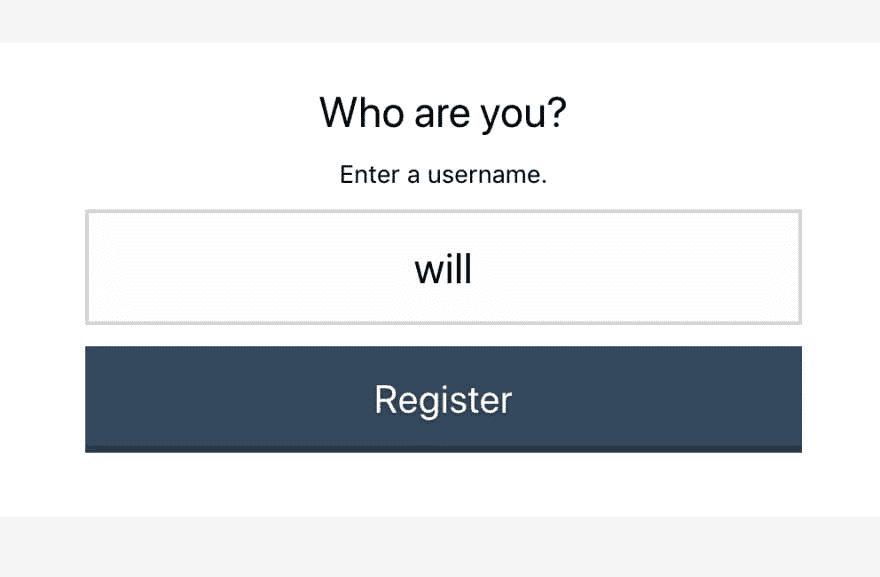
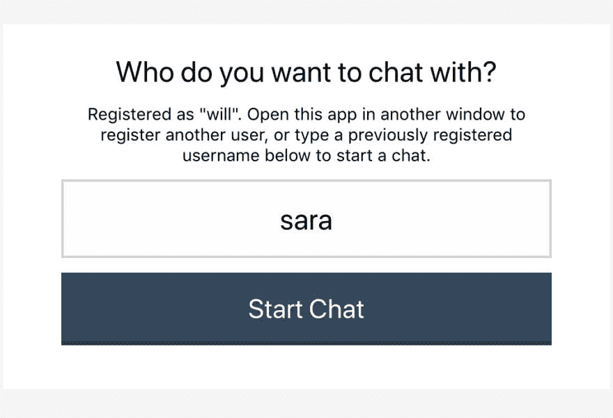
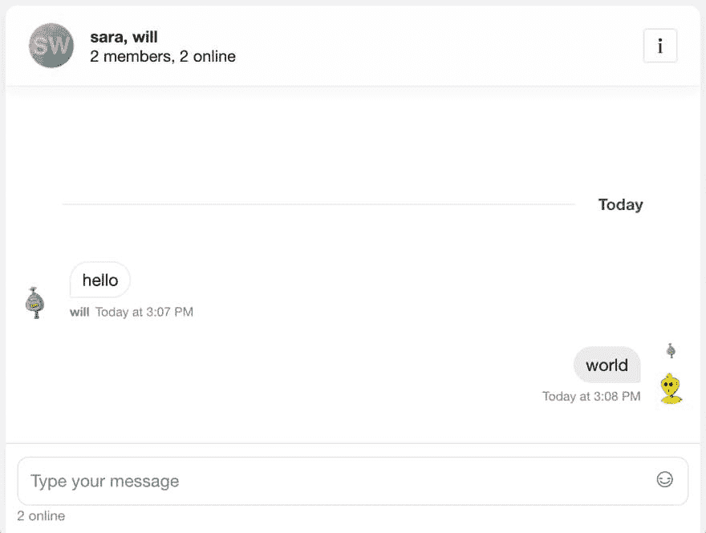

# 构建符合 HIPAA 的端到端加密聊天

> 原文：<https://betterprogramming.pub/building-hipaa-compliant-end-to-end-encrypted-chat-with-stream-react-chat-and-virgil-security-6c3c35f0664d>

## 与 Stream React 聊天和维吉尔安全



随着医疗保健技术的进步，安全的实时通信对任何现代医疗保健应用都变得至关重要。在保护患者隐私和医疗保健数据的同时，提供患者期望的技术体验至关重要。聊天消息通常包含受保护的健康信息(PHI)，因此在构建聊天时，您必须考虑端到端加密。

在本教程中，我们将介绍如何使用 [Stream Chat](https://getstream.io/chat/) 结合 [Virgil Security](https://virgilsecurity.com/end-to-end-encrypted-chat) 创建完整的端到端加密聊天解决方案。这两项服务允许开发人员通过保护 PHI 和患者通信来集成符合 HIPAA 的聊天。该应用嵌入了 Virgil Security 的 [eThree Kit](https://github.com/VirgilSecurity/virgil-e3kit-js) 和 [Stream Chat React](https://github.com/GetStream/stream-chat-react) 的组件。该应用的所有源代码都可以在 [GitHub](https://github.com/psylinse/stream-encrypted-chat) 上获得。

Stream Chat 和 Virgil 可以轻松构建一个具有出色安全性和所有预期功能的解决方案。

# 什么是端到端加密？

端到端加密意味着两个人之间发送的消息只能被那两个人读取。为此，消息在离开用户设备之前被加密，并且只能由预定的接收者解密。

Virgil Security 是一家供应商，它使我们能够使用公钥/私钥技术创建端到端加密。Virgil 提供了一个平台和一个 JavaScript SDK，使我们能够创建、存储和提供健壮的端到端安全加密。

在本教程中，我们将创建一个流聊天应用程序，它使用 Virgil 的加密技术来防止除预定方之外的任何人阅读消息。您公司中的任何人，或者您使用的任何云提供商，都无法阅读这些消息。即使一个恶意的人获得了包含消息的数据库的访问权，他们所看到的也只是加密的文本，即所谓的密文。

# 让我们使用 React 构建一个符合 HIPAA 的聊天应用程序！

为了构建这个应用程序，我们将依赖三个库，
[Stream React Chat](https://www.npmjs.com/package/stream-chat-react) ， [Virgil SDK](https://www.npmjs.com/package/virgil-sdk) 和 [Virgil Crypto](https://www.npmjs.com/package/virgil-crypto) 。我们的最终产品将在发送消息之前在浏览器中加密文本。解密和验证都将在接收者的浏览器中进行。

为此，该应用程序执行以下步骤:

*   用户通过您的后端进行身份验证。
*   用户的应用程序从后端请求流身份验证令牌和 API 密钥。浏览器为该用户创建一个[流聊天客户端](https://getstream.io/chat/docs/#init_and_users)。


*   用户的应用程序从后端请求一个 Virgil 身份验证令牌，并向 Virgil 注册。这将生成他们的私钥和公钥。私钥存储在本地，公钥存储在 Virgil 中。
*   一旦用户决定了他们想和谁聊天，应用程序就会创建并加入一个[流聊天频道](https://getstream.io/chat/docs/#initialize_channel)。
*   该应用程序向 Virgil 索要接收者的公钥。
*   用户键入一条消息并将其发送到 stream。在发送之前，该应用程序将接收者的公钥传递给 Virgil 以加密消息。消息通过 Stream Chat 传递给接收者。流接收密文，这意味着他们永远看不到原始消息。
*   接收用户使用 Virgil 解密发送的消息。当收到消息时，应用程序用 Virgil 解密消息，并将它传递给 Stream 的 React 组件。Virgil 使用发送者的公钥验证消息的真实性。

这看起来令人生畏，但幸运的是 Stream 和 Virgil 为我们做了繁重的工作。作为使用这些服务的开发人员，我们的责任只是将它们正确地连接在一起。

代码在包含在`frontend`文件夹中的 React 前端和位于`backend`文件夹中的 Express (Node.js)后端之间进行分割。查看每个文件夹中的`README.md`，查看安装和运行说明。如果您想继续运行代码，请确保在继续之前让`backend`和`frontend`都运行起来。

让我们走一遍，看看每个步骤所需的重要代码。

# 先决条件

遵循本教程需要 React 和 Node.js 的基础知识。此代码旨在在您的计算机上本地运行。

你需要一个[流](https://getstream.io/accounts/signup/)和[维吉尔](https://dashboard.virgilsecurity.com/signup)的账户。创建您的帐户，然后将您的凭证放入`backend/.env`。使用`backend/.env.example`作为需要凭证的参考。

本教程使用以下软件包版本:

*   节点 11.14.0
*   纱线 1.17.0
*   流聊天 0.13.3
*   流聊天反应 0.6.26
*   维吉尔加密 3.2.0
*   Virgil SDK 5.3.0
*   Virgil e3Kit 0.5.3
*   快递 4.17.1

除了`node`和`yarn`之外，所有这些依赖项都在`backend/package.json`和`frontend/package.json`中声明。

# 第一步。设置后端

为了让 React 前端与 Stream 和 Virgil 交互，
应用程序提供了三个端点:

*   `POST /v1/authenticate`:这个端点生成一个 auth 令牌，允许 React 前端与`/v1/stream-credentials`和`/v1/virgil-credentials`通信。为了简单起见，这个端点允许客户机是任何用户。前端告诉后端它想要认证谁。在您的应用程序中，这应该替换为您的 API 的身份验证端点。
*   `POST /v1/stream-credentials`:返回 React 应用程序与 Stream 建立会话所需的数据。要返回此信息，我们需要告诉 Stream 此用户存在，并要求他们创建一个有效的 auth 令牌:

```
exports.streamCredentials = async (req, res) => {
    const data = req.body;
    const apiKey = process.env.STREAM_API_KEY;
    const apiSecret = process.env.STREAM_API_SECRET;

    const client = new StreamChat(apiKey, apiSecret);

    const user = Object.assign({}, data, {
      id: `${req.user.sender}`,
      role: "admin",
      image: `https://robohash.org/${req.user.sender}`
    });
    const token = client.createToken(user.id);
    await client.updateUsers([user]);
    res.status(200).json({ user, token, apiKey });
  };
```

响应负载的形状如下:

```
{
    "apiKey": "<string>",
    "token": "<string>",
    "user": {
      "id": "<string>",
      "role": "<string>",
      "image": "<string>"
    }
  }
```

*   `apiKey`是您的流实例的流帐户标识符。需要它来识别您的前端试图连接的帐户。
*   `token` : JWT 令牌，授权前端使用流。
*   `user`:这个对象包含了前端需要连接和渲染用户视图的数据。

```
const virgilCrypto = new VirgilCrypto();

const generator = new JwtGenerator({
  appId: process.env.VIRGIL_APP_ID,
  apiKeyId: process.env.VIRGIL_KEY_ID,
  apiKey: virgilCrypto.importPrivateKey(process.env.VIRGIL_PRIVATE_KEY),
  accessTokenSigner: new VirgilAccessTokenSigner(virgilCrypto)
});

exports.virgilCredentials = async (req, res) => {
  const virgilJwtToken = generator.generateToken(req.user.sender);

  res.json({ token: virgilJwtToken.toString() });
};
```

在这种情况下，前端只需要 auth 令牌。

# 第二步。用户通过后端验证

既然我们已经设置并运行了我们的后端，是时候对后端进行认证了。如果您正在运行该应用程序，您将看到以下屏幕:



这是一个简单的 React 表单，它接受所提供的输入，将其存储在状态中作为`sender`，并使用该信息对后端进行身份验证:

```
exports.streamCredentials = async (req, res) => {
    const data = req.body;
    const apiKey = process.env.STREAM_API_KEY;
    const apiSecret = process.env.STREAM_API_SECRET;

    const client = new StreamChat(apiKey, apiSecret);

    const user = Object.assign({}, data, {
      id: `${req.user.sender}`,
      role: "admin",
      image: `https://robohash.org/${req.user.sender}`
    });
    const token = client.createToken(user.id);
    await client.updateUsers([user]);
    res.status(200).json({ user, token, apiKey });
  };
```

一旦我们用 auth 令牌创建了发送者身份，我们就可以连接到 Stream 和 Virgil。

# 第二步。用户连接到流

使用来自[步骤 1](https://getstream.io/blog/hipaa-chat/#step-1-user-authenticates-with-backend) 的凭证，我们可以从后端请求流凭证。使用这些，我们将前端客户端连接到流:

```
{
    "apiKey": "<string>",
    "token": "<string>",
    "user": {
      "id": "<string>",
      "role": "<string>",
      "image": "<string>"
    }
  }
```

这将从`Stream Chat React`库中初始化`StreamChat`对象，并使用后端生成的令牌对用户进行身份验证。

# 第三步。用户连接到 Virgil

再次使用在[步骤 1](https://getstream.io/blog/hipaa-chat/#step-1-user-authenticates-with-backend) 中获得的凭证，我们请求后端生成一个 Virgil auth 令牌。使用这个令牌，我们从维吉尔的`e3kit`库中初始化了`EThree`对象:

# 第四步。创建流聊天频道

一旦我们同时连接到 Stream 和 Virgil，我们就可以开始和某人聊天了。点击教程应用程序中的“注册”后，您将看到以下屏幕:



该表单询问您想与之聊天的用户的身份。如果他们已经在另一个浏览器窗口注册，我们可以创建一个针对这两个成员的流聊天`Channel`:

```
let members = [this.state.sender, this.state.receiver];
members.sort();

const channel = this.state.stream.client.channel("messaging", {
  image: `https://getstream.io/random_svg/?id=rapid-recipe-0&name=${members.join(
    "+"
  )}`,
  name: members.join(", "),
  members: members
});
```

我们在状态下访问的客户端是在
[步骤 2](https://getstream.io/blog/hipaa-chat/#step-2-user-connects-to-stream) 中创建的客户端。呼叫`.channel`将基于成员的身份创建或加入一个独特的频道。只有那两个成员可以进去。然而，这不足以保护 Stream 或其他人查看这些用户的消息。

# 第五步。查找 Virgil 公钥

为了在通过流通道发送消息之前对其进行加密，我们需要查找接收者的公钥:

```
const publicKeys = await this.state.virgil.eThree.lookupPublicKeys([
  this.state.sender,
  this.state.receiver
]);
```

我们状态中的`eThree`实例来自[步骤 3](https://getstream.io/blog/hipaa-chat/#step-3-user-connects-to-virgil) 。假设发送方的身份是`will`，接收方的身份是`sara`，这将返回一个如下所示的对象:

```
{
  will: {/* Public Key Info */},
  sara: {/* Public Key Info */}
}
```

因为我们需要解密收到的我们自己的消息，为了显示和方便，我们同时要求两个公钥。

# 第六步。发送方加密消息并通过流发送

我们已经具备了通过 Stream 发送安全、端到端的加密消息所需的一切，现在是聊天的时候了！

首先，我们需要向用户展示聊天室:

```
<Chat client={this.state.stream.client} theme={"messaging light"}>
  <Channel channel={this.state.stream.channel}>
    <Window>
      <ChannelHeader />
      <MessageList Message={this._buildMessageEncrypted} />
      <MessageInputEncrypted
        virgil={this.state.virgil}
        channel={this.state.stream.channel}
      />
    </Window>
    <Thread />
  </Channel>
</Chat>
```

这呈现了 Stream React 聊天组件，为我们的用户创建了出色的开箱即用体验。如果你继续看下去，你会看到这个:



注意我们包含自定义类`MessageInputEncrypted`的那一行。该组件使用来自 Virgil 的发送者公钥来加密，然后在通过流通道发送消息之前包装流 React `MessageInput`组件:

```
export class MessageInputEncrypted extends PureComponent {
  sendMessageEncrypted = async data => {
    const encryptedText = await this.props.virgil.eThree.encrypt(
      data.text,
      this.props.virgil.publicKeys
    );
    await this.props.channel.sendMessage({
      ...data,
      text: encryptedText
    });
  };

  render = () => {
    const newProps = {
      ...this.props,
      sendMessage: this.sendMessageEncrypted
    };

    return <MessageInput {...newProps} />;
  };
}
```

现在所有流将看到的是密文！

# 第七步。接收者解密并读取消息

最后要做的事情是在接收方解密发送方的消息。假设您已经完成了聊天室设置，您将看到以下内容:


为了解密消息，我们遵循与第 6 步中[相似的模式。如果你看看我们是如何创建`MessageList`的，你会看到一个名为`MessageEncrypted`的定制`Message`组件:](https://getstream.io/blog/hipaa-chat/#step-6-sender-encrypts-message-and-sends-it-via-stream)

```
<MessageList Message={this._buildMessageEncrypted} />
```

由于我们需要提供解密道具来将用于解密的道具添加到我们的自定义`Message`组件中，所以我们将它们添加到 React 流传递的道具中:

```
_buildMessageEncrypted = props => {
  const newProps = {
    ...props,
    sender: this.state.sender,
    receiver: this.state.receiver,
    virgil: this.state.virgil
  };
  return <MessageEncrypted {...newProps} />;
};
```

一旦我们有了我们需要的道具，我们就可以解密每条信息:

```
export class MessageEncrypted extends PureComponent {
  _isMounted = false;

  constructor(props) {
    super(props);
    this.state = { decryptedText: null };
  }

  componentDidMount = () => {
    this._isMounted = true;
    this._decryptText().then(decryptedText => {
      if (this._isMounted) {
        this.setState({ decryptedText });
      }
    });
  };

  componentWillUnmount = () => {
    this._isMounted = false;
  };

  _decryptText = async () => {
    const messageCreator = this.props.isMyMessage(this.props.message)
      ? this.props.sender
      : this.props.receiver;
    return this.props.virgil.eThree.decrypt(
      this.props.message.text,
      this.props.virgil.publicKeys[messageCreator]
    );
  };

  render = () => {
    const newProps = {
      ...this.props,
      message: {
        ...this.props.message,
        text: this.state.decryptedText || ""
      }
    };

    return <MessageSimple {...newProps} />;
  };
}
```

这个类在呈现来自 Stream Chat React 的`MessageSimple`组件之前解密消息。为此，我们首先使用 Stream 的`.isMyMessage`确定消息是否确实是我们的消息。然后我们找到正确的公钥，并要求维吉尔解密。一旦完成，我们就可以将密钥和其余的道具一起传递给流的`MessageSimple`组件。

`_isMounted`标志防止在消息被解密后更新组件。如果你滚动得很快，或者页面加载时有很多消息，就会发生这种情况。

# 从这里去哪里

本教程旨在让您尽快上手并运行。因此，您的应用程序可能会缺少一些关键功能。以下是关于如何使用你的应用程序的一些提示:

*   建立真实用户注册，保护身份注册。本教程简化了注册和检索有效令牌，以便与 Stream 和 Virgil 进行交互。
*   备份用户的私钥以恢复会话并用于多个设备。使用维吉尔的`eThree.backupPrivateKey(pwd)`将安全地存储私钥，以便在任何设备上恢复。
*   集成用户图像和文件上传。这个功能通过 CSS 隐藏在这个应用程序中。你可以看看如何连接到 Stream React Chat 的 [MessageInput](https://getstream.github.io/stream-chat-react/#messageinput) 或者作为一个起点来构建你自己的聊天小部件。

# 这是一个总结！

我希望你喜欢这个教程。有关流聊天的更多信息，请访问[https://getstream.io/chat](https://getstream.io/chat)。关于维吉尔的信息，请访问 https://virgilsecurity.com/的[。](https://virgilsecurity.com/)

编码快乐！