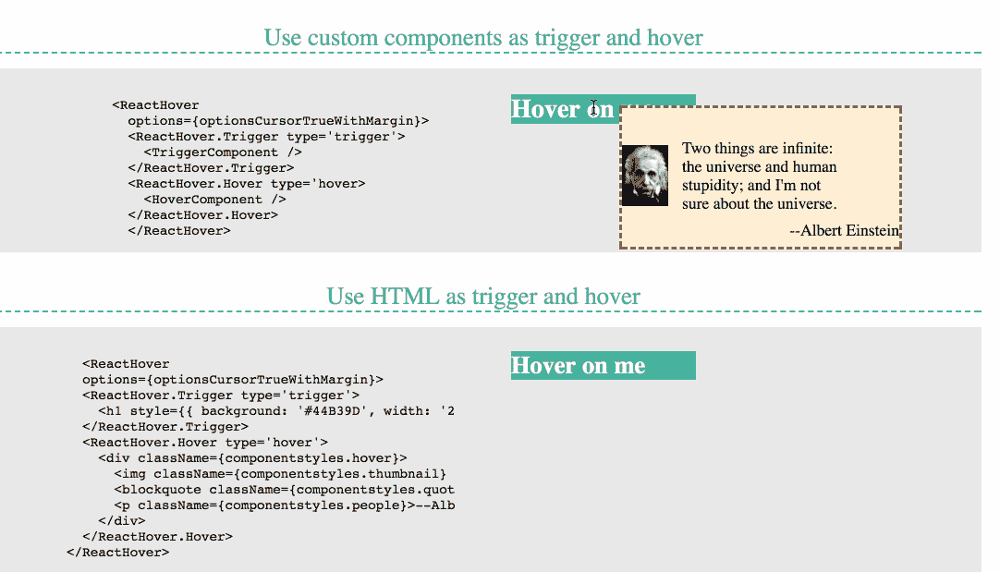
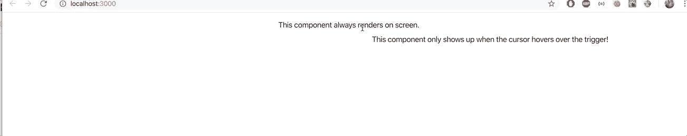
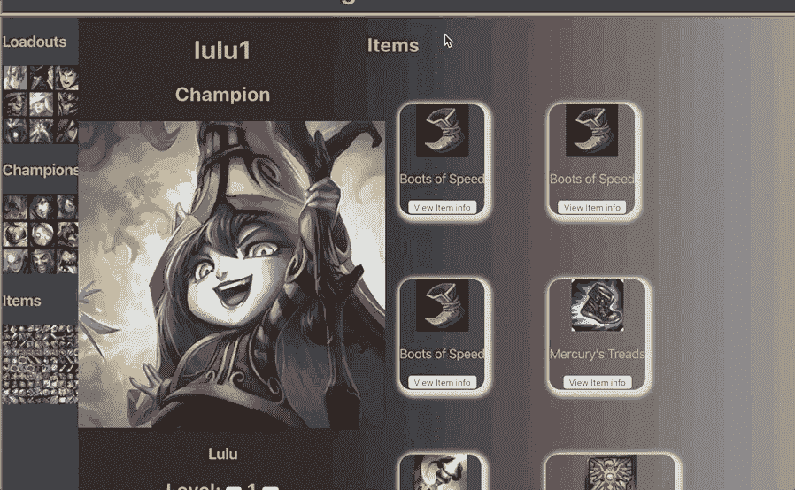

# 用 React-Hover 构建悬停组件

> 原文：<https://betterprogramming.pub/building-hover-comonents-with-react-hover-e1b3921319bb>

## 使用悬停组件为您的 web 应用程序添加一些额外的细节


我最近遇到了一个叫做`react-hover`的用于 React 的简洁的 npm 包，它允许你通过将鼠标悬停在一个组件上来渲染另一个组件。这个包允许开发人员预览应用程序中不同对象的详细信息，或者提供一种动态方式来呈现信息，而不必导航到另一个组件。

在花了一些时间使用这个包并弄清楚它是如何工作的之后，我认为写一个关于如何使用它的教程是一个好主意。我做了一个简单的 React 应用程序来测试它的功能。下面的大部分代码片段和图片都来自这个项目。



文档中的悬停工作方式示例

让我们看一下这个包使用的语法，然后分解你需要做什么。稍后，我将提供两个完整的代码示例:1 .完整的构件结构形成了本工程和 2。我如何将这个包合并到一个更大的项目中的代码片段。

如果您只是对查看示例的最终组件结构感兴趣，请向下滚动到底部的代码示例 A。

# 语法概述

在深入研究如何利用这个包之前，我想先回顾一下它使用的语法:

*   `trigger` —这是您将光标移到其上的组件。
*   `hover` —这是指当光标位于触发器上时将呈现的组件。
*   `type` —该标签标识组件是触发器还是悬停。
*   `options` —该对象设置当光标移动到触发器组件上时，悬停组件将出现的方式和位置。
*   `followCursor` —该事件指示当光标在触发器组件上移动时，悬停组件将跟随光标。
*   `shiftX` —这定义了悬停组件相对于光标左侧或右侧的渲染位置。
*   `shiftY` —这定义了悬停组件相对于光标顶部或底部的渲染位置。
*   `<ReactHover>` —该标签将包裹在您正在使用的两个组件周围。
*   `<ReactHover.Trigger>` —该标签将包裹在您的触发器组件周围。
*   `<ReactHover.Hover>` —该标签将被包裹在您的悬停组件周围。

# 第 0 步:决定你将在哪里工作

在您开始使用`react-hover`之前，您需要做的第一件事是决定您要将它添加到什么项目中。

一旦你选择了你的项目，接下来你要决定的是哪个组件将作为你的`trigger`，哪个组件将作为你的`hover`，最后哪个父组件将呈现这两个组件(在我的例子中，我使用了`App` 组件，但是你应该使用最适合你的应用程序的组件)。

`trigger`组件应该是您希望显示在页面上的东西。它可以是一幅图像、列表中的单个项目，或者是一个按钮——由您决定。

`hover`组件应该是你想要呈现的东西，但是你不想离开你当前的组件来这样做。它可以呈现更多的信息、图像、有用的提示或说明，甚至是有趣的复活节彩蛋！

# 步骤 1:安装 React-Hover

要将软件包安装到您选择的项目中，只需运行以下命令:

```
$ npm install react-hover
```

# 步骤 2:导入反应-悬停

接下来，在将要添加悬停特性的组件中，导入`ReactHover`。在我的测试应用程序中，我将它导入到我的`app`组件中——但是它可以在任何需要的地方使用:

```
import React, {component} from ‘react’
import ReactHover from ‘react-hover’
```

从这一步开始，一定要测试您的应用程序。导入`ReactHover` *，*但不使用会导致你的应用出错。目前这没问题，将在**步骤 4 结束时解决。**

# 第三步:设置你的期权道具

是时候创建你的`options`对象了。这个物体以后会被用作道具。

要设置您的`options`对象，您需要将其声明为组件中的一个全局变量。首先，声明选项(您可以随意命名它们，但是，`react-hover`有自己的命名约定，您可以在它的文档中找到)。

```
const optionsCursorTrueWithMargin = {}
```

接下来，您设置对象将遵循的规则。如果您希望`Hover`组件跟随光标，您应该将`followCursor`设置为 true，然后将`shiftX`和`shiftY`设置为最适合您的应用程序的任何值(一旦您有了悬停功能，您可以随意使用它们！).

```
 // you can call your options whatever you want. Here I followed the naming convention found in the package documentation.import ReactHover from ‘react-hover’const optionsCursorTrueWithMargin = {
      followCursor:true,
      shiftX:20,
      shiftY:0
}export default class App extends Component {//shiftX and shiftY can be manipulated to fit where you want our hover to appear around your cursor.
```

# 步骤 4:用 ReactHover 包装你的组件

接下来，将您的组件包装在`ReactHover`标签中，并添加您的选项作为道具:

```
export default class App extends Component {
   render() {
      return (
        <div className="App">
          <ReactHover options={optionsCursorTrueWithMargin}>
            <TriggerTest/>
            <HoverTest/>
          </ReactHover>
        </div>
      )
   }
}//TriggerTest and HoverTest are just the placeholder names I used to test how this package worked. In my test applicaiton they simply rendered strings
```

**注意**:如果您忘记添加您的选项道具，您可能会看到以下错误:

```
Warning: Failed prop type: The prop `options` is marked as required in `ReactHover`, but its value is `undefined`.
    in ReactHover (at App.js:14)
    in App (at src/index.js:7)
```

如果到目前为止一切正常，您会注意到没有任何东西在您的 DOM 上呈现。这是因为*反应器*还不知道哪个组件是`trigger`哪个是`hover`。

# 步骤 5:用 ReactHover 包装您的触发器组件。引发

现在你开始包装`trigger`和`hover`组件。

从`trigger`开始，用`ReactHover.Trigger`标签包裹组件。务必添加`type=‘trigger’`作为属性:

```
export default class App extends Component {
   render() {
      return (
        <div className="App">
          <ReactHover options={optionsCursorTrueWithMargin}>
            <ReactHover.Trigger type=’trigger’>
               <TriggerTest/>
            </ReactHover.Trigger>
            <HoverTest/>
          </ReactHover>
        </div>
      )
   }
}
```

# 步骤 6:用 ReactHover 包装你的悬停组件。盘旋

接下来，用标签`ReactHover.Hover`和属性`type=‘hover’`包装`hover`组件:

```
export default class App extends Component {
   render() {
      return (
        <div className="App">
          <ReactHover options={optionsCursorTrueWithMargin}>
            <ReactHover.Trigger type=’trigger’>
               <TriggerTest/>
            </ReactHover.Trigger>
            <ReactHover.Hover type=’hover’>
               <HoverTest/>
            </ReactHover.Hover>
          </ReactHover>
        </div>
      )
   }
}
```

如果您正确地遵循了这些步骤，您应该具有与此类似的功能:



悬停在我的测试应用程序中是如何工作的。

如果一切正常，下一步就是给你的组件添加一些风格！

# 最终注释

使用这个包，您还可以将您的`ReactHover.Trigger`和`ReactHover.Hover`标签包装在 HTML 元素周围:

```
<ReactHover.Trigger type=’trigger’>
             <h1> I am a trigger for a hover event </h1></ReactHover.Trigger>
```

# 代码示例

## 示例 A

```
import React, { Component } from 'react'
import TriggerTest from './Components/TriggerTest'
import HoverTest from './Components/HoverTest'
import ReactHover from 'react-hover'const optionsCursorTrueWithMargin = {
   followCursor: true,
   shiftX: 20,
   shiftY: 0
}export default class App extends Component {
   render() {
      return (
        <div className="App">
           <ReactHover options={optionsCursorTrueWithMargin}>
             <ReactHover.Trigger type='trigger'>
                <TriggerTest/>
             </ReactHover.Trigger>
             <ReactHover.Hover type='hover'>
                <HoverTest />
             </ReactHover.Hover>
           </ReactHover>
        </div>
      )  
   }
}//TriggerTest and HoverTest both render a single string of text.
```

## 示例 B

这来自我围绕《英雄联盟》构建的另一个应用。我想提供一个动态的例子，说明如何在一个更大的应用程序中实现这个包。



悬停如何在更鲁棒的应用中工作。

```
import React, { Component } from 'react'
import { connect } from 'react-redux'
import Actions from '../../Redux/loadoutActions'
import {NavLink, withRouter} from 'react-router-dom'
import ReactHover from 'react-hover'
import LoadoutItem from './LoadoutItem'const optionsCursorTrueWithMargin = {
   followCursor: true,
   shiftX: 30,
   shiftY: 0
}class LoadoutCard extends Component {
   renderLoadoutItems = () => 
      return *this*.props.loadout.items.map(item => {
        return (
          <ReactHover options={optionsCursorTrueWithMargin}>
            <ReactHover.Trigger type='trigger'>
              <div>
               
               <p>{item.name}</p>
               <NavLink to={`/items/${item.name}`} >
                 <button>View Item info</button>
               </NavLink>
              </div>
            </ReactHover.Trigger>
            <ReactHover.Hover type='hover'>
              <LoadoutItem item={item}/>
            </ReactHover.Hover>
         </ReactHover>
        )
      })
   }
 render() {
      const {loadout} = *this*.props
      return (
        <div className='content-container'>
          <div className='loadout-card'>
            <div className='loadout-icon'>
                 <h1>{loadout.name}</h1>
                 <h2>Champion</h2>
                 <h3>{loadout.champion.name}</h3>
            </div>
          <div className='loadout-info'>
            <div className='loadout-all-items'>
                 <h2> Items</h2>
                 {*this*.renderLoadoutItems()}</div>
          </div>
        </div>
       </div>
      )
   }
} 
```

# 结论

感谢阅读！我希望这篇文章能帮助你创建更多的动态应用程序！编码快乐！

## React 悬停文档

[https://www.npmjs.com/package/react-hover](https://www.npmjs.com/package/react-hover)