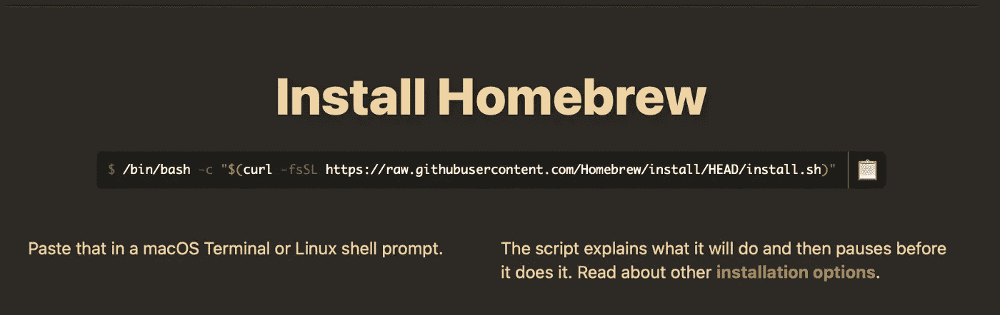
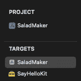
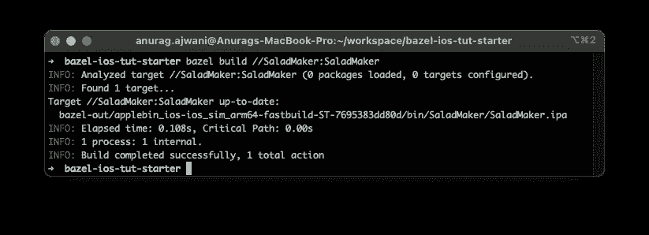
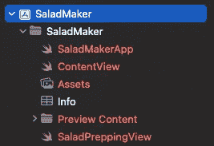
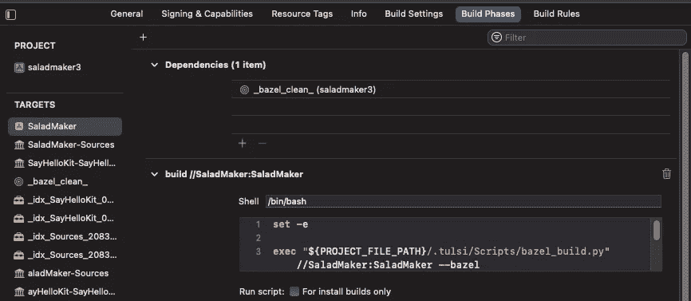

# 使用 Bazel 更快地构建 iOS 应用

> 原文：<https://betterprogramming.pub/building-ios-apps-faster-using-bazel-b960f6788fab>

## iOS 开发工具

## 了解如何在没有 Xcode 的情况下更快地构建 iOS 应用程序


Loubna Aggoun 在 [Unsplash](https://unsplash.com?utm_source=medium&utm_medium=referral) 上拍摄的照片

你是否想过在每次创建一个干净的 iOS 应用程序时喝杯咖啡？也许你和我一样，在等待的时候开始浏览 instagram。更糟糕的是，当构建完成时，你已经忘记了你下一步应该做什么，或者你为什么要进行这个干净的构建。

随着 iOS 代码库的增长，它们的构建变得越来越慢。较慢的构建时间会导致开发人员效率较低，更加沮丧。

那么，我们如何加快构建时间呢？一种方法是[将你的应用](https://medium.com/@anuragajwani/modular-ios-guide-60810f5a7f97)模块化成独立的块，然后使用你不会处理的块的[已编译模块](https://medium.com/@anuragajwani/how-to-build-universal-ios-frameworks-using-xcframeworks-4c2790cfa623)。然而，这可能很难管理。开发人员需要知道他们将在哪些模块上工作。其余的模块需要从缓存中获取。此外，他们可能需要为将要工作的每个分支配置不同的 Xcode。

那么，有没有更好的方法来加快应用程序的构建时间呢？有，有！Bazel 是许多语言和应用程序的开源构建工具。Bazel 还增加了缓存构建并无缝使用它们的选项。

在本教程中，我将向您展示如何迁移现有应用程序以使用 [Bazel](https://bazel.build) 。 [Bazel](https://bazel.build) 不使用 Xcode 构建系统、工具和 IDE。因此，我将继续指导如何在模拟器上调试 Bazel 管理的 iOS 应用程序。然后，我将指导您如何缓存构建以加快构建时间。最后，我将介绍何时不使用 [Bazel](https://bazel.build) 。

以下是这篇文章将如何划分的概述:

1.  如何将现有的 [iOS 项目](https://github.com/anuragajwani/bazel-ios-tut/releases/tag/starter)转换为使用 [Bazel](https://bazel.build)
2.  使用[巴泽尔](https://bazel.build)时调试 iOS 应用
3.  远程缓存在[巴泽尔](https://bazel.build)构建输出
4.  何时不使用 [Bazel](https://bazel.build)

*我在这篇文章中使用了 Swift 5.6 和 Xcode 13.3。*

# 如何将一个 iOS 应用程序项目转换为使用 Bazel

在这一部分，我们将从安装 [Bazel](https://bazel.build) 开始。然后我们将下载一个已经存在的 iOS 应用程序项目。最后，我们将迁移项目以使用 [Bazel](https://bazel.build) 。

以下是我们将要采取的步骤:

1.  安装[挡板](https://bazel.build)
2.  下载入门包
3.  将项目转换为使用 [Bazel](https://bazel.build)

我们开始吧！

## 1.安装 Bazel

有多种方法安装 [Bazel](https://bazel.build) 。然而，在本教程中，我们将使用[自制软件](https://brew.sh)来安装 Bazel。

[家酿](https://brew.sh)是一个软件包管理系统。对于 macOS 来说，它是一个非常受欢迎的工具。如果您还没有安装它，那么继续这样做。遵循[家酿](https://brew.sh/)在其网站 [brew.sh](https://brew.sh/) 上的安装说明。



一旦安装好自制软件，让我们安装 Bazel。在终端中运行以下命令:

```
brew install bazel
```

一旦成功完成，我们将准备开始使用[巴泽尔](https://bazel.build)。

## 2.下载入门包

在本教程中，我们将使用一个现有的 iOS 应用程序项目来举例说明如何迁移到使用 [Bazel](https://bazel.build) 。让我们下载一个已经存在的 iOS 应用程序项目。打开终端并运行以下命令:

```
cd $HOME
curl [https://github.com/anuragajwani/bazel-ios-tut/archive/starter.zip](https://github.com/anuragajwani/bazel-ios-tut/archive/starter.zip) -L -o starter.zip -s
unzip -q starter.zip
cd bazel-ios-tut-starter
```

## 3.将项目转换为使用 [Bazel](https://bazel.build)

在这一步中，我们将迁移 starter 项目中的 app 项目以使用 Bazel。

首先，我们来分析一下 Xcode 管理的项目的项目结构。

```
.
├── README.md
├── SaladMaker
├── SaladMaker.xcodeproj
└── SayHelloKit
```



SaladMaker.xcodeproj 中的目标

`SaladMaker`项目由两个目标组成:

1.  `SaladMaker` iOS 应用程序
2.  `SayHelloKit`框架

`SaladMaker`的源代码位于一个名为`SaladMaker`的目录中。

`SayHelloKit`的源代码位于一个名为`SayHelloKit`的目录中。

这两个目标都支持 iOS 14 及以上版本。`SayHelloKit`框架被`SaladMaker`应用消费。

接下来，让我们在 Bazel 中重新创建项目结构。在项目的根目录下，我们需要创建一个名为`WORKSPACE.bazel`的文件。Bazel 工作空间是:

> 您的文件系统上的一个目录树，包含您想要构建的软件的源文件
> - [Bazel docs](https://bazel.build/concepts/build-ref)

简单来说，它标记了项目的根。目标必须位于包含`WORKSPACE`的目录下。

让我们创建`WORKSPACE`。在终端中运行以下命令:

```
cat > WORKSPACE.bazel <<-EOF
load("[@bazel_tools](http://twitter.com/bazel_tools)//tools/build_defs/repo:http.bzl", "http_archive")http_archive(
    name = "build_bazel_rules_apple",
    sha256 = "4161b2283f80f33b93579627c3bd846169b2d58848b0ffb29b5d4db35263156a",
    url = "[https://github.com/bazelbuild/rules_apple/releases/download/0.34.0/rules_apple.0.34.0.tar.gz](https://github.com/bazelbuild/rules_apple/releases/download/0.34.0/rules_apple.0.34.0.tar.gz)",
)load(
    "[@build_bazel_rules_ap](http://twitter.com/build_bazel_rules_ap)ple//apple:repositories.bzl",
    "apple_rules_dependencies",
)apple_rules_dependencies()load(
    "[@build_bazel_rules_sw](http://twitter.com/build_bazel_rules_sw)ift//swift:repositories.bzl",
    "swift_rules_dependencies",
)swift_rules_dependencies()load(
    "[@build_bazel_rules_sw](http://twitter.com/build_bazel_rules_sw)ift//swift:extras.bzl",
    "swift_rules_extra_dependencies",
)swift_rules_extra_dependencies()load(
    "[@build_bazel_apple_su](http://twitter.com/build_bazel_apple_su)pport//lib:repositories.bzl",
    "apple_support_dependencies",
)apple_support_dependencies()
EOF
```

上面我们正在获取和加载知道如何构建 iOS 应用(`bazelbuild/rules_apple`)和 swift 库(`bazelbuild/rules_swift`)的代码。在 Bazel 中，完成构建的函数被称为 [*规则*](https://bazel.build/rules/rules) 。

您可能已经注意到，我们的*工作区*不包含关于要构建的目标的信息。Bazel 将在我们项目的根目录下搜索要构建的东西。 [Bazel](https://bazel.build) 将寻找一个名为`BUILD.bazel`的文件，我们在其中指定要构建的内容。我们通常在 Xcode 中将这些称为目标。有两件事要做:

1.  `SaladMaker` iOS 应用程序
2.  `SayHelloKit`图书馆

因此，我们将为其中的每一个创建一个`BUILD.bazel`。

注意:最初的`SayHelloKit`目标是一个动态框架。为了简单起见，在这篇文章中我们将把它转换成一个静态库。这个职位不需要模块类型的知识。你可以在我的[模块化 iOS 指南](https://medium.com/p/60810f5a7f97)中了解更多关于动态与静态的内容。

让我们先为`SayHelloKit`创建`BUILD.bazel`。在终端中运行以下命令:

```
cat > SayHelloKit/BUILD.bazel <<-EOF
load("[@build_bazel_rules_sw](http://twitter.com/build_bazel_rules_sw)ift//swift:swift.bzl", "swift_library")swift_library(
    name = "SayHelloKit",
    module_name = "SayHelloKit",
    srcs = ["SayHello.swift"],
    visibility = ["//visibility:public"],
)
EOF
```

上面我们已经用 Swift 静态库创建了一个`BUILD.bazel`文件作为产品。为了生成库，我们使用了`swift_library`函数或*规则*。记得我们在`WORKSAPCE.bazel`文件中加载了 swift 构建规则。在这个`BUILD.bazel`文件中，我们已经加载了`swift_library`规则。

接下来，让我们为`SaladMaker`目标创建一个`BUILD.bazel`文件。然而，在我们这样做之前，让我们重组一下`SaladMaker`目录。为什么？您可能已经注意到，我们将文件`SayHello.swift`列为`SayHelloKit`的 sources ( `srcs`)下的唯一文件。在大型应用程序中列出每个文件不太容易。我们可以使用 double `glob`函数和目录路径中的星号(`**`)来告诉 [Bazel](https://bazel.build) 将一个目录下的所有文件作为其来源。但是，该规则只接受 Swift 文件。因此，and `Info.plist` or 图像将不被接受，构建将失败。

让我们重组`SaladMaker`。在终端中运行以下命令:

```
mkdir SaladMaker/Sources
mkdir SaladMaker/Resources
mv SaladMaker/*.swift SaladMaker/Sources
mv SaladMaker/Assets.xcassets SaladMaker/Resources && mv SaladMaker/Preview\ Content SaladMaker/Resources
```

现在所有`SaladMaker`的 Swift 文件都在`SaladMaker/Sources`下，所有其他资源都在`SaladMaker/Resources`下。接下来让我们为`SaladMaker`创建`BUILD.bazel`文件。

在终端中运行以下命令:

```
cat > SaladMaker/BUILD.bazel <<-EOF
load("[@build_bazel_rules_ap](http://twitter.com/build_bazel_rules_ap)ple//apple:ios.bzl", "ios_application")
load("[@build_bazel_rules_sw](http://twitter.com/build_bazel_rules_sw)ift//swift:swift.bzl", "swift_library")
load("[@build_bazel_rules_ap](http://twitter.com/build_bazel_rules_ap)ple//apple:resources.bzl", "apple_resource_bundle")apple_resource_bundle(
    name = "SaladMaker_Resoures",
    bundle_id = "com.anuragajwani.SaladMaker_Resources",
    resources = [
        "Resources/Assets.xcassets",
        "Resources/Preview Content"
    ],
    visibility = ["//visibility:public"],
)swift_library(
    name = "Sources",
    srcs = glob(["Sources/**"]),
    deps = [
        "//SayHelloKit:SayHelloKit"
    ],
    visibility = ["//visibility:public"],
)ios_application(
    name = "SaladMaker",
    bundle_id = "com.anuragajwani.SaladMaker",
    deps = [
        ":Sources",
        ":SaladMaker_Resoures"
    ],
    families = [
        "iphone"
    ],
    infoplists = ["Info.plist"],
    minimum_os_version = "14.0",
    visibility = ["//visibility:public"],
    resources = [":SaladMaker_Resoures"]
)
EOF
```

上面我们有三个规则可以调用:

1.  `SaladMaker` app
2.  `SaladMaker` app 源代码文件包装在一个库中
3.  `SaladMaker`打包在资源包中的资源

`ios_application`规则不接受源代码文件或资源文件的参数。该规则期望代码和资源作为单独构建的工件，然后链接到应用程序。因此，源代码被构建为静态库，资源被包装在资源包中。

两件值得注意的事情是源代码库中的`srcs`参数和到`SayHelloKit`依赖项的链接。

首先，`srcs`注意，我们还没有声明所有的 Swift 文件。这很容易变成一个大列表，因此我们从`SaladMaker/Sources`目录中选择所有文件。所有这些文件都必须很快，否则构建会失败。

第二，我们声明`SayHelloKit`是一个附属国；`//SayHelloKit:SayHelloKit`。基本上，我们是说依赖项位于项目根目录下的`SayHelloKit`目录下(T5 所在的位置)，带有一个模块名`SayHelloKit`(在冒号`:`之后)。

迁移就是这样。您现在可以开始构建了。在终端中运行以下命令:

```
bazel build //SaladMaker:SaladMaker
```



使用 Bazel 构建 SaladMaker 应用程序

# 调试用 Bazel 构建的 iOS 应用程序

在上一节中，我们将一个现有的 app 项目从 Xcode 构建系统迁移到了 [Bazel](https://bazel.build) 构建系统。在这个过程中，我们重组了目录。最后，我们通过命令行用 [Bazel](https://bazel.build) 搭建了 app。

但是，如何才能调试好自己的 app 呢？通常我们会在模拟器或设备上通过 Xcode 运行应用程序。在撰写本文时，没有其他方法可以将 iOS 应用程序调试到 Xcode。

如果您试图打开项目中的`xcodeproj`,它将无法工作，因为文件已被移动，对文件位置的引用已被破坏。



Xcode 中损坏的文件引用

此外，我们希望使用 [Bazel 的](https://bazel.build)构建系统从更快的构建时间中获益。那么我们如何在使用 [Bazel](https://bazel.build) 构建系统的同时使用 Xcode 来调试 iOS 应用呢？为 [Bazel](https://bazel.build) 管理的 iOS 项目生成`xcodeproj`有两种流行的方法:

1.  [图尔斯](https://tulsi.bazel.build)
2.  [XCHammer](https://github.com/pinterest/xchammer)

这些工具将生成`xcodeproj`并调用 [Bazel](https://bazel.build) 构建系统，而不是 Xcode 的默认系统。然后 Xcode 将使用来自 [Bazel](https://bazel.build) 的构建，并在您选择的物理或模拟器设备上运行应用程序。我们应该使用哪种工具，为什么？让我们来看看每一个。

Tulsi 是基于 UI 的工具，它利用 [Bazel](https://bazel.build) 文件来构建中间文件。然后使用这些中间文件生成`xcodeproj`。 [Tulsi 需要与 Bazel](https://github.com/bazelbuild/tulsi/tree/ea2d59e0f82390edbedd709e1816a80ed84f50ad#building-and-installing) 分开安装和管理。



用 Tulsi 生成的 xcodeproj

[XCHammer](https://github.com/pinterest/xchammer) 是可以通过 [Bazel](https://bazel.build) 本身安装的工具。这是一个可以通过 [Bazel](https://bazel.build) 调用的规则。

我不会讨论如何实现这些。我将留下两个工具操作方法的链接:

*   [如何使用 Tulsi 生成 Xcodeproj】](https://tulsi.bazel.build/docs/gettingstarted.html)
*   [如何使用 XCHammer 生成 Xcodeproj】](https://github.com/pinterest/xchammer)

# Bazel 中的远程缓存构建输出

巴泽尔在增量构建方面速度很快——也就是说只重建已经改变的东西。然而，从一个干净的状态开始构建仍然需要大量的时间。应用程序的某些部分不会在不同的要素分支之间发生变化。Bazel 允许我们在远程服务器中缓存构建输出，并在从头构建时重用它们。

简单地说，你所需要的就是一个托管对象服务器。您可以创建、部署和管理自己的服务器。或者，你可以使用谷歌云存储或 AWS S3。

一旦远程服务器启动并运行，我们只需远程缓存 bazel 构建的参数:

```
bazel build --remote_cache=http://replace-with-your.host:port //SaladMaker:SaladMaker
```

你可以在 [Bazel](https://bazel.build) 文档中找到更多关于如何使用 [Bazel](https://bazel.build) 远程缓存的信息:

[](https://docs.bazel.build/versions/main/remote-caching.html) [## 远程缓存

### 本页涵盖远程缓存、设置服务器来承载缓存以及使用远程缓存运行构建。一个…

docs.bazel.build](https://docs.bazel.build/versions/main/remote-caching.html) 

# 何时不使用 Bazel

Bazel 经常被用在大型项目中，有一个大型团队参与其中。这些项目的构建时间通常需要几十分钟，甚至接近一个小时。Bazel 是一个强大的工具，可以将构建时间减少到原来的一小部分。然而，向项目中添加任何新工具都会增加项目的复杂性。因此，在决定使用某个工具时，利大于弊是很重要的。

[巴泽尔](https://bazel.build)使用一种叫做 [Starlank](https://github.com/bazelbuild/starlark) 的语言，这是 Python 的一种方言。您团队中的 iOS 工程师需要学习一门新语言来维护项目和构建配置。

此外，值得注意的是，Bazel 不是由苹果维护的第三方工具。因此，当苹果在 Xcode 构建系统中推出新的特性或功能时，那么 [Bazel](https://bazel.build) 将需要由开源社区进行更新。例如，M1 Mac 于 2020 年 11 月推出，但 Bazel only [于 2022 年 1 月](https://github.com/bazelbuild/bazel/releases/tag/5.0.0)全面支持它。

此外，你还依赖于 Bazel 社区来保持教程和其他资源的更新。在撰写 bazel.build 的 iOS 教程[时](https://docs.bazel.build/versions/main/tutorial/ios-app.html)指向了近 3 年前的苹果规则模块。[这个教程](https://docs.bazel.build/versions/main/tutorial/ios-app.html)坏了，不管用。

以下是避免使用 [Bazel](https://bazel.build) 的原因总结:

*   需要学习和维护的新工具和语言
*   对最新 Apple 特性和功能的支持缓慢
*   糟糕的文档

# 摘要

在这篇文章中，我们了解到:

*   什么是[巴泽尔](https://bazel.build)
*   如何迁移现有应用程序以使用 [Bazel](https://bazel.build)
*   如何在 [Bazel](https://bazel.build) 中远程缓存构建
*   什么时候不用[巴泽尔](https://bazel.build)

# 最后的想法

我在这篇文章中提到了使用[巴泽尔](https://bazel.build)的缺点。使用 [Bazel](https://bazel.build) 的公司是那些拥有大型 iOS 应用项目的公司，这些项目的模块数量在 10 个甚至 100 个模块上。在这些项目中，使用 Bazel 的影响更有可能超过实现和维护它的努力。

需要注意的是，Bazel 可能需要一些努力。你会发现开发者[经常在推特上谈论这个](https://twitter.com/kocienda/status/1425909869345869825?s=20&t=pqxryzo13lbVwrgIcV3Lyw)。

为了加快构建时间，Bazel 还有其他选择。一个这样的选择是 [Tuist](https://medium.com/better-programming/generating-xcodeprojs-with-tuist-4f11134e9f5a) 。使用 Tuist，开发者需要决定在哪些模块上工作，并使用缓存来处理其余的模块。 [Tuist](https://medium.com/better-programming/generating-xcodeprojs-with-tuist-4f11134e9f5a) 用 Swift 配置和编写，围绕 Xcode 工作。因此，iOS 开发者很容易管理和维护它。如果你有兴趣了解更多关于 Tuist 的知识，请查看我的教程。

```
**Want to Connect?**For more on iOS development follow me on [Twitter](https://twitter.com/anuragajwani?source=post_page---------------------------)!
```