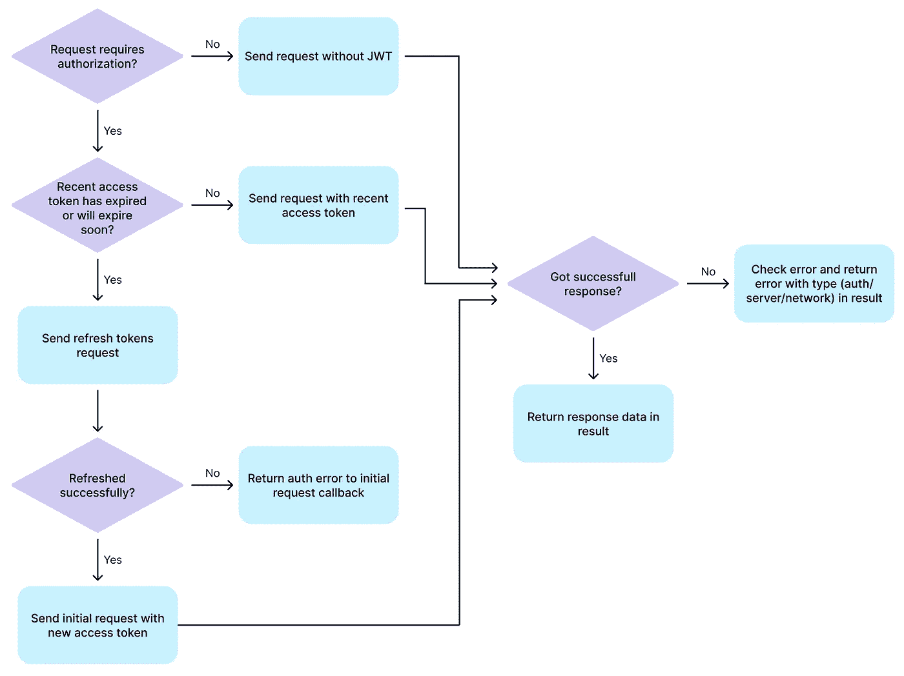
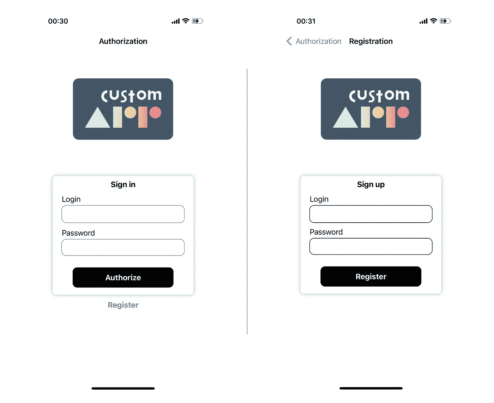
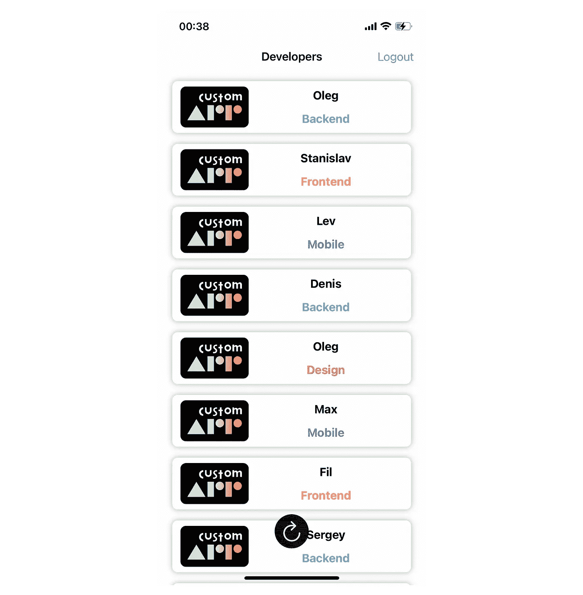

# 构建一个具有自动 JWT 授权的 iOS 网络应用

> 原文：<https://betterprogramming.pub/building-ios-networking-app-with-automated-jwt-authorization-a14e02b512d0>

## 移动应用中的 JWT 管理变得简单


[memes.com 的相似图片](https://memes.com/m/KOR75_yJE3J)

本文将考虑一种在 iOS 应用程序中使用刷新令牌自动进行 JWT 授权的方法。我们将编写一个应用程序来演示所提出的方法，并与 JWT 授权服务器进行交互。

演示应用程序的完整源代码可以在[库](https://github.com/custom-app/mobile-jwt-authorizer)中找到。JWT 授权自动化逻辑的主要代码位于[网络/请求者. swift](https://github.com/custom-app/mobile-jwt-authorizer/blob/main/ios/jwt_authorizer/jwt_authorizer/Networking/Requester.swift) 文件中。您可以尝试一下，检查关于认证过程的日志，等等。

[JWT (JSON Web Token)](https://www.rfc-editor.org/rfc/rfc7519) 是一种在签名授权令牌中保存身份数据的标准。通常，在登录密码授权之后，服务器会生成一个包含用户数据的 JWT，对其进行签名，然后向客户端返回一个令牌。然后，客户端可以使用此令牌进行身份验证—当服务器收到 JWT 时，它会验证签名并检查令牌是否过期。

通常，一些系统会修改使用 JWT 的一般方法——添加刷新令牌。在这种情况下，访问令牌是短暂的，刷新令牌在延长的时间内保持有效，并在到期时用于生成新的访问令牌。

这种方法提高了安全性，因为短期令牌比长期或永久令牌的危害更小。通常，当刷新访问令牌时，还会生成新的刷新令牌。这降低了危及有效刷新令牌的机会。

当使用这种模型时，来自客户端的授权变得更加复杂，因为当发送每个请求时，您需要管理令牌，并且短期访问令牌可能随时过期。它将需要及时更新。本文将考虑 JWT 授权修改的自动化。

SwiftUI 将在本文中用于创建一个演示应用程序，但这并不重要，因为一般的 JWT 授权逻辑不会绑定到 UI。

## 后端

为应用程序实现了一个简单的后端，它处理四个请求:

1.  用户注册。如果成功，服务器将返回一个包含访问和刷新令牌及其到期时间的用户实体。
2.  通过登录名和密码进行用户授权。如果成功，服务器响应将与注册时相同。
3.  刷新令牌。成功时返回一组新的令牌。要执行请求，您必须在授权头和空主体中发送一个刷新令牌。
4.  获取需要授权的数据。在这种情况下，服务器将返回一个包含姓名和部门的 CustomApp company 的列表。要完成此请求，您必须在授权头中发送有效的访问令牌。在演示的后端，只有一个请求需要授权，但是在实际的应用程序中，当然会有很多这样的请求。

几乎任何实现这种授权类型的后端都会有这样一组请求。

关于令牌刷新请求的重要一点是，根据后端的不同，此请求的实现可能会有所不同。例如，可能需要在请求正文中发送刷新令牌。这并不重要，因为请求应用程序将很容易修改。

在我们将与之交互的服务器上，设置了以下令牌的生存期值:访问令牌一分钟，刷新令牌五分钟。实际上，这些值当然会大得多。在我们的例子中，选择它们是为了方便测试。

## iOS 应用程序

该应用程序将使用 MVVM 方法，这通常是使用 SwiftUI 时的最佳方法，也适用于编写具有单个`ViewModel`的小应用程序。

先说车型。我们需要在注册和授权请求中发送的授权机构的结构，以及响应这些请求的用户实体。

我们还需要一个令牌对实体来响应一个令牌刷新请求，以及一个令牌实体来方便将来的请求者存储。

对于服务器上的所有请求，都有一个常见的错误响应。我们还将为它创建一个结构，如下所示:

这个结构有一个`isAuth`方法，通过检查消息来帮助您确定错误是否是授权错误(无效令牌或令牌过期)。该方法使用了对`Errors`类的调用，这将在下面讨论。

最后，开发人员实体的结构:

为了保存 JWT 令牌以便进一步授权，我们需要本地存储。在我们的例子中，为了简单起见，我将使用`UserDefaults`。如有必要，您可以使用更安全的数据存储。让我们编写一个小的单例类来使用`UserDefaults`并保存/获取令牌:

为了方便与服务器交互和生成 URL，让我们创建一个`Endpoint` enum。代码如下:

此外，为了从我们的请求处理器返回一个通用值，我们将创建一个`Result`包装器，它将清楚地表明从服务器收到了什么响应。

`ViewModel`将处理最终结果，如果我们收到无法通过 JWT 授权的错误消息(访问和刷新令牌都已过期或无效),必要时将能够将用户发送到授权屏幕。

## 实施请求者

让我们直接进入我们的请求处理器-授权器的逻辑(从现在开始，我将称它为`Requester`)，它的算法可以用下面的方案来描述:



因此，我们将看到以下内容:

*   不需要 JWT 授权的请求(在我们的例子中，通过登录和密码进行注册和授权)被直接发送，而不需要额外的检查
*   对于需要 JWT 授权的请求，在发送之前会检查访问令牌的有效性。如果令牌已经过期或即将过期(过期时间小于指定的阈值)，则在发送请求本身之前，令牌会被刷新
*   如果令牌刷新失败，有必要返回授权错误，以便我们的`ViewModel`可以确定我们需要将用户移至授权屏幕，因为我们无法使用 JWT 进行授权。

让我们从使用用户默认值开始实现请求者。请求者应该能够在更新后获取令牌并将其保存在存储中，以便在开始与应用程序的新会话时拥有最新的令牌。我们还将准备一个在注销时重置当前令牌的方法。

这里，我们声明了一个私有构造函数和一个静态的`shared`字段来通过它访问唯一的现有请求者，从而实现了单例模式。这是必要的，因为 API 调用通常可以从应用程序中的多个位置调用。例如，当使用 MVVM 方法时，通常有几个`ViewModel`可以独立发送请求。

为了执行请求，我将使用 Swift 的 [URLSession](https://developer.apple.com/documentation/foundation/urlsession) 。让我们编写一个生成`URLRequest`的通用方法，它将用于我们所有的请求，以及一些帮助方法。

在`formRequest`方法中，除了请求参数之外，还有两个标志— `refreshTokens` —表示正在形成更新令牌的请求，请求者需要在授权头中放置刷新令牌— `ignoreJwtAuth` —表示请求中不需要使用 JWT 授权(访问令牌)。

这里我们还需要一个方法来生成更新令牌的请求，这个请求只能从我们的请求者那里调用。

`renewAuthHeader`方法用当前令牌替换授权头中的访问令牌。当生成需要 JWT 的请求后，需要刷新令牌时，这是必需的。在这种情况下，授权头将包含旧的无效访问令牌。

让我们继续讨论发送请求的逻辑。由于许多检查，下一个代码块将非常大，但它不包含非常难以理解的内容，我将在下面描述这些内容:

编写请求者方法的主要方法如下—请求本身和转义回调函数被传递给参数化的请求发送方法，该方法将返回`Result<Type>`，其中`Type`是请求成功时响应中应该包含的数据类型。根据请求的结果，将返回包含错误的`Result.success`或`Result`。

`needReAuth` helper 函数让您知道在发送请求之前是否需要刷新令牌。它检查令牌是否尚未过期，并且在它过期之前还有比我们设置的阈值(10 秒)更长的时间。它使用一个简单的扩展函数，以毫秒为单位返回 UNIX 时间戳。

请注意，为了确定当前时间，会在设备上创建一个带有当前时间的`Date`对象，如果时间同步被禁用，则结果可能不正确。更安全的选择是从服务器获取当前时间戳，并记住实际时间和设备上的时间之间的差异。

需要 JWT 授权的请求应该使用`request`方法。它确定是在请求和调用`authAndDoRequest`之前刷新令牌，还是只调用`doRequest`。

在`authAndDoRequest`方法中，我们形成并发送一个刷新令牌的请求。我们进行了传统的检查，确认没有网络错误，响应被成功地转换为`HTTPURLResponse`类型，并且我们收到了一个非零的响应体。接下来，我们检查请求是否成功(一个简单的扩展函数，检查 2XX 的 HTTP 响应代码)。

如果成功，我们更新请求者中的令牌，替换原始请求中的授权头，并用`doRequest`发送它。如果失败，您必须返回`Result.authError`，因为用户将不能进行进一步的请求，并且必须使用登录密码登录。

`doRequest`方法只是执行请求而不进行授权检查。它从`authAndDoRequest`调用，也直接执行不需要授权的请求。
`parseResponse`方法试图将响应 JSON 解码成我们期望的响应结构。如果失败，那么调用`parseError`方法，它试图将错误体解码成我们的`ErrorResponse`结构。在`parseError`中，检查我们收到的错误是授权错误还是其他错误。

接下来只需添加调用 API 的公共方法(注册、授权、获取开发人员列表)。

请注意，在这里，为了处理`register`和`login`请求的结果，我们使用了一个单独的`handleAuthResponse`包装函数，只有在它内部，我们才在保存令牌后调用初始的`onResult`回调。这对于在请求者内部封装整个令牌管理是必要的，外部实例(例如，`ViewModel`)不会知道它们的存在。因此，所有使用令牌的自动化工作都发生在请求者内部，并且`ViewModel`只使用 API 调用方法。

在我们的代码中，我们还使用了`Errors` [类](https://github.com/custom-app/mobile-jwt-authorizer/blob/main/ios/jwt_authorizer/jwt_authorizer/Utils/Errors.swift)，它包含了错误字符串描述的常量和几个助手方法。

重要注意事项—此请求程序将处理顺序发送的请求，因为如果访问令牌已过期，那么在同时发送请求时，将会同时调用几次刷新令牌方法，这将导致错误。如果您需要同时发送几个请求，那么就需要对请求者稍加修改。在任何情况下，您都必须刷新令牌，然后才开始发送请求。我将提供两个最合理的解决方案:

1.  存储所有请求和回调，直到令牌被刷新，然后发送它们。可能有某种有用的互斥锁或[分发信号量](https://developer.apple.com/documentation/dispatch/dispatchsemaphore)来锁定流，直到刷新完成。
2.  为需要 JWT 授权的请求创建一个队列，并逐个发送它们。

## 添加应用程序的其他部分

主要最有意思的联网逻辑都写了。现在，我们将继续编写应用程序的其余部分。我们不会关注 UI 部分的具体描述，因为它非常简单。我们来看一些重要的点。

`ViewModel`将包含我们的请求者调用及其结果的处理，以及发布的部分，它们将显示在 UI 中。

当初始化`ViewModel`(当应用程序启动时)，我们检查我们是否有一个有效的刷新令牌，如果有，我们通过更改`showAuthContainer`字段以编程方式跳过授权屏幕，该字段负责授权/注册屏幕或带有开发人员列表的内部屏幕是否将被显示。

这里，编程导航方法非常适合您，因为如果您在应用程序中收到授权错误，您可以很容易地将用户重定向到授权屏幕。

在发送请求的方法中，我们决定了我们收到的响应类型。在收到授权请求的授权错误时(获取开发人员列表)，我们将用户返回到授权屏幕。当我们收到不同类型的错误时，我们将显示一个警告。

在根`ContentView`的代码中，我们需要实现上面的编程导航，以及创建我们的`ViewModel`，并将其作为`EnvironmentObject`传递给子视图。

在登录和注册屏幕上，我们将只有用于输入登录和密码的字段以及授权/注册按钮。此外，登录屏幕将包含登录屏幕的`NavigationLink`。



成功授权或注册后，用户将被重定向到一个内部屏幕，上面有一个开发人员列表。为了方便授权工作的全面测试，我们制作了一个列表刷新按钮和一个注销选项。



这就完成了应用程序的编写。正如我前面所说的，您可以查看[存储库](https://github.com/custom-app/mobile-jwt-authorizer)中的完整源代码，克隆项目并查看授权者的整个流程。

```
**Want to Connect?**[Full application code](https://github.com/custom-app/mobile-jwt-authorizer/tree/main/ios/jwt_authorizer/jwt_authorizer) | [Custom app company](https://customapp.tech)Chat with me on [Twitter](https://twitter.com/baklanov_dev).
```

如果你对 web3 开发感兴趣，这里有我同事的一篇很酷的文章，关于[在区块链](https://medium.com/better-programming/issues-of-returning-arrays-of-dynamic-size-in-solidity-smart-contracts-dd1e54424235)实现一些 web2 特性。