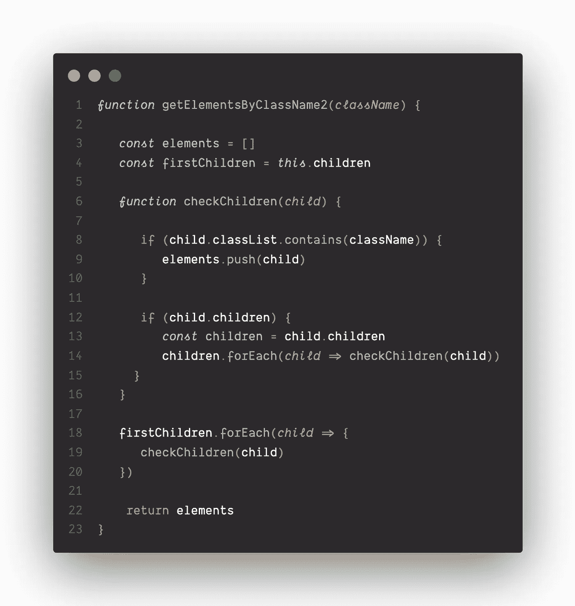

# 如何从头开始构建 document . getelementsbyclassname？

> 原文：<https://betterprogramming.pub/building-javascript-from-scratch-5caf5e7cc464>

## 看一个有趣的面试问题

代码示例的屏幕截图

我目前正在寻找我的第一份软件工程师工作，最近我进行了一次模拟技术面试。面试是针对 JavaScript 的，由两个问题组成。第一个是相当标准的算法问题，但第二个相当有趣:我被要求从头开始构建`document.getElementByClassName`方法——就好像它不存在一样。

我发现建立一个我以前用过很多次的方法很有启发性。它从整体上提高了我对 DOM 操作和 JavaScript 的理解。在这篇文章中，我将向您介绍我提出的解决方案。

# 目标

目标是创建一个功能等同的`[document.getElementByClassName](https://developer.mozilla.org/en-US/docs/Web/API/Document/getElementsByClassName)`版本。为此，我们的新功能需要以下特性:

*   它可以在任何 HTML 元素上调用。
*   它有一个参数，一个字符串，包含任意数量的类名。
*   它返回与传入的所有类名匹配的所有元素。
*   它只返回调用该函数的元素的子元素

# 例子

# 计划

首先，我们需要为我们的功能创建一个概念性的计划:

1.  创建一个数组来存储所有匹配的元素。
2.  检查类名的 main 元素的所有直接后代。如果有，将它们添加到数组中。
3.  用同样的方法检查所有这些孩子的孩子。
4.  重复直到不再有孩子。

基于这个计划，我们需要创建一个递归帮助函数，或者一个在自己的定义中调用自己的函数，来检查主函数下的所有元素。我们将在主函数中调用这个辅助函数。main 函数的返回值应该是一个元素数组，我们在顶部将它声明为一个空数组，并随着我们的进展向其添加元素。

我们有一个可靠的计划。让我们开始编码吧！

# 密码

## 步骤 1:设置主函数

这里我们将定义我们的主要功能。在主体中，我们将定义两个变量:`elements`，一个数组，所有具有匹配类名的元素将被添加到该数组中；`firstChildren`，该函数被调用的元素的所有子元素。对于后者，我们可以利用 JavaScript 的方法，该方法返回一个包含被调用节点的所有子元素的`[HTMLCollection](https://developer.mozilla.org/en-US/docs/Web/API/HTMLCollection)`。这个`HTMLCollection`可以当作一个数组。

## 步骤 2:编写递归助手函数

[递归函数](https://javascript.info/recursion)是一个在定义中调用自身的函数，而辅助函数是一个抽象一些代码以使其既可重用又更可读的函数。

## 第三步:把它们放在一起

现在我们想在每个`firstChildren`上调用`checkChildren`方法。这个函数运行后，我们的元素数组应该包含所有匹配的元素！

## 第 4 步:添加到 HTML 元素原型

最后，为了能够在任何 HTML 元素上调用这个函数，我们需要将它添加到 HTML 元素[原型](https://medium.com/better-programming/prototypes-in-javascript-5bba2990e04b)中。

就这样，我们结束了！我们的新方法`getElementsByClassName2`现在与原来的`getElementsByClassName`具有相同的功能。我希望你觉得这个过程和我一样有趣和翔实。

谢谢你的阅读！