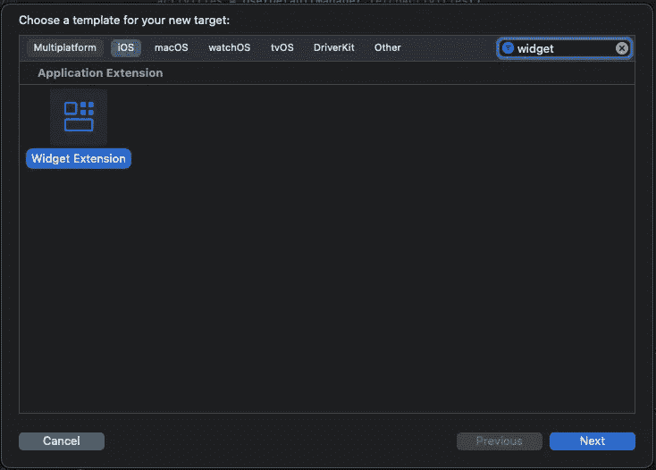
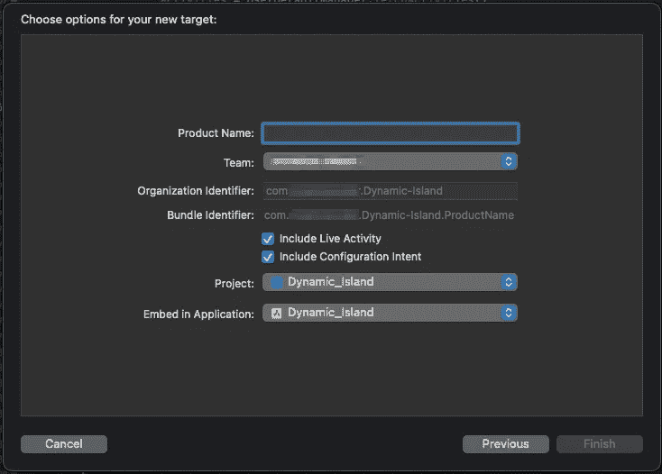
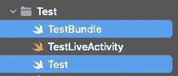
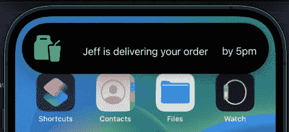
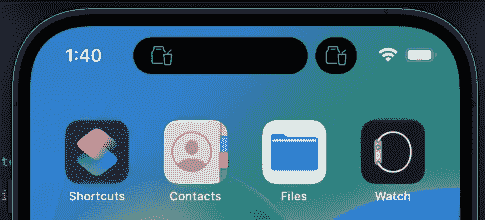
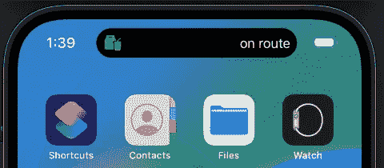
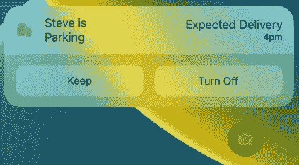

# 在 SwiftUI 中为动态岛设置现场活动

> 原文：<https://betterprogramming.pub/building-live-activities-for-dynamic-island-in-swift-d76444cb48ab>

## 开始、获取、更新和结束实时活动


图片来自 [Pixabay](https://pixabay.com//?utm_source=link-attribution&utm_medium=referral&utm_campaign=image&utm_content=7479306) 的 [Lukas Gehrer](https://pixabay.com/users/lukgehr-16347051/?utm_source=link-attribution&utm_medium=referral&utm_campaign=image&utm_content=7479306)

iOS 16 带来了一个很棒的新功能，当以新的有趣的方式实现时，肯定会为一大批开发人员增加价值。现场活动和它们的实现需要一点解释，因为开始时需要几个步骤。

我在下面概述了添加基本实时活动实现的步骤，以及如何将其添加到现有项目中。

感谢 [Cristiano Alves](https://www.linkedin.com/in/cristianoftalves/) 在 React Native 中出色地实现了这一点，我自己在创建本指南时也以此为基础。

**需求** : Xcode Beta(版本 14.1 beta 3)，iOS 16.1 以上

我想在本指南的前面加上苹果关于这个功能的文档，因为它非常有用。

让我们开始向现有应用程序添加动态岛支持。

您需要创建一个新目标(文件->新建->目标…)，并从菜单中选择“小部件扩展”模板。



给你的小工具命名，如果没有勾选的话，选择“包括实时活动”选项。



您将看到另一个启用目标的小对话框，继续操作，您的项目将设置一个模板化的动态岛。

现在您的目标已经添加到您的项目中，将以下键添加到您的项目 main `Info.plist` —这是重要的一步:

```
<key>NSSupportsLiveActivities</key>
<true/>
```

在 Xcode 的目标文件夹中，您应该会看到几个新文件。因为我们只是在看动态岛，所以保留`LiveActivity`文件，但删除另外两个。



在您的`LiveActivity`文件中，用以下内容替换内容:

这是创建动态孤岛小部件的基础:

1.  第一块是锁定屏幕的 SwiftUI 视图。
2.  `ExpandedRegion`是当您长按动态岛小部件时出现的视图，您可以控制`leading`、`trailing`、`center`和`bottom`部分的视图。
3.  `CompactLeading`和`CompactTrailing`是最常见的动态岛屿视图。
4.  如果您打开了两个已经开始实时活动的应用程序，就会看到`Minimal`,如果您的应用程序开始了两个活动，它们都使用`minimal`视图格式。



不同的现场活动演示风格



我们将建立一个简单的用户界面，如上面的截图所示。由于每个状态都是单独配置的，我们可以完全定制用户体验，以确保呈现最相关的内容。

用下面的代码替换项目中计算出的`body`变量的内容，这些代码添加了一些基本的 SwiftUI 元素，以获得与上面显示的截图非常接近的结果。以此为基础，构建更适合您自己的应用程序和设计风格的 UI。

通过在您的`struct`上实现`ActivityAttributes`协议，您可以将您的对象传递给实时活动。对于本指南，我们将创建一个简单的`struct`，它包含:

1.  `status` —订单的状态。
2.  `deliveryDriverName` —一个虚构的送货司机的名字。
3.  `arrivalTime` —一个订单将到达的硬编码、模拟的时间。

唯一的限制是编码内容**的大小小于 4kb。**这应该只是一个问题，如果试图通过动画或大型图像，文本更新应该没问题。

现在我们已经为我们的活动和自定义的`ContentState`结构配置了 UI，我们可以继续创建一个管理器来启动、更新、获取和结束我们的活动。

我们的经理需要 5 项职能:

1.  `startActivity(…)`
2.  `fetchActivities()`
3.  `updateActivity(…)`
4.  `endActivities()`
5.  `endActivity(…)`

让我们从`startActivity`函数和类声明开始。

我们的函数将把`ContentState`属性作为输入，并返回启动的活动的 ID。

我已经添加了`@discardableResult` function 属性，就像我们返回 ID 一样，有时我们不想对它做任何事情，如果我们无法获得 ID 或者无法使用提供的参数启动活动，那么就会抛出一个错误。

接下来是更新功能。现在我们可以创建和启动实时活动，我们希望能够在收到更新时更新活动，无论是通过应用内操作还是推送通知(我将在另一篇文章中介绍推送通知更新)。

更新一个活动类似于启动它们，我们只需创建一个新的`ContentState`，在使用我们的自定义属性类型的当前活动的活动数组中找到我们的活动，并向它提供更新后的状态。需要注意的主要一点是，更新活动是异步的，所以一定要在调用这个函数的地方使用`Task`。

最终函数用于结束和获取正在进行的给定类型的活动。在获取活动后，我将它们作为一个字典数组返回，因为我想包含它们的 id——尽管我也可以创建一个新对象并将它们映射到该对象。

结束活动可以通过使用一个 ID 来过滤当前正在进行的活动并调用`.end(dismissalPolicy: .immediate)`来完成，或者通过简单地迭代每个具有给定类型属性的活动并调用相同的函数来完成，如果你只是想结束所有的活动。

这里有一个[链接](https://github.com/SoaringEarth/DynamicIslandExample)到一个应用程序的公共存储库，该应用程序实现了这个逻辑，并且包括一个用于创建新活动并将它们存储在`userdefaults`中的 UI。

动态岛入门到此就差不多了。我将准备一份后续指南，介绍如何使用推送通知更新您的实时活动。

感谢阅读。

```
If you’ve got any questions about iOS development, career progression and growth, or industry questions, reach out to me on [LinkedIn](https://www.linkedin.com/in/jonathonalbert/).
```