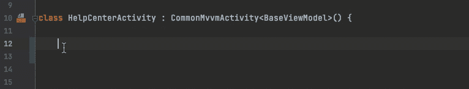
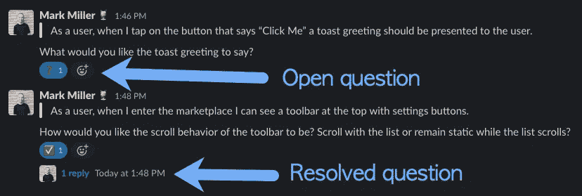
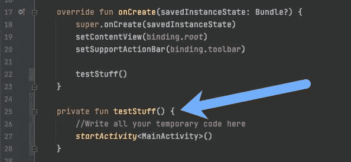

# 构建高质量软件的 15 个技巧

> 原文：<https://betterprogramming.pub/building-quality-software-63eb8a5f73ca>

## 手动开发人员测试，隔离临时代码，等等

gears——照片来自[wonderopolis.org](https://www.wonderopolis.org/wonder/who-invented-gears)

在我们开始讨论如何构建高质量的软件之前，让我们先来定义它。高质量的软件是健壮的，可维护的，有最小的错误，并提供良好的 UX。

下面的大部分评论都是适用于软件开发的一般概念；然而，其中一些更具体地适用于 Android 开发。

一开始就把重点放在质量上会带来巨大的回报。随着代码质量的提高，您可以增加开发人员的吞吐量，增加容量，并减少交付时间，这反过来会给您更多的时间来反思/改进您自己的过程。

# 坚实的原则

这个由 5 个字母组成的首字母缩略词概括了有助于增强代码健壮性的通用软件设计原则。点击[这里](https://medium.com/swlh/solid-design-principles-the-simplest-explanation-8df7164308f5)和[这里](https://medium.com/litslink/solid-software-design-principles-ac5be34a6cd5)了解更多信息。

无论何时编写代码，都要记住这些事情。这些原则有助于使您的代码可维护，从长远来看，这是非常有价值的。

对所有原则有一个“坚实”的理解将被证明是非常有价值的。

# 给自己时间做计划

当处理一个大的特性时，要花足够的时间来考虑如何有效地设计这个特性。考虑所有组件将如何通信。

有没有已经解决了相同/相似问题的现有设计模式？如果将来这个特性需要改变，我该如何构建它以使改变变得又快又容易？即在做出改变时最小的波纹效应。

当构建一个中大型的特性时，有时我会花大约 4 个小时来规划架构。如果它是一个非常大的功能，我甚至会花一整天甚至更多的时间来设计一个健壮的设计。

# 按功能打包

组织代码的两种主要方式是按层打包和按特性打包。通过逐层打包，您实际上是将类放在它们所属的架构层中。例如，您可以将所有的定制视图类放在一个包中，将所有的存储库类放在另一个包中，将所有的模型类放在另一个包中，等等。

使用“按特性打包”,您可以将特性所需的所有类放在同一个包中。这有这么多好处！较低的复杂性，较高的类内聚力，较低的包间耦合。需要更新功能或删除功能吗？您需要的所有东西都在一个地方——不需要去搜索构成特性的所有类！

这也使得项目更容易维护，因为未来的开发人员也将更容易使用该特性，因为所有的东西都在一个地方。

当然，像通用工具类这样的东西可能更适合在特性包之外。

# 不要跨功能共享自定义组件

例如，如果您为特性 A 创建了一个定制视图，那么即使特性 B 需要一个相似(或相同)的视图，您最好不要**重用特性 B 的定制视图。**

原因如下。假设您创建了一个定制的卡片视图，它被四个不同屏幕上的列表使用*(特性 A、B、C 和 D)* 。今天，四个不同屏幕上的所有卡片视图显示相同的信息。如果将来只针对特性 A 和 B 的需求发生了变化，该怎么办？那你会怎么做？通常是两种情况之一:

1.  向自定义视图添加一些条件和/或更多属性，以便它可以满足所有屏幕的所有要求。
2.  断开特征，并使用修改后的需求创建一个新的自定义视图。

第一个选择很可能是一个糟糕的决定，因为这样做会增加自定义视图的复杂性。如果您一直这样做，随着时间的推移，您将最终得到一个与不同特性紧密耦合的整体类。现在，如果你想重构这个类，将会花费很长时间，因为它与如此多的特性紧密耦合，并且复杂性增加。你可能会打破其中一个功能的东西。*此外，请记住，随着复杂性的增加，开发人员的吞吐量会下降。*

第二个选择是更好的选择，但是，如果您为每个特性都创建了单独的视图，那么第一个选择就没有必要了。

有一点需要注意。如果有一个非常小的自定义视图，我非常确定它不会改变，我可能会把它放在一个通用视图包中，并在不同的特性中使用。这可能类似于在每个卡片视图中使用的小型自定义用户图像视图。相反，卡片视图可能包含各种信息，这使得它更有可能被改变。

# 仔细考虑边缘案例

在开发特性时，花些时间仔细考虑所有的边缘情况。您应该了解您所处理的代码的每个部分可能会出现什么问题。

比如 API 错误是否处理得当？如果用户正在打电话，但失去了网络连接，会发生什么情况？如果用户在长时间运行的操作中终止了应用程序，然后在稍后恢复，该怎么办？如果用户点击一个按钮，让一个 API 请求非常快速地重复，会怎么样？

如果你不能立即解决边缘情况，那么一定要以某种方式跟踪它们。*例如，你可以留下待办事宜的注释。不过，在您考虑功能是否完整之前，请务必解决边缘情况！*

Android Studio/IntelliJ IDEA 有一个很好的特性，你可以看到一个包中所有的 TODO 注释。关于如何在 Android Studio 中查看 TODO 评论，请参见[这篇 SO 帖子](https://stackoverflow.com/a/23384888/1159930)。

# IntelliJ Live 模板

[实时模板](https://www.jetbrains.com/help/idea/using-live-templates.html)是 Android Studio/IntelliJ IDEA 中的一项功能，允许你快速插入样板代码。这是一个非常强大的功能，可以提高您的工作效率(同时减少复制/粘贴错误)。

例如，您可以在执行重复性任务时使用它，如创建自定义视图、设置视图绑定、编写单元测试等。使用变量可以自定义实时模板。

详见[本帖](https://www.raywenderlich.com/4979242-live-templates-in-android-studio-getting-started)。

# 总是澄清不确定性

通常，开发人员处理由产品经理创建的票证。该标签将包含您正在处理的给定特性的详细信息(以及验收标准)。

在制作这些特色票时，最好澄清票中任何不清楚的地方。不要假设。你这样做会节省时间。我们最不想做的事情就是做出错误的假设，然后需要重做一些本可以在早些时候澄清的事情。

在我目前的组织中，我们都为 Slack 中特定主题频道的特定功能编写了通信。该功能的相关人员将是 Slack 渠道的一部分(后端工程师、前端工程师、产品经理等)。

为了保持条理，我通常会把我对某张票的所有问题作为一个单独的评论贴出来。然后，每个问题都可以在该特定问题的线程中得到回答。我用松弛的表情符号来表示问题是否被回答。如果有任何悬而未决的问题，我 use❓to 指出这一点。如果这个问题已经被完全回答了，那么我用✅来表示这个状态。

# 不要匆忙

不管这个特性有多重要，重要的是一步一步来，把所有的事情都考虑清楚。即使你“落后”，也不要让它影响你。如果你试图尽可能快地运行，很有可能你会留下一些错误或者错过一些本可以避免的情况。

即使你“走得很快”,回来解决问题和偷工减料也需要更多的时间。从长远来看，保持冷静和从容会节省时间。第一次就把事情做对，比发现一些 bug 后修复五次要便宜。

如果你感到有压力，休息一下或者去散步。

即使在生产中有一个严重的错误，你仍然需要一步一步来，在解决问题之前理解发生了什么。如果修复这个问题需要很长时间，那么你可以在修复的时候回滚到以前的版本。

# 隔离临时代码

假设您想要快速启动一个正在进行的新活动来测试它，或者您可能想要在代码中模拟某种临时条件。

不管你想写的代码量有多小，如果你不想让它留在代码中，那么它应该被隔离到它自己的方法中。否则，它可能会与其他代码混合在一起，您可能会忘记它！至少用一个孤立的方法会更容易识别。

# 首先解决困难/阻塞问题

集成点是潜在障碍的一个例子。假设您正在开发一个需要 API 集成的新客户端特性。假设完成 API 需要一天，完成客户端工作需要 5 天。即使您还没有完成 UI 的构建，在过程的早期测试 API 也是一个好主意。

如果您等到完全构建好特性之后才测试 API，或者更糟的是，根本不测试它，而只是简单地将构建抛给 QA，那么您就冒着延长特性交付周期的风险。通过与后端团队保持密切沟通，并在完成特性构建之前帮助测试 API，您可以帮助减少总体交付时间。

# 手动开发者测试

当您完成构建特征时，您应该尝试中断它。做一些你自己的手动开发测试，以确保你没有错过任何边缘情况，事情会像你期望的那样工作。这将有助于缩短反馈回路。

想象一下，我们完全跳过做我们自己的开发人员测试，简单地把构建扔给 QA。然后 QA 发现一个 bug，然后发回给你修复。同时，您已经将上下文切换到另一个票证。然后你回去把 QA 里发现的 bug 修好。想象这种情况在 QA 和你之间再发生一轮。

您能看到这种事情如何轻易地将一个票据的开发时间延长几天吗(上下文切换+在同一个票据上花费更多时间)？尽管在将构建移交给 QA 之前进行一些手工开发人员测试可能看起来很乏味，但从长远来看，这将节省您的时间。

# 单元测试

理想情况下，您构建的每个功能都应该有单元测试。如果代码是不可测试的，那么它需要被改进以使它是可测试的。

如果您的单元测试通过持续集成在每次提交到您的开发/主分支时运行，那就更好了。

# 代码审查

标准代码评审是另一个捕捉错误和潜在改进的好方法。彻底的代码审查比简单地点击批准按钮更有价值。

# 监控崩溃报告

在一个版本发布后，密切关注崩溃报告可能会有所帮助。当您能够在错误变得太大之前识别并修复它们时，这种感觉非常好。

# 使回滚变得容易

如果/当您需要回滚到以前的版本时，标记您发布的提交将使您的生活变得容易。我使用类似于`release/1.2.3–456`的标签来表示版本号。

当您需要回滚时，您可以轻松地签出标记的 commit，修改版本，并发布构建。即使您的项目使用子模块，此方法也有效。