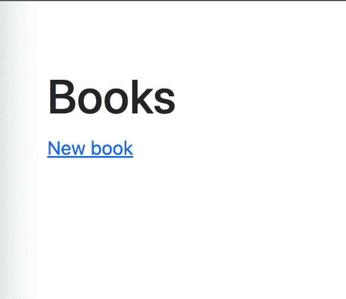
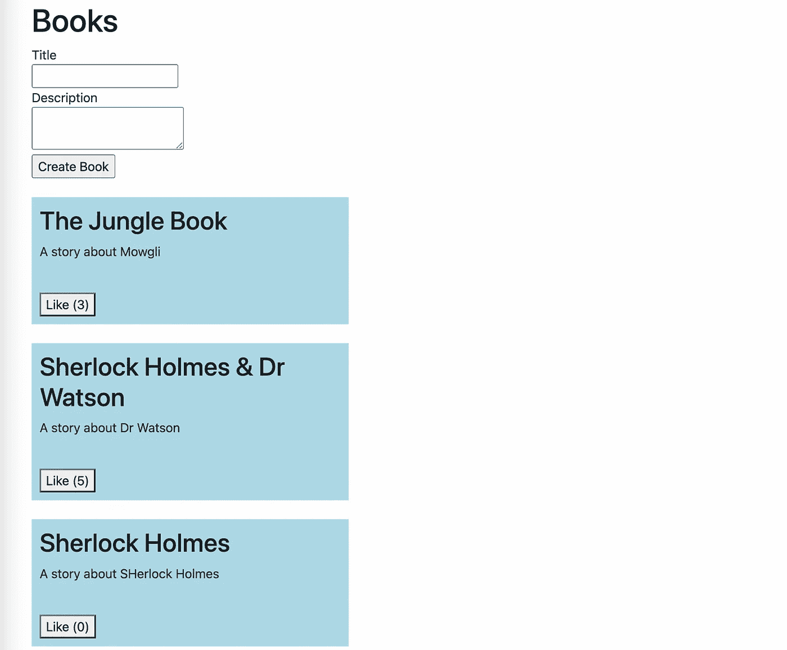

# 用 Hotwire 构建响应式 Rails 应用

> 原文：<https://betterprogramming.pub/building-responsive-rails-apps-with-hotwire-507880df0f01>

## 在本文中，我们将介绍 Hotwire 的基础知识，并使用 Hotwire 和 Ruby on Rails 构建一个示例应用程序


如果您正在使用 Ruby on Rails 开发现代的单页面应用程序，您很可能会使用一些花哨的 JS 框架来很好地更新您的 UI，而不需要重新加载页面。如果不使用它们，你真的没什么可做的，这是当今的一种标准…直到 Rails 有了 Hotwire。

使用 Hotwire，您可以获得快速响应的 web 应用程序，而无需编写大量的 JavaScript。听起来不错，但是热线是什么？

在本文中，我们将介绍 Hotwire 的基础知识，并使用它构建一个示例应用程序。

# 响应式 Rails 应用有哪些选项？

2013 年 6 月 25 日，Rails 4 发布，引入了 Turbolinks。Turbolinks 为 Rails 的“响应”做了什么？Turbolinks 拦截所有的链接点击，而不是发送常规的`GET`请求，而是发送异步 JavaScript 请求(AJAX)来获取 HTML。

然后，它合并获取的页面的`head`标签，并替换页面的整个`body`标签，因此没有全页面重载。无需重新加载样式表或脚本，这意味着更快的页面导航。但它仍然替换了整个`body`，而不仅仅是改变了页面的一部分。

但是，如果您只想重新加载发生变化的部分呢？嗯，当你将一些元素标记为`data-remote='true'`时，你可以使用 Rails AJAX 帮助器，这使得那些元素发送 AJAX `GET/POST`请求，而不是常规的`GET/POST`请求。Rails 用生成的 JS 代码进行响应，然后由浏览器执行这些代码来动态更新页面的这些部分。

然后，我们可以在前端使用一些 JS 组件(例如，使用 React ),让应用程序感觉更加灵敏。因此，JS 组件发送一个 AJAX 请求，Rails 服务器用 JSON 数据响应它。然后前端框架将收到的 JSON 转换成 DOM 元素，并更新 DOM 以反映这些变化。它工作得很好，唯一的缺点是它在页面上混合了服务器端呈现和客户端呈现。

另一种更传统的方式是在前端使用 React、Vue 或另一个 JS 框架，只使用客户端渲染，即所谓的单页面应用程序(SPA)。使用这种方法，前端是一个向 Rails 服务器发送 AJAX 请求的独立应用程序，Rails 只是一个 JSON API。您可能知道，构建、维护和部署两个具有可互换数据的独立应用程序非常复杂。

但是，如果您可以构建一个 SPA，而不需要构建两个独立的应用程序和编写大量 Javascript 代码，那会怎么样呢？以下是 Hotwire 可以帮助您解决的问题。

# 什么是 Hotwire？

Hotwire 是构建类似 SPA 的 web 应用程序的另一种方法，它使用 Rails 模板呈现所有的 HTML 服务器端，同时保持应用程序快速响应。

将渲染保持在服务器端会使您的开发体验更简单、更高效。Hotwire name 基本上是`HTML Over the Wire`的缩写，意思是将生成的 HTML 而不是 JSON 从服务器发送到客户端。

它也不需要您编写太多定制的 javascript 代码。热线由涡轮和刺激组成。

# 什么是涡轮增压？

涡轮宝石是热线的心脏。这是一组动态更新页面的技术，通过将页面划分为可以利用 WebSockets 作为传输工具进行部分更新的组件，加快了导航和表单提交的速度。如果您曾经在 Rails 中使用过 WebSockets，您很可能知道 Rails 正在使用 ActionCable 来处理 WebSockets 连接，默认情况下它包含在 Rails 中。而`Trubo` gem 由 Turbo Drive、Turbo Frames 和 Turbo Streams 组成。

# 涡轮驱动

Turbo Drive 用于拦截链接点击(就像 Turbolinks 以前做的那样)和拦截表单提交。

然后，Turbo Drive 合并页面的 head 标签，并替换页面的 body 标签。Turbolinks 的情况也是如此——没有全页面重新加载，这对于某些页面来说可能很快，但并不像 2022 应用程序预期的那样响应迅速。所以你可以考虑只更新页面的某些部分，而不是整个页面。这就是涡轮框架派上用场的地方。

# 涡轮框架

您可以简单地将页面的一部分变成 Turbo Fram——只需用一个具有唯一 id 的 turbo-frame 标签将它包装起来:

```
<turbo-frame id=”13">
…
</turbo-frame>
```

这使得框架内的任何交互都局限于该框架。该框架内的任何交互都向 Rails 服务器发送一个 AJAX 请求，服务器只为该框架响应一个 HTML。

它允许 Turbo 只自动替换页面上的该帧。这不需要编写任何 JavaScript。但是如果你想同时更新页面的多个部分呢？这就是 Turbo Streams 可以帮助你的地方。

# 涡轮流

当用户与页面上的元素(如表单/链接)交互时，Turbo Drive 向服务器发送一个 AJAX 请求，服务器用一个包含 Turbo 流元素的 HTML 进行响应。这些就像是 Turbo 要遵循的方向，以便更新页面中受影响的部分。

Turbo Streams 包括七个可用动作:`append, prepend, (insert) before, (insert) after, replace, update, and remove`:

```
<turbo-stream action="append" target="target_a">
  <template>
    HTML
  </template>
</turbo-stream>
<turbo-stream action="prepend" target="target_b">
  <template>
    HTML
  </template>
</turbo-stream>
<turbo-stream action="replace" target="target_c">
  <template>
    HTML
  </template>
</turbo-stream>
```

Turbo Streams 使用 ActionCable 通过 WebSockets 异步向多个客户端交付更新。同样，您无需编写任何 Javascript 代码就能获得所有这些。但是，即使您出于任何原因需要一些定制的 Javascript(例如，一些动画、日期选择器等)。)，Hotwire 给你提供了刺激。

# 什么是刺激？

就像 Rails 拥有带动作的控制器一样，Stimulus 允许您以类似的方式组织客户端代码。你有一个控制器，它是一个 Javascript 对象，定义了动作，也就是 Javascript 函数。然后，使用 HTML 属性将控制器动作连接到页面上的交互式元素。然后，当 DOM 事件被触发时，该操作将作为响应运行。

# 让我们用 Hotwire 创建一个示例 Rails 应用程序

现在读完了以上所有内容，你可能会想:我该如何使用它呢？Hotwire 使用起来非常简单，我们所需要的只是一个标准的 Rails 应用程序和 Redis 服务器。首先，您需要安装 Ruby 3 和 Rails 7 以及 Redis 服务器。

> 我不打算介绍它们的安装过程，但是您可以根据您的平台轻松找到您需要的任何说明。

因此，让我们建立一个新的 Rails 应用程序(我们将使用 Bootstrap 作为 CSS 选项，只是为了让我们的应用程序看起来更好一点):

```
rails new bookstore --css bootstrap
```

Rails 生成所有需要的文件后，将 cd 放入 app 目录:

```
cd bookstore
```

Rails 7 初始应用程序拥有我们开始使用 Hotwire 所需的一切，gem 文件包括 Redis gem、Turbo-rails gem 和 Stimulus-rails。

确保您已经启动并运行了 Redis 服务器。Redis 是必需的，因为 ActionCable 使用它来存储 websockets 相关的信息。Rails 连接 Redis 服务器的默认地址和端口在`config/cable.yml`中设置

```
development:
  adapter: redis
  url: redis:*//localhost:6379/1*
```

然后我们可以生成我们的模型、控制器和迁移，在我们的`Bookstore`案例中是`Books`。它将有一个字符串标题，类型文本的描述，并喜欢计数器作为一个整数:

```
rails g scaffold books title:string description:text likes:integer
```

让我们修复生成的迁移，这样我们添加到数据库的任何书默认都有 0 个赞:

```
class CreateBooks < ActiveRecord::Migration[7.0]
  def change
    create_table :books do |t|
      t.string :title
      t.text :description
      t.integer :likes, default: 0
      t.timestamps
    end
  end
end
```

不要忘记为我们的应用程序创建一个数据库，并在终端中运行:

```
rake db:create db:migrate
```

让我们将`books`列表页面设为应用的根页面，打开`config/routes.rb`，添加缺失的根声明:

```
Rails.application.routes.draw do
  root 'books#index'
  resources :books
end
```

然后，您应该能够在您的终端中使用`rails server`命令或`./bin/dev`(它也将监视 CSS 和 JavaScript 的变化)运行 rails 服务器，当您在浏览器中访问 [http://localhost:3000](http://localhost:3000) 时，您应该会看到类似这样的内容:



让我们把`Book`部分`app/views/books/_book.html.erb`改成这样:

```
<%= turbo_stream_from "book_#{book.id}" %>
<%= turbo_frame_tag "book_#{book.id}" do %>
  <div style="background: lightblue; padding: 10px; width: 400px;">
    <h2><%= book.title %></h2>
    <p><%= book.description %></p>
    <br>
    <%= button_to "Like (#{book.likes})", book_path(book, book: { likes: (book.likes + 1) }), method: :put %>
  </div>
  <br/>
<% end %>
```

`turbo_stream_from`告诉 Hotwire 使用 WebSocket 更新用`:book_id`标识的帧，而`turbo_frame_tag`标识一个帧，该帧可以在更新时被部分替换。

为了告诉 Turbo 我们想要将每本新创建的书添加到书籍列表的开头，并在每次点击 like 按钮时更新 like 计数，我们需要将以下回调添加到`app/models/book.rb`文件(也让我们添加一个验证):

```
class Book < ApplicationRecord
  after_create_commit { broadcast_prepend_to :books }
  after_update_commit { broadcast_replace_to "book_#{id}" }
  validates :title, :description, presence: true
end
```

第一个告诉 Turbo 在创建时使用`:books` Turbo Stream 进行更新，第二个告诉使用`:book_id`用更新替换部分更新。

然后让我们修复 books 控制器中的排序，并在`app/controllers/books_controller.rb`中添加新的 book 变量赋值(这样我们可以从根路径创建一本书):

```
...
def index
  @books = Book.order(created_at: :desc)
  @book = Book.new
end
...
```

我们还应该编辑`app/views/books/index.html.erb`来添加我们的涡轮流和涡轮帧:

```
<h1>Books</h1>
<%= turbo_stream_from :books %>
<%= turbo_frame_tag :book_form do %>
  <%= render 'books/form', book: @book %>
<% end %>
<%= turbo_frame_tag :books do %>
  <%= render @books %>
<% end %>
```

为了避免在我们创建一本新书或更新现有书籍并停留在同一个主页上时发生重定向，我们还需要编辑`app/controllers/books_controller.rb`中的创建和更新动作:

```
...
def create
  @book = Book.new(book_params)
  respond_to do |format|
    if @book.save
      format.html { redirect_to root_path }
    else
      format.turbo_stream { render turbo_stream: turbo_stream.replace(@book, partial: 'books/form', locals: { book: @book }) }
      format.html { render :new, status: :unprocessable_entity }
    end
  end
end

def update
  respond_to do |format|
    if @book.update(book_params)
      format.html { redirect_to root_path }
    else
      format.html { render :edit, status: :unprocessable_entity }
    end
  end
end
...
```

此时，我们的书店应用程序应该是这样的:



# 结论

每当您使用主页上的表单创建新书时，Turbo 会将其添加到图书列表中，无需重新加载页面。如果您在浏览器中打开多个标签，将会更新所有标签。

“喜欢”按钮也可以在不重新加载页面的情况下工作，并在所有标签中更新图书的喜欢数。所有这些都没有一行 Javascript 代码。多酷啊。

这个示例应用程序只是一个基本的例子，展示了如何在 Rails 中使用 Hotwire，但是您可以使用 Turbo 和 Stimulus 做更复杂的事情。因此，如果你想用 Rails 创建一个新的 SPA，请三思是否需要 React、Vue 或任何其他前端框架，尝试一下 Hotwire 可能会更有成效。这很有可能会让你开心。

*原载于*[*https://aleksulanov.com*](https://aleksulanov.com/posts/hotwire-intro/)